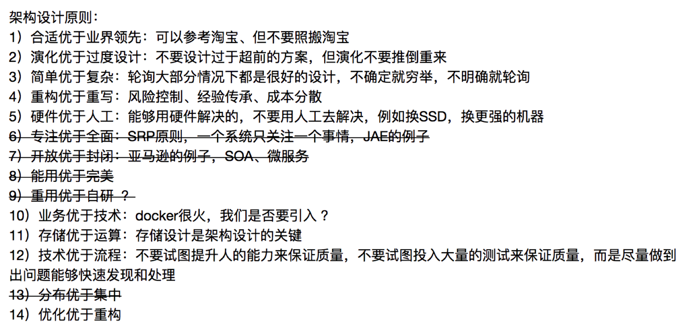

# 常用架构设计方法论

- [常用架构设计方法论](#常用架构设计方法论)
    - [架构设计理念](#架构设计理念)
    - [框架设计需要考的因素/影响架构复杂性的几个因素](#框架设计需要考的因素影响架构复杂性的几个因素)
    - [架构设计的三个原则](#架构设计的三个原则)
    - [架构设计的流程](#架构设计的流程)
    - [高性能架构模式](#高性能架构模式)
    - [软件负载均衡的优点：](#软件负载均衡的优点)
    - [异地多活设计4大技巧](#异地多活设计4大技巧)
    - [跨城异地多活架构设计的 4 个步骤](#跨城异地多活架构设计的-4-个步骤)
    - [如何应对接口级的故障](#如何应对接口级的故障)
    - [可扩展的基本思想](#可扩展的基本思想)
    - [我建议按照下面优先级来搭建基础设施：](#我建议按照下面优先级来搭建基础设施)
      - [运维平台](#运维平台)
      - [测试平台](#测试平台)
      - [数据平台](#数据平台)
      - [管理平台](#管理平台)
    - [重构](#重构)
    - [Reactor](#reactor)
    - [Proactor](#proactor)
    - [架构师条件](#架构师条件)

本文内容来自 [https://time.geekbang.org/column/article/6354]() 总结

### 架构设计理念

架构设计理念，可以提炼为下面几个关键点：

1. 架构是系统的顶层结构。
2. 架构设计的主要目的是为了解决软件系统复杂度带来的问题。
3. 架构设计需要遵循三个主要原则：合适原则、简单原则、演化原则。
4. 架构设计首先要掌握业界已经成熟的各种架构模式，然后再进行优化、调整、创新。

### 框架设计需要考的因素/影响架构复杂性的几个因素

1. 高性能， 衡量软件性能包括了响应时间、TPS、服务器资源利用率等客观指标，也可以是用户的主观感受。
2. 高可用，高可用性就是技术实力的象征，高可用性就是竞争力。99.99%（俗称4个9）网站不可用时间=52.56分钟
3. 可扩展性，设计具备良好可扩展性的系统，有两个基本条件：“正确预测变化、完美封装变化”。
4. 低成本，语言选择、方案选择。
5. 安全，功能安全XSS、CSRF等，架构安全、访问策略、
6. 规模，规模带来复杂度的主要原因就是“量变引起质变”

### 架构设计的三个原则

1. 合适原则 ，“合适优于业界领先”。不追求高大上方案，只追求最合适的。
2. 简单原则，KISS原则（Keep It Simple, Stupid!），“简单优于复杂”。
3. 演化原则，“演化优于一步到位”，“不要过度设计” “不要提前优化，不要为了优化而优化”。对于建筑来说，永恒是主题；而对于软件来说，变化才是主题。软件架构需要根据业务的发展而不断变化。

### 架构设计的流程

1. 识别复杂度 （1）构建复杂度的来源清单——高性能、可用性、扩展性、安全、低成本、规模等。（2）结合需求、技术、团队、资源等对上述复杂度逐一分析是否需要？是否关键？
2. 设计备选方案，备选方案的数量以 3 ~ 5 个为最佳，备选方案的差异要比较明显，备选方案的技术不要只局限于已经熟悉的技术
3. 评估和选择备选方案，列出我们需要关注的质量属性点，然后分别从这些质量属性的维度去评估每个方案，再综合挑选适合当时情况的最优方案。常见的方案质量属性点有：性能、可用性、硬件成本、项目投入、复杂度、安全性、可扩展性等。在评估这些质量属性时，需要遵循架构设计原则 1“合适原则”和原则 2“简单原则”，避免贪大求全，基本上某个质量属性能够满足一定时期内业务发展就可以了。
4. 详细方案设计，详细方案设计就是将方案涉及的关键技术细节给确定下来

### 高性能架构模式

1. 读写分离，读写分离的实现逻辑并不复杂，但有两个细节点将引入设计复杂度：主从复制延迟和分配机制。主从复制延迟和分配机制。
	* 解决主从复制延迟有几种常见的方法：1. 写操作后的读操作指定发给数据库主服务器 2. 读从机失败后再读一次主机. 3. 关键业务读写操作全部指向主机，非关键业务采用读写分离
	* 程序代码封装和中间件封装 “读写分离逻辑”。
2. 分库分表，业务分库、分表（垂直分表和水平分表），垂直分表适合将表中某些不常用且占了大量空间的列拆分出去，水平分表适合表行数特别大的表。 路由方式：范围路由、Hash 路由、配置路由
3. NoSql数据库，K-V 存储：解决关系数据库无法存储数据结构的问题，以 Redis 为代表。文档数据库：解决关系数据库强 schema 约束的问题，以 MongoDB 为代表。列式数据库：解决关系数据库大数据场景下的 I/O 问题，以 HBase 为代表。全文搜索引擎：解决关系数据库的全文搜索性能问题，以 Elasticsearch 为代表。
4. 负载均衡分类，DNS 负载均衡、硬件负载均衡、软件负载均衡（LVS、Nginx）
5. 负责均衡算法，轮询、加权、负载最低优先、性能最优类、Hash 类

### 软件负载均衡的优点：

* 简单：无论是部署还是维护都比较简单。
* 便宜：只要买个 Linux 服务器，装上软件即可。
* 灵活：4 层和 7 层负载均衡可以根据业务进行选择；也可以根据业务进行比较方便的扩展，例如，可以通过 Nginx 的插件来实现业务的定制化功能。

其实下面的缺点都是和硬件负载均衡相比的，并不是说软件负载均衡没法用。

* 性能一般：一个 Nginx 大约能支撑 5 万并发。
* 功能没有硬件负载均衡那么强大。
* 一般不具备防火墙和防 DDoS 攻击等安全功能。

### 异地多活设计4大技巧
* 技巧 1：保证核心业务的异地多活 ，注册问题、登录，登录功能用的频率最高，优先考虑登录功能高可用
* 技巧 2：保证核心数据最终一致性，1. 尽量减少异地多活机房的距离，搭建高速网络 2. 尽量减少数据同步，只同步核
心业务相关的数据 3. 保证最终一致性，不保证实时一致性。
* 技巧 3：采用多种手段同步数据，1. 消息队列方式 2. 二次读取方式 3. 存储系统同步方式 4. 回源读取方式 5.重新生成数据方式
* 技巧 4：只保证绝大部分用户的异地多活

异地多活设计的理念可以总结为一句话：采用多种手段，保证绝大部分用户的核心业务异地多活！

### 跨城异地多活架构设计的 4 个步骤

* 第 1 步：业务分级，访问量大的业务、核心业务、产生大量收入的业务
* 第 2 步：数据分类， 数据量、唯一性、实时性、可丢失性、可恢复性
* 第 3 步：数据同步，存储系统同步、消息队列同步、重复生成
* 第 4 步：异常处理，异常处理主要有以下几个目的：
  - 1. 问题发生时，避免少量数据异常导致整体业务不可用。
  - 2. 问题恢复后，将异常的数据进行修正。
  - 3. 对用户进行安抚，弥补用户损失。常见的异常处理措施有这几类：1. 多通道同步 2. 同步和访问结合 3. 日志记录 4. 用户补偿

### 如何应对接口级的故障

解决接口级故障的核心思想和异地多活基本类似：优先保证核心业务和优先保证绝大部分用户。

* 降级，降级指系统将某些业务或者接口的功能降低，可以是只提供部分功能，也可以是完全停掉所有功能。例如，论坛可以降级为只能看帖子，不能发帖子。降级的核心思想就是丢车保帅，优先保证核心业务
* 熔断，熔断机制实现的关键是需要有一个统一的 API 调用层，由 API 调用层来进行采样或者统计，如果接口调用散落在代码各处就没法进行统一处理了。
* 限流，降级是从系统功能优先级的角度考虑如何应对故障，而限流则是从用户访问压力的角度来考虑如何应对故障。限流指只允许系统能够承受的访问量进来，超出系统访问能力的请求将被丢弃。
* 排队，排队实际上是限流的一个变种，限流是直接拒绝用户，排队是让用户等待一段时间，全世界最有名的排队当属 12306 网站排队了。排队虽然没有直接拒绝用户，但用户等了很长时间后进入系统，体验并不一定比限流好。

### 可扩展的基本思想

* 面向流程拆分：将整个业务流程拆分为几个阶段，每个阶段作为一部分。
* 面向服务拆分：将系统提供的服务拆分，每个服务作为一部分。
* 面向功能拆分：将系统提供的功能拆分，每个功能作为一部分。
* 面向流程拆分：分层架构。1. C/S 架构、B/S 架构 2. MVC 架构、MVP 架构 3. 逻辑分层架构
* 面向服务拆分：SOA、微服务。

SOA ：“面向服务的架构”, SOA 提出了 3 个关键概念  

1. 服务 
2. ESB 的全称是 Enterprise Service Bus “企业服务总线” 
3. 松耦合 松耦合的目的是减少各个服务间的依赖和互相影响。

SOA 和微服务的关系和区别： 

1. 微服务是 SOA 的实现方式 
2. 微服务是去掉 ESB 后的 SOA 
3. 微服务是一种和 SOA 相似但本质上不同的架构理念

SOA 和微服务本质上是两种不同的架构设计理念，只是在“服务”这个点上有交集而已，因此两者的关系应该是上面第三种观点。

微服务的陷阱/微服务具体有哪些坑：  

1. 服务划分过细，服务间关系复杂 
2. 服务数量太多，团队效率急剧下降 
3. 调用链太长，性能下降 
4. 调用链太长，问题定位困难 
5. 没有自动化支撑，无法快速交付.  
6. 没有服务治理，微服务数量多了后管理混乱

微服务拆分方法： 

1. 基于业务逻辑拆分 
2. 基于可扩展拆分  
3. 基于可靠性拆分 （避免非核心服务故障影响核心服务，核心服务高可用方案可以更简单，能够降低高可用成本）
4. 基于性能拆分

面向功能拆分：微内核架构。

* 微内核架构包含两类组件：核心系统（core system）和插件模块（plug-in modules）。微内核的核心系统设计的关键技术有：插件管理、插件连接和插件通信。
* OSGi 的全称是 Open Services Gateway initiative，本身其实是指 OSGi Alliance。这个联盟是 Sun Microsystems、IBM、爱立信等公司于 1999 年 3 月成立的开放的标准化组织，最初名为 Connected Alliance。它是一个非盈利的国际组织，旨在建立一个开放的服务规范，为通过网络向设备提供服务建立开放的标准，这个标准就是 OSGi specification。现在我们谈到 OSGi，如果没有特别说明，一般都是指 OSGi 的规范。

微服务基础设施 

1. 自动化测试，自动化测试涵盖的范围包括代码级的单元测试、单个系统级的集成测试、系统间的接口测试，理想情况是每类测试都自动化.
2. 自动化部署，自动化部署系统包括版本管理、资源管理（例如，机器管理、虚拟机管理）、部署操作、回退操作等功能。
3. 配置中心，配置中心包括配置版本管理（例如，同样的微服务，有 10 个节点是给移动用户服务的，有 20 个节点给联通用户服务的，配置项都一样，配置值不一样）、增删改查配置、节点管理、配置同步、配置推送等功能。
4. 接口框架，微服务提倡轻量级的通信方式，一般采用 HTTP/REST 或者 RPC 方式统一接口协议。但在实践过程中，光统一接口协议还不够，还需要统一接口传递的数据格式 
5. API 网关，API 网关是外部系统访问的接口，所有的外部系统接⼊系统都需要通过 API 网关，主要包括接入鉴权（是否允许接入）、权限控制（可以访问哪些功能）、传输加密、请求路由、流量控制等功能。
6. 服务发现，服务发现主要有两种实现方式：自理式和代理式。 自理式：服务自己去注册表查询节点ip。代理式，就是指微服务之间有一个负载均衡系统（图中的 LOAD BALANCER 节点），由负载均衡系统来完成微服务之间的服务发现。
6. 服务路由，常见的路由算法有：随机路由、轮询路由、最小压力路由、最小连接数路由等
7. 服务发现，xxx
8. 服务容错，常见的服务容错包括请求重试、流控和服务隔离。通常情况下，服务容错会集成在服务发现和服务路由系统中。
9. 服务监控，作用：1. 实时搜集信息并进行分析，避免故障后再来分析，减少了处理时间。 2. 服务监控可以在实时分析的基础上进行预警，在问题萌芽的阶段发觉并预警，降低了问题影响的范围和时间。通常情况下，服务监控需要搜集并分析大量的数据，因此建议做成独立的系统，而不要集成到服务发现、API 网关等系统中。
10. 服务跟踪，跟踪某一个请求在微服务中的完整路径。目前无论是分布式跟踪还是微服务的服务跟踪，绝大部分请求跟踪的实现技术都基于 Google 的 Dapper 论文《Dapper, a Large-Scale Distributed Systems Tracing Infrastructure》
11. 服务安全，服务安全主要分为三部分：接入安全、数据安全、传输安全。通常情况下，服务安全可以集成到配置中心系统中进行实现，即配置中心配置微服务的接入安全策略和数据安全策略，微服务节点从配置中心获取这些配置信息，然后在处理具体的微服务调用请求时根据安全策略进行处理。由于这些策略是通用的，一般会把策略封装成通用的库提供给各个微服务调用。

### 我建议按照下面优先级来搭建基础设施：
1. 服务发现、服务路由、服务容错：这是最基本的微服务基础设施。
2. 接口框架、API 网关：主要是为了提升开发效率，接口框架是提升内部服务的开发效率，API 网关是为了提升与外部服务对接的效率。
3. 自动化部署、自动化测试、配置中心：主要是为了提升测试和运维效率。
4. 服务监控、服务跟踪、服务安全：主要是为了进一步提升运维效率

#### 运维平台
运维平台核心的职责分为四大块：配置、部署、监控、应急，每个职责对应系统生命周期的一个阶段，如下图所示。

* 配置：主要负责资源的管理。例如，机器管理、IP 地址管理、虚拟机管理等。
* 部署：主要负责将系统发布到线上。例如，包管理、灰度发布管理、回滚等。
* 监控：主要负责收集系统上线运行后的相关数据并进行监控，以便及时发现问题。
* 应急：主要负责系统出故障后的处理。例如，停止程序、下线故障机器、切换 IP 等。
* 运维平台的核心设计要素是“四化”：标准化、平台化、自动化、可视化。

#### 测试平台
测试平台核心的职责当然就是测试了，包括单元测试、集成测试、接口测试、性能测试等，都可以在测试平台来完成。

测试平台的核心目的是提升测试效率，从而提升产品质量，其设计关键就是自动化。传统的测试方式是测试人员手工执行测试用例，测试效率低，重复的工作多。通过测试平台提供的自动化能力，测试用例能够重复执行，无须人工参与，大大提升了测试效率。

1. 用例管理 
2. 资源管理 
3. 任务管理 
4. 数据管理

#### 数据平台

数据平台的核心职责主要包括三部分：数据管理、数据分析和数据应用。

#### 管理平台

  管理平台的核心职责就是权限管理，无论是业务系统（例如，淘宝网）、中间件系统（例如，消息队列 Kafka），还是平台系统（例如，运维平台），都需要进行管理。如果每个系统都自己来实现权限管理，效率太低，重复工作很多，因此需要统一的管理平台来管理所有的系统的权限。
权限管理主要分为两部分：身份认证、权限控制，其基本架构如下图所示。

### 重构

总结一下重构的做法，其实就是“分段实施”，将要解决的问题根据优先级、重要性、实施难度等划分为不同的阶段，每个阶段聚焦于一个整体的目标，集中精力和资源解决一类问题。

这样做有几个好处：

* 每个阶段都有明确目标，做完之后效果明显，团队信心足，后续推进更加容易。

* 每个阶段的工作量不会太大，可以和业务并行。

* 每个阶段的改动不会太大，降低了总体风险。

1. 优先级排序 
2. 问题分类  
3. 先易后难 
4. 循序渐进

### Reactor

解决这个问题的最简单的方式是将 read 操作改为非阻塞，然后进程不断地轮询多个连接。这种方式能够解决阻塞的问题，但解决的方式并不优雅。首先，轮询是要消耗 CPU 的；其次，如果一个进程处理几千上万的连接，则轮询的效率是很低的。

I/O 多路复用技术归纳起来有两个关键实现点：

1. 当多条连接共用一个阻塞对象后，进程只需要在一个阻塞对象上等待，而无须再轮询所有连接，常见的实现方式有 select、epoll、kqueue 等
2. 当某条连接有新的数据可以处理时，操作系统会通知进程，进程从阻塞状态返回，开始进行业务处理。

最终 Reactor 模式有这三种典型的实现方案：

1. 单 Reactor 单进程 / 线程。
2. 单 Reactor 多线程。
3. 多 Reactor 多进程 / 线程。

我多说一句，Nginx 采用的是多 Reactor 多进程的模式，但方案与标准的多 Reactor 多进程有差异。具体差异表现为主进程中仅仅创建了监听端口，并没有创建 mainReactor 来“accept”连接，而是由子进程的 Reactor 来“accept”连接，通过锁来控制一次只有一个子进程进行“accept”，子进程“accept”新连接后就放到自己的 Reactor 进行处理，不会再分配给其他子进程，更多细节请查阅相关资料或阅读 Nginx 源码。

### Proactor

Reactor 是非阻塞同步网络模型，因为真正的 read 和 send 操作都需要用户进程同步操作。这里的“同步”指用户进程在执行 read 和 send 这类 I/O 操作的时候是同步的，如果把 I/O 操作改为异步就能够进一步提升性能，这就是异步网络模型 Proactor。

理论上 Proactor 比 Reactor 效率要高一些，异步 I/O 能够充分利用 DMA 特性，让 I/O 操作与计算重叠，但要实现真正的异步 I/O，操作系统需要做大量的工作。目前 Windows 下通过 IOCP 实现了真正的异步 I/O，而在 Linux 系统下的 AIO 并不完善，因此在 Linux 下实现高并发网络编程时都是以 Reactor 模式为主。所以即使 Boost.Asio 号称实现了 Proactor 模型，其实它在 Windows 下采用 IOCP，而在 Linux 下是用 Reactor 模式（采用 epoll）模拟出来的异步模型。



###  架构师条件

我认为，架构师的内功主要包含三部分：判断力、执行力、创新力，简单解释如下：

* 判断力：能够准确判断系统的复杂度在哪里，就像武侠高手一样，能准确地看出对手的破绽和弱点。
* 执行力：能够使用合适的方案解决复杂度问题，就像武侠高手一样，能选择合适的招式或者方法打败对手。
* 创新力：能够创造新的解决方案解决复杂度问题，就像武侠世界里，小一些的创新是创新招式，而武学宗师能够创立新的武学或者心法，例如张三丰创立太极拳一样。

因此，要成为一个优秀的架构师，就需要不断地提升自己这几方面的内功，而这三方面的能力主要来源于经验、视野、思考。

* 经验：设计过的系统越多、系统越复杂，架构师的内功也就越强，不管是成功的架构，还是失败的架构，不管是踩坑的经验，还是填坑的经验，都将成为架构师内功的一部分。
* 视野：掌握的知识和技能越多、越深，架构师的内功也就越强，他山之石可以攻玉，站在巨人的肩膀上会看的更高更远。
* 思考：经验和视野都是外部输入，类似于我们吃的食物，但光吃还不行，还要消化，将其变为我们自己的营养，这就是思考的作用。思考能够将经验和视野中的模式、判断、选择、技巧等提炼出来为我所用，思考也能促使我们产生新的创意和灵感。

