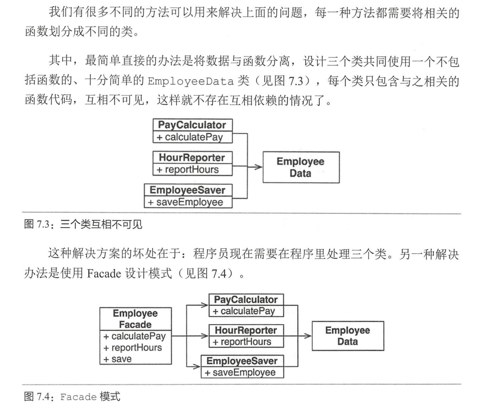
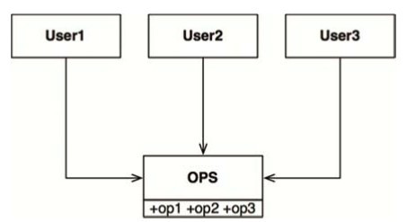
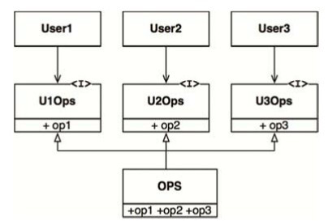
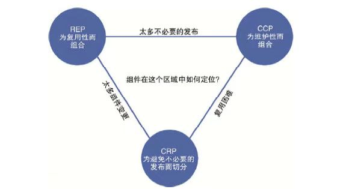
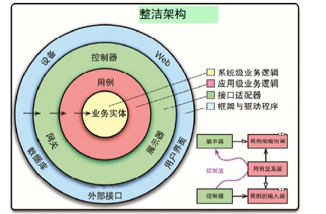
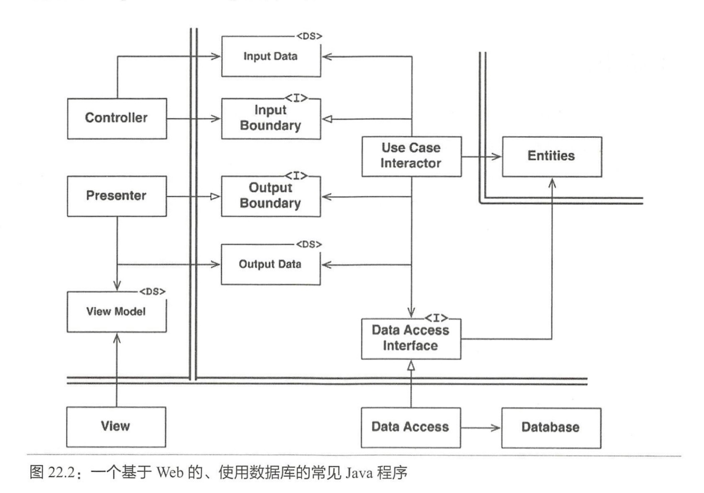
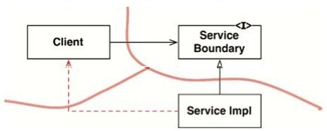
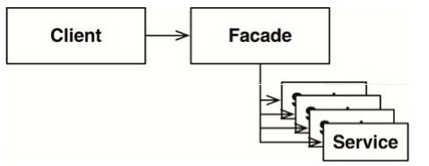

# Clean Architecture 读书笔记

## 编程范式

### 结构化编程（Structured Programming）

**结构化编程是对程序控制权的直接转移的限制。**

结构化编程范式促使我们先将一段程序递归降解为一系列可证明的小函数，然后再编写相关的测试来试图证明这些函数是错误的。如果这些测试无法证伪这些函数，那么我们就可以认为这些函数是足够正确的，进而推导整个程序是正确的。

### 面向对象编程（Object Oriented Programming）

**面向对象编程是对程序控制权的间接转移的限制。**

* 封装（Encapsulation），封装也叫作信息隐藏或者数据访问保护。类通过暴露有限的访问接口，授权外部仅能通过类提供的方式来访问内部信息或者数据。它需要编程语言提供权限访问控制语法来支持，例如 Java 中的 private、protected、public 关键字。封装特性存在的意义，一方面是保护数据不被随意修改，提高代码的可维护性；另一方面是仅暴露有限的必要接口，提高类的易用性。

* 抽象（Abstraction），封装主要讲如何隐藏信息、保护数据，那抽象就是讲如何隐藏方法的具体实现，让使用者只需要关心方法提供了哪些功能，不需要知道这些功能是如何实现的。抽象可以通过接口类或者抽象类来实现，但也并不需要特殊的语法机制来支持。抽象存在的意义，一方面是提高代码的可扩展性、维护性，修改实现不需要改变定义，减少代码的改动范围；另一方面，它也是处理复杂系统的有效手段，能有效地过滤掉不必要关注的信息。

* 继承（Inheritance），继承是用来表示类之间的 is-a 关系，比如猫是一种哺乳动物。从继承关系上来讲，继承可以分为两种模式，单继承和多继承。单继承表示一个子类只继承一个父类，多继承表示一个子类可以继承多个父类，比如猫既是哺乳动物，又是爬行动物。为了实现继承这个特性，编程语言需要提供特殊的语法机制来支持。继承主要是用来解决代码复用的问题。

* 多态（Polymorphism），多态是指子类可以替换父类，在实际的代码运行过程中，调用子类的方法实现。多态这种特性也需要编程语言提供特殊的语法机制来实现，比如继承、接口类、duck-typing。多态可以提高代码的扩展性和复用性，是很多设计模式、设计原则、编程技巧的代码实现基础。
* Clean Architecture 里面指出**多态是函数指针的一种应用**。并用getchar()举了例子。然后用多态的实现引出了“依赖反转”的例子。

面向对象编程就是以多态为手段来对源代码中的依赖关系进行控制的能力，这种能力让软件架构师可以构建出某种插件式架构，让高层策略性组件与底层实现性组件相分离，底层组件可以被编译成插件，实现独立于高层组件的开发和部署。

### 函数式编程（Functional Programming）

**函数式编程是对程序中赋值操作的限制**

* 本质：函数式编程中的函数这个术语不是指计算机中的函数（实际上是Subroutine），而是指数学中的函数，即自变量的映射。也就是说一个函数的值仅决定于函数参数的值，不依赖其他状态。比如sqrt(x)函数计算x的平方根，只要x不变，不论什么时候调用，调用几次，值都是不变的。
* 在函数式语言中，函数作为一等公民，可以在任何地方定义，在函数内或函数外，可以作为函数的参数和返回值，可以对函数进行组合。
* 纯函数式编程语言中的变量也不是命令式编程语言中的变量，即存储状态的单元，而是代数中的变量，即一个值的名称。变量的值是不可变的（immutable），也就是说不允许像命令式编程语言中那样多次给一个变量赋值。比如说在命令式编程语言我们写“x = x + 1”，这依赖可变状态的事实，拿给程序员看说是对的，但拿给数学家看，却被认为这个等式为假。
* 由于命令式编程语言也可以通过类似函数指针的方式来实现高阶函数，函数式的最主要的好处主要是不可变性带来的。没有可变的状态，函数就是引用透明（Referential transparency）的和没有副作用（No Side Effect）。
* 一个好处是，函数即不依赖外部的状态也不修改外部的状态，函数调用的结果不依赖调用的时间和位置，这样写的代码容易进行推理，不容易出错。这使得单元测试和调试都更容易。
* 不变性带来的另一个好处是：由于（多个线程之间）不共享状态，不会造成资源争用(Race condition)，也就不需要用锁来保护可变状态，也就不会出现死锁，这样可以更好地并发起来，尤其是在对称多处理器（SMP）架构下能够更好地利用多个处理器（核）提供的并行处理能力。

### 总结
这三个编程范式都对程序员提出了新的限制。每个范式都约束了某种编写代码的方式，没有一个编程范式是在增加新能力。
也就是说，我们过去50年学到的东西主要是——什么不应该做。

我们必须面对这种不友好的现实：软件构建并不是一个迅速前进的技术。今天构建软件的规则和1946年阿兰·图灵写下电子计算机的第一行代码时是一样的。尽管工具变化了，硬件变化了，但是软件编程的核心没有变。
总而言之，软件，或者说计算机程序无一例外是由顺序结构、分支结构、循环结构和间接转移这几种行为组合而成的，无可增加，也缺一不可。

## 设计原则 - SOLID 原则

### 单一职责（SRP）

Single Responsibility Principle，一个类只负责完成一个职责或者功能。不要设计大而全的类，要设计粒度小、功能单一的类。单一职责原则是为了实现代码高内聚、低耦合，提高代码的复用性、可读性、可维护性。

Clean Architecture 中用一个 “工资管理程序中的 Employee 类”举例，这类里面分别有三个函数  

* calculatePay （）函数是由财务部门制定的，他们负责向 CFO 汇报。
* reportHours （）函数是由人力资源部门制定并使用的，他们负责向 coo汇报。
* save （）函数是由 DBA 制定的，他们负责向 CTO 汇报。

这三个函数由三个部门负责，然后修改其中一个就会影响其他两个，这个类很显然违背了单一职责。

总结为：**“任何一个软件模块都应该只对某一类行为者负责”**

单一职责原则主要讨论的是函数和类之间的关系——但是它在两个讨论层面上会以不同的形式出现。在组件层面，我们可以将其称为共同闭包原则（Common Closure Principle），在软件架构层面，它则是用于奠定架构边界的变更轴心（Axis of Change）。

facade 模式：

### 开闭原则（OCP）
Open Closed Principle，对扩展开放，对修改关闭。添加一个新的功能，应该是通过在已有代码基础上扩展代码（新增模块、类、方法、属性等），而非修改已有代码（修改模块、类、方法、属性等）的方式来完成。关于定义，我们有两点要注意。第一点是，开闭原则并不是说完全杜绝修改，而是以最小的修改代码的代价来完成新功能的开发。第二点是，同样的代码改动，在粗代码粒度下，可能被认定为“修改”；在细代码粒度下，可能又被认定为“扩展”。

* 一个设计良好的计算机系统应该在不需要修改的前提下就可以轻易被扩展。

* 一个好的软件架构设计师会努力将旧代码的修改需求量降至最小，甚至为0。

### 里式替换（LSP）

Liskov Substitution Principle 子类对象（object of subtype/derived class）能够替换程序（program）中父类对象（object of base/parent class）出现的任何地方，并且保证原来程序的逻辑行为（behavior）不变及正确性不被破坏。举例： 是拿父类的单元测试去验证子类的代码。如果某些单元测试运行失败，就有可能说明，子类的设计实现没有完全地遵守父类的约定，子类有可能违背了里式替换原则。

### 接口隔离原则（ISP)

Interface Segregation Principle 调用方不应该被强迫依赖它不需要的接口。

回顾一下ISP最初的成因：在一般情况下，任何层次的软件设计如果依赖于不需要的东西，都会是有害的。从源代码层次来说，**这样的依赖关系会导致不必要的重新编译和重新部署**，对更高层次的软件架构设计来说，问题也是类似的。

本章所讨论的设计原则告诉我们：任何层次的软件设计如果依赖了它并不需要的东西，就会带来意料之外的麻烦。

**Bad Case:**

**Good Case:**

### 依赖反转原则（DIP)
Dependency Inversion Principle 高层模块（high-level modules）不要依赖低层模块（low-level）。高层模块和低层模块应该通过抽象（abstractions）来互相依赖。除此之外，抽象（abstractions）不要依赖具体实现细节（details），具体实现细节（details）依赖抽象（abstractions）。举例 Tomcat和Java WebApp，两者都依赖同一个“抽象”，也就是 Servlet 规范。

**依赖反转原则（DIP）主要想告诉我们的是，如果想要设计一个灵活的系统，在源代码层次的依赖关系中就应该多引用抽象类型，而非具体实现。**

同理，在应用DIP时，我们也不必考虑稳定的操作系统或者平台设施，因为这些系统接口很少会有变动。我们主要应该关注的是软件系统内部那些会经常变动的（volatile）具体实现模块，这些模块是不停开发的，也就会经常出现变更。

我们每次修改抽象接口的时候，一定也会去修改对应的具体实现。但反过来，当我们修改具体实现时，却很少需要去修改相应的抽象接口。所以我们可以认为**接口比实现更稳定**。

依赖反转原则归结为具体编码守则：

* 应在代码中多使用抽象接口，尽量避免使用那些多变的具体实现类。这条守则适用于所有编程语言，无论静态类型语言还是动态类型语言。同时，对象的创建过程也应该受到严格限制，对此，我们通常会选择用抽象工厂（abstract factory）这个设计模式。

* 不要在具体实现类上创建衍生类。上一条守则虽然也隐含了这层意思，但它还是值得被单独拿出来做一次详细声明。在静态类型的编程语言中，**继承关系是所有一切源代码依赖关系中最强的、最难被修改的，所以我们对继承的使用应该格外小心**。即使是在稍微便于修改的动态类型语言中，这条守则也应该被认真考虑。(我理解这里说的意思不是说不能使用继承，而已谨慎使用继承，防止杂乱无章的继承)

* 不要覆盖（override）包含具体实现的函数。调用包含具体实现的函数通常就意味着引入了源代码级别的依赖。即使覆盖了这些函数，我们也无法消除这其中的依赖——这些函数继承了那些依赖关系。在这里，控制依赖关系的唯一办法，就是创建一个抽象函数，然后再为该函数提供多种具体实现。

* **应避免在代码中写入与任何具体实现相关的名字，或者是其他容易变动的事物的名字**。这基本上是DIP原则的另外一个表达方式。比如mysql存储、redis存储。

控制反转（IOC）: Inversion Of Control，框架提供了一个可扩展的代码骨架，用来组装对象、管理整个执行流程。程序员利用框架进行开发的时候，只需要往预留的扩展点上，添加跟自己业务相关的代码，就可以利用框架来驱动整个程序流程的执行。

依赖注入（DI）: Dependency Injection 依赖注入的方式来将依赖的类对象传递进来，这样就提高了代码的扩展性，我们可以灵活地替换依赖的类

## 组件

### 什么是组件

组件是软件的部署单元，是整个软 系统在部署过程中可以独立完成部署的最小实体。例如，对于 Java 来说 它的组件是 jar 文件。而在 Rub 它们是 ge。在.Net 中，它们 DLL 文件。总而言之 在编译运行语言中，组件是二进制文件的集合。而在解释运行语言中 组件则是 组源代码文件的集合。无采用什么编程语言来开发软件，组件都是该软件在部署过程中的最小单元。

大型软件系统的构建过程与建筑物修建很类似，都是由一个个小组件组成的。所以，**如果说SOLID原则是用于指导我们如何将砖块砌成墙与房间的，那么组件构建原则就是用来指导我们如何将这些房间组合成房子的**。

## 组件的聚合

### 复用/发布等同原则（REP原则 - Release Reuse Equivalency Principle）

**软件复用的最粒度应等同于其发布的最小粒度**

从软件设计和架构设计的角度来看，REP原则就是指组件中的类与模块必须是彼此紧密相关的，也就是说，一个组件不能由毫无关联类和模块组成，它们之间应该有一个共同的主题或者大方向。

但从另外一个视角来看，这个原则就没那么简单了 因为根据该原则，一个组件中包含的类与模块还应该是可以同时发布的这意味着它 享相同的版本号与版本跟踪，并且包含在相同的发行文档中，这些都应该同时对该组件的作者和用户有意义。

这层建议听起来就比较薄弱了，毕竟说某项事情的安排应该“合理”的确有点假大空，不着实该建议薄弱的原因是它没有清晰地定义出到底应该如何将类与模块组合成组件 但即使这样， REP 原则的重要性也是毋庸置疑的，因为违反这个原则的后果事实上很明显定会有人抱怨你的安排“不合理”，并进而对你的软件架构能力产生怀疑

### 共同闭包原则 （CCP原则 - the Common Closure Principle）

**我们应该将那些会同时修改，并且为相同目的而修改的类放到同一个组件中，而将不会同时修改，并且不会为了相同目的而修改的那些类放到不同的组件中。**

对大部分应用程序来说，可维护性的重要性要远远高于可复用性。如果某程序中的代码必须要进行某些变更，那么这些变更最好都体现在同一个组件中，而不是分布于很多个组件中[4]。因为如果这些变更都集中在同一个组件中，我们就只需要重新部署该组件，其他组件则不需要被重新验证、重新部署了。

总而言之，CCP的主要作用就是提示我们要将所有可能会被一起修改的类集中在一处。也就是说，如果两个类紧密相关，不管是源代码层面还是抽象理念层面，永远都会一起被修改，那么它们就应该被归属为同一个组件。通过遵守这个原则，我们就可以有效地降低因软件发布、验证及部署所带来的工作压力。

另外，CCP原则和开闭原则（OCP）也是紧密相关的。CCP讨论的就是OCP中所指的“闭包”。OCP原则认为一个类应该便于扩展，而抗拒修改。由于100%的闭包是不可能的，所以我们只能战略性地选择闭包范围。在设计类的时候，我们需要根据历史经验和预测能力，尽可能地将需要被一同变更的那些点聚合在一起。

对于CCP，我们还可以在此基础上做进一步的延伸，即可以将某一类变更所涉及的所有类尽量聚合在一处。这样当此类变更出现时，我们就可以最大限度地做到使该类变更只影响到有限的相关组件。

#### CCP与SRP原则的相似点:

如前所述，CCP原则实际上就是SRP原则的组件版。在SRP原则的指导下，我们将会把变更原因不同的函数放入不同的类中。而CCP原则指导我们应该将变更原因不同的类放入不同的组件中。简而言之，这两个原则都可以用以下一句简短的话来概括：
**"将由于相同原因而修改，并且需要同时修改的东西放在一起。将由于不同原因而修改，并且不同时修改的东西分开"**。

### 共同复用原则（CRP原则 - Composite Reuse Principle）

**不要强迫一个组件的用户依赖他们不需要的东西。**

共同复用原则（CRP）是另外一个帮助我们决策类和模块归属于哪一个组件的原则。该原则建议我们将经常共同复用的类和模块放在同一个组件中。
通常情况下，类很少会被单独复用。更常见的情况是多个类同时作为某个可复用的抽象定义被共同复用。CRP原则指导我们将这些类放在同一个组件中，而在这样的组件中，我们应该预见到会存在着许多互相依赖的类。

一个简单的例子就是容器类与其相关的遍历器类，这些类之间通常是紧密相关的，一般会被共同复用，因此应该被放置在同一个组件中。
但是CRP的作用不仅是告诉我们应该将哪些类放在一起，更重要的是要告诉我们应该将哪些类分开。因为每当一个组件引用了另一个组件时，就等于增加了一条依赖关系。虽然这个引用关系仅涉及被引用组件中的一个类，但它所带来的依赖关系丝毫没有减弱。也就是说，引用组件已然依赖于被引用组件了。

由于这种依赖关系的存在，每当被引用组件发生变更时，引用它的组件一般也需要做出相应的变更。即使它们不需要进行代码级的变更，一般也免不了需要被重新编译、验证和部署。哪怕引用组件根本不关心被引用组件中的变更，也要如此。

因此，当我们决定要依赖某个组件时，最好是实际需要依赖该组件中的每个类。换句话说，我们希望组件中的所有类是不能拆分的，即不应该出现别人只需要依赖它的某几个类而不需要其他类的情况。否则，我们后续就会浪费不少时间与精力来做不必要的组件部署。

因此在CRP原则中，关于哪些类不应该被放在一起的建议是其更为重要的内容。简而言之，CRP原则实际上是在指导我们：不是紧密相连的类不应该被放在同一个组件里。

#### 与ISP原则的关系
CRP原则实际上是ISP原则的一个普适版。ISP原则是建议我们不要依赖带有不需要的函数的类，而CRP原则则是建议我们不要依赖带有不需要的类的组件。上述两条建议实际上都可以用下面一句话来概括：**"不要依赖不需要用到的东西。"**

### 三个规则的Treadeoff

下面我们来看下图。这是一张组件聚合三大原则的张力图，图的边线所描述的是忽视对应原则的后果。


简而言之，只关注REP和CRP的软件架构师会发现，即使是简单的变更也会同时影响到许多组件。相反，如果软件架构师过于关注CCP和REP，则会导致很多不必要的发布。

优秀的软件架构师应该能在上述三角张力区域中定位一个最适合目前研发团队状态的位置，同时也会根据时间不停调整。例如在项目早期，CCP原则会比REP原则更重要，因为在这一阶段研发速度比复用性更重要。

一般来说，一个软件项目的重心会从该三角区域的右侧开始，先期主要牺牲的是复用性。然后，随着项目逐渐成熟，其他项目会逐渐开始对其产生依赖，项目重心就会逐渐向该三角区域的左侧滑动。换句话说，一个项目在组件结构设计上的重心是根据该项目的开发时间和成熟度不断变动的，我们对组件结构的安排主要与项目开发的进度和它被使用的方式有关，与项目本身功能的关系其实很小。

## 组件耦合

### 无依赖环原则（ADP - Acyclic Dependency Principle）
 
**组件依赖关系图中不应该出现环。**

### 自上而下的设计

组件结构图是不可能自上而下被设计出来的。它必须随着软件系统的变化而变化和扩张，而不可能在系统构建的最初就被完美设计出来。
 

事实上，组件依赖结构图并不是用来描述应用程序功能的，它更像是应用程序在构建性与维护性方面的一张地图。这就是组件的依赖结构图不能在项目的开始阶段被设计出来的原因——当时该项目还没有任何被构建和维护的需要，自然也就不需要一张地图来指引。然而，随着早期被设计并实现出来的模块越来越多，项目中就逐渐出现了要对组件依赖关系进行管理的需求，以此来预防“一觉醒来综合征”的爆发。除此之外，我们还希望将项目变更所影响的范围被限制得越小越好，因此需要应用单一职责原则（SRP）和共同闭包原则（CCP）来将经常同时被变更的类聚合在一起。

组件结构图中的一个重要目标是指导如何隔离频繁的变更。我们不希望那些频繁变更的组件影响到其他本来应该很稳定的组件，例如，我们通常不会希望无关紧要的GUI变更影响到业务逻辑组件；我们也不希望对报表的增删操作影响到其高阶策略。出于这样的考虑，软件架构师们才有必要设计并且铸造出一套组件依赖关系图来，以便将稳定的高价值组件与常变的组件隔离开，从而起到保护作用。

另外，随着应用程序的增长，创建可重用组件的需要也会逐渐重要起来。这时CRP又会开始影响组件的组成。最后当循环依赖出现时，随着无循环依赖原则（ADP）的应用，组件依赖关系会产生相应的抖动和扩张。

如果我们在设计具体类之前就来设计组件依赖关系，那么几乎是必然要失败的。因为在当下，我们对项目中的共同闭包一无所知，也不可能知道哪些组件可以复用，这样几乎一定会创造出循环依赖的组件。因此，**组件依赖关系是必须要随着项目的逻辑设计一起扩张和演进的。**

### 稳定依赖原则 （SDP - Stabilization Dependency Principle）

**依赖关系必须要指向更稳定的方向。** 例如：我们Service Mesh 的控制面氛围`cp_http`、`cp_core` 两个模块，`cp_core` 是比较核心比较稳定的模块，改动也会比较少。`cp_http`是非核心模块，改动了个会比较多。

设计这件事不可能是完全静止的，如果我们要让一个设计是可维护的，那么其中某些部分就必须是可变的。通过遵守共同闭包原则（CCP），我们可以创造出对某些变更敏感，对其他变更不敏感的组件。这其中的一些组件在设计上就已经是考虑了易变性，预期它们会经常发生变更的。

任何一个我们预期会经常变更的组件都不应该被一个难于修改的组件所依赖，否则这个多变的组件也将会变得非常难以被修改。

这就是软件开发的困难之处，我们精心设计的一个容易被修改的组件很可能会由于别人的一条简单依赖而变得非常难以被修改。即使该模块中没有一行代码需要被修改，但是整个模块在被修改时所面临的挑战性也已经存在了。而通过遵守稳定依赖原则（SDP），我们就可以确保自己设计中那些容易变更的模块不会被那些难于修改的组件所依赖。
稳定性

我们该如何定义“稳定性”呢？譬如说将一个硬币立起来放，你认为它会处于一个稳定的位置吗？当然不会。然而，除非受到外界因素干扰，否则硬币本身可以在这个位置保持相当长的一段时间。因此稳定性应该与变更的频繁度没有直接关系。但问题是硬币并没有倒，为什么我们却并不认为它是稳定的呢？

下面来看看Webster在线字典中的描述：稳定指的是“很难移动”。所以稳定性应该与变更所需的工作量有关。例如，硬币是不稳定的，因为只需要很小的动作就可以推倒它，而桌子则是非常稳定的，因为将它掀翻需要很大的动作。

但如果将这套理论关联到软件开发的问题上呢？软件组件的变更困难度与很多因素有关，例如代码的体量大小、复杂度、清晰度等。我们在这里会忽略这些因素，只集中讨论一个特别的因素——让软件组件难于修改的一个最直接的办法就是让很多其他组件依赖于它。带有许多入向依赖关系的组件是非常稳定的，因为它的任何变更都需要应用到所有依赖它的组件上。

### 稳定抽象原则（SAP - Stable Abstractions Principle）

**一个组件的抽象化程度应该与其稳定性保持一致。**

#### 高阶策略应该放在哪里？

在一个软件系统中，总有些部分是不应该经常发生变更的。这些部分通常用于表现该系统的高阶架构设计及一些策略相关的高阶决策。我们不想让这些业务决策和架构设计经常发生变更，因此这些代表了系统高阶策略的组件应该被放到稳定组件（I=0）中，而不稳定的组件（I=1）中应该只包含那些我们想要快速和方便修改的部分。

然而，如果我们将高阶策略放入稳定组件中，那么用于描述那些策略的源代码就很难被修改了。这可能会导致整个系统的架构设计难于被修改。如何才能让一个无限稳定的组件（I=0）接受变更呢？开闭原则（OCP）为我们提供了答案。这个原则告诉我们：创造一个足够灵活、能够被扩展，而且不需要修改的类是可能的，而这正是我们所需要的。哪一种类符合这个原则呢？答案是抽象类。

#### 稳定抽象原则简介

稳定抽象原则（SAP）为组件的稳定性与它的抽象化程度建立了一种关联。一方面，该原则要求稳定的组件同时应该是抽象的，这样它的稳定性就不会影响到扩展性。另一方面，该原则也要求一个不稳定的组件应该包含具体的实现代码，这样它的不稳定性就可以通过具体的代码被轻易修改。

因此，如果一个组件想要成为稳定组件，那么它就应该由接口和抽象类组成，以便将来做扩展。如此，这些既稳定又便于扩展的组件可以被组合成既灵活又不会受到过度限制的架构。

将SAP与SDP这两个原则结合起来，就等于组件层次上的DIP。因为SDP要求的是让依赖关系指向更稳定的方向，而SAP则告诉我们稳定性本身就隐含了对抽象化的要求，即依赖关系应该指向更抽象的方向。

然而，DIP毕竟是与类这个层次有关的原则——对类来说，设计是没有灰色地带的。一个类要么是抽象类，要么就不是。SDP与SAP这对原则是应用在组件层面上的，我们要允许一个组件部分抽象，部分稳定。

## 软件架构

### 什么是软件架构？软件架构师工作内容是什么？

首先，**软件架构师自身需要是程序员**，并且必须一直坚持做一线程序员，绝对不要听从那些说应该让软件架构师从代码中解放出来以专心解决高阶问题的伪建议。不是这样的！软件架构师其实应该是能力最强的一群程序员，他们通常会在自身承接编程任务的同时，逐渐引导整个团队向一个**能够最大化生产力的系统设计方向前进**。也许软件架构师生产的代码量不是最多的，但是他们必须不停地承接编程任务。如果不亲身承受因系统设计而带来的麻烦，就体会不到设计不佳所带来的痛苦，接着就会逐渐迷失正确的设计方向。

软件系统的架构质量是由它的构建者所决定的，**软件架构这项工作的实质就是规划如何将系统切分成组件，并安排好组件之间的排列关系，以及组件之间互相通信的方式**。

而设计软件架构的目的，**就是为了在工作中更好地对这些组件进行研发、部署、运行以及维护**。

软件架构设计的主要目标是支撑软件系统的全生命周期，设计良好的架构可以让系统便于理解、易于修改、方便维护，并且能轻松部署。软件架构的终极目标就是最大化程序员的生产力，同时最小化系统的总运营成本。

### 开发（development）

一个开发起来很困难的软件系统一般不太可能会有一个长久、健康的生命周期，所以系统架构的作用就是要方便其开发团队对它的开发。

这意味着，不同的团队结构应该采用不同的架构设计。一方面，对于一个只有五个开发人员的小团队来说，他们完全可以非常高效地共同开发一个没有明确定义组件和接口的单体系统（monolithic system）。事实上，**这样的团队可能会发现软件架构在早期开发中反而是一种障碍**。这可能就是为什么许多系统都没有设计一个良好架构的原因，因为它们的开发团队起初都很小，**不需要设计一些上层建筑来限制某些事情**。

### 部署（Deployment）

为了让开发成为有效的工作，软件系统就必须是可部署的。在通常情况下，一个系统的部署成本越高，可用性就越低。因此，实现一键式的轻松部署应该是我们设计软件架构的一个目标。

但很不幸，我们在系统的早期开发中很少会考虑部署策略方面的事情，这常常会导致一些易于开发、难于部署的系统架构。

例如，在系统的早期开发中，开发人员可能会决定采用某种“微服务架构”。这种架构的组件边界清晰，接口稳定，非常利于开发。但当我们实际部署这种系统时，就会发现其微服务的数量已经大到令人望而生畏，而配置这些微服务之间的连接以及启动时间都会成为系统出错的主要来源。

如果软件架构师早先就考虑到这些部署问题，可能就会有意地减少微服务的数量，采用进程内部组件与外部服务混合的架构，以及更加集成式的连接管理方式。

### 维护（Maintenance）

在软件系统的所有方面中，维护所需的成本是最高的。满足永不停歇的新功能需求，以及修改层出不穷的系统缺陷这些工作将会占去绝大部分的人力资源。

系统维护的主要成本集中在“探秘”和“风险”这两件事上。其中，“探秘（spelunking）”的成本主要来自我们对于现有软件系统的挖掘，目的是确定新增功能或被修复问题的最佳位置和最佳方式。而“风险（risk）”，则是指当我们进行上述修改时，总是有可能衍生出新的问题，这种可能性就是风险成本。

我们可以通过精雕细琢的架构设计极大地降低这两项成本。通过将系统切分为组件，并使用稳定的接口将组件隔离，我们可以将未来新功能的添加方式明确出来，并大幅度地降低在修改过程中对系统其他部分造成伤害的可能性。

### 保持可选项

正如我们在之前章节中所说的，软件有行为价值与架构价值两种价值。这其中的第二种价值又比第一种更重要，因为它正是软件之所以“软”的原因。

软件被发明出来就是因为我们需要一种灵活和便捷的方式来改变机器的行为。而软件的灵活性则取决于系统的整体状况、组件的布置以及组件之间的连接方式。

我们让软件维持“软”性的方法就是尽可能长时间地保留尽可能多的可选项。那么到底哪些选项是我们应该保留的？它们就是那些无关紧要的细节设计。

基本上，所有的软件系统都可以降解为策略与细节这两种主要元素。策略体现的是软件中所有的业务规则与操作过程，因此它是系统真正的价值所在。

而细节则是指那些让操作该系统的人、其他系统以及程序员们与策略进行交互，但是又不会影响到策略本身的行为。它们包括I/O设备、数据库、Web系统、服务器、框架、交互协议等。

软件架构师的目标是创建一种系统形态，该形态会以策略为最基本的元素，并让细节与策略脱离关系，以允许在具体决策过程中推迟或延迟与细节相关的内容。

如果在开发高层策略时有意地让自己摆脱具体细节的纠缠，我们就可以将与具体实现相关的细节决策推迟或延后，因为越到项目的后期，**我们就拥有越多的信息来做出合理的决策**。

**一个优秀的软件架构师应该致力于最大化可选项数量。**

## 独立性

### 用例

我们先来看第一个支持目标：用例。我们认为一个系统的架构必须能支持其自身的设计意图。也就是说，如果某系统是一个购物车应用，那么该系统的架构就必须非常直观地支持这类应用可能会涉及的所有用例。事实上，这本来就是架构师们首先要关注的问题，也是架构设计过程中的首要工作。**软件的架构必须为其用例提供支持**。

然而，正如我们前面所讨论的，一个系统的架构对其行为并没有太大的影响。虽然架构也可以限制一些行为选项，但这种影响所涉及的范围并不大。**一个设计良好的架构在行为上对系统最重要的作用就是明确和显式地反映系统设计意图的行为，使其在架构层面上可见。**

### 运行

架构在支持系统运行方面扮演着更实际的角色。如果某个系统每秒要处理100000个用户，该系统的架构就必须能支持这种级别的吞吐量和响应时间。同样的，如果某个系统要在毫秒级的时间内完成对大数据仓库的查询，那么该系统的架构也必须能支持这类操作。

### 开发

系统的架构在支持开发环境方面当然扮演着重要的角色，我们在这里可以引述一下康威定律：

> 任何一个组织在设计系统时，往往都会复制出一个与该组织内沟通结构相同的系统。

一个由多个不同目标的团队协作开发的系统必须具有相应的软件架构。这样，这些团队才可以各自独立地完成工作，不会彼此干扰。这就需要恰当地将系统切分为一系列隔离良好、可独立开发的组件。然后才能将这些组件分配给不同的团队，各自独立开发。

### 部署

一个系统的架构在其部署的便捷性方面起到的作用也是非常大的。设计目标一定是实现“立刻部署”。一个设计良好的架构通常不会依赖于成堆的脚本与配置文件，也不需要用户手动创建一堆“有严格要求”的目录与文件。总而言之，一个设计良好的软件架构可以让系统在构建完成之后立刻就能部署。

同样的，这些也需要通过正确地划分、隔离系统组件来实现，这其中包括开发一些主组件，让它们将整个系统黏合在一起，正确地启动、连接并监控每个组件。同样的，这些也需要通过正确地划分、隔离系统组件来实现，这其中包括开发一些主组件，让它们将整个系统黏合在一起，正确地启动、连接并监控每个组件。

### 保留可选项

一个设计良好的架构应该充分地权衡以上所述的所有关注点，然后尽可能地形成一个可以同时满足所有需求的组件结构。这说起来还挺容易的，不是吗？

事实上，要实现这种平衡是很困难的。主要问题是，我们在大部分时间里是无法预知系统的所有用例的，而且我们也无法提前预知系统的运行条件、开发团队的结构，或者系统的部署需求。更糟糕的是，就算我们能提前了解这些需求，随着系统生命周期的演进，这些需求也会不可避免地发生变化。总而言之，事实上我们想要达到的目标本身就是模糊多变的。真实的世界就这样。

然而，我们还是可以通过采用一些实现成本较低的架构原则来做一些事情的。虽然我们没有清晰的目标，但采用一些原则总是有助于提前解决一些平衡问题。通过遵守这些原则可以帮助我们正确地将系统划分为一些隔离良好的组件，以便尽可能长时间地为我们的未来保留尽可能多的可选项。

**一个设计良好的架构应该通过保留可选项的方式，让系统在任何情况下都能方便地做出必要的变更。**

### 按层解耦

一个系统可以被解耦成若干个水平分层——UI界面、应用独有的业务逻辑、领域普适的业务逻辑、数据库等。

### 用例的解耦

如果我们按照变更原因的不同对系统进行解耦，就可以持续地向系统内添加新的用例，而不会影响旧有的用例。如果我们同时对支持这些用例的UI和数据库也进行了分组，那么每个用例使用的就是不同面向的UI与数据库，因此增加新用例就更不太可能会影响旧有的用例了。

### 结构模式

SOA还是但单体？一个设计良好的架构总是要为将来多留一些可选项，这里所讨论的解耦模式也是这样的可选项之一。

### 开发独立性 

我们进行架构设计的第三个目标是支持系统的开发。很显然，当系统组件之间被高度解耦之后，开发团队之间的干扰就大大减少了。譬如说，如果系统的业务逻辑与其UI无关，那么专注于UI开发的团队就不会对专注于业务逻辑开发的团队造成多大的影响。同样的，如果系统的各个用例之间相互隔离，那么专注于addOrder用例的团队就不太可能干扰到负责deleteOrder用例的团队。

### 部署独立性

这种按用例和水平分层的解耦也会给系统的部署带来极大的灵活性。实际上，如果解耦工作做得好，我们甚至可以在系统运行过程中热切换（hot-swap）其各个分层实现和具体用例。在这种情况下，我们增加新用例就只需要在系统中添加一些新的jar文件，或启动一些服务即可，其他部分将完全不受影响。

### 重复

架构师们经常会钻进一个牛角尖——害怕重复。

当然，重复在软件行业里一般来说都是坏事。我们不喜欢重复的代码，当代码真的出现重复时，我们经常会感到作为一个专业人士，自己是有责任减少或消除这种重复的。

但是重复也存在着很多种情况。其中有些是真正的重复，在这种情况下，每个实例上发生的每项变更都必须同时应用到其所有的副本上。重复的情况中也有一些是假的，或者说这种重复只是表面性的。如果有两段看起来重复的代码，它们走的是不同的演进路径，也就是说它们有着不同的变更速率和变更缘由，那么这两段代码就不是真正的重复。等我们几年后再回过头来看，可能就会发现这两段代码是非常不一样的了。

### 再谈解耦模式

让我们再回到解耦模式的问题上来。按水平分层和用例解耦一个系统有很多种方式。例如，我们可以在源码层次上解耦、二进制层次上解耦（部署），也可以在执行单元层次上解耦（服务）。

* 源码层次：我们可以控制源代码模块之间的依赖关系，以此来实现一个模块的变更不会导致其他模块也需要变更或重新编译（例如Ruby Gem）。在这种解耦模式下，系统所有的组件都会在同一个地址空间内执行，它们会通过简单的函数调用来进行彼此的交互。这类系统在运行时是作为一个执行文件被统一加载到计算机内存中的。人们经常把这种模式叫作单体结构。

* 部署层次：我们可以控制部署单元（譬如jar文件、DLL、共享库等）之间的依赖关系，以此来实现一个模块的变更不会导致其他模块的重新构建和部署。在这种模式下，大部分组件可能还是依然运行在同一个地址空间内，通过彼此的函数调用通信。但有一些别的组件可能会运行在同一个处理器下的其他进程内，使用跨进程通信，或者通过socket或共享内存进行通信。这里最重要的是，这些组件的解耦产生出许多可独立部署的单元，例如jar文件、Gem文件和DLL等。

* 服务层次：我们可以将组件间的依赖关系降低到数据结构级别，然后仅通过网络数据包来进行通信。这样系统的每个执行单元在源码层和二进制层都会是一个独立的个体，它们的变更不会影响其他地方（例如，常见的服务或微服务就都是如此的）。

## 划分边界

软件架构设计本身就是一门划分边界的艺术。边界的作用是将软件分割成各种元素，以便约束边界两侧之间的依赖关系。其中有一些边界是在项目初期——甚至在编写代码之前——就已经划分好，而其他的边界则是后来才划分的。在项目初期划分这些边界的目的是方便我们尽量将一些决策延后进行，并且确保未来这些决策不会对系统的核心业务逻辑产生干扰。

正如我们之前所说，架构师们所追求的目标是最大限度地降低构建和维护一个系统所需的人力资源。那么我们就需要了解一个系统最消耗人力资源的是什么？答案是系统中存在的耦合——尤其是那些过早做出的、不成熟的决策所导致的耦合。

那么，怎样的决策会被认为是过早且不成熟的呢？答案是那些决策与系统的业务需求（也就是用例）无关。这部分决策包括我们要采用的框架、数据库、Web服务器、工具库、依赖注入等。在一个设计良好的系统架构中，这些细节性的决策都应该是辅助性的，可以被推迟的。一个设计良好的系统架构不应该依赖于这些细节，而应该尽可能地推迟这些细节性的决策，并致力于将这种推迟所产生的影响降到最低。

### 插件式架构

综上所述，我们似乎可以基于数据库和GUI这两个为例来建立一种向系统添加其他组件的模式。这种模式与支持第三方插件的系统模式是一样的。

事实上，软件开发技术发展的历史就是一个如何想方设法方便地增加插件，从而构建一个可扩展、可维护的系统架构的故事。系统的核心业务逻辑必须和其他组件隔离，保持独立，而这些其他组件要么是可以去掉的，要么是有多种实现的。

由于用户界面在这个设计中是以插件形式存在的，所以我们可以用插拔的方式切换很多不同类型的用户界面。可以是基于Web模式的、基于客户端/服务器端模式的、基于SOA模式的、基于命令行模式的或者基于其他任何类型的用户界面技术的。

数据库也类似。因为我们现在是将数据库作为插件来对待的，所以它就可以被替换成不同类型的SQL数据库、NoSQL数据库，甚至基于文件系统的数据库，以及未来任何一种我们认为有必要发展的数据库技术。
当然，这些替换工作可能并不轻松，如果我们的系统一开始是按照Web方式部署的，那么为它写一个客户端/服务器端模型的UI插件就可能会比较困难一些。很可能业务逻辑与新UI之间的交互方式也要重新修改。但即使这样，插件式架构也至少为我们提供了这种实现的可能性。

### 插件式架构好处

将系统设计为插件式架构，就等于构建起了一面变更无法逾越的防火墙。换句话说，只要GUI是以插件形式插入系统的业务逻辑中的，那么GUI这边所发生的变更就不会影响系统的业务逻辑。

所以，边界线也应该沿着系统的变更轴来画。也就是说，位于边界线两侧的组件应该以不同原因、不同速率变化着。

一个系统的GUI与业务逻辑的变更原因、变更速率显然是不同的，所以二者中间应该有一条边界线。同样的，一个系统的业务逻辑与依赖注入框架之间的变更原因和变更速度也会不同，它们之间也应该画边界线。

**这其实就是单一职责原则（SRP）的具体实现，SRP的作用就是告诉我们应该在哪里画边界线。**

## 边界剖析

### 跨边界调用

在运行时，跨边界调用指的是边界线一侧的函数调用另一侧的函数，并同时传递数据的行为。构造合理的跨边界调用需要我们对源码中的依赖关系进行合理管控。

为什么需要管控源码中的依赖关系呢？因为当一个模块的源码发生变更时，其他模块的源码也可能会随之发生变更或重新编译，并需要重新部署。所谓划分边界，就是指在这些模块之间建立这种针对变更的防火墙。

### 本地进程
系统架构还有一个更明显的物理边界形式，那就是本地进程。本地进程一般是由命令行启动或其他等价的系统调用产生的。本地进程往往运行于单个处理器或多核系统的同一组处理器上，但它们拥有各自不同的地址空间。一般来说，现有的内存保护机制会使这些进程无法共享其内存，但它们通常可以用某种独立的内存区域来实现共享。

最常见的情况是，这些本地进程会用socket来实现彼此的通信。当然，它们也可以通过一些操作系统提供的方式来通信，例如共享邮件或消息队列。

### 服务

系统架构中最强的边界形式就是服务。一个服务就是一个进程，它们通常由命令行环境或其他等价的系统调用来产生。服务并不依赖于具体的运行位置，两个互相通信的服务既可以处于单一物理处理器或多核系统的同一组处理器上，也可以彼此位于不同的处理器上。服务会始终假设它们之间的通信将全部通过网络进行。

服务之间的跨边界通信相对于函数调用来说，速度是非常缓慢的，其往返时间可以从几十毫秒到几秒不等。因此我们在划分架构边界时，一定要尽可能地控制通信次数。在这个层次上通信必须能够适应高延时情况。

除此之外，我们可以在服务层次上使用与本地进程相同的规则。也就是让较低层次服务成为较高层次服务的“插件”。为此，我们要确保高层服务的源码中没有包含任何与低层服务相关的物理信息（例如URI）。

## 策略和层次

本质上，所有的软件系统都是一组策略语句的集合。是的，可以说计算机程序不过就是一组仔细描述如何将输入转化为输出的策略语句的集合。
在大多数非小型系统（nontrivial system）中，整体业务策略通常都可以被拆解为多组更小的策略语句。一部分策略语句专门用于描述计算部分的业务逻辑，另一部分策略语句则负责描述计算报告的格式。除此之外，可能还会有一些用于描述如何校验输入数据的策略。
软件架构设计的工作重点之一就是，将这些策略彼此分离，然后将它们按照变更的方式进行重新分组。其中变更原因、时间和层次相同的策略应该被分到同一个组件中。反之，变更原因、时间和层次不同的策略则应该分属于不同的组件。

### 层次

我们对“层次”是严格按照“输入与输出之间的距离”来定义的。也就是说，一条策略距离系统的输入/输出越远，它所属的层次就越高。而直接管理输入/输出的策略在系统中的层次是最低的。

## 业务逻辑

严格地讲，**业务逻辑就是程序中那些真正用于赚钱或省钱的业务逻辑与过程**。更严格地讲，无论这些业务逻辑是在计算机上实现的，还是人工执行的，它们在省钱/赚钱上的作用都是一样的。

### 业务实体

业务实体实际上就是计算机系统中的一种对象，这种对象中包含了一系列用于操作关键数据的业务逻辑。这些实体对象要么直接包含关键业务数据，要么可以很容易地访问这些数据。业务实体的接口层则是由那些实现关键业务逻辑、操作关键业务数据的函数组成的。

### 用例

并不是所有的业务逻辑都是一个纯粹的业务实体。例如，有些业务逻辑是通过定义或限制自动化系统的运行方式来实现赚钱或省钱的业务的。这些业务逻辑就不能靠人工来执行，它们只有在作为自动化系统的一部分时才有意义。

## 尖叫的软件架构

### 架构设计的主题

软件的系统架构应该为该系统的用例提供支持。这就像住宅和图书馆的建筑计划满篇都在非常明显地凸显这些建筑的用例一样，软件系统的架构设计图也应该非常明确地凸显该应用程序会有哪些用例。

架构设计不是（或者说不应该是）与框架相关的，这件事不应该是基于框架来完成的。对于我们来说，框架只是一个可用的工具和手段，而不是一个架构所规范的内容。如果我们的架构是基于框架来设计的，它就不能基于我们的用例来设计了。

### 架构设计的核心目标

一个良好的架构设计应该围绕着用例来展开，这样的架构设计可以在脱离框架、工具以及使用环境的情况下完整地描述用例。这就好像一个住宅建筑设计的首要目标应该是满足住宅的使用需求，而不是确保一定要用砖来构建这个房子。架构师应该花费很多精力来确保该架构的设计在满足用例需要的情况下，尽可能地允许用户能自由地选择建筑材料（砖头、石料或者木材）。

而且，良好的架构设计应该尽可能地允许用户推迟和延后决定采用什么框架、数据库、Web服务以及其他与环境相关的工具。框架应该是一个可选项，良好的架构设计应该允许用户在项目后期再决定是否采用Rails、Spring、Hibernate、Tomcat、MySQL这些工具。同时，良好的架构设计还应该让我们很容易改变这些决定。总之，良好的架构设计应该只关注用例，并能将它们与其他的周边因素隔离。

### 框架是工具不是生活信条

当然，框架通常可以是非常强大、非常有用的。但框架作者往往对自己写出的框架有着极深的信念，他们所写出来的使用手册一般都是从如何成为该框架的虔诚信徒的角度来描绘如何使用这个框架的。甚至这些框架的使用者所写的教程也会出现这种传教士模式。他们会告诉你某个框架是能包揽一切、超越一切、解决一切问题的存在。

这不应该成为你的观点。

我们一定要带着怀疑的态度审视每一个框架。是的，采用框架可能会很有帮助，但采用它们的成本呢？我们一定要懂得权衡如何使用一个框架，如何保护自己。无论如何，**我们需要仔细考虑如何能保持对系统用例的关注，避免让框架主导我们的架构设计**。

### 可测试的框架设计

如果系统架构的所有设计都是围绕着用例来展开的，并且在使用框架的问题上保持谨慎的态度，那么我们就应该可以在不依赖任何框架的情况下针对这些用例进行单元测试。另外，我们在运行测试的时候不应该运行Web服务，也不应该需要连接数据库。我们测试的应该只是一个简单的业务实体对象，没有任何与框架、数据库相关的依赖关系。总而言之，我们应该通过用例对象来调度业务实体对象，确保所有的测试都不需要依赖框架。
本章小结

## 整洁架构

在过去的几十年中，我们曾见证过一系列关于系统架构的想法被提出，列举如下。

* 六边形架构（Hexagonal Architecture）（也称为端口与适配器架构，Ports and Adpaters）：该架构由Alistair Cockburn首先提出。Steve Freeman和Nat Pryce在他们合写的著作Growing Object Oriented Software with Tests一书中对该架构做了隆重的推荐。
* DCI架构：由James Coplien和Trygve Reenskaug首先提出。
* BCE架构：由Ivar Jacobson在他的Object Oriented Software Engineering:A Use-Case Driven Approach一书中首先提出。

虽然这些架构在细节上各有不同，但总体来说是非常相似的。它们都具有同一个设计目标：按照不同关注点对软件进行切割。也就是说，这些架构都会将软件切割成不同的层，至少有一层是只包含该软件的业务逻辑的，而用户接口、系统接口则属于其他层。

按照这些架构设计出来的系统，通常都具有以下特点。

* 独立于框架：这些系统的架构并不依赖某个功能丰富的框架之中的某个函数。框架可以被当成工具来使用，但不需要让系统来适应框架。
* 可被测试：这些系统的业务逻辑可以脱离UI、数据库、Web服务以及其他的外部元素来进行测试。
* 独立于UI：这些系统的UI变更起来很容易，不需要修改其他的系统部分。例如，我们可以在不修改业务逻辑的前提下将一个系统的UI由Web界面替换成命令行界面。
* 独立于数据库：我们可以轻易将这些系统使用的Oracle、SQL Server替换成Mongo、BigTable、CouchDB之类的数据库。因为业务逻辑与数据库之间已经完成了解耦。
* 独立于任何外部机构：这些系统的业务逻辑并不需要知道任何其他外部接口的存在。

下面我们要通过下图将**上述所有架构的设计理念综合成为一个独立的理念：整洁架构**

### 依赖关系规则
图中的同心圆分别代表了软件系统中的不同层次，通常越靠近中心，其所在的软件层次就越高。基本上，外层圆代表的是机制，内层圆代表的是策略。

当然这其中有一条贯穿整个架构设计的规则，即它的依赖关系规则：

**“源码中的依赖关系必须只指向同心圆的内层，即由低层机制指向高层策略。”**

换句话说，就是任何属于内层圆中的代码都不应该牵涉外层圆中的代码，尤其是内层圆中的代码不应该引用外层圆中代码所声明的名字，包括函数、类、变量以及一切其他有命名的软件实体。

同样的道理，外层圆中使用的数据格式也不应该被内层圆中的代码所使用，尤其是当数据格式是由外层圆的框架所生成时。总之，我们不应该让外层圆中发生的任何变更影响到内层圆的代码。

### 一个场景应用场景

## 展示器和谦卑对象

我们引入了展示器（presenter）的概念，展示器实际上是采用谦卑对象（humble object）模式的一种形式，这种设计模式可以很好地帮助识别和保护系统架构的边界。事实上，第22章所介绍的整洁架构中就充满了大量谦卑对象的实现体。

### 谦卑对象模式

谦卑对象模式[11]最初的设计目的是帮助单元测试的编写者区分容易测试的行为与难以测试的行为，并将它们隔离。其设计思路非常简单，就是将这两类行为拆分成两组模块或类。其中一组模块被称为谦卑（Humble）组，包含了系统中所有难以测试的行为，而这些行为已经被简化到不能再简化了。另一组模块则包含了所有不属于谦卑对象的行为。

例如，GUI通常是很难进行单元测试的，因为让计算机自行检视屏幕内容，并检查指定元素是否出现是非常难的事情。然而，GUI中的大部分行为实际上是很容易被测试的。这时候，我们就可以利用谦卑对象模式将GUI的这两种行为拆分成展示器与视图两部分。

### 展示器与视图

视图部分属于难以测试的谦卑对象。这种对象的代码通常应该越简单越好，它只应负责将数据填充到GUI上，而不应该对数据进行任何处理。

展示器则是可测试的对象。展示器的工作是负责从应用程序中接收数据，然后按视图的需要将这些数据格式化，以便视图将其呈现在屏幕上。例如，如果应用程序需要在屏幕上展示一个日期，那么它传递给展示器的应该是一个Date对象。然后展示器会将该对象格式化成所需的字符串形式，并将其填充到视图模型中。

如果应用程序需要在屏幕上展示金额，那么它应该将Currency对象传递给展示器。展示器随后会将这个对象按所需的小数位数进行格式化，并加上对应的货币标识符，形成一个字符串存放在视图模型中。如果需要将负数金额显示成红色，那么该视图模型中就应该有一个简单的布尔值被恰当地设置。

另外，应用程序在屏幕上的每个按钮都应该有其对应的名称，这些名称也是由展示器在视图模型中设置的。如果某个按钮需要变灰，展示器就应该将相应的开关变量设置成对应的布尔值。同样，菜单中每个菜单项所显示的值，也应该是一个个由展示器加载到视图模型中的字符串。应用程序在屏幕上显示的每个单选项、多选项以及文本框的名字也都如此，在视图模型中都有相应的字符串和布尔值可供展示器做对应的设置。即使屏幕上要加载的是一个数值表，展示器也应该负责把这些数值格式化成具有表格属性的字符串，以供视图使用。

总而言之，应用程序所能控制的、要在屏幕上显示的一切东西，都应该在视图模型中以字符串、布尔值或枚举值的形式存在。然后，视图部分除了加载视图模型所需要的值，不应该再做任何其他事情。因此，我们才能说视图是谦卑对象。

### 测试与架构

众所周知，强大的可测试性是一个架构的设计是否优秀的显著衡量标准之一。谦卑对象模式就是这方面的一个非常好的例子。我们将系统行为分割成可测试和不可测试两部分的过程常常就也定义了系统的架构边界。展示器与视图之间的边界只是多种架构边界中的一种，另外还有许多其他边界。

### 数据库网关

对于用例交互器（interactor）与数据库中间的组件，我们通常称之为数据库网关[13]。这些数据库网关本身是一个多态接口，包含了应用程序在数据库上所要执行的创建、读取、更新、删除等所有操作。例如，如果应用程序需要知道所有昨天登录系统的用户的姓，那么 UserGateway 接口就应该包含一个 getLastNamesOfUsers WhoLoggedInAfter方法，接收一个Date参数，并返回一个包含姓的列表。
另外，我们之前说过，SQL不应该出现在用例层的代码中，所以这部分的功能就需要通过网关接口来提供，而这些接口的实现则要由数据库层的类来负责。显然，这些实现也应该都属于谦卑对象，它们应该只利用SQL或其他数据库提供的接口来访问所需要的数据。与之相反，交互器则不属于谦卑对象，因为它们封装的是特定应用场景下的业务逻辑。不过，交互器尽管不属于谦卑对象，却是可测试的，因为数据库网关通常可以被替换成对应的测试桩和测试替身类。

### 数据映射器

让我们继续数据库方面的话题，现在我们来思考一下Hibernate这类的ORM框架应该属于系统架构中的哪一层呢？
首先，我们要弄清楚一件事：对象关系映射器（ORM）事实上是压根就不存在的。道理很简单，对象不是数据结构。至少从用户的角度来说，对象内部的数据应该都是私有的，不可见的，用户在通常情况下只能看到对象的公有函数。因此从用户角度来说，对象是一些操作的集合，而不是简单的数据结构体。

与之相反，数据结构体则是一组公开的数据变量，其中不包含任何行为信息。所以ORM更应该被称为“数据映射器”，因为它们只是将数据从关系型数据库加载到了对应的数据结构中。

那么，这样的ORM系统应该属于系统架构中的哪一层呢？当然是数据库层。ORM其实就是在数据库和数据库网关接口之间构建了另一种谦卑对象的边界。

### 服务监听器
如果我们的应用程序需要与其他服务进行某种交互，或者该应用本身要提供某一套服务，我们在相关服务的边界处也会看到谦卑对象模式吗？

答案是肯定的。我们的应用程序会将数据加载到简单的数据结构中，并将这些数据结构跨边界传输给那些能够将其格式化并传递其他外部服务的模块。在输入端，服务监听器会负责从服务接口中接收数据，并将其格式化成该应用程序易用的格式。总而言之，上述数据结构可以进行跨服务边界的传输。

## 不完全边界

构建完整的架构边界是一件很耗费成本的事。在这个过程中，需要为系统设计双向的多态边界接口，用于输入和输出的数据结构，以及所有相关的依赖关系管理，以便将系统分割成可独立编译与部署的组件。这里会涉及大量的前期工作，以及大量的后期维护工作。

在很多情况下，一位优秀的架构师都会认为设计架构边界的成本太高了——但为了应对将来可能的需要，通常还是希望预留一个边界。

但这种预防性设计在敏捷社区里是饱受诟病的，因为它显然违背了YAGNI原则（“You Aren't Going to Need It”，意即“不要预测未来的需要”）。然而，架构师的工作本身就是要做这样的预见性设计，这时候，我们就需要引入不完全边界（partial boundary）的概念了。

### 单向边界

在设计一套完整的系统架构边界时，往往需要用反向接口来维护边界两侧组件的隔离性。而且，维护这种双向的隔离性，通常不会是一次性的工作，它需要我们持续地长期投入资源维护下去。

在图中，你会看到一个临时占位的，将来可被替换成完整架构边界的更简单的结构。这个结构采用了传统的策略模式（strategy pattern）。如你所见，其Client使用的是一个由ServiceImpl类实现的ServiceBoundary接口。


很明显，上述设计为未来构建完整的系统架构边界打下了坚实基础。为了未来将Client与ServiceImpl隔离，必要的依赖反转已经做完了。同时，我们也能清楚地看到，图中的虚线箭头代表了未来有可能很快就会出现的隔离问题。由于没有采用双向反向接口，这部分就只能依赖开发者和架构师的自律性来保证组件持久隔离了。

### 门户模式

下面，我们再来看一个更简单的架构边界设计：采用门户模式（facade pattern），其架构如图所示。在这种模式下，我们连依赖反转的工作都可以省了。这里的边界将只能由Facade类来定义，这个类的背后是一份包含了所有服务函数的列表，它会负责将Client的调用传递给对Client不可见的服务函数。


但需要注意的是，在该设计中，Client会传递性地依赖于所有的Service类。在静态类型语言中，这就意味着对Service类的源码所做的任何修改都会导致Client的重新编译。另外，我们应该也能想象得到为这种结构建立反向通道是多容易的事。

## 层次与边界

为什么要将一个极为简单的、在Kornshell中只需200行代码就能写完的小程序扩展成具有这些系统架构边界的复杂程序？

我们设计这个例子的目的就是为了证明架构边界可以存在于任何地方。作为架构师，我们必须要小心审视究竟在什么地方才需要设计架构边界。另外，我们还必须弄清楚完全实现这些边界将会带来多大的成本。

同时，我们也必须要了解如果事先忽略了这些边界，后续再添加会有多么困难——哪怕有覆盖广泛的测试，严加小心的重构也于事无补。

所以作为架构师，我们应该怎么办？这个问题恐怕没有答案。一方面，就像一些很聪明的人多年来一直告诉我们的那样，不应该将未来的需求抽象化。这就是YAGNI原则：“You aren't going to need it”，臆想中的需求事实上往往是不存在的。这是一句饱含智慧的建议，因为过度的工程设计往往比工程设计不足还要糟糕。但另一方面，如果我们发现自己在某个位置确实需要设置一个架构边界，却又没有事先准备的时候，再添加边界所需要的成本和风险往往是很高的。

现实就是这样。作为软件架构师，我们必须有一点未卜先知的能力。有时候要依靠猜测——当然还要用点脑子。软件架构师必须仔细权衡成本，决定哪里需要设计架构边界，以及这些地方需要的是完整的边界，还是不完全的边界，还是可以忽略的边界。

而且，这不是一次性的决定。我们不能在项目开始时就决定好哪里需要设计边界，哪里不需要。相反，架构师必须持续观察系统的演进，时刻注意哪里可能需要设计边界，然后仔细观察这些地方会由于不存在边界而出现哪些问题。

当出现问题时，我们还需要权衡一下实现这个边界的成本，并拿它与不实现这个边界的成本对比——这种对比经常需要反复地进行。我们的目标是找到设置边界的优势超过其成本的拐点，那就是实现该边界的最佳时机。

持之以恒，一刻也不能放松。

## Main组件

Main组件也可以被视为应用程序的一个插件——这个插件负责设置起始状态、配置信息、加载外部资源，最后将控制权转交给应用程序的其他高层组件。另外，由于Main组件能以插件形式存在于系统中，因此我们可以为一个系统设计多个Main组件，让它们各自对应于不同的配置。

例如，我们既可以设计专门针对开发环境的Main组件，也可以设计专门针对测试的或者生产环境的Main组件。除此之外，我们还可以针对要部署的国家、地区甚至客户设计不同的Main组件。

当我们将Main组件视为一种插件时，用架构边界将它与系统其他部分隔离开这件事，在系统的配置上是不是就变得更容易了呢？

## 宏观和微观

虽然服务化可能有助于提升系统的可扩展性和可研发性，但服务本身却并不能代表整个系统的架构设计。系统的架构是由系统内部的架构边界，以及边界之间的依赖关系所定义的，与系统中各组件之间的调用和通信方式无关。

一个服务可能是一个独立组件，以系统架构边界的形式隔开。一个服务也可能由几个组件组成，其中的组件以架构边界的形式互相隔离。在极端情况下[19]，客户端和服务端甚至可能会由于耦合得过于紧密而不具备系统架构意义上的隔离性。

## 测试边界

测试并不是独立于整个系统之外的，恰恰相反，它们是系统的一个重要组成部分。我们需要精心设计这些测试，才能让它们发挥验证系统稳定性和预防问题复发的作用。没有按系统组成部分来设计的测试代码，往往是非常脆弱且难以维护的。这种测试最后常常会被抛弃，因为它们终究会出问题。

## 整洁的嵌入式架构

嵌入式编程人员应该多学习一些非嵌入式系统的编程经验。如果你从事的是嵌入式编程工作，相信你一定会从本章的建议中得到很多启发。

为了让我们的产品能长期地保持健康，请别让你的代码都变成固件。如果一个系统的代码只能在目标硬件上测试，那么它的开发过程会变得非常艰难。总之，为产品的长期健康着想而采用一套整洁的嵌入式架构是很有必要的。

## 实现细节

### 数据库只是细节

从系统架构的角度来看，数据库并不重要——它只是一个实现细节，在系统架构中并不占据重要角色。如果就数据库与整个系统架构的关系打个比方，它们之间就好比是门把手和整个房屋架构的关系。

这个比喻肯定会招来非议。相信我，这种架我吵过很多次了。所以我在这里要把话说得清楚一点：这里讨论的不是数据模型。为应用程序中的数据设计结构，对于系统架构来说当然是很重要的，但是数据库并不是数据模型。数据库只是一款软件，是用来存取数据的工具。从系统架构的角度来看，工具通常是无关紧要的——因为这只是一个底层的实现细节，一种达成目标的手段。一个优秀的架构师是不会让实现细节污染整个系统架构的。

#### 假设磁盘不存在会怎么样？
虽然硬盘现在还是很常见，但其实已经在走下坡路了。很快它们就会和磁带、软盘、CD一样成为历史，RAM正在替代一切。

现在，我们要来考虑一下：如果所有的数据都存在内存中，应该如何组织它们呢？需要按表格存储并且用SQL查询吗？需要用文件形式存储，然后按目录查找吗？

当然不，我们会将数据存储为链表、树、哈希表、堆栈、队列等各种各样的数据结构，然后用指针或者引用来访问这些数据——因为这对程序员来说是最自然的方式。

事实上，如果你再仔细想想，就会发现我们已经在这样做了。即使数据保存在数据库或者文件系统中，我们最终也会将其读取到内存中，并按照最方便的形式将其组织成列表、集合、堆栈、队列、树等各种数据结构，继续按文件和表格的形式来操作数据是非常少见的

#### 实现细节
上面所说的，就是为什么我们认为数据库只是一种实现细节的原因。数据库终究只是在硬盘与内存之间相互传输数据的一种手段而已，它真的可以被认为只是一个长期存储数据的、装满字节的大桶。我们通常并不会真的以这种形式来使用数据。

因此，从系统架构的视角来看，真的不应该关心数据在旋转的磁盘表面上以什么样的格式存在。实际上，系统架构应该对磁盘本身的存在完全不关心。

数据的组织结构，数据的模型，都是系统架构中的重要部分，但是从磁盘上存储/读取数据的机制和手段却没那么重要。关系型数据库强制我们将数据存储成表格并且以SQL访问，主要是为了后者。**总而言之，数据本身很重要，但数据库系统仅仅是一个实现细节**。

### web只是细节

GUI只是一个实现细节。而Web则是GUI的一种，所以也是一个实现细节。作为一名软件架构师，我们需要将这类细节与核心业务逻辑隔离开来。

其实我们可以这样考虑这个问题：Web只是一种I/O设备。早在20世纪60年代，我们就已经了解编写设备无关应用程序的重要性。这种独立性的重要性至今仍然没有变化，Web也不例外。

是这样的吗？有人可能会辩称Web这样的GUI是非常特殊的，它能力强大，强大到让我们追求设备无关的架构变得毫无意义。当我们考虑到JavaScript数据校验的复杂程度、可拖拽的Ajax调用，以及无数可以轻松引入的设计组件时，很容易认为追求设备无关性是不现实的。

从某种程度上来说，的确如此。应用程序和GUI之间的频繁交互的确是与GUI的类型密切相关的。浏览器与Web应用之间的交互模式也的确与桌面客户端/服务器之间的交互模式区别很大。想要让浏览器上的Web操作模仿我们在UNIX中对I/O设备那样的操作，将其抽象成界面交互模型几乎是不可能的。

但我们其实可以从UI和应用程序之间的另一条边界出发来进行抽象化。因为业务逻辑可以被视为是一组用例的集合。而每个用例都是以用户的身份来执行某种操作的，所以它们都可以用输入数据、处理过程以及输出数据这个流程来描述。

也就是说，在UI和应用程序之间的某一点上，输入数据会被认为达到了一个完整状态，然后用例就被允许进入执行阶段了。在用例执行完之后，其生成的返回数据又继续在UI与应用程序之间传递。

这样一来，完整的输入数据，以及完整的输出数据就可以被标准化为数据结构，并提供给执行用例的进程了。通过这种方法，我们就可以认为用例都是以设备无关的方式在操作I/O设备。

### 应用程序框架只是细节

应用程序框架现在非常流行，这在通常情况下是一件好事。许多框架都非常有效，非常有用，而且是免费的。
但框架并不等同于系统架构——尽管有些框架确实以此为目标。

#### 单向婚姻
我们与框架作者之间的关系是非常不对等的。我们要采用某个框架就意味着自己要遵守一大堆约定，但框架作者却完全不需要为我们遵守什么约定。

请仔细想想这一关系，当我们决定采用一个框架时，就需要完整地阅读框架作者提供的文档。在这个文档中，框架作者和框架其他用户对我们提出进行应用整合的一些建议。一般来说，这些建议就是在要求我们围绕着该框架来设计自己的系统架构。譬如，框架作者会建议我们基于框架中的基类来创建一些派生类，并在业务对象中引入一些框架的工具。框架作者还会不停地催促我们将应用与框架结合得越紧密越好。

对框架作者来说，应用程序与自己的框架耦合是没有风险的。毕竟作为作者，他们对框架有绝对的控制权，强耦合是应该的。

与此同时，作者当然是非常希望让我们的应用与其框架紧密结合的，因为这意味着脱离框架会很困难。作为框架作者来说，没有什么比让一堆用户心甘情愿地基于他的框架基类来构建派生类更自豪的事情了。

换句话说，框架作者想让我们与框架订终身——这相当于我们要对他们的框架做一个巨大而长期的承诺，而在任何情况下框架作者都不会对我们做出同样的承诺。这种婚姻是单向的。我们要承担所有的风险，而框架作者则没有任何风险。

#### 风险

那么我们要承担的风险究竟有哪些呢？我们可以想到的至少有以下这几项：

* 框架自身的架构设计很多时候并不是特别正确的。框架本身可能经常违反依赖关系原则。譬如，框架可能会要求我们将代码引入到业务对象中——甚至是业务实体中。框架可能会想要我们将框架耦合在最内圈代码中。而我们一旦引入，就再也不会离开该框架了，这就像戴上结婚戒指一样，从此一生不离不弃了。

* 框架可能会帮助我们实现一些应用程序的早期功能，但随着产品的成熟，功能要求很可能超出框架所能提供的范围。而且随着时间的推移，我们也会发现在应用的开发过程中，自己与框架斗争的时间要比框架帮助我们的时间长得多。

* 框架本身可能朝着我们不需要的方向演进。也许我们会被迫升级到一个并不需要的新版本，甚至会发现自己之前所使用的旧功能突然消失了，或悄悄改变了行为。

* 未来我们可能会想要切换到一个更新、更好的框架上。

#### 解决方案

解决方案是什么呢？

**请不要嫁给框架！**

我们可以使用框架——但要时刻警惕，别被它拖住。我们应该将框架作为架构最外圈的一个实现细节来使用，不要让它们进入内圈。

如果框架要求我们根据它们的基类来创建派生类，就请不要这样做！我们可以创造一些代理类，同时把这些代理类当作业务逻辑的插件来管理。

另外，不要让框架污染我们的核心代码，应该依据依赖关系原则，将它们当作核心代码的插件来管理。

以Spring为例，它作为一个依赖注入框架是不错的，也许我们会需要用Spring来自动连接应用程序中的各种依赖关系。这不要紧，但是千万别在业务对象里到处写@autowired注解。业务对象应该对Spring完全不知情才对。

反之，我们也可以利用Spring将依赖关系注入到Main组件中，毕竟Main组件作为系统架构中最低层、依赖最多的组件，它依赖于Spring并不是问题。

#### 总结

总而言之。当我们面临框架选择时，尽量不要草率地做出决定。在全身心投入之前，应该首先看看是否可以部分地采用以增加了解。另外，请尽可能长时间地将框架留在架构边界之外，越久越好。因为谁知道呢，也许你可以不用买奶牛也能喝到牛奶

