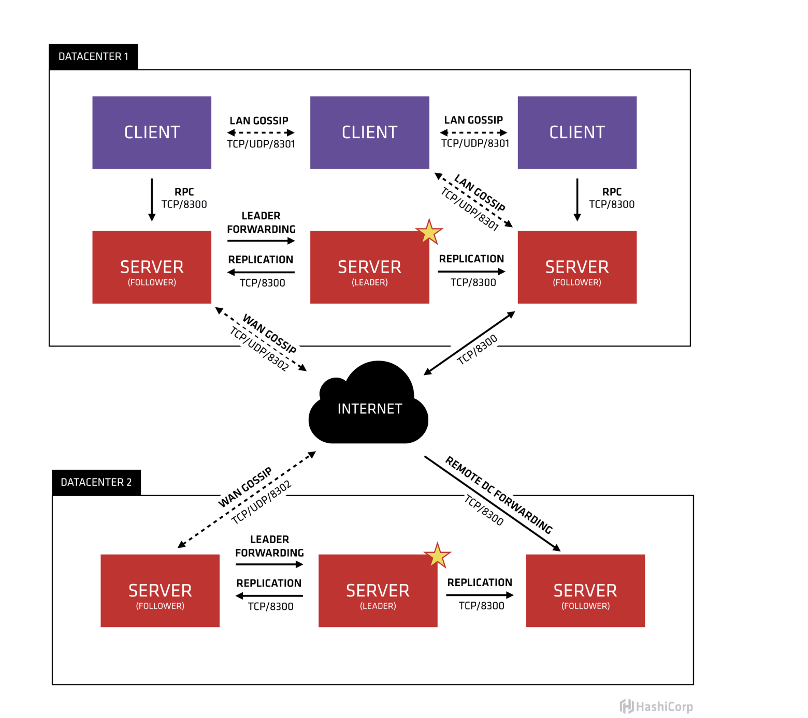

# 服务发现之Consul

consul是一个可以提供服务发现，健康检查，多数据中心，Key/Value存储等功能的分布式服务框架

用于实现分布式系统的服务发现与配置。与其他分布式服务注册与发现的方案，Consul的方案更"一站式"，内置了服务注册与发现框架、分布一致性协议实现、健康检查、Key/Value存储、多数据中心方案，不再需要依赖其他工具（比如ZooKeeper等）。使用起来也较为简单。Consul用Golang实现，因此具有天然可移植性(支持Linux、Windows和Mac OS X)；安装包仅包含一个可执行文件，方便部署，与Docker等轻量级容器可无缝配合。

## Consul 的使用场景
* docker 实例的注册与配置共享
* coreos 实例的注册与配置共享
* vitess 集群
* SaaS 应用的配置共享
* 与 confd 服务集成，动态生成 nginx 和 haproxy 配置文件

## Consul 的优势
* 使用 Raft 算法来保证一致性, 比复杂的 Paxos 算法更直接. 相比较而言, zookeeper 采用的是 Paxos, 而 etcd 使用的则是 Raft.
* 支持多数据中心，内外网的服务采用不同的端口进行监听。 多数据中心集群可以避免单数据中心的单点故障,而其部署则需要考虑网络延迟, 分片等情况等. zookeeper 和 etcd 均不提供多数据中心功能的支持.
* 支持健康检查. etcd 不提供此功能.
* 支持 http 和 dns 协议接口. zookeeper 的集成较为复杂, etcd 只支持 http 协议.
* 官方提供web管理界面, etcd 无此功能.

综合比较, Consul 作为服务注册和配置管理的新星, 比较值得关注和研究.

## Consul 的角色
* client: 客户端, 无状态, 将 HTTP 和 DNS 接口请求转发给局域网内的服务端集群. 
* server: 服务端, 保存配置信息, 高可用集群, 在局域网内与本地客户端通讯, 通过广域网与其他数据中心通讯. 每个数据中心的 server 数量推荐为 3 个或是 5 个.

## Consul 基础组件
* Agent: 在consul集群上每个节点运行的后台进程，在服务端模式和客户端模式都需要运行该进程。

* client: 客户端是无状态的，负责把RPC请求转发给服务端， 占用资源和带宽比较少

* server: 维持集群状态， 相应rpc请求， 选举算法

* Datacenter：数据中心，支持多个数据中心

* Consensus：一致性协议

* Gossip protocol： consul是基于Serf, Serf为成员规则， 失败检测， 节点通信提供了一套协议，

* LAN Gossip： 在同一个局域网或者数据中心中所有的节点

	Refers to the LAN gossip pool which contains nodes that are all located on the same local area network or datacenter.

* Server和Client。客户端不存储配置数据，官方建议每个Consul Cluster至少有3个或5个运行在Server模式的Agent，Client节点不限，如下图

1. 支持多个数据中心， 上图有两个数据中心

2. 每个数据中心一般有3-5个服务器，服务器数目要在可用性和性能上进行平衡，客户端数量没有限制。分布在不同的物理机上

3. 一个集群中的所有节点都添加到 gossip protocol（通过这个协议进行成员管理和信息广播）中， a客户端不用知道服务地址， b节点失败检测是分布式的， 不用只在服务端完成；c

4. 数据中心的所有服务端节点组成一个raft集合， 他们会选举出一个leader，leader服务所有的请求和事务， 如果非leader收到请求， 会转发给leader. leader通过一致性协议（consensus protocol），把所有的改变同步(复制)给非leader.

5. 所有数据中心的服务器组成了一个WAN gossip pool，他存在目的就是使数据中心可以相互交流，增加一个数据中心就是加入一个WAN gossip pool，

6. 当一个服务端节点收到其他数据中心的请求， 会转发给对应数据中心的服务端。

## 保持一致性-Raft协议

[分布式系统的Raft算法](http://johng.cn/cluster-algorithm-raft/)

[英文动画演示Raft](http://thesecretlivesofdata.com/raft/)

## Consul Agent 容错

> 1. 前提：agent 向 server 发 RPC 请求数据，以目前一个机房 5 台 servers 的部署架构，宕 2 台 servers 对集群无影响。agent 默认的 stale 模式会向任一 server 请求数据，这样只要集群中仍存在 server，而不论其角色是否为 leader 时都能工作。
> 
> 2. 重试：RPC 调用失败的话，换另一台 server 再重试一次。
> 
> 3. 快照：将缓存数据（无论其是否过期）定期 dump 到本地存储，当 servers 全部宕掉时 agent 可以从本地 snapshot 取数据，以保证尚能返回部分热点数据。
> 
> 4. 封禁：agent 给 RPC 调用失败的 servers 扣分，根据不同的分值决定将 servers 封禁一定时长。
> 
> 5. 兜底：agent 宕掉的话，客户端尝试直连同集群的其它 agent 返回数据，仍然失败的话，尝试从本地存储中的 snapshot 中取数据。
> 
> 

## consul灾备方案

> 定时从consul读取要调用服务的host+port到db或者redis。如果从consul读取有问题并且重试后还有问题，说明consul出现了问题lark通知被调用服务负责人暂时先不要重启该服务以保证存储的服务host:port是最新的。
> 
> 然后就是怎么从db或者redis在超低延迟以及高并发情况下获取服务的host:port了
> 
> 此方案瓶颈就是怎么保证低延迟高并发从存储中读取host:port的配置，想了下加cache或者从redis读应该能满足

## 几种服务发现工具

zookeeper：https://zookeeper.apache.org/

etcd：https://coreos.com/etcd/

consul：https://www.consul.io/

[服务发现：Zookeeper vs etcd vs Consul](http://dockone.io/article/667)

[服务发现之 Etcd VS Consul](https://www.jianshu.com/p/6160d414dd5e)

## 参考文献

http://www.liangxiansen.cn/2017/04/06/consul/