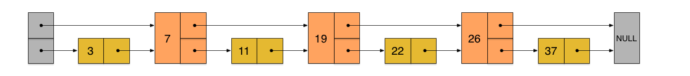
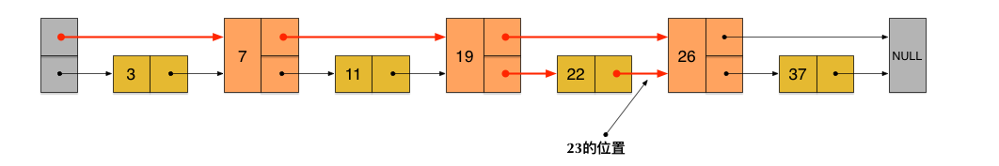
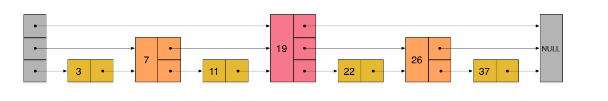
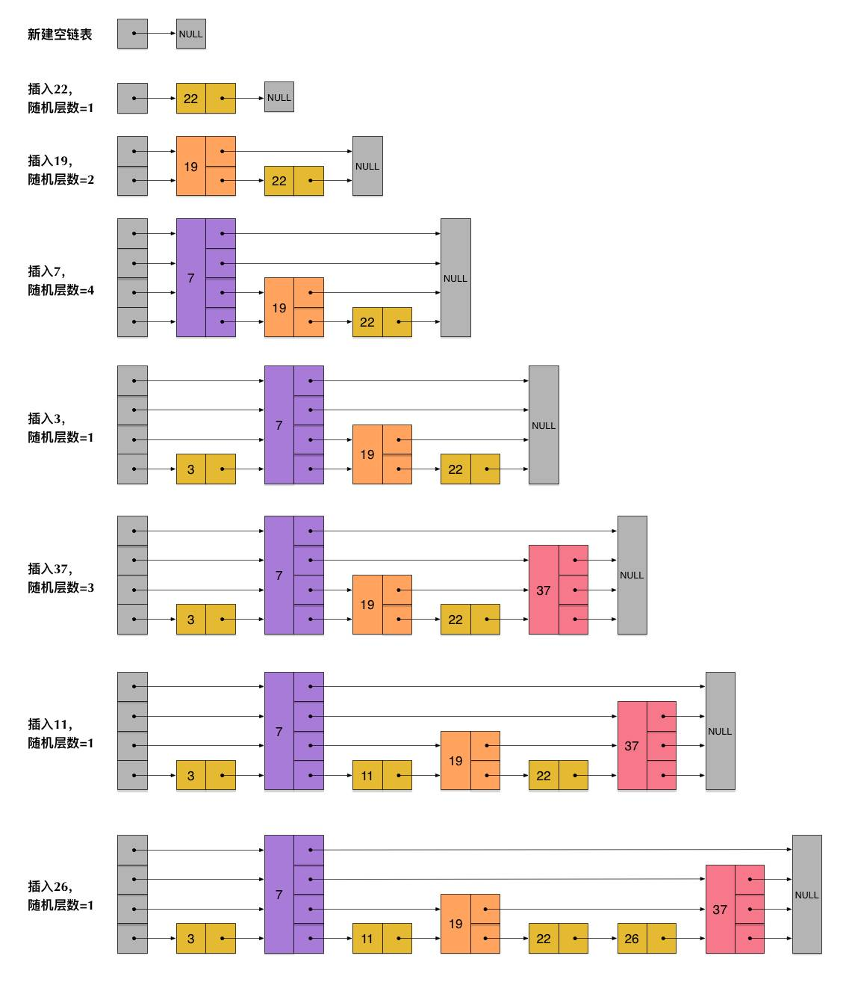
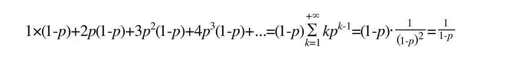
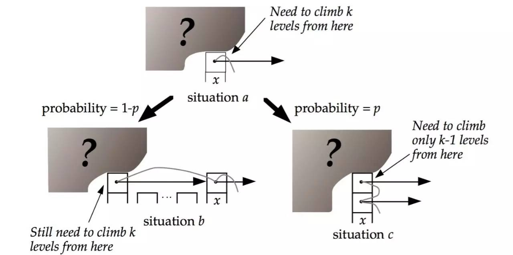
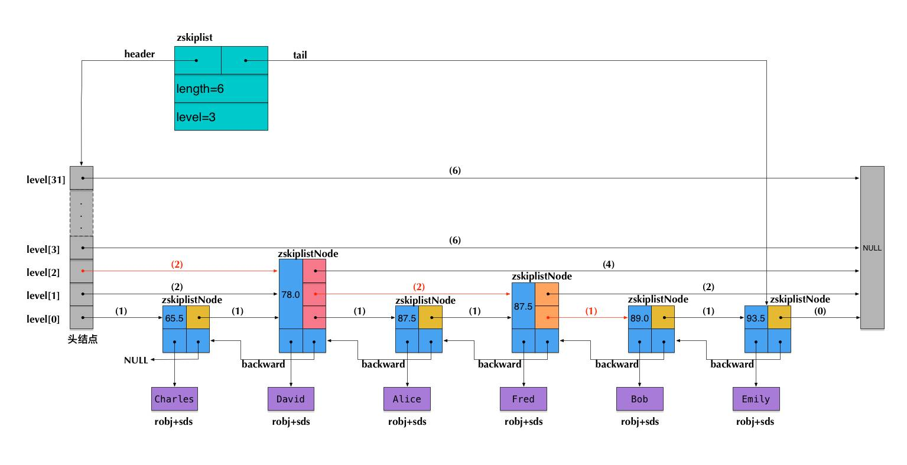

# Redis 源码分析(七) ：skiplist

- [Redis 源码分析(七) ：skiplist](#redis-%e6%ba%90%e7%a0%81%e5%88%86%e6%9e%90%e4%b8%83-skiplist)
	- [一、skiplist 由来](#%e4%b8%80skiplist-%e7%94%b1%e6%9d%a5)
	- [二、skiplist 性能和实现逻辑](#%e4%ba%8cskiplist-%e6%80%a7%e8%83%bd%e5%92%8c%e5%ae%9e%e7%8e%b0%e9%80%bb%e8%be%91)
		- [skiplist 生成随机层数的方法](#skiplist-%e7%94%9f%e6%88%90%e9%9a%8f%e6%9c%ba%e5%b1%82%e6%95%b0%e7%9a%84%e6%96%b9%e6%b3%95)
		- [skiplist 的算法性能分析](#skiplist-%e7%9a%84%e7%ae%97%e6%b3%95%e6%80%a7%e8%83%bd%e5%88%86%e6%9e%90)
		- [skiplist 算法时间复杂度](#skiplist-%e7%ae%97%e6%b3%95%e6%97%b6%e9%97%b4%e5%a4%8d%e6%9d%82%e5%ba%a6)
	- [三、redis 的实现](#%e4%b8%89redis-%e7%9a%84%e5%ae%9e%e7%8e%b0)
		- [结构体定义](#%e7%bb%93%e6%9e%84%e4%bd%93%e5%ae%9a%e4%b9%89)
		- [跳跃表创建及插入](#%e8%b7%b3%e8%b7%83%e8%a1%a8%e5%88%9b%e5%bb%ba%e5%8f%8a%e6%8f%92%e5%85%a5)
		- [Redis 中 skiplist 实现的特殊性](#redis-%e4%b8%ad-skiplist-%e5%ae%9e%e7%8e%b0%e7%9a%84%e7%89%b9%e6%ae%8a%e6%80%a7)
		- [Redis 中的 sorted set](#redis-%e4%b8%ad%e7%9a%84-sorted-set)
	- [四、skiplist 与平衡树、哈希表的比较](#%e5%9b%9bskiplist-%e4%b8%8e%e5%b9%b3%e8%a1%a1%e6%a0%91%e5%93%88%e5%b8%8c%e8%a1%a8%e7%9a%84%e6%af%94%e8%be%83)
	- [五、Redis 为什么用 skiplist 而不用平衡树？](#%e4%ba%94redis-%e4%b8%ba%e4%bb%80%e4%b9%88%e7%94%a8-skiplist-%e8%80%8c%e4%b8%8d%e7%94%a8%e5%b9%b3%e8%a1%a1%e6%a0%91)
	- [参数资料](#%e5%8f%82%e6%95%b0%e8%b5%84%e6%96%99)

## 一、skiplist 由来

`skiplist`本质上也是一种查找结构，用于解决算法中的查找问题（`Searching`），即根据给定的`key`，快速查到它所在的位置（或者对应的`value`）。

我们在《Redis 内部数据结构详解》系列的第一篇中介绍 dict 的时候，曾经讨论过：一般查找问题的解法分为两个大类：一个是基于各种平衡树，一个是基于哈希表。但`skiplist`却比较特殊，它没法归属到这两大类里面。

这种数据结构是由`William Pugh`发明的，最早出现于他在 1990 年发表的论文《Skip Lists: A Probabilistic Alternative to Balanced Trees》。对细节感兴趣的同学可以下载论文原文来阅读。

`skiplist`，顾名思义，首先它是一个`list`。实际上，它是在有序链表的基础上发展起来的。

我们先来看一个有序链表，如下图（最左侧的灰色节点表示一个空的头结点）：

在这样一个链表中，如果我们要查找某个数据，那么需要从头开始逐个进行比较，直到找到包含数据的那个节点，或者找到第一个比给定数据大的节点为止（没找到）。也就是说，时间复杂度为`O(n)`。同样，当我们要插入新数据的时候，也要经历同样的查找过程，从而确定插入位置。

假如我们每相邻两个节点增加一个指针，让指针指向下下个节点，如下图：

这样所有新增加的指针连成了一个新的链表，但它包含的节点个数只有原来的一半（上图中是 7, 19, 26）。现在当我们想查找数据的时候，可以先沿着这个新链表进行查找。当碰到比待查数据大的节点时，再回到原来的链表中进行查找。比如，我们想查找 23，查找的路径是沿着下图中标红的指针所指向的方向进行的：

- 23 首先和 7 比较，再和 19 比较，比它们都大，继续向后比较。
- 但 23 和 26 比较的时候，比 26 要小，因此回到下面的链表（原链表），与 22 比较。
- 23 比 22 要大，沿下面的指针继续向后和 26 比较。23 比 26 小，说明待查数据 23 在原链表中不存在，而且它的插入位置应该在 22 和 26 之间。

在这个查找过程中，由于新增加的指针，我们不再需要与链表中每个节点逐个进行比较了。需要比较的节点数大概只有原来的一半。

利用同样的方式，我们可以在上层新产生的链表上，继续为每相邻的两个节点增加一个指针，从而产生第三层链表。如下图：

`skiplist`正是受这种多层链表的想法的启发而设计出来的。实际上，按照上面生成链表的方式，上面每一层链表的节点个数，是下面一层的节点个数的一半，这样查找过程就非常类似于一个二分查找，使得查找的时间复杂度可以降低到`O(log n)`。

**但是，这种方法在插入数据的时候有很大的问题。新插入一个节点之后，就会打乱上下相邻两层链表上节点个数严格的 2:1 的对应关系。如果要维持这种对应关系，就必须把新插入的节点后面的所有节点（也包括新插入的节点）重新进行调整，这会让时间复杂度重新蜕化成 O(n)。删除数据也有同样的问题。**

`skiplist`为了避免这一问题，它不要求上下相邻两层链表之间的节点个数有严格的对应关系，而是为每个节点随机出一个层数`(level)`。比如，一个节点随机出的层数是 3，那么就把它链入到第 1 层到第 3 层这三层链表中。为了表达清楚，下图展示了如何通过一步步的插入操作从而形成一个`skiplist`的过程：

从上面`skiplist`的创建和插入过程可以看出，每一个节点的层数`（level）`是随机出来的，而且新插入一个节点不会影响其它节点的层数。因此，插入操作只需要修改插入节点前后的指针，而不需要对很多节点都进行调整。这就降低了插入操作的复杂度。实际上，这是`skiplist`的一个很重要的特性，这让它在插入性能上明显优于平衡树的方案。这在后面我们还会提到。

根据上图中的`skiplist`结构，我们很容易理解这种数据结构的名字的由来。`skiplist`，翻译成中文，可以翻译成“跳表”或“跳跃表”，指的就是除了最下面第 1 层链表之外，它会产生若干层稀疏的链表，这些链表里面的指针故意跳过了一些节点（而且越高层的链表跳过的节点越多）。这就使得我们在查找数据的时候能够先在高层的链表中进行查找，然后逐层降低，最终降到第 1 层链表来精确地确定数据位置。在这个过程中，我们跳过了一些节点，从而也就加快了查找速度。

## 二、skiplist 性能和实现逻辑

### skiplist 生成随机层数的方法

    // redis 5.0.2的客户端代码，redis 3.2.x版本最大Level是32
    #define ZSKIPLIST_MAXLEVEL 64 /* Should be enough for 2^64 elements */
    #define ZSKIPLIST_P 0.25      /* Skiplist P = 1/4 */

    /* Returns a random level for the new skiplist node we are going to create.
     * The return value of this function is between 1 and ZSKIPLIST_MAXLEVEL
     * (both inclusive), with a powerlaw-alike distribution where higher
     * levels are less likely to be returned. */
    int zslRandomLevel(void) {  // 跳跃表获取随机level值  越大的数出现的几率越小

        int level = 1;
        while ((random()&0xFFFF) < (ZSKIPLIST_P * 0xFFFF))  // 每往上提一层的概率为4分之一
            level += 1;
        return (level<ZSKIPLIST_MAXLEVEL) ? level : ZSKIPLIST_MAXLEVEL;
    }

由上面的代码可以看出，Redis 最大的层数是 64，`level`层数最小是 1 ，level+1 的概率是`1/4`（比如 level=2 的概率是`1/4`，level=3 的概率是`1/16`依次类推）

### skiplist 的算法性能分析

我们先来计算一下每个节点所包含的平均指针数目（概率期望）。节点包含的指针数目，相当于这个算法在空间上的额外开销`(overhead)`，可以用来度量空间复杂度。

根据前面`zslRandomLevel`()代码，我们很容易看出，产生越高的节点层数，概率越低。定量的分析如下：

- 节点层数至少为 1。而大于 1 的节点层数，满足一个概率分布。
- 节点层数恰好等于 1 的概率为 1-p。
- 节点层数大于等于 2 的概率为 p，而节点层数恰好等于 2 的概率为 p(1-p)。
- 节点层数大于等于 3 的概率为 p 2 ，而节点层数恰好等于 3 的概率为 p 2 (1-p)。
- 节点层数大于等于 4 的概率为 p 3 ，而节点层数恰好等于 4 的概率为 p 3 (1-p)。
- 依次类推

因此，一个节点的平均层数（也即包含的平均指针数目），计算如下：

现在很容易计算出：

- 当 p=1/4 时，每个节点所包含的平均指针数目为 1.33（平衡树每个节点包含指针数是 2）。这也是 Redis 里的 skiplist 实现在空间上的开销。

### skiplist 算法时间复杂度

为了分析时间复杂度，我们计算一下`skiplist`的平均查找长度。查找长度指的是查找路径上跨越的跳数，而查找过程中的比较次数就等于查找长度加 1。

为了计算查找长度，这里我们需要利用一点小技巧。我们注意到，每个节点插入的时候，它的层数是由随机函数`zslRandomLevel()`计算出来的，而且随机的计算不依赖于其它节点，每次插入过程都是完全独立的。所以从统计上来说，一个`skiplist`结构的形成与节点的插入顺序无关。

这样的话，为了计算查找长度，我们可以将查找过程倒过来看，从右下方第 1 层上最后到达的那个节点开始，沿着查找路径向左向上回溯，类似于爬楼梯的过程。我们假设当回溯到某个节点的时候，它才被插入，这虽然相当于改变了节点的插入顺序，但从统计上不影响整个`skiplist`的形成结构。

现在假设我们从一个层数为`i`的节点`x`出发，需要向左向上攀爬`k`层。这时我们有两种可能：

如果节点`x`有第`(i+1)`层指针，那么我们需要向上走。这种情况概率为`p`。

如果节点`x`没有第`(i+1)`层指针，那么我们需要向左走。这种情况概率为`(1-p)`。

这两种情形如下图所示：

用`C(k)`表示向上攀爬`k`个层级所需要走过的平均查找路径长度（概率期望），那么：

    C(0)=0
    C(k)=(1-p)×(上图中情况b的查找长度) + p×(上图中情况c的查找长度)

代入，得到一个差分方程并化简：
C(k)=(1-p)(C(k)+1) + p(C(k-1)+1)
C(k)=1/p+C(k-1)
C(k)=k/p
这个结果的意思是，我们每爬升 1 个层级，需要在查找路径上走`1/p`步。而我们总共需要攀爬的层级数等于整个`skiplist`的总层数-1。

那么接下来我们需要分析一下当`skiplist`中有`n`个节点的时候，它的总层数的概率均值是多少。这个问题直观上比较好理解。根据节点的层数随机算法，容易得出：

- 第 1 层链表固定有`n`个节点；
- 第 2 层链表平均有`n*p`个节点；
- 第 3 层链表平均有`n*p 2`个节点；
- ...

所以，从第 1 层到最高层，各层链表的平均节点数是一个指数递减的等比数列。容易推算出，总层数的均值为`log 1/p n`，而最高层的平均节点数为`1/p`。

综上，粗略来计算的话，平均查找长度约等于：

    C(log 1/p n-1)=(log 1/p n-1)/p

即，平均时间复杂度为 O(log n)。

当然，这里的时间复杂度分析还是比较粗略的。比如，沿着查找路径向左向上回溯的时候，可能先到达左侧头结点，然后沿头结点一路向上；还可能先到达最高层的节点，然后沿着最高层链表一路向左。但这些细节不影响平均时间复杂度的最后结果。另外，这里给出的时间复杂度只是一个概率平均值，但实际上计算一个精细的概率分布也是有可能的。详情还请参见 William Pugh 的论文《Skip Lists: A Probabilistic Alternative to Balanced Trees》。

## 三、redis 的实现

### 结构体定义

    typedef struct zskiplistNode {  // 跳跃表节点
        robj *obj;  // redis对象
        double score;   // 分值
        struct zskiplistNode *backward; // 后退指针
        struct zskiplistLevel {
            struct zskiplistNode *forward;  // 前进指针
            unsigned int span;  // 跨度
        } level[];
    } zskiplistNode;

    typedef struct zskiplist {
        struct zskiplistNode *header, *tail;
        unsigned long length;   // 跳跃表长度
        int level;  // 目前跳跃表的最大层数节点
    } zskiplist;

redis 的跳跃表是一个双向的链表，并且在`zskiplist`结构体中保存了跳跃表的长度和头尾节点，方便从头查找或从尾部遍历。

`zskiplistNode`定义了`skiplist`的节点结构。

- `obj`字段存放的是节点数据，它的类型是一个`string robj`。本来一个`string robj`可能存放的不是`sds`，而是`long`型，但`zadd`命令在将数据插入到`skiplist`里面之前先进行了解码，所以这里的`obj`字段里存储的一定是一个`sds`。这样做的目的应该是为了方便在查找的时候对数据进行字典序的比较，而且，`skiplist`里的数据部分是数字的可能性也比较小。
- `score`字段是数据对应的分数。
- `backward`字段是指向链表前一个节点的指针（前向指针）。节点只有 1 个前向指针，所以只有第 1 层链表是一个双向链表。
- `level[]`存放指向各层链表后一个节点的指针（后向指针）。每层对应 1 个后向指针，用`forward`字段表示。另外，每个后向指针还对应了一个`span`值，它表示当前的指针跨越了多少个节点。`span`用于计算元素排名`(rank)`，这正是前面我们提到的 Redis 对于`skiplist`所做的一个扩展。需要注意的是，`level[]`是一个柔性数组`（flexible array member）`，因此它占用的内存不在`zskiplistNode`结构里面，而需要插入节点的时候单独为它分配。也正因为如此，`skiplist`的每个节点所包含的指针数目才是不固定的，我们前面分析过的结论——`skiplist`每个节点包含的指针数目平均为`1/(1-p)`——才能有意义。

`zskiplist`定义了真正的`skiplist`结构，它包含：

- 头指针`header`和尾指针`tail`。
- 链表长度`length`，即链表包含的节点总数。注意，新创建的`skiplist`包含一个空的头指针，这个头指针不包含在`length`计数中。
- `level`表示`skiplist`的总层数，即所有节点层数的最大值。

注意：图中前向指针上面括号中的数字，表示对应的`span`的值。即当前指针跨越了多少个节点，这个计数不包括指针的起点节点，但包括指针的终点节点。

假设我们在这个`skiplist`中查找`score=89.0`的元素（即 Bob 的成绩数据），在查找路径中，我们会跨域图中标红的指针，这些指针上面的`span`值累加起来，就得到了 Bob 的排名`(2+2+1)-1=4`（减 1 是因为 rank 值以 0 起始）。需要注意这里算的是从小到大的排名，而如果要算从大到小的排名，只需要用`skiplist`长度减去查找路径上的`span`累加值，即`6-(2+2+1)=1`。

可见，在查找`skiplist`的过程中，通过累加`span`值的方式，我们就能很容易算出排名。相反，如果指定排名来查找数据（类似`zrange`和`zrevrange`那样），也可以不断累加`span`并时刻保持累加值不超过指定的排名，通过这种方式就能得到一条`O(log n)`的查找路径。

### 跳跃表创建及插入

跳跃表的创建就是一些基本的初始化操作，需要注意的是 redis 的跳跃表最大层数为 64，是为了能够足够支撑优化`2^64`个元素的查找。假设每个元素出现在上一层索引的概率为 0.5，每个元素出现在第 n 层的概率为`1/2^n`，所以当有`2^n`个元素时，需要 n 层索引保证查询时间复杂度为`O(logN)`。
	
	zskiplistNode *zslCreateNode(int level, double score, robj *obj) {  // 跳跃表节点创建
	    zskiplistNode *zn = zmalloc(sizeof(*zn)+level*sizeof(struct zskiplistLevel));
	    zn->score = score;
	    zn->obj = obj;
	    return zn;
	}
	
	zskiplist *zslCreate(void) {    // 跳跃表创建
	    int j;
	    zskiplist *zsl;
	
	    zsl = zmalloc(sizeof(*zsl));
	    zsl->level = 1;
	    zsl->length = 0;
	    zsl->header = zslCreateNode(ZSKIPLIST_MAXLEVEL,0,NULL); // 创建头结点
	    for (j = 0; j < ZSKIPLIST_MAXLEVEL; j++) {  // 初始化头结点
	        zsl->header->level[j].forward = NULL;
	        zsl->header->level[j].span = 0;
	    }
	    zsl->header->backward = NULL;
	    zsl->tail = NULL;
	    return zsl;
	}

redis 的跳跃表出现在上层索引节点的概率为 0.25，在这样的概率下跳跃表的查询效率会略大于 O(logN)，但是索引的存储内存却能节省一半。
	
	zskiplistNode *zslInsert(zskiplist *zsl, double score, robj *obj) { // 跳跃表zset节点插入
	    zskiplistNode *update[ZSKIPLIST_MAXLEVEL], *x;
	    unsigned int rank[ZSKIPLIST_MAXLEVEL];
	    int i, level;
	
	    serverAssert(!isnan(score));
	    x = zsl->header;
	    for (i = zsl->level-1; i >= 0; i--) {   // 获取带插入节点的位置
	        /* store rank that is crossed to reach the insert position */
	        rank[i] = i == (zsl->level-1) ? 0 : rank[i+1];
	        while (x->level[i].forward &&
	            (x->level[i].forward->score < score ||
	                (x->level[i].forward->score == score &&
	                compareStringObjects(x->level[i].forward->obj,obj) < 0))) { // 如果当前节点分支小于带插入节点
	            rank[i] += x->level[i].span;    // 记录各层x前一个节点的索引跨度
	            x = x->level[i].forward;    // 查找一下个节点
	        }
	        update[i] = x;  // 记录各层x的前置节点
	    }
	
	    level = zslRandomLevel();   // 获取当前节点的level
	    if (level > zsl->level) {   // 如果level大于当前skiplist的level 将大于部分的header初始化
	        for (i = zsl->level; i < level; i++) {
	            rank[i] = 0;
	            update[i] = zsl->header;
	            update[i]->level[i].span = zsl->length;
	        }
	        zsl->level = level;
	    }
	    x = zslCreateNode(level,score,obj); // 创建新节点
	    for (i = 0; i < level; i++) {
	        x->level[i].forward = update[i]->level[i].forward;  // 建立x节点索引
	        update[i]->level[i].forward = x;    // 将各层x的前置节点的后置节点置为x
	
	        /* update span covered by update[i] as x is inserted here */
	        x->level[i].span = update[i]->level[i].span - (rank[0] - rank[i]);  // 计算x节点各层索引跨度
	        update[i]->level[i].span = (rank[0] - rank[i]) + 1; // 计算x前置节点的索引跨度
	    }
	
	    /* increment span for untouched levels */
	    for (i = level; i < zsl->level; i++) {  // 如果level小于zsl的level
	        update[i]->level[i].span++; // 将x前置节点的索引跨度加一
	    }
	
	    x->backward = (update[0] == zsl->header) ? NULL : update[0];    // 设置x前置节点
	    if (x->level[0].forward)
	        x->level[0].forward->backward = x;  // 设置x后面节点的前置节点
	    else
	        zsl->tail = x;
	    zsl->length++;  // length+1
	    return x;
	}

### Redis 中 skiplist 实现的特殊性

在 Redis 中，`skiplist`被用于实现暴露给外部的一个数据结构：`sorted set`。准确地说，`sorted set`底层不仅仅使用了`skiplist`，还使用了`ziplist`和`dict`。

我们简单分析一下`sorted set`的几个查询命令：

- `zrevrank`由数据查询它对应的排名，这在前面介绍的`skiplist`中并不支持。
- `zscore`由数据查询它对应的分数，这也不是`skiplist`所支持的。
- `zrevrange`根据一个排名范围，查询排名在这个范围内的数据。这在前面介绍的`skiplist`中也不支持。
- `zrevrangebyscore`根据分数区间查询数据集合，是一个`skiplist`所支持的典型的范围查找（`score`相当于`key`）。

实际上，Redis 中`sorted set`的实现是这样的：

- 当数据较少时，`sorted set`是由一个`ziplist`来实现的。
- 当数据多的时候，`sorted set`是由一个`dict` + 一个`skiplist`来实现的。简单来讲，`dict`用来查询数据到分数的对应关系，而`skiplist`用来根据分数查询数据（可能是范围查找）。

现在我们集中精力来看一下`sorted set`与`skiplist`的关系：

- `zscore`的查询，不是由`skiplist`来提供的，而是由那个`dict`来提供的。
- 为了支持排名`(rank)`，Redis 里对`skiplist`做了扩展，使得根据排名能够快速查到数据，或者根据分数查到数据之后，也同时很容易获得排名。而且，根据排名的查找，时间复杂度也为`O(log n)`。
- `zrevrange`的查询，是根据排名查数据，由扩展后的`skiplist`来提供。
- `zrevrank`是先在`dict`中由数据查到分数，再拿分数到`skiplist`中去查找，查到后也同时获得了排名。

前述的查询过程，也暗示了各个操作的时间复杂度：

- `zscore`只用查询一个`dict`，所以时间复杂度为`O(1)`
- `zrevrank`, `zrevrange`, `zrevrangebyscore`由于要查询`skiplist`，所以`zrevrank`的时间复杂度为`O(log n)`，而`zrevrange`, `zrevrangebyscore`的时间复杂度为`O(log(n)+M)`，其中 M 是当前查询返回的元素个数。

总结起来，Redis 中的`skiplist`跟前面介绍的经典的`skiplist`相比，有如下不同：

- 分数`(score)`允许重复，即`skiplist`的 key 允许重复。这在最开始介绍的经典`skiplist`中是不允许的。
- 在比较时，不仅比较分数（相当于`skiplist`的`key`），还比较数据本身。在 Redis 的`skiplist`实现中，数据本身的内容唯一标识这份数据，而不是由 key 来唯一标识。另外，当多个元素分数相同的时候，还需要根据数据内容来进字典排序。
- 第 1 层链表不是一个单向链表，而是一个双向链表。这是为了方便以倒序方式获取一个范围内的元素。
- 在 skiplist 中可以很方便地计算出每个元素的排名(rank)。

### Redis 中的 sorted set

我们前面提到过，Redis 中的`sorted set`，是在`skiplist`, `dict`和`ziplist`基础上构建起来的:

- 当数据较少时，`sorted set`是由一个`ziplist`来实现的。
- 当数据多的时候，`sorted set`是由一个叫 zset 的数据结构来实现的，这个`zset`包含一个`dict` + 一个`skiplist`。dict 用来查询数据到分数`(score)`的对应关系，而`skiplist`用来根据分数查询数据（可能是范围查找）。

在这里我们先来讨论一下前一种情况——基于`ziplist`实现的`sorted set`。在本系列前面关于`ziplist`的文章里，我们介绍过，`ziplist`就是由很多数据项组成的一大块连续内存。由于`sorted set`的每一项元素都由数据和`score`组成，因此，当使用`zadd`命令插入一个(数据, `score`)对的时候，底层在相应的`ziplist`上就插入两个数据项：数据在前，`score`在后。

`ziplist`的主要优点是节省内存，但它上面的查找操作只能按顺序查找（可以正序也可以倒序）。因此，`sorted set`的各个查询操作，就是在`ziplist`上从前向后（或从后向前）一步步查找，每一步前进两个数据项，跨域一个(数据, `score`)对。

随着数据的插入，`sorted set`底层的这个`ziplist`就可能会转成`zset`的实现（转换过程详见`t_zset.c`的`zsetConvert`）。

    zset-max-ziplist-entries 128
    zset-max-ziplist-value 64

这个配置的意思是说，在如下两个条件之一满足的时候，`ziplist`会转成`zset`（具体的触发条件参见`t_zset.c`中的`zaddGenericCommand`相关代码）：

- 当`sorted set`中的元素个数，即(数据, score)对的数目超过 128 的时候，也就是 ziplist 数据项超过 256 的时候。
- 当`sorted set`中插入的任意一个数据的长度超过了 64 的时候。

最后，`zset`结构的代码定义如下：

    typedef struct zset { dict *dict; zskiplist *zsl; } zset;

## 四、skiplist 与平衡树、哈希表的比较

- `skiplist`和各种平衡树（如`AVL`、红黑树等）的元素是有序排列的，而哈希表不是有序的。因此，在哈希表上只能做单个`key`的查找，不适宜做范围查找。所谓范围查找，指的是查找那些大小在指定的两个值之间的所有节点。
- 在做范围查找的时候，平衡树比`skiplist`操作要复杂。在平衡树上，我们找到指定范围的小值之后，还需要以中序遍历的顺序继续寻找其它不超过大值的节点。如果不对平衡树进行一定的改造，这里的中序遍历并不容易实现。而在`skiplist`上进行范围查找就非常简单，只需要在找到小值之后，对第 1 层链表进行若干步的遍历就可以实现。
- 平衡树的插入和删除操作可能引发子树的调整，逻辑复杂，而`skiplist`的插入和删除只需要修改相邻节点的指针，操作简单又快速。
- 从内存占用上来说，`skiplist`比平衡树更灵活一些。一般来说，平衡树每个节点包含 2 个指针（分别指向左右子树），而 skiplist 每个节点包含的指针数目平均为`1/(1-p)`，具体取决于参数`p`的大小。如果像 Redis 里的实现一样，取`p=1/4`，那么平均每个节点包含 1.33 个指针，比平衡树更有优势。
- 查找单个`key`，`skiplist`和平衡树的时间复杂度都为 O(log n)，大体相当；而哈希表在保持较低的哈希值冲突概率的前提下，查找时间复杂度接近 O(1)，性能更高一些。所以我们平常使用的各种`Map`或`dictionary`结构，大都是基于哈希表实现的。
- 从算法实现难度上来比较，`skiplist`比平衡树要简单得多。

## 五、Redis 为什么用 skiplist 而不用平衡树？

在前面我们对于`skiplist`和平衡树、哈希表的比较中，其实已经不难看出 Redis 里使用`skiplist`而不用平衡树的原因了。现在我们看看，对于这个问题，Redis 的作者 `@antirez` 是怎么说的：

There are a few reasons:

1. They are not very memory intensive. It's up to you basically. Changing parameters about the probability of a node to have a given number of levels will make then less memory intensive than btrees.

2. A sorted set is often target of many ZRANGE or ZREVRANGE operations, that is, traversing the skip list as a linked list. With this operation the cache locality of skip lists is at least as good as with other kind of balanced trees.

3. They are simpler to implement, debug, and so forth. For instance thanks to the skip list simplicity I received a patch (already in Redis master) with augmented skip lists implementing ZRANK in O(log(N)). It required little changes to the code.

这里从内存占用、对范围查找的支持和实现难易程度这三方面总结的原因，我们在前面其实也都涉及到了。

## 参数资料

[Redis 为什么用跳表而不用平衡树？](https://mp.weixin.qq.com/s?__biz=MzA4NTg1MjM0Mg==&mid=2657261425&idx=1&sn=d840079ea35875a8c8e02d9b3e44cf95&scene=0#wechat_redirect)

[redis 源码解读(七):基础数据结构之 skiplist](http://czrzchao.com/redisSourceSkiplist#skiplist)
