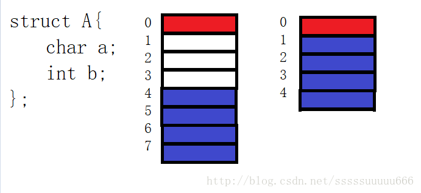

# Golang 内存对齐问题

### 什么是内存对齐？

CPU把内存当成是一块一块的，块的大小可以是2，4，8，16字节大小，因此CPU在读取内存时是一块一块进行读取的。块大小成为memory access granularity（粒度）。

假设CPU访问粒度是4，也就是一次性可以读取内存中的四个字节内容；当我们不采用内存对齐策略，如果需要访问A中的b元素，CPU需要先取出0~3四个字节的内容，发现没有读取完，还需要再次读取，一共需要进行两次访问内存的操作；而有了内存对齐，参考左图，可一次性取出4~7四个字节的元素也即是b，这样就只需要进行一次访问内存的操作。所以操作系统这样做的原因也就是所谓的拿空间换时间，提高效率。

### 为什么要内存对齐？

会了关于结构体内存大小的计算，可是为什么系统要对于结构体数据进行内存对齐呢，很明显所占用的空间大小要更多。原因可归纳如下：

1. 平台原因(移植原因)：不是所有的硬件平台都能访问任意地址上的任意数据的；某些硬件平台只能在某些地址处取某些特定类型的数据，否则抛出硬件异常。
2. 性能原因：数据结构(尤其是栈)应该尽可能地在自然边界上对齐。原因在于，为了访问未对齐的内存，处理器需要作两次内存访问；而对齐的内存访问仅需要一次访问。

### Golang 字节对齐

最近在做一个需求的时候，有个场景，需要一个线程定时去更新一个全局变量指针地址，然后在另外的线程可以读取这个变量的数据，同事在帮忙Review代码的时候，问这个多线程操作这个全局指针变量时候是否可以不用加锁，因为在C/C++中有内存对齐问题，如果指针是内存对齐的，是可以不加锁的。所以下面测试下golang的内存是否会做自动对齐的操作。

测试一

		//输出长度为1
	   fmt.Printf("%d",unsafe.Sizeof(struct {
		   i8  int8
	   }{}))
	   
测试二

		//输出长度为16
	   fmt.Printf("%d",unsafe.Sizeof(struct {
		   i8  int8
		   p   *int8
	   }{}))

在测试二中可以看出， 在后面申明一个指针以后，内存空间自动扩容为16了，说明编译自动帮我们做了内存对齐。

### 参考文献

http://www.cppblog.com/snailcong/archive/2009/03/16/76705.html

https://www.zhihu.com/question/27862634

https://blog.csdn.net/sssssuuuuu666/article/details/75175108

https://my.oschina.net/u/2950272/blog/1829197

https://www.jianshu.com/p/cb40c746bf9e