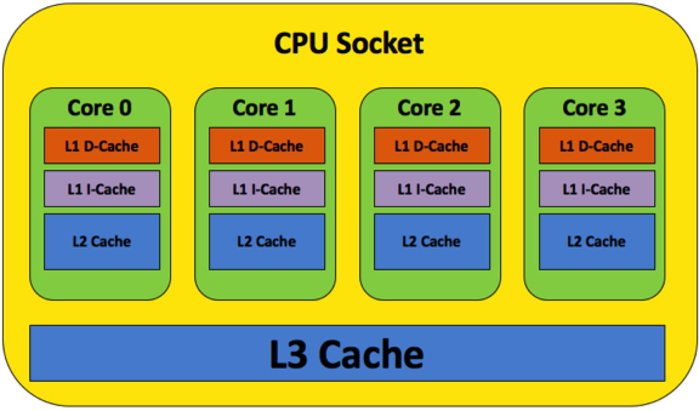
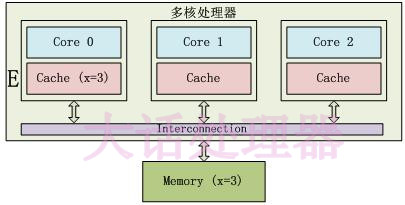
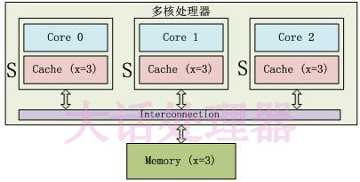
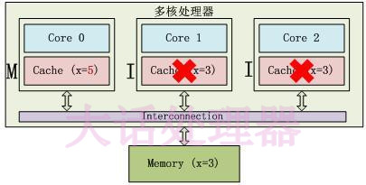
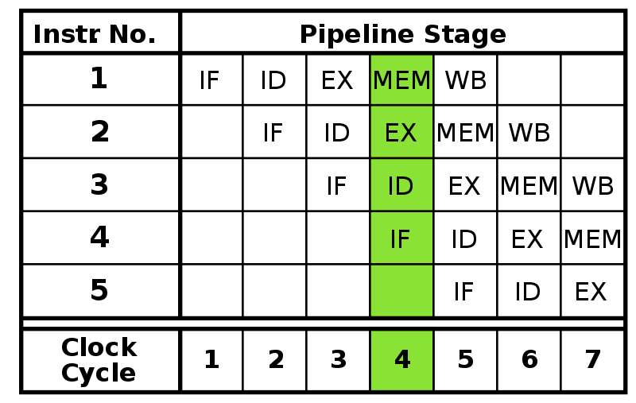

# Golang Memory Model

## 一、背景

### 1.1 一个 Code Review 引发的思考

一个同学在 `Golang` 项目里面用 `Double Check`（不清楚的同学可以去百度搜下，Java中比较常见，Golang系统Sync库也有部分代码用到这种方式）的方式实现了一个单例。具体实现如下：
	
	var (
		lock     sync.Mutex
		instance *UserInfo
	)
	
	func getInstance() (*UserInfo, error) {
		if instance == nil {
			//---Lock
			lock.Lock()
			defer lock.Unlock()
			if instance == nil {
				instance = &UserInfo{
					Name: "fan",
				}
			}
		}//---Unlock()
		return instance, nil
	}

这个代码第一眼看上去好像是标准的`Double Check`的写法，确没有什么问题，但是大佬Review代码的时候，指出这里会发生Data Race。我用 `go run -race go_race2.go` 检查的确有Data Race的警告：

	==================
	WARNING: DATA RACE
	Read at 0x00000120d9c0 by goroutine 8:
	  main.getInstance()
	      /Users/fl/go/src/github.com/fl/GolangDemo/GoTest/go_race2.go:42 +0x4f
	  main.main.func1()
	      /Users/fl/go/src/github.com/fl/GolangDemo/GoTest/go_race2.go:24 +0x44
	
	Previous write at 0x00000120d9c0 by goroutine 7:
	  main.getInstance()
	      /Users/fl/go/src/github.com/fl/GolangDemo/GoTest/go_race2.go:49 +0x169
	  main.main.func1()
	      /Users/fl/go/src/github.com/fl/GolangDemo/GoTest/go_race2.go:24 +0x44
	
	Goroutine 8 (running) created at:
	  main.main()
	      /Users/fl/go/src/github.com/fl/GolangDemo/GoTest/go_race2.go:23 +0xab
	
	Goroutine 7 (finished) created at:
	  main.main()
	      /Users/fl/go/src/github.com/fl/GolangDemo/GoTest/go_race2.go:23 +0xab
	==================

警告中指明在多线程执行`getInstance`这个方法的时候，在`if instance == nil {` 这一行会发生`data race`。这个为什么在这一行会有`data race`，我们后面再说。

其实搞Java的同学很快可以看出这段代码的问题，Java中的`Double Check `来实现单例模式的时候都会使用`volatile`来修饰变量，`volatile`主要做的事就是`保证线程可见性`和`禁止指令重排序`。其实这两个主要就是`Memory Model`描述的事情。

### 1.2 什么是 Memory Model

Java和C++的同学可能会熟悉一些，其他很多同学第一次听到这个单词的时候，潜意识翻译成中文就是`内存模型`，好像是讲的一个内存数据结构相关的东西。某度上搜索`Memory Model`出来更多是不相干东西。我们看下[wikipedia](https://en.wikipedia.org/wiki/Memory_model_(programming)#:~:text=In%20computing%2C%20a%20memory%20model,shared%20use%20of%20the%20data.)上的解释：

> In computing, a memory model describes the interactions of threads through memory and their shared use of the data.

直接翻译过来就是：`在计算中，内存模型描述了多线程如何通过内存的交互来共享数据`

看下Golang官方文档的解释：[The Go Memory Model](https://golang.org/ref/mem)

> The Go memory model specifies the conditions under which reads of a variable in one goroutine can be guaranteed to observe values produced by writes to the same variable in a different goroutine.

翻译下就是：Go内存模型指定了某些条件，在这种条件下，可以保证一个共享变量，在一个goroutine（线程）中写入，可以在另外一个线程被观察到。

**`Memory Model` 其实是一个概念，表示在多线程场景下，如何保证数据同步的正确性。** 为什么多线程读取共享内存变量的时候会有`数据同步正确性`问题呢，这里主要涉及到**`CPU缓存一致性问题`**和**`CPU乱序执行的问题`**，

各个语言对`Memory Model`实现方式各不相同，对其他语言感兴趣的同学可以去搜索下相关资料。

[Java Memory Model](https://en.wikipedia.org/wiki/Java_memory_model) 

[C++ Memory Model](https://en.cppreference.com/w/cpp/language/memory_model#:~:text=Defines%20the%20semantics%20of%20computer,memory%20has%20a%20unique%20address.) 

[《C++ Concurrency in Action》第五章](https://book.douban.com/subject/27036085/) （大佬推荐的书，还没拜读）

## 二、CPU的高速缓存和流水线架构

### 2.1 CPU 缓存一致性

#### 2.1.1 线程可见性问题

我们先看一下测试DEMO
	
	func main() {
		running := true
		go func() {
			println("thread1 start")
			count := 1
			for running {
				count++
			}
			println("thread1 end : count = ", count) //这个循环永远也不会结束,为什么？
		}()
		go func() {
			println("start thread2")
			for {
				running = false
			}
		}()
		time.Sleep(time.Hour)
		return
	}

我分别写了[Java Demo](https://github.com/fanlv/fanlv.github.io/blob/master/Content/Backend/Main.java) 、[Objective-C Demo](https://github.com/fanlv/fanlv.github.io/blob/master/Content/Backend/AppDelegate.m#L51) 、[C Demo](https://github.com/fanlv/fanlv.github.io/blob/master/Content/Backend/main.c) 测试了下，跟`Golang`的执行的效果一致（C和Objective-C用Xcode跑的时候需要用Release模式，因为Debug和Release的-O优化级别不一样，[-O优化详见](https://blog.csdn.net/kobemin/article/details/83180747)）。

为什么在一个线程修改了共享变量，另外一个线程感知不到呢？这里我们需要了解下CPU的Cache原理。

现代多核CPU的`Cache `模型基本都跟上图所示一样，`L1 L2 cache`是每个核独占的，只有`L3`是共享的，当多个CPU读、写同一个变量时，就需要在多个CPU的`Cache`之间同步数据，跟分布式系统一样，必然涉及到一致性的问题。

#### 2.1.2 CPU 缓存一致性协议

 在MESI协议中，每个Cache line（Cache Line的概念后面会补充介绍）有4个状态，可用2个bit表示，它们分别是： 

* 失效（Invalid）缓存段，要么已经不在缓存中，要么它的内容已经过时。为了达到缓存的目的，这种状态的段将会被忽略。一旦缓存段被标记为失效，那效果就等同于它从来没被加载到缓存中。
* 共享（Shared）缓存段，它是和主内存内容保持一致的一份拷贝，在这种状态下的缓存段只能被读取，不能被写入。多组缓存可以同时拥有针对同一内存地址的共享缓存段，这就是名称的由来。
* 独占（Exclusive）缓存段，和 S 状态一样，也是和主内存内容保持一致的一份拷贝。区别在于，如果一个处理器持有了某个 E 状态的缓存段，那其他处理器就不能同时持有它，所以叫“独占”。这意味着，如果其他处理器原本也持有同一缓存段，那么它会马上变成“失效”状态。
* 已修改（Modified）缓存段，属于脏段，它们已经被所属的处理器修改了。如果一个段处于已修改状态，那么它在其他处理器缓存中的拷贝马上会变成失效状态，这个规律和 E 状态一样。此外，已修改缓存段如果被丢弃或标记为失效，那么先要把它的内容回写到内存中——这和回写模式下常规的脏段处理方式一样。

只有Core 0访问变量x，它的Cache line状态为E(Exclusive):

3个Core都访问变量x，它们对应的Cache line为S(Shared)状态:

Core 0修改了x的值之后，这个Cache line变成了M(Modified)状态，其他Core对应的Cache line变成了I(Invalid)状态 :

在MESI协议中，每个Cache的Cache控制器不仅知道自己的读写操作，而且也监听(snoop)其它Cache的读写操作。每个Cache line所处的状态根据本核和其它核的读写操作在4个状态间进行迁移。

更多可以看 [《大话处理器》Cache一致性协议之MESI](https://blog.csdn.net/muxiqingyang/article/details/6615199) 这篇文章介绍。

#### 2.1.3 为什么有 MESI 协议还会有缓存一致性问题

由上面的MESI协议，我们可以知道如果满足下面两个条件，你就可以得到完全的顺序一致性：

1. 缓存一收到总线事件，就可以在当前指令周期中迅速做出响应.
2. 处理器如实地按程序的顺序，把内存操作指令送到缓存，并且等前一条执行完后才能发送下一条。

当然，实际上现代处理器一般都无法满足以上条件，主要原因有：

* 缓存不会及时响应总线事件。如果总线上发来一条消息，要使某个缓存段失效，但是如果此时缓存正在处理其他事情（比如和 CPU 传输数据），那这个消息可能无法在当前的指令周期中得到处理，而会进入所谓的“失效队列（invalidation queue）”，这个消息等在队列中直到缓存有空为止。
* 处理器一般不会严格按照程序的顺序向缓存发送内存操作指令。当然，有乱序执行（Out-of-Order execution）功能的处理器肯定是这样的。顺序执行（in-order execution）的处理器有时候也无法完全保证内存操作的顺序（比如想要的内存不在缓存中时，CPU 就不能为了载入缓存而停止工作）。
* 写操作尤其特殊，因为它分为两阶段操作：在写之前我们先要得到缓存段的独占权。如果我们当前没有独占权，我们先要和其他处理器协商，这也需要一些时间。同理，在这种场景下让处理器闲着无所事事是一种资源浪费。实际上，写操作首先发起获得独占权的请求，然后就进入所谓的由“写缓冲（store buffer）”组成的队列（有些地方使用“写缓冲”指代整个队列，我这里使用它指代队列的一条入口）。写操作在队列中等待，直到缓存准备好处理它，此时写缓冲就被“清空（drained）”了，缓冲区被回收用于处理新的写操作。
这些特性意味着，默认情况下，读操作有可能会读到过时的数据（如果对应失效请求还等在队列中没执行），写操作真正完成的时间有可能比它们在代码中的位置晚，一旦牵涉到乱序执行，一切都变得模棱两可。

更多可以看 [缓存一致性（Cache Coherency）入门](https://www.infoq.cn/article/cache-coherency-primer) 这篇文章了解更多。

## 2.2 CPU 指令乱序执行

### 2.2.1 CPU 指令乱序执行 Demo

	func main() {
		count := 0
		for {
			x, y, a, b := 0, 0, 0, 0
			count++
			var wg sync.WaitGroup
			wg.Add(2)
			go func() {
				a = 1
				x = b
				println("thread1 done ", count)
				wg.Done()
			}()
			go func() {
				b = 1
				y = a
				println("thread2 done ", count)
				wg.Done()
	
			}()
			wg.Wait()
			if x == 0 && y == 0 {
				println("执行次数 ：", count)
				break
			}
		}
	}
	...
	thread2 done  11061
	thread1 done  11061
	执行次数 ： 11061 // 执行了11061次以后出现了 x=0、y=0的情况

上面`demo`中我在线程1和线程2中，先分别让`a = 1`、`b = 1`，再让`x = b`、`y = a`，如果CPU是按顺序执行这些指令的话，无论线程一和线程二中的如何而组合先后执行，永远也不会得到 `x = 0`、 `y = 0`的情况。CPU 为什么会发生乱序呢？我们先了解下`CPU 指令流水线`

### 2.2.2 为什么CPU会乱序执行

我们知道对于CPU性能有以下公式

CPU性能＝IPC(CPU每一时钟周期内所执行的指令多少)×频率(MHz时钟速度)

由上述公式我们可以知道，提高CPU性能要么就提高主频，要么就提高IPC(每周期执行的指令数).提升IPC有两种做法，一个是增加单核并行的度，一个是加多几个核。**单核CPU增加并行度的主要方式是采用流水线设计**。

### 2.2.3 什么是指令流水线

先看 [wikipedia](https://zh.wikipedia.org/wiki/%E6%8C%87%E4%BB%A4%E7%AE%A1%E7%B7%9A%E5%8C%96) 解释

> 指令流水线（英语：Instruction pipeline）是为了让计算机和其它数字电子设备能够加速指令的通过速度（单位时间内被运行的指令数量）而设计的技术。

> 流水线在处理器的内部被组织成层级，各个层级的流水线能半独立地单独运作。每一个层级都被管理并且链接到一条“链”，因而每个层级的输出被送到其它层级直至任务完成。 处理器的这种组织方式能使总体的处理时间显著缩短。

流水线化则是实现各个工位不间断执行各自的任务，例如同样的四工位设计，指令拾取无需等待下一工位完成就进行下一条指令的拾取，其余工位亦然。

理想很丰满，现实很骨感，上述图示中的状态只是极为理想中的情况。流水线在运作过程中会遇到以下的问题：

* RISC 指令集具备指令编码格式统一、指令都在一周期内完成等特点，在流水线设计设计上有得天独厚的优势。但是非等长不定周期的 CISC（例如 x86 的指令长度为 1 个字节到 17 个字节不等）想要达到上图中紧凑高效的流水线形式就比较困难了，在执行的过程中肯定会存在气泡（存在空闲的流水线工位）。
* 如果连续指令之间存在依赖关系（如 a=1,b=a）那么这两条指令不能使用流水线，必须等 a=1执行完毕后才能执行 b=a。在这里也产生了很大的一个气泡。
* 如果指令存在条件分支，那么CPU不知道要往哪里执行，那么流水线也要停掉，等条件分支的判断结果出来。大气泡~
 

为了解决上述的问题，工程师们设计了以下的技术：

* **乱序执行**
* **分支预测**

### 2.3.4 CPU 乱序执行

乱序执行就是说把原来有序执行的指令列表，在**保证执行结果一致的情况下根据指令依赖关系及指令执行周期重新安排执行顺序**。例如以下指令（a = 1; b = a; c = 2; d = c）在CPU中就很可能被重排序成为以下的执行顺序（a = 1;c = 2;b = a;d = c;），这样的话，4条指令都可以高效的在流水线中运转了。

**注意：CPU只会对两边毫不相干，没有依赖关系的语句进行乱序执行。并不会对 x = 1 ，y = x 这种语句进行乱序**

虽然乱序执行提高了CPU的执行效率，但是却带来了另外一个问题。就是在多核多线程环境中，若线程A执行（a = 1，x = b）优化成了（x = b, a= 1）的话，线程B执行（b = 1，y = a）被优化成了（y = 1, b = 1）, 所以就得到了（x = 0，y = 0）这种结果

### 2.3.5 分支预测

分支预测(Branch predictor):当处理一个分支指令时,有可能会产生跳转,从而打断流水线指令的处理,因为处理器无法确定该指令的下一条指令,直到分支指令执行完毕。流水线越长,处理器等待时间便越长,分支预测技术就是为了解决这一问题而出现的。因此,分支预测是处理器在程序分支指令执行前预测其结果的一种机制。

采用分支预测，处理器猜测进入哪个分支，并且基于预测结果来取指、译码。如果猜测正确，就能节省时间，如果猜测错误，大不了从头再来，刷新流水线，在新的地址处取指、译码。

分支预测有很多方式，[详见Wikipedia](https://zh.wikipedia.org/wiki/%E5%88%86%E6%94%AF%E9%A0%90%E6%B8%AC%E5%99%A8)
	
### 2.3.5.1 分支预测 Demo
	
	
	func main() {
		data := make([]int, 32678)
		for i := 0; i < len(data); i++ {
			data[i] = rand.Intn(256)
		}
		sort.Sort(sort.IntSlice(data))// Sort和非Sort
		now := time.Now()
		count := 0
		for i := 0; i < len(data); i++ {
			if data[i] > 128 {
				count += data[i]
			}
		}
		end := time.Since(now)
		fmt.Println("time : ", end.Microseconds(), "ms count = ", count)
	}
	sort ：time :  112 ms count =  3101495
	非Sort：time :  290 ms count =  3101495

简单地分析一下：
有序数组的分支预测流程：

	T = 分支命中
	N = 分支没有命中
	 
	data[] = 0, 1, 2, 3, 4, ... 126, 127, 128, 129, 130, ... 250, 251, 252, ...
	branch = N  N  N  N  N  ...   N    N    T    T    T  ...   T    T    T  ...
	 
	       = NNNNNNNNNNNN ... NNNNNNNTTTTTTTTT ... TTTTTTTTTT  (非常容易预测)

无序数组的分支预测流程：

	data[] = 226, 185, 125, 158, 198, 144, 217, 79, 202, 118,  14, 150, 177, 182, 133, ...
	branch =   T,   T,   N,   T,   T,   T,   T,  N,   T,   N,   N,   T,   T,   T,   N  ...
	 
	       = TTNTTTTNTNNTTTN ...   (完全随机--无法预测)

### 2.3.6 如何解决CPU会乱序执行

#### 2.3.6.1 内存屏障（英语：Memory barrier）

内存屏障（Memory barrier），也称内存栅栏，内存栅障，屏障指令等，是一类同步屏障指令，它使得 CPU 或编译器在对内存进行操作的时候, 严格按照一定的顺序来执行, 也就是说在memory barrier 之前的指令和memory barrier之后的指令不会由于系统优化等原因而导致乱序。

内存屏障是底层原语，是内存排序的一部分，在不同体系结构下变化很大而不适合推广。需要认真研读硬件的手册以确定内存屏障的办法。x86指令集中的内存屏障指令是：
	
	lfence (asm), void _mm_lfence (void) 读操作屏障
	sfence (asm), void _mm_sfence (void)[1] 写操作屏障
	mfence (asm), void _mm_mfence (void)[2] 读写操作屏障

## 三、 Golang 一致性原语

### 3.1 什么是Happens Before

**Happens Before 是`Memory Model`中一个通用的概念**。主要是用来保证内存操作的可见性。如果要保证E1的内存写操作能够被E2读到，那么需要满足：

* E1 Happens Before E2；
* 其他所有针对此内存的写操作，要么Happens Before E1，要么Happens After E2。也就是说不能存在其他的一个写操作E3，这个E3 Happens Concurrently E1/E2。

让我们再回头来看下这篇 [The Go Memory Model](https://golang.org/ref/mem)，里面讲到， golang 中有数个地方实现了 Happens Before 语义，分别是 `init函数`、`goruntine 的创建`、`goruntine 的销毁`、`channel 通讯`、`锁`、`sync`、`sync/atomic`.

#### Init 函数

* 如果包`P1`中导入了包`P2`，则`P2`中的`init`函数`Happens Before`所有`P1`中的操作
* `main`函数`Happens After`所有的init函数

#### Goroutine

* `Goroutine` 的创建 `Happens Before` 所有此 `Goroutine` 中的操作
* `Goroutine` 的销毁 `Happens After` 所有此 `Goroutine` 中的操作

#### Channel

* `channel`底层实现主要是由`ringbuf`、`sendqueue`、`recequeue`、`mutex`组成。
* 内部实现主要是使用锁来保证一致性，但这把锁并不是标准库里的锁，而是在 runtime 中自己实现的一把更加简单、高效的锁。

#### Lock

Go里面有Mutex和RWMutex两种锁，RWMutex是在Mutex基础上实现的。所以这里主要说下Mutex。

Mutex是一个公平锁，有正常模式和饥饿模式两种状态。看下mutex结构体

	type Mutex struct {
	    // 第0位:表示是否加锁，第1位:表示有 goroutine被唤醒，尝试获取锁； 第2位:是否为饥饿状态。
		state int32
	    // semaphore，锁的信号量。
	    // 一般通过runtime_SemacquireMutex来获取、runtime_Semrelease来释放
		sema  uint32 
	}

在看下Mutex加锁是怎么实现的

	func (m *Mutex) Lock() {
		// 先CAS判断是否加锁成功，成就返回
		if atomic.CompareAndSwapInt32(&m.state, 0, mutexLocked) {
			return
		}
		// lockSlow 里面主要是尝试自旋、正常模式、饥饿模式切换
		m.lockSlow()
	}

`sync.Mutex`底层都是使用`Atomic`来读写锁的状态。所以我们可以理解为，`Mutex`都是基于`Atomic`来实现`Happens Before`语义。我们下面来看下Atomic是如何实现的。

#### Atomic

	func main() {
		i := int64(2)
		atomic.AddInt64(&i, 2)
	}

go tool compile -S -l -N main2.go

	0x0037 00055 (main2.go:8)	MOVQ	$2, (AX)
	0x003e 00062 (main2.go:9)	PCDATA	$0, $1
	0x003e 00062 (main2.go:9)	PCDATA	$1, $0
	0x003e 00062 (main2.go:9)	MOVQ	"".&i+16(SP), AX
	0x0043 00067 (main2.go:9)	MOVL	$2, CX
	0x0048 00072 (main2.go:9)	PCDATA	$0, $0
	0x0048 00072 (main2.go:9)	LOCK
	0x0049 00073 (main2.go:9)	XADDQ	CX, (AX)
	0x004d 00077 (main2.go:10)	PCDATA	$0, $-2

用`go tool compile -S`导出汇编可以看出第9行代码`atomic.AddInt64`其实是一条带`Lock`前缀的`XADDQ`指令。让我们看一看 `LOCK` 的具体意义，在 英特尔开发人员手册 中，我们到了如下的解释：

> The I/O instructions, locking instructions, the LOCK prefix, and serializing instructions force stronger orderingon the processor.
> 
> Memory mapped devices and other I/O devices on the bus are often sensitive to the order of writes to their I/O buffers. I/O instructions can be used to (the IN and OUT instructions) impose strong write ordering on suchaccesses as follows. Prior to executing an I/O instruction, the processor waits for all previous instructions in theprogram to complete and for all buffered writes to drain to memory. Only instruction fetch and page tables walkscan pass I/O instructions. Execution of subsequent instructions do not begin until the processor determines thatthe I/O instruction has been completed.

**从描述中，我们了解到：`LOCK` 指令前缀提供了强一致性的内(缓)存读写保证，可以保证 `LOCK` 之后的指令在带 `LOCK` 前缀的指令执行之后才会执行。同时，我们在手册中还了解到，现代的 CPU 中的 `LOCK` 操作并不是简单锁 CPU 和主存之间的通讯总线， Intel 在 `cache` 层实现了这个 `LOCK` 操作，因此我们也无需为 `LOCK` 的执行效率担忧。**

更多可以参考[探索 Golang 一致性原语
](https://wweir.cc/post/%E6%8E%A2%E7%B4%A2-golang-%E4%B8%80%E8%87%B4%E6%80%A7%E5%8E%9F%E8%AF%AD/)

### 3.2 Golang Happen Before 语义继承图

	                +----------+ +-----------+   +---------+
	                | sync.Map | | sync.Once |   | channel |
	                ++---------+++---------+-+   +----+----+
	                 |          |          |          |
	                 |          |          |          |
	+------------+   | +-----------------+ |          |
	|            |   | |       +v--------+ |          |
	|  WaitGroup +---+ | RwLock|  Mutex  | |   +------v-------+
	+------------+   | +-------+---------+ |   | runtime lock |
	                 |                     |   +------+-------+
	                 |                     |          |
	                 |                     |          |
	                 |                     |          |
	         +------+v---------------------v   +------v-------+
	         | LOAD | other atomic action  |   |runtime atomic|
	         +------+--------------+-------+   +------+-------+
	                               |                  |
	                               |                  |
	                  +------------v------------------v+
	                  |           LOCK prefix          |
	                  +--------------------------------+
	                  
	                  
### 3.3 如果解决上面Golang Double Check的问题

	var (
		lock     sync.Mutex
		instance *UserInfo
	)
	
	func getInstance() (*UserInfo, error) {
		if instance == nil {
			//---Lock
			lock.Lock()
			defer lock.Unlock()
			if instance == nil {
				instance = &UserInfo{
					Name: "fan",
				}
			}
		}//---Unlock()
		return instance, nil
	}

再看下这段有问题的代码，由上面的`Golang Happy Before`一致性原语我们知道，`instance`修改在`lock`临界区里面，其他的线程是可见的。那为什么在 `if instance == nil `还是会发生`Data Race`呢？

真正的原因是是在`instance = &UserInfo{Name: "fan"}`这句代码，这句代码并不是原子操作，这个赋值可能是会有几步指令，比如

1. 先`new`一个`UserInfo`
2. 然后设置`Name=fan`
3. 最后把了`new`的对象赋值给`instance`

如果这个时候发生了乱序，可能会变成

1. 先了`new`一个`UserInfo`
2. 然后再赋值给`instance`
3. 最后再设置`Name=fan`

A进程进来的时候拿到锁，然后对`instance`进行赋值，这个时候`instance`对象是一个半初始化状态的数据，线程B来的时候判断`if instance == nil`发现不为`nil`就直接吧半初始化状态的数据返回了，所以会有问题。

下面是`instance = &UserInfo{Name: "fan"}`这个代码对应的Golang的汇编指令

	0x00bc 00188 (main2.go:29)	LEAQ	type."".UserInfo(SB), AX
	0x00c3 00195 (main2.go:29)	PCDATA	$0, $0
	0x00c3 00195 (main2.go:29)	MOVQ	AX, (SP)
	0x00c7 00199 (main2.go:29)	CALL	runtime.newobject(SB)
	0x00cc 00204 (main2.go:29)	PCDATA	$0, $2
	0x00cc 00204 (main2.go:29)	MOVQ	8(SP), DI
	0x00d1 00209 (main2.go:29)	PCDATA	$1, $2
	0x00d1 00209 (main2.go:29)	MOVQ	DI, ""..autotmp_2+72(SP)
	0x00d6 00214 (main2.go:29)	MOVQ	$3, 8(DI)
	0x00de 00222 (main2.go:29)	PCDATA	$0, $-2
	0x00de 00222 (main2.go:29)	PCDATA	$1, $-2
	0x00de 00222 (main2.go:29)	CMPL	runtime.writeBarrier(SB), $0
	0x00e5 00229 (main2.go:29)	JEQ	233
	0x00e7 00231 (main2.go:29)	JMP	286
	0x00e9 00233 (main2.go:29)	LEAQ	go.string."fan"(SB), CX
	0x00f0 00240 (main2.go:29)	MOVQ	CX, (DI)
	0x00f3 00243 (main2.go:29)	JMP	245
	0x00f5 00245 (main2.go:28)	PCDATA	$0, $1
	0x00f5 00245 (main2.go:28)	PCDATA	$1, $1
	0x00f5 00245 (main2.go:28)	MOVQ	""..autotmp_2+72(SP), AX
	0x00fa 00250 (main2.go:28)	PCDATA	$0, $-2
	0x00fa 00250 (main2.go:28)	PCDATA	$1, $-2
	0x00fa 00250 (main2.go:28)	CMPL	runtime.writeBarrier(SB), $0
	0x0101 00257 (main2.go:28)	JEQ	261
	0x0103 00259 (main2.go:28)	JMP	272
	0x0105 00261 (main2.go:28)	MOVQ	AX, "".instance(SB)
	0x010c 00268 (main2.go:28)	JMP	270
	0x010e 00270 (main2.go:29)	JMP	186
	0x0110 00272 (main2.go:28)	LEAQ	"".instance(SB), DI
	0x0117 00279 (main2.go:28)	CALL	runtime.gcWriteBarrier(SB)
	0x011c 00284 (main2.go:28)	JMP	270
	0x011e 00286 (main2.go:29)	LEAQ	go.string."fan"(SB), AX
	0x0125 00293 (main2.go:29)	CALL	runtime.gcWriteBarrier(SB)
	0x012a 00298 (main2.go:29)	JMP	245

知道了原因，我们可以直接用Atomic.Value来保证可见性和原子性就行了，改造代码如下：

	var instance atomic.Value
	
	func getInstance() (*UserInfo, error) {
		if instance.Load() == nil {
			lock.Lock()
			defer lock.Unlock()
			if instance.Load() == nil {
				instance.Store(&UserInfo{
					Name: "fan",
				})
			}
		}
		return instance.Load().(*UserInfo), nil
	}

再次用`go run -race go_race2.go` 检查发现已经没有警告了。

## 参考

https://zhuanlan.zhihu.com/p/29108170

https://www.infoq.cn/article/cache-coherency-primer

https://zh.wikipedia.org/wiki/%E5%86%85%E5%AD%98%E5%B1%8F%E9%9A%9C

https://blog.csdn.net/hanzefeng/article/details/82893317

https://www.cnblogs.com/linhaostudy/p/9193162.html

https://hacpai.com/article/1459654970712

