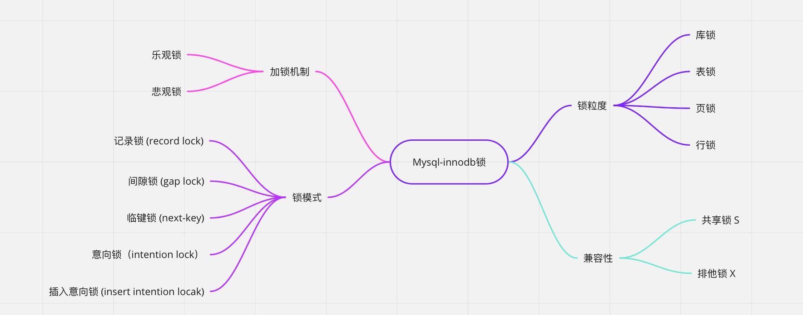
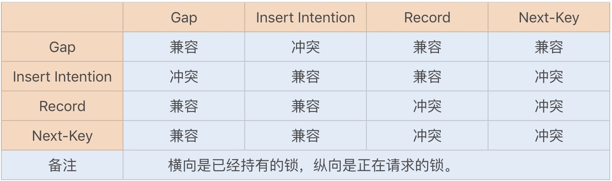
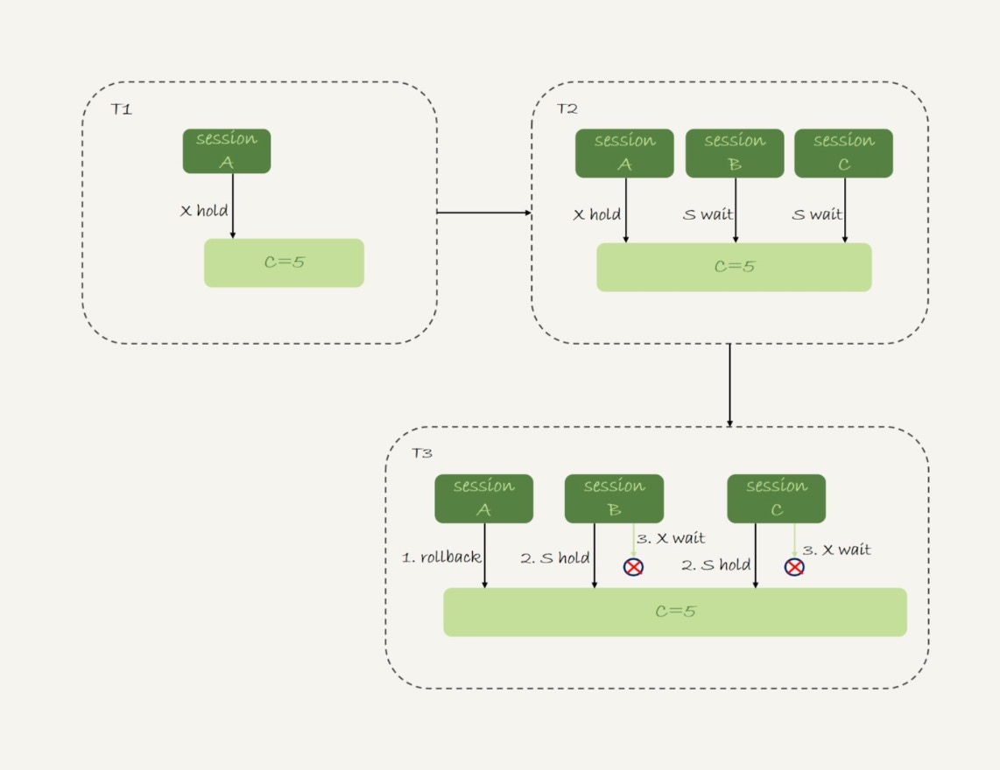
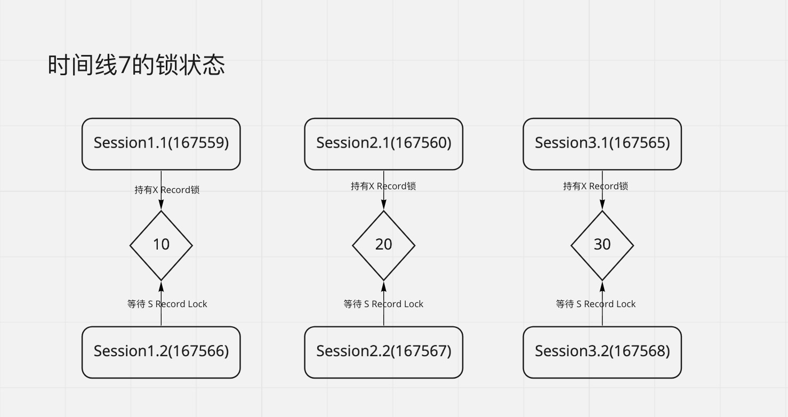
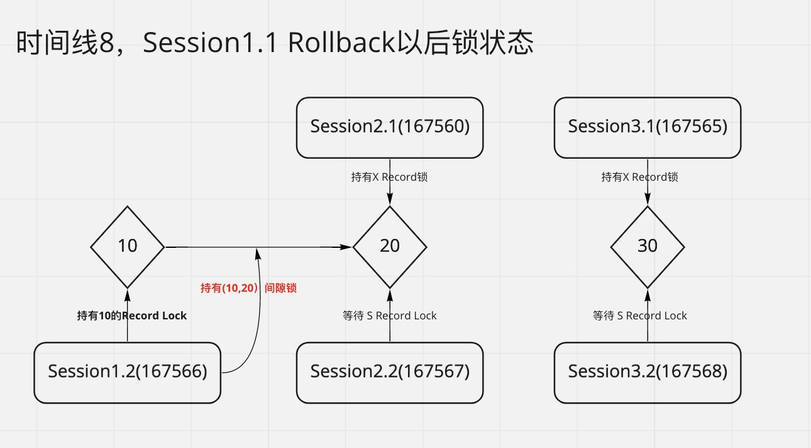
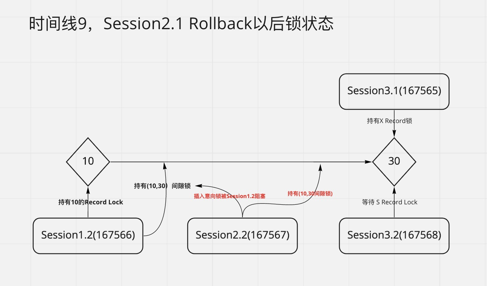
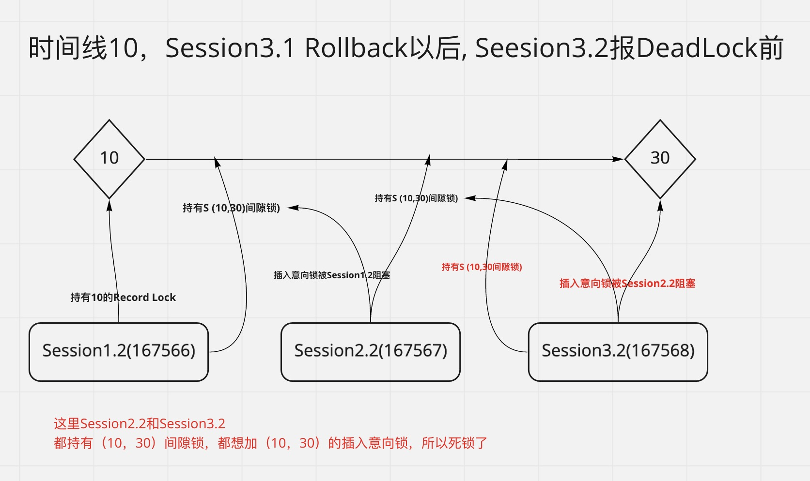
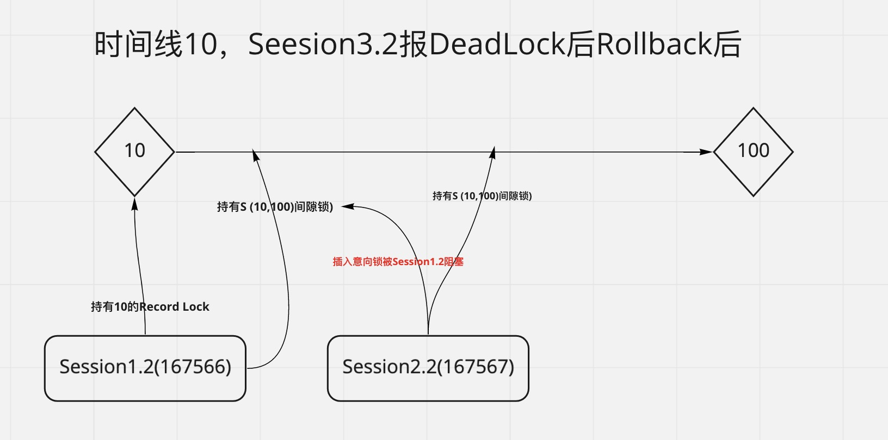

- [Mysql Insert 死锁问题研究](#mysql-insert-死锁问题研究)
	- [背景](#背景)
		- [问题背景](#问题背景)
		- [技术背景](#技术背景)
			- [0. 死锁日志含义](#0-死锁日志含义)
			- [1. READ COMMITTED 下是否有间隙锁(Gap Lock)?](#1-read-committed-下是否有间隙锁gap-lock)
			- [2. Insert 的时候 Mysql 到底会加哪些锁？](#2-insert-的时候-mysql-到底会加哪些锁)
			- [3. InnoDb锁的基本常识](#3-innodb锁的基本常识)
	- [死锁场景复现](#死锁场景复现)
		- [环境](#环境)
		- [场景一](#场景一)
			- [场景一死锁总结](#场景一死锁总结)
		- [场景二](#场景二)
			- [场景二死锁总结](#场景二死锁总结)
	- [总结-本质问题](#总结-本质问题)

# Mysql Insert 死锁问题研究

## 背景

不想看废话的，建议直接去最后看死锁的本质原因。

### 问题背景

线上一个很简单结构的表，报`insert`死锁，这个表基本上只有`insert`操作，所以引出一个问题`insert` 和`insert`之间为什么会死锁？

**顺便说下我们线上库的隔离级别都是RC，日志格式是ROW，我下面所有测试都是在RC下**。

    *** (1) TRANSACTION:
    TRANSACTION 2404187192, ACTIVE 0 sec inserting
    mysql tables in use 1, locked 1
    LOCK WAIT 8 lock struct(s), heap size 1136, 2 row lock(s)
    MySQL thread id 118913019, OS thread handle 140411115681536, query id 8752700587 xx.xx.xx.147 message__u update
    INSERT  INTO `message_entity` (`id`,`message_id`,`chat_id`,`entity`) VALUES (6921593523158564868,6921593523158564868,6579445153033879811,_binary'')
    *** (1) WAITING FOR THIS LOCK TO BE GRANTED:
    RECORD LOCKS space id 289 page no 2697984 n bits 80 index PRIMARY of table `lark_message_shard_xxx`.`message_entity` trx id 2404187192 lock_mode X locks gap before rec insert intention waiting

    *** (2) TRANSACTION:
    TRANSACTION 2404186956, ACTIVE 0 sec inserting, thread declared inside InnoDB 1
    mysql tables in use 1, locked 1
    8 lock struct(s), heap size 1136, 3 row lock(s)
    MySQL thread id 118913470, OS thread handle 140410161960704, query id 8752703155 xx.xx.xx.25 message__u update
    INSERT INTO `message_entity` (`id`,`message_id`,`chat_id`,`entity`) VALUES (6921593568842792988,6921593568842792988,6807310568442118145,_binary'')
    *** (2) HOLDS THE LOCK(S):
    RECORD LOCKS space id 289 page no 2697984 n bits 80 index PRIMARY of table `lark_message_shard_xxx`.`message_entity` trx id 2404186956 lock mode S locks gap before rec
    *** (2) WAITING FOR THIS LOCK TO BE GRANTED:
    RECORD LOCKS space id 289 page no 2697984 n bits 80 index PRIMARY of table `lark_message_shard_xxx`.`message_entity` trx id 2404186956 lock_mode X locks gap before rec insert intention waiting
    *** WE ROLL BACK TRANSACTION (2)
    ------------
    TRANSACTIONS
    ------------

上面死锁日志重点如下： 

* 事务一，WAITING FOR THIS LOCK TO BE GRANTED:  lock_mode X locks gap before rec insert intention waiting
* 事务二， HOLDS THE LOCK(S): lock mode S locks gap before rec 
* 事务二，WAITING FOR THIS LOCK TO BE GRANTED: lock_mode X locks gap before rec insert intention waiting

**因为死锁日志并没有完整的死锁现场**，光看事两个务发生的语句，我们这里很难分析出具体死锁原因，真正原因我们下面复现死锁场景的时候再说。

顺便说下第一次看到这个死锁日志，我有两个反应。

1. 这两个`Insert`数据没有任何冲突，为什么会死锁？（其实这个是因为日志没有完整的现场，后面会复现这个现场）
2. `locks gap before rec` RC下为什么会有GAP锁？（下面场景2，时间线9中我证明了，RC下的确有Gap Lock）

### 技术背景

#### 0. 死锁日志含义

在此之前，我们能要先了解下日志里面各种锁对应的相关描述：

* 记录锁（`LOCK_REC_NOT_GAP`）: locks rec but not gap
* 间隙锁（`LOCK_GAP`）: locks gap before rec
* Next-key 锁（`LOCK_ORNIDARY`）: lock_mode X
* 插入意向锁（`LOCK_INSERT_INTENTION`）: locks gap before rec insert intention

这里有一点要注意的是，并不是在日志里看到 `lock_mode X` 就认为这是 `Next-key` 锁，因为还有一个例外：如果在 `supremum record` 上加锁，`locks gap before rec` 会省略掉，间隙锁会显示成 `lock_mode X`，插入意向锁会显示成 `lock_mode X insert intention`。

#### 1. READ COMMITTED 下是否有间隙锁(Gap Lock)?

因为上面死锁日志里面有 `lock mode S locks gap before rec`，我们 Mysql 隔离级别都是RC，大家都说RC隔离级别下Gap Lock会失效，那RC下面到底有没有`Gap Lock`。

其实答案很明显，我们可以根据结果来推导，死锁日志里面报了插入意向锁的死锁，我们知道插入意向锁只跟间隙锁冲突，说明RC下面肯定是存在Gap锁的，不然插入意向锁也不会造成死锁。

口说无凭，撸下Mysql官方文档，关于 [Gap Lock](https://dev.mysql.com/doc/refman/5.7/en/innodb-locking.html) 描述如下。

> Gap locking can be disabled explicitly. This occurs if you change the transaction isolation level to READ COMMITTED or enable the innodb_locks_unsafe_for_binlog system variable (which is now deprecated). Under these circumstances, gap locking is disabled for searches and index scans and is used only for foreign-key constraint checking and duplicate-key checking.

说的很明白，在 RC 下`searches and index scans` 时候 `Gap` 是失效的，但是`duplicate-key checking`时候还是会有间隙锁。

**所以结论是，RC隔离级别下，某些场景还是会有Gap Lock。**

#### 2. Insert 的时候 Mysql 到底会加哪些锁？

继续撸下 Mysql 官方文档，关于 [insert锁有如下描述](https://dev.mysql.com/doc/refman/5.7/en/innodb-locks-set.html)

> INSERT sets an exclusive lock on the inserted row. This lock is an index-record lock, not a next-key lock (that is, there is no gap lock) and does not prevent other sessions from inserting into the gap before the inserted row.
> 
> Prior to inserting the row, a type of gap lock called an insert intention gap lock is set. This lock signals the intent to insert in such a way that multiple transactions inserting into the same index gap need not wait for each other if they are not inserting at the same position within the gap. Suppose that there are index records with values of 4 and 7. Separate transactions that attempt to insert values of 5 and 6 each lock the gap between 4 and 7 with insert intention locks prior to obtaining the exclusive lock on the inserted row, but do not block each other because the rows are nonconflicting.
> 
> If a duplicate-key error occurs, a shared lock on the duplicate index record is set. This use of a shared lock can result in deadlock should there be multiple sessions trying to insert the same row if another session already has an exclusive lock. This can occur if another session deletes the row.

具体翻译如下：

1. insert会对插入成功的行加上排它锁，这个排它锁是个记录锁，而非next-key锁（当然更不是gap锁了），不会阻止其他并发的事务往这条记录之前插入记录。

2. 在插入之前，会先在插入记录所在的间隙加上一个插入意向锁（Insert intenion Lock），并发的事务可以对同一个Gap加插入意向锁。插入意向锁和插入意向锁不会互相阻塞。

3. 如果insert 的事务出现了duplicate-key error ，事务会对duplicate index record加共享锁。这个共享锁在并发的情况下是会产生死锁的，比如有两个并发的insert都对要对同一条记录加共享锁，而此时这条记录又被其他事务加上了排它锁，**排它锁的事务者回滚后，两个并发的insert操作是会发生死锁的**。  

这个只是官方文档说明的。实际上：

1. 执行 insert 之后，如果没有任何冲突，在 show engine innodb status 命令中是看不到任何锁的，这是因为 insert 加的是隐式锁。什么是隐式锁？隐式锁的意思就是没有锁。
2. InnoDB 在插入记录时，是不加锁的。如果事务 A 插入记录且未提交，这时事务 B 尝试对这条记录加锁，事务 B 会先去判断记录上保存的事务 id 是否活跃，如果活跃的话，那么就帮助事务 A 去建立一个锁对象，然后自身进入等待事务 A 状态，这就是所谓的隐式锁转换为显式锁。

具体可以参考[读 MySQL 源码再看 INSERT 加锁流程
](https://www.aneasystone.com/archives/2018/06/insert-locks-via-mysql-source-code.html)

#### 3. InnoDb锁的基本常识

## 死锁场景复现
### 环境
	mysql> select version();
	+-----------+
	| version() |
	+-----------+
	| 5.6.41    |
	+-----------+
	1 row in set (0.05 sec)
	
	mysql> select @@tx_isolation;
	+----------------+
	| @@tx_isolation |
	+----------------+
	| READ-COMMITTED |
	+----------------+
	1 row in set (0.05 sec)
	

表结构
	
	DROP TABLE IF EXISTS `message_entity`;
	CREATE TABLE `message_entity` (
	  `id` bigint(20) unsigned NOT NULL AUTO_INCREMENT,
	  `chat_id` bigint(20) unsigned NOT NULL,
	  PRIMARY KEY (`id`)
	) ENGINE=InnoDB AUTO_INCREMENT=1 DEFAULT CHARSET=utf8mb4 ROW_FORMAT=DYNAMIC;

### 场景一

这个也是[官方文档里面给出的insert死锁场景](https://dev.mysql.com/doc/refman/5.7/en/innodb-locks-set.html)

| 时间线 | Session1                                                  | Session2                                                  | Session3                                                  |
| ------ | ---------------------------------------------------------- | ---------------------------------------------------------- | ---------------------------------------------------------- |
| 1      | BEGIN                                                      | BEGIN                                                      | BEGIN                                                      |
| 2      | INSERT  INTO `message_entity`(`id`,`chat_id`) VALUES (1,1) |                                                            |                                                            |
| 3      |                                                            | INSERT  INTO `message_entity`(`id`,`chat_id`) VALUES (1,1) |                                                            |
| 4      |                                                            |                                                            | INSERT  INTO `message_entity`(`id`,`chat_id`) VALUES (1,1) |
| 5      | ROLLBACK                                                   |                                                            |                                                            |

**时间线2**，Session 1 插入成功，查询下 mysql 锁状态，发现当前没有阻塞的锁。
	
	mysql> select * from information_schema.innodb_locks;
	Empty set (0.05 sec)

**时间线3**，Session 2 插入语句会被 block，查询锁状态发现，Session1 持有了 X 锁 (事务还没提交所以一直持有)，Session2 请求持有 S 锁，但是被 Session1 的持有的 X 锁 block住了。

	mysql> select * from information_schema.innodb_locks;
	+----------------+-------------+-----------+-----------+----------------------------+------------+------------+-----------+----------+-----------+
	| lock_id        | lock_trx_id | lock_mode | lock_type | lock_table                 | lock_index | lock_space | lock_page | lock_rec | lock_data |
	+----------------+-------------+-----------+-----------+----------------------------+------------+------------+-----------+----------+-----------+
	| 167515:252:3:2 | 167515      | S         | RECORD    | `test_db`.`message_entity` | PRIMARY    |        252 |         3 |        2 | 1         |
	| 167514:252:3:2 | 167514      | X         | RECORD    | `test_db`.`message_entity` | PRIMARY    |        252 |         3 |        2 | 1         |
	+----------------+-------------+-----------+-----------+----------------------------+------------+------------+-----------+----------+-----------+
	2 rows in set (0.19 sec)

**时间线4**， Session 3 插入语句阻塞，Session3 跟 Session2 一样，都是请求 S 锁，被 Session1 的持有的 X 锁 block住了。

	mysql> select * from information_schema.innodb_locks;
	+----------------+-------------+-----------+-----------+----------------------------+------------+------------+-----------+----------+-----------+
	| lock_id        | lock_trx_id | lock_mode | lock_type | lock_table                 | lock_index | lock_space | lock_page | lock_rec | lock_data |
	+----------------+-------------+-----------+-----------+----------------------------+------------+------------+-----------+----------+-----------+
	| 167516:252:3:2 | 167516      | S         | RECORD    | `test_db`.`message_entity` | PRIMARY    |        252 |         3 |        2 | 1         |
	| 167514:252:3:2 | 167514      | X         | RECORD    | `test_db`.`message_entity` | PRIMARY    |        252 |         3 |        2 | 1         |
	| 167515:252:3:2 | 167515      | S         | RECORD    | `test_db`.`message_entity` | PRIMARY    |        252 |         3 |        2 | 1         |
	+----------------+-------------+-----------+-----------+----------------------------+------------+------------+-----------+----------+-----------+
	3 rows in set (0.10 sec)

**时间线5**，Session 1 回滚以后，Session2 和 Session3 都成功拿到了 S 锁，可以`show engine innodb status`，看下死锁日志如下
	
	------------------------
	LATEST DETECTED DEADLOCK
	------------------------
	2021-02-09 15:26:42 7efe3d7a6700
	*** (1) TRANSACTION:
	TRANSACTION 167515, ACTIVE 76 sec inserting
	mysql tables in use 1, locked 1
	LOCK WAIT 4 lock struct(s), heap size 1184, 2 row lock(s)
	MySQL thread id 13393, OS thread handle 0x7efe3d7e8700, query id 394645 123.58.117.233 root update
	INSERT  INTO `message_entity` (`id`,`message_id`,`chat_id`,`entity`) VALUES (1,1,1,_binary'')
	*** (1) WAITING FOR THIS LOCK TO BE GRANTED:
	RECORD LOCKS space id 244 page no 3 n bits 72 index `PRIMARY` of table `test_db`.`message_entity` trx id 167515 lock_mode X insert intention waiting
	Record lock, heap no 1 PHYSICAL RECORD: n_fields 1; compact format; info bits 0
	 0: len 8; hex 73757072656d756d; asc supremum;;
	
	*** (2) TRANSACTION:
	TRANSACTION 167516, ACTIVE 28 sec inserting
	mysql tables in use 1, locked 1
	4 lock struct(s), heap size 1184, 2 row lock(s)
	MySQL thread id 13395, OS thread handle 0x7efe3d7a6700, query id 394651 123.58.117.233 root update
	INSERT  INTO `message_entity` (`id`,`message_id`,`chat_id`,`entity`) VALUES (1,1,1,_binary'')
	*** (2) HOLDS THE LOCK(S):
	RECORD LOCKS space id 244 page no 3 n bits 72 index `PRIMARY` of table `test_db`.`message_entity` trx id 167516 lock mode S
	Record lock, heap no 1 PHYSICAL RECORD: n_fields 1; compact format; info bits 0
	 0: len 8; hex 73757072656d756d; asc supremum;;
	
	*** (2) WAITING FOR THIS LOCK TO BE GRANTED:
	RECORD LOCKS space id 244 page no 3 n bits 72 index `PRIMARY` of table `test_db`.`message_entity` trx id 167516 lock_mode X insert intention waiting
	Record lock, heap no 1 PHYSICAL RECORD: n_fields 1; compact format; info bits 0
	 0: len 8; hex 73757072656d756d; asc supremum;;
	
	*** WE ROLL BACK TRANSACTION (2)

	
从日志我们可以看出：

1. 事务167515（Session2）`lock_mode X insert intention waiting Record lock`插入意向排他锁在等待记录锁。
2. 事务167516 （Session3）`lock mode S Record lock` 持有 S 记录锁。
3. 事务167516 （Session3）`lock_mode X insert intention waiting Record lock` 插入意向排他锁等待记录锁。
4. `WE ROLL BACK TRANSACTION (2)` , 最终 mysql roll back 了 Session3 , 执行了Session2.

#### 场景一死锁总结 

**死锁日志的信息记录并不全**，其实在**时间线4**的时候，我们可以看到 Session2 和 Session3 在申请 S 记录锁。Session1 回滚了以后，Session2 和 Session3 都持有 S 锁，然后都请求 X 锁，互相等待对方释放 S 锁，所以导致死锁。

具体流程图类似下图

**但是这个报错信息跟我们线上死锁场景不一样，我们线上是两个毫不想干的数据互相死锁。我们继续看下场景二。**

### 场景二

	INSERT  INTO `message_entity`(`id`,`chat_id`) VALUES (100,100)

先插入一个边界数据，主要是为了跟线上现场的死锁日志保持一致。上面说了如果在 `supremum record` 上加锁，`locks gap before rec` 会省略掉，间隙锁会显示成 `lock_mode X`，插入意向锁会显示成 `lock_mode X insert intention`。

死锁场景复现如下：

| 时间线 | Session1.1(167559)        | Session1.2(167566)        | Session2.1(167560)          | Session2.2(167567)          | Session3.1(167565)         | Session3.2(167568)         |
| ------ | ----------------- | ------------------ | ------------------ | ------------------ | ----------------- | ----------------- |
| 1      | BEGIN             | BEGIN              | BEGIN              | BEGIN              | BEGIN             | BEGIN             |
| 2      | INSERT .. (10,10) |                    |                    |                    |                   |                   |
| 3      |                   |                    | INSERT ..  (20,20) |                    |                   |                   |
| 4      |                   |                    |                    |                    | INSERT .. (30,30) |                   |
| 5      |                   | INSERT ..  (10,10) |                    |                    |                   |                   |
| 6      |                   |                    |                    | INSERT ..  (20,20) |                   |                   |
| 7      |                   |                    |                    |                    |                   | INSERT .. (30,30) |
| 8      | ROLLBACK          |                    |                    |                    |                   |                   |
| 9      |                   |                    | ROLLBACK           |                    |                   |                   |
| 10     |                   |                    |                    | //依旧 blocking  | ROLLBACK          | DEAD LOCK         |
| 11     |                   | ROLLBACK           |                    | //插入成功     |                   |                   |

**时间线2、3、4** 都是正常插入，没有阻塞的锁。

	mysql> select * from information_schema.innodb_locks;
	Empty set (0.10 sec)

**[时间线5](./5)** Session1.2 执行 Insert被阻塞，查询锁的情况，可以看到Session1.1 对有 10 有 X 锁。
Session1.2 等待 S 锁。

	mysql> select * from information_schema.innodb_locks;
	+----------------+-------------+-----------+-----------+----------------------------+------------+------------+-----------+----------+-----------+
	| lock_id        | lock_trx_id | lock_mode | lock_type | lock_table                 | lock_index | lock_space | lock_page | lock_rec | lock_data |
	+----------------+-------------+-----------+-----------+----------------------------+------------+------------+-----------+----------+-----------+
	| 167566:252:3:4 | 167566      | S         | RECORD    | `test_db`.`message_entity` | PRIMARY    |        252 |         3 |        4 | 10        |
	| 167559:252:3:4 | 167559      | X         | RECORD    | `test_db`.`message_entity` | PRIMARY    |        252 |         3 |        4 | 10        |
	+----------------+-------------+-----------+-----------+----------------------------+------------+------------+-----------+----------+-----------+
	2 rows in set (0.09 sec)

**[时间线6](./6)** 跟上面一样，Session2.1 对有 20 有 X 锁，Session2.2 等待 S 锁。

	mysql> select * from information_schema.innodb_locks;
	+----------------+-------------+-----------+-----------+----------------------------+------------+------------+-----------+----------+-----------+
	| lock_id        | lock_trx_id | lock_mode | lock_type | lock_table                 | lock_index | lock_space | lock_page | lock_rec | lock_data |
	+----------------+-------------+-----------+-----------+----------------------------+------------+------------+-----------+----------+-----------+
	| 167567:252:3:3 | 167567      | S         | RECORD    | `test_db`.`message_entity` | PRIMARY    |        252 |         3 |        3 | 20        |
	| 167560:252:3:3 | 167560      | X         | RECORD    | `test_db`.`message_entity` | PRIMARY    |        252 |         3 |        3 | 20        |
	| 167566:252:3:4 | 167566      | S         | RECORD    | `test_db`.`message_entity` | PRIMARY    |        252 |         3 |        4 | 10        |
	| 167559:252:3:4 | 167559      | X         | RECORD    | `test_db`.`message_entity` | PRIMARY    |        252 |         3 |        4 | 10        |
	+----------------+-------------+-----------+-----------+----------------------------+------------+------------+-----------+----------+-----------+
	4 rows in set (0.12 sec)

**[时间线7](./7)** 跟上面一样，Session3.1 对有 30 有 X 锁，Session3.2 等待 S 锁。 

	mysql> select * from information_schema.innodb_locks;
	+----------------+-------------+-----------+-----------+----------------------------+------------+------------+-----------+----------+-----------+
	| lock_id        | lock_trx_id | lock_mode | lock_type | lock_table                 | lock_index | lock_space | lock_page | lock_rec | lock_data |
	+----------------+-------------+-----------+-----------+----------------------------+------------+------------+-----------+----------+-----------+
	| 167568:252:3:5 | 167568      | S         | RECORD    | `test_db`.`message_entity` | PRIMARY    |        252 |         3 |        5 | 30        |
	| 167565:252:3:5 | 167565      | X         | RECORD    | `test_db`.`message_entity` | PRIMARY    |        252 |         3 |        5 | 30        |
	| 167567:252:3:3 | 167567      | S         | RECORD    | `test_db`.`message_entity` | PRIMARY    |        252 |         3 |        3 | 20        |
	| 167560:252:3:3 | 167560      | X         | RECORD    | `test_db`.`message_entity` | PRIMARY    |        252 |         3 |        3 | 20        |
	| 167566:252:3:4 | 167566      | S         | RECORD    | `test_db`.`message_entity` | PRIMARY    |        252 |         3 |        4 | 10        |
	| 167559:252:3:4 | 167559      | X         | RECORD    | `test_db`.`message_entity` | PRIMARY    |        252 |         3 |        4 | 10        |
	+----------------+-------------+-----------+-----------+----------------------------+------------+------------+-----------+----------+-----------+
	6 rows in set (0.13 sec)

**[时间线8](./8)** 这里我们 Rollback 了 Session1.1 的操作，这个时候 Session1.2 不在阻塞，数据正常插入。

	mysql> select * from information_schema.innodb_locks;
	+----------------+-------------+-----------+-----------+----------------------------+------------+------------+-----------+----------+-----------+
	| lock_id        | lock_trx_id | lock_mode | lock_type | lock_table                 | lock_index | lock_space | lock_page | lock_rec | lock_data |
	+----------------+-------------+-----------+-----------+----------------------------+------------+------------+-----------+----------+-----------+
	| 167568:252:3:5 | 167568      | S         | RECORD    | `test_db`.`message_entity` | PRIMARY    |        252 |         3 |        5 | 30        |
	| 167565:252:3:5 | 167565      | X         | RECORD    | `test_db`.`message_entity` | PRIMARY    |        252 |         3 |        5 | 30        |
	| 167567:252:3:3 | 167567      | S         | RECORD    | `test_db`.`message_entity` | PRIMARY    |        252 |         3 |        3 | 20        |
	| 167560:252:3:3 | 167560      | X         | RECORD    | `test_db`.`message_entity` | PRIMARY    |        252 |         3 |        3 | 20        |
	+----------------+-------------+-----------+-----------+----------------------------+------------+------------+-----------+----------+-----------+
	4 rows in set (0.10 sec)

因为Session1.1 (167559)会滚了，只看`innodb_locks`表，  看不到 Session1.2(167566) 的锁状态了，我们`show engine innodb status`看下 Session1.2(167566) 的状态，显示 Session1.2(167566) 这个时候持有了数据`20`共享`Record Lock`和`(10，20)`的 `Gap Lock`。我测试了下，尝试再开个事务尝试插入（11，19）数据，都被阻塞了，证明这就是`Gap Lock`。

	---TRANSACTION 167566, ACTIVE 217 sec
	3 lock struct(s), heap size 360, 2 row lock(s), undo log entries 1
	MySQL thread id 13469, OS thread handle 0x7efe42afe700, query id 396301 111.225.144.149 root
	TABLE LOCK table `test_db`.`message_entity` trx id 167566 lock mode IX
	RECORD LOCKS space id 252 page no 3 n bits 72 index `PRIMARY` of table `test_db`.`message_entity` trx id 167566 lock mode S locks rec but not gap
	RECORD LOCKS space id 252 page no 3 n bits 72 index `PRIMARY` of table `test_db`.`message_entity` trx id 167566 lock mode S locks gap before rec
	Record lock, heap no 3 PHYSICAL RECORD（表示20）: n_fields 4; compact format; info bits 0

**[时间线9](./9)** 这里我们 Rollback 了 Session2.1(167560) 的操作，因为我们上面知道 Session1.2(167566) 持有了数据`20`的共享的`Gap Lock`和`Record Lock`，所以 Session2.2 的数据依然Block了。查询`innodb_lock_waits` 发现，的确 Session1.2(167566) 阻塞了 Session2.2(167567) 的操作。

	mysql> select * from information_schema.innodb_lock_waits;
	+-------------------+-------------------+-----------------+------------------+
	| requesting_trx_id | requested_lock_id | blocking_trx_id | blocking_lock_id |
	+-------------------+-------------------+-----------------+------------------+
	| 167568            | 167568:252:3:5    | 167565          | 167565:252:3:5   |
	| 167567            | 167567:252:3:5    | 167566          | 167566:252:3:5   |
	+-------------------+-------------------+-----------------+------------------+
	2 rows in set (0.14 sec)
	
再查下`innodb_locks`阻塞锁的状态，因为RollBack了 20 这条数据，现在 Session.1.2(167566) 和 Session2.2(167567)，发现这时候`Gap Lock`的数据都加到了30上面去了。

	mysql> select * from information_schema.innodb_locks;
	+----------------+-------------+-----------+-----------+----------------------------+------------+------------+-----------+----------+-----------+
	| lock_id        | lock_trx_id | lock_mode | lock_type | lock_table                 | lock_index | lock_space | lock_page | lock_rec | lock_data |
	+----------------+-------------+-----------+-----------+----------------------------+------------+------------+-----------+----------+-----------+
	| 167568:252:3:5 | 167568      | S         | RECORD    | `test_db`.`message_entity` | PRIMARY    |        252 |         3 |        5 | 30        |
	| 167565:252:3:5 | 167565      | X         | RECORD    | `test_db`.`message_entity` | PRIMARY    |        252 |         3 |        5 | 30        |
	| 167567:252:3:5 | 167567      | X,GAP     | RECORD    | `test_db`.`message_entity` | PRIMARY    |        252 |         3 |        5 | 30        |
	| 167566:252:3:5 | 167566      | S,GAP     | RECORD    | `test_db`.`message_entity` | PRIMARY    |        252 |         3 |        5 | 30        |
	+----------------+-------------+-----------+-----------+----------------------------+------------+------------+-----------+----------+-----------+
	4 rows in set (0.10 sec)

`show engine innodb status`，看下锁详细信息 Session.1.2(167566) 持有数据`10`的共享`Record Lock`和`(10,30)`的`Gap Lock`。
	
	---TRANSACTION 167566, ACTIVE 270 sec
	4 lock struct(s), heap size 1184, 2 row lock(s), undo log entries 1
	MySQL thread id 13469, OS thread handle 0x7efe42afe700, query id 396301 111.225.144.149 root
	TABLE LOCK table `test_db`.`message_entity` trx id 167566 lock mode IX
	RECORD LOCKS space id 252 page no 3 n bits 72 index `PRIMARY` of table `test_db`.`message_entity` trx id 167566 lock mode S locks rec but not gap
	RECORD LOCKS space id 252 page no 3 n bits 72 index `PRIMARY` of table `test_db`.`message_entity` trx id 167566 lock mode S locks gap before rec
	Record lock, heap no 4 PHYSICAL RECORD（表示10）: n_fields 4; compact format; info bits 0

	
	RECORD LOCKS space id 252 page no 3 n bits 72 index `PRIMARY` of table `test_db`.`message_entity` trx id 167566 lock mode S locks gap before rec
	Record lock, heap no 5 PHYSICAL RECORD（表示30）: n_fields 4; compact format; info bits 0

继续看下Session2.2(167567)的锁详细信息，Session2.2(167567)持有了数据`30`的的共享`Record Lock`和`Gap Lock`，等待对`(10,30)`上加上插入间隙锁。

	
	TABLE LOCK table `test_db`.`message_entity` trx id 167567 lock mode IX
	RECORD LOCKS space id 252 page no 3 n bits 72 index `PRIMARY` of table `test_db`.`message_entity` trx id 167567 lock mode S locks rec but not gap
	RECORD LOCKS space id 252 page no 3 n bits 72 index `PRIMARY` of table `test_db`.`message_entity` trx id 167567 lock mode S locks gap before rec
	Record lock, heap no 5 PHYSICAL RECORD（表示30）: n_fields 4; compact format; info bits 0
	 0: len 8; hex 000000000000001e; asc         ;;
	 1: len 6; hex 000000028e8d; asc       ;;
	 2: len 7; hex d6000001b90110; asc        ;;
	 3: len 8; hex 000000000000001e; asc         ;;
	
	
	RECORD LOCKS space id 252 page no 3 n bits 72 index `PRIMARY` of table `test_db`.`message_entity` trx id 167567 lock_mode X locks gap before rec insert intention waiting
	Record lock, heap no 5 PHYSICAL RECORD（表示30）: n_fields 4; compact format; info bits 0

**[时间线10](./10)** 执行 Session3.1(167565) Rollback，Session3.2 立即报死锁，然后回滚了。Session2.2，还在被Session1.2 阻塞了。

	mysql> select * from information_schema.innodb_locks;
	+----------------+-------------+-----------+-----------+----------------------------+------------+------------+-----------+----------+-----------+
	| lock_id        | lock_trx_id | lock_mode | lock_type | lock_table                 | lock_index | lock_space | lock_page | lock_rec | lock_data |
	+----------------+-------------+-----------+-----------+----------------------------+------------+------------+-----------+----------+-----------+
	| 167567:252:3:2 | 167567      | X,GAP     | RECORD    | `test_db`.`message_entity` | PRIMARY    |        252 |         3 |        2 | 100       |
	| 167566:252:3:2 | 167566      | S,GAP     | RECORD    | `test_db`.`message_entity` | PRIMARY    |        252 |         3 |        2 | 100       |
	+----------------+-------------+-----------+-----------+----------------------------+------------+------------+-----------+----------+-----------+
	2 rows in set (0.08 sec)

**[时间线11](./11)** 回滚了Session1.2(167566)以后，没有`（10，30）`的`Gap Lock`，Session2.2(167567)数据就能正常插入了。

#### 场景二死锁总结

## 总结-本质问题

一句话总结就是，两个insert语句发生duplicate error情况以后，回滚了第一个事务，第二个事务插入成功以后，mysql会给这个记录加上间隙锁（**RC下也会有间隙锁**），间隙锁会阻止插入。如果多个事务时候发生插入冲突，又都有回滚，会导致记录之间会加上间隙锁，然后几个插入又都想拿插入意向锁，就会死锁。

验证间隙锁如下：

| 时间线 | Session1                                                  | Session2                                                  | Session3                                                  |
| ------ | ---------------------------------------------------------- | ---------------------------------------------------------- | ---------------------------------------------------------- |
| 1      | BEGIN                                                      | BEGIN                                                      | BEGIN                                                      |
| 2      | INSERT  INTO `message_entity`(`id`,`chat_id`) VALUES (1,1) |                                                            |                                                            |
| 3      |                                                            | INSERT  INTO `message_entity`(`id`,`chat_id`) VALUES (1,1) |                                                            |
| 4      |    ROLLBACK                                                        |                                                           插入成功|  |
| 5      |                                                   |                                                            |        INSERT  INTO `message_entity`(`id`,`chat_id`) VALUES (10,10) 会被阻塞，因为(1 +∞）已经加上间隙锁    |

