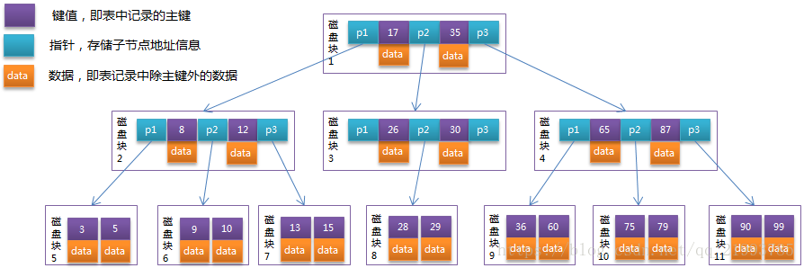
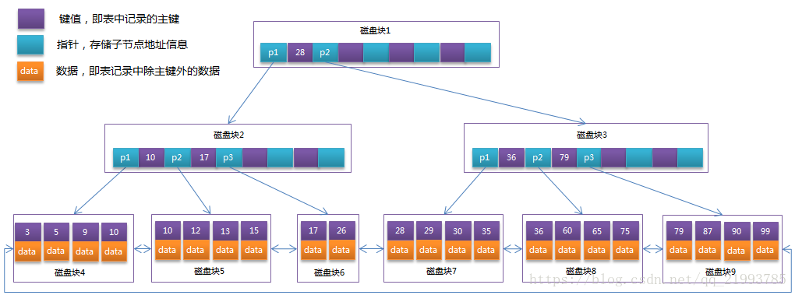
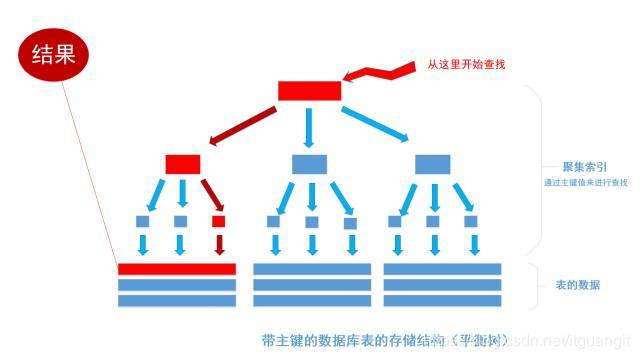
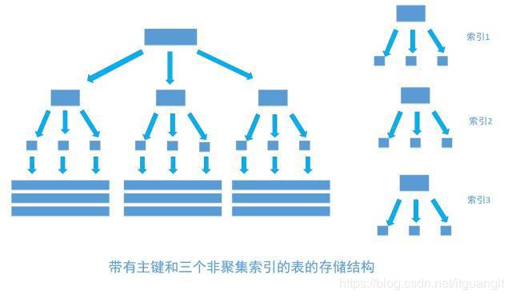
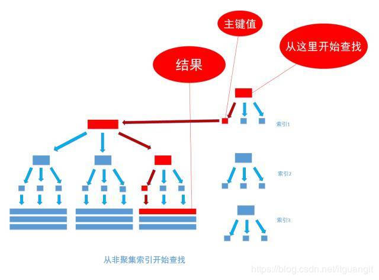

- [1. Mysql 基础知识汇总](#1-mysql-%E5%9F%BA%E7%A1%80%E7%9F%A5%E8%AF%86%E6%B1%87%E6%80%BB)
  - [1.1. Mysql 的数据结构](#11-mysql-%E7%9A%84%E6%95%B0%E6%8D%AE%E7%BB%93%E6%9E%84)
    - [1.1.1. 什么是 B 树（B-Tree）](#111-%E4%BB%80%E4%B9%88%E6%98%AF-b-%E6%A0%91b-tree)
    - [1.1.2. 什么是 B+树（B+Tree）](#112-%E4%BB%80%E4%B9%88%E6%98%AF-b%E6%A0%91btree)
    - [1.1.3. Mysql 为什么使用 B+树（B+Tree）作为存储的数据结构？](#113-mysql-%E4%B8%BA%E4%BB%80%E4%B9%88%E4%BD%BF%E7%94%A8-b%E6%A0%91btree%E4%BD%9C%E4%B8%BA%E5%AD%98%E5%82%A8%E7%9A%84%E6%95%B0%E6%8D%AE%E7%BB%93%E6%9E%84)
    - [1.1.4. 小结](#114-%E5%B0%8F%E7%BB%93)
    - [1.1.5. 参考](#115-%E5%8F%82%E8%80%83)
  - [1.2. Mysql 数据是如何读取、插入和删除的](#12-mysql-%E6%95%B0%E6%8D%AE%E6%98%AF%E5%A6%82%E4%BD%95%E8%AF%BB%E5%8F%96%E6%8F%92%E5%85%A5%E5%92%8C%E5%88%A0%E9%99%A4%E7%9A%84)
    - [1.2.1. 什么是“磁盘块”？](#121-%E4%BB%80%E4%B9%88%E6%98%AF%E7%A3%81%E7%9B%98%E5%9D%97)
    - [1.2.2. mysql 的 B+Tree 非叶子节点有多少数据，一般有几层。](#122-mysql-%E7%9A%84-btree-%E9%9D%9E%E5%8F%B6%E5%AD%90%E8%8A%82%E7%82%B9%E6%9C%89%E5%A4%9A%E5%B0%91%E6%95%B0%E6%8D%AE%E4%B8%80%E8%88%AC%E6%9C%89%E5%87%A0%E5%B1%82)
    - [1.2.3. B 树和 B+树是如何插入和删除数据的(可以理解 Mysql 数据删除和插入的相关操作)？](#123-b-%E6%A0%91%E5%92%8C-b%E6%A0%91%E6%98%AF%E5%A6%82%E4%BD%95%E6%8F%92%E5%85%A5%E5%92%8C%E5%88%A0%E9%99%A4%E6%95%B0%E6%8D%AE%E7%9A%84%E5%8F%AF%E4%BB%A5%E7%90%86%E8%A7%A3-mysql-%E6%95%B0%E6%8D%AE%E5%88%A0%E9%99%A4%E5%92%8C%E6%8F%92%E5%85%A5%E7%9A%84%E7%9B%B8%E5%85%B3%E6%93%8D%E4%BD%9C)
    - [1.2.4. 小结](#124-%E5%B0%8F%E7%BB%93)
    - [1.2.5 参考](#125-%E5%8F%82%E8%80%83)
  - [1.3. Mysql 物理文件组成详解](#13-mysql-%E7%89%A9%E7%90%86%E6%96%87%E4%BB%B6%E7%BB%84%E6%88%90%E8%AF%A6%E8%A7%A3)
    - [1.3.1. 日志文件](#131-%E6%97%A5%E5%BF%97%E6%96%87%E4%BB%B6)
    - [1.3.2. Binlog、Redolog、Undolog](#132-binlogredologundolog)
      - [Binlog](#binlog)
      - [Redolog](#redolog)
      - [Undo Log](#undo-log)
      - [Binlog 和 Redolog 记录如何保持一致](#binlog-%E5%92%8C-redolog-%E8%AE%B0%E5%BD%95%E5%A6%82%E4%BD%95%E4%BF%9D%E6%8C%81%E4%B8%80%E8%87%B4)
      - [有了redo log，为啥还需要binlog呢？](#%E6%9C%89%E4%BA%86redo-log%E4%B8%BA%E5%95%A5%E8%BF%98%E9%9C%80%E8%A6%81binlog%E5%91%A2)
      - [基于以上，binlog必不可少](#%E5%9F%BA%E4%BA%8E%E4%BB%A5%E4%B8%8Abinlog%E5%BF%85%E4%B8%8D%E5%8F%AF%E5%B0%91)
    - [1.3.3. 数据文件](#133-%E6%95%B0%E6%8D%AE%E6%96%87%E4%BB%B6)
    - [1.3.4. Replication 文件](#134-replication-%E6%96%87%E4%BB%B6)
    - [1.3.5. 系统配置文件文件](#135-%E7%B3%BB%E7%BB%9F%E9%85%8D%E7%BD%AE%E6%96%87%E4%BB%B6%E6%96%87%E4%BB%B6)
    - [1.3.6. 小结](#136-%E5%B0%8F%E7%BB%93)
    - [1.3.7. 参考](#137-%E5%8F%82%E8%80%83)
  - [1.4. Mysql的索引实现](#14-mysql%E7%9A%84%E7%B4%A2%E5%BC%95%E5%AE%9E%E7%8E%B0)
    - [1.4.1. 常见的索引](#141-%E5%B8%B8%E8%A7%81%E7%9A%84%E7%B4%A2%E5%BC%95)
    - [1.4.2. MyISAM 索引实现](#142-myisam-%E7%B4%A2%E5%BC%95%E5%AE%9E%E7%8E%B0)
    - [1.4.3. InnoDB 索引实现](#143-innodb-%E7%B4%A2%E5%BC%95%E5%AE%9E%E7%8E%B0)
    - [1.4.4. 聚集索引和非聚集索引解释](#144-%E8%81%9A%E9%9B%86%E7%B4%A2%E5%BC%95%E5%92%8C%E9%9D%9E%E8%81%9A%E9%9B%86%E7%B4%A2%E5%BC%95%E8%A7%A3%E9%87%8A)
    - [1.4.5. Innodb 的聚集索引](#145-innodb-%E7%9A%84%E8%81%9A%E9%9B%86%E7%B4%A2%E5%BC%95)
    - [1.4.6. Innodb 如何选择一个聚集索引](#146-innodb-%E5%A6%82%E4%BD%95%E9%80%89%E6%8B%A9%E4%B8%80%E4%B8%AA%E8%81%9A%E9%9B%86%E7%B4%A2%E5%BC%95)
    - [1.4.7. 建立自增主键的原因](#147-%E5%BB%BA%E7%AB%8B%E8%87%AA%E5%A2%9E%E4%B8%BB%E9%94%AE%E7%9A%84%E5%8E%9F%E5%9B%A0)
    - [1.4.8. 索引的缺点](#148-%E7%B4%A2%E5%BC%95%E7%9A%84%E7%BC%BA%E7%82%B9)
    - [1.4.9. 注意事项](#149-%E6%B3%A8%E6%84%8F%E4%BA%8B%E9%A1%B9)
    - [1.4.10. 小结](#1410-%E5%B0%8F%E7%BB%93)
    - [1.4.11. 参考](#1411-%E5%8F%82%E8%80%83)
  - [1.5. [Mysql 锁]](#15-mysql-%E9%94%81)
    - [1.5.1. Mysql常见的几种锁](#151-mysql%E5%B8%B8%E8%A7%81%E7%9A%84%E5%87%A0%E7%A7%8D%E9%94%81)
    - [1.5.2. MyISAM的锁](#152-myisam%E7%9A%84%E9%94%81)
      - [1.5.2.1. 查询表级锁争用情况](#1521-%E6%9F%A5%E8%AF%A2%E8%A1%A8%E7%BA%A7%E9%94%81%E4%BA%89%E7%94%A8%E6%83%85%E5%86%B5)
      - [1.5.2.2. MySQL表级锁的锁模式](#1522-mysql%E8%A1%A8%E7%BA%A7%E9%94%81%E7%9A%84%E9%94%81%E6%A8%A1%E5%BC%8F)
      - [1.5.2.3. 如何加表锁](#1523-%E5%A6%82%E4%BD%95%E5%8A%A0%E8%A1%A8%E9%94%81)
      - [1.5.2.4. 并发插入（Concurrent Inserts）](#1524-%E5%B9%B6%E5%8F%91%E6%8F%92%E5%85%A5concurrent-inserts)
      - [1.5.2.5. MyISAM的锁调度](#1525-myisam%E7%9A%84%E9%94%81%E8%B0%83%E5%BA%A6)
    - [1.5.3. InnoDB的锁](#153-innodb%E7%9A%84%E9%94%81)
      - [1.5.3.1. 背景知识](#1531-%E8%83%8C%E6%99%AF%E7%9F%A5%E8%AF%86)
      - [1.5.3.2. 并发事务处理带来的问题](#1532-%E5%B9%B6%E5%8F%91%E4%BA%8B%E5%8A%A1%E5%A4%84%E7%90%86%E5%B8%A6%E6%9D%A5%E7%9A%84%E9%97%AE%E9%A2%98)
      - [1.5.3.3. 事务隔离级别](#1533-%E4%BA%8B%E5%8A%A1%E9%9A%94%E7%A6%BB%E7%BA%A7%E5%88%AB)
      - [1.5.3.4. mysql默认的事务隔离级别](#1534-mysql%E9%BB%98%E8%AE%A4%E7%9A%84%E4%BA%8B%E5%8A%A1%E9%9A%94%E7%A6%BB%E7%BA%A7%E5%88%AB)
      - [1.5.3.5. 获取InnoDB行锁争用情况](#1535-%E8%8E%B7%E5%8F%96innodb%E8%A1%8C%E9%94%81%E4%BA%89%E7%94%A8%E6%83%85%E5%86%B5)
      - [1.5.3.6. InnoDB的行锁模式及加锁方法](#1536-innodb%E7%9A%84%E8%A1%8C%E9%94%81%E6%A8%A1%E5%BC%8F%E5%8F%8A%E5%8A%A0%E9%94%81%E6%96%B9%E6%B3%95)
      - [1.5.3.7. InnoDB行锁实现方式](#1537-innodb%E8%A1%8C%E9%94%81%E5%AE%9E%E7%8E%B0%E6%96%B9%E5%BC%8F)
      - [1.5.3.8. 恢复和复制的需要，对InnoDB锁机制的影响](#1538-%E6%81%A2%E5%A4%8D%E5%92%8C%E5%A4%8D%E5%88%B6%E7%9A%84%E9%9C%80%E8%A6%81%E5%AF%B9innodb%E9%94%81%E6%9C%BA%E5%88%B6%E7%9A%84%E5%BD%B1%E5%93%8D)
      - [1.5.3.9. 什么时候使用表锁](#1539-%E4%BB%80%E4%B9%88%E6%97%B6%E5%80%99%E4%BD%BF%E7%94%A8%E8%A1%A8%E9%94%81)
      - [1.5.3.10. 关于死锁](#15310-%E5%85%B3%E4%BA%8E%E6%AD%BB%E9%94%81)
      - [1.5.3.11. InnoDB使用的七种锁](#15311-innodb%E4%BD%BF%E7%94%A8%E7%9A%84%E4%B8%83%E7%A7%8D%E9%94%81)
        - [自增锁](#%E8%87%AA%E5%A2%9E%E9%94%81)
        - [共享/排他锁](#%E5%85%B1%E4%BA%AB%E6%8E%92%E4%BB%96%E9%94%81)
        - [意向锁](#%E6%84%8F%E5%90%91%E9%94%81)
        - [插入意向锁](#%E6%8F%92%E5%85%A5%E6%84%8F%E5%90%91%E9%94%81)
        - [记录锁](#%E8%AE%B0%E5%BD%95%E9%94%81)
        - [间隙锁](#%E9%97%B4%E9%9A%99%E9%94%81)
        - [临键锁](#%E4%B8%B4%E9%94%AE%E9%94%81)
        - [小结：](#%E5%B0%8F%E7%BB%93)

# 1. Mysql 基础知识汇总

## 1.1. Mysql 的数据结构

### 1.1.1. 什么是 B 树（B-Tree）

1970 年，R.Bayer 和 E.mccreight 提出了一种适用于外查找的树，它是一种平衡的多叉树，称为 B 树，其定义如下

    1. 根结点至少有两个子女。
    2. 每个中间节点都包含k-1个元素和k个孩子，其中 m/2 <= k <= m
    3. 每一个叶子节点都包含k-1个元素，其中 m/2 <= k <= m
    4. 所有的叶子结点都位于同一层。
    5. 每个节点中的元素从小到大排列，节点当中k-1个元素正好是k个孩子包含的元素的值域分划。

### 1.1.2. 什么是 B+树（B+Tree）

B+ 树是一种树数据结构，是一个 n 叉树，每个节点通常有多个孩子，一棵 B+树包含根节点、内部节点和叶子节点。根节点可能是一个叶子节点，也可能是一个包含两个或两个以上孩子节点的节点。

一个 m 阶的 B+树具有如下几个特征：

    1. 有k个子树的中间节点包含有k个元素（B树中是k-1个元素），每个元素不保存数据，只用来索引，所有数据都保存在叶子节点。
    2. 所有的叶子结点中包含了全部元素的信息，及指向含这些元素记录的指针，且叶子结点本身依关键字的大小自小而大顺序链接。
    3. 所有的中间节点元素都同时存在于子节点，在子节点元素中是最大（或最小）元素。

**B+Tree 相对于 B-Tree 不同：**

    1. 非叶子节点只存储键值信息。
    2. 所有叶子节点之间都有一个链指针。
    3. 数据记录都存放在叶子节点中。

### 1.1.3. Mysql 为什么使用 B+树（B+Tree）作为存储的数据结构？

1. B+树的磁盘读写代价更低：B+树的内部节点并没有指向关键字具体信息的指针，因此其内部节点相对 B 树更小，如果把所有同一内部节点的关键字存放在同一盘块中，那么盘块所能容纳的关键字数量也越多，一次性读入内存的需要查找的关键字也就越多，相对 IO 读写次数就降低了。

2. B+树的查询效率更加稳定：由于非终结点并不是最终指向文件内容的结点，而只是叶子结点中关键字的索引。所以任何关键字的查找必须走一条从根结点到叶子结点的路。所有关键字查询的路径长度相同，导致每一个数据的查询效率相当。

3. 由于 B+树的数据都存储在叶子结点中，分支结点均为索引，方便扫库，只需要扫一遍叶子结点即可，但是 B 树因为其分支结点同样存储着数据，我们要找到具体的数据，需要进行一次中序遍历按序来扫，所以 B+树更加适合在区间查询的情况，所以通常 B+树用于数据库索引。

### 1.1.4. 小结

B树和B+树都是一种平衡的多叉树，根节点最少两个孩子，中间节点和叶子节点都包含k-1个元素，所有节点可以有k孩子，所有叶子节点都处于同一层。其中M/2<=k<=M,假设在一个M=3阶的B树，则有1.5<=k<=3，所以有所有节点包含的数据个数范围是(k-1)`1~2`,非叶子节点的孩子个数(k)`2~3`

B+树相对于B树来说，非叶子节点只存储键值信息，数据记录只放在叶子节点里面，叶子节点之间是一个链表

相对于B树来说，Mysql使用B+树好处是，1.非叶子节点不存数据，减少数据检索时候磁盘的IO读写次数。2.B+树查询效率更加稳定，每次查询的路径长度都一样。3.B+树所有数据都存在叶子节点中，然后叶子节点是一个链表，方便按范围查询数据。

### 1.1.5. 参考

 [二叉树、2-3 树、红黑树](https://www.jianshu.com/p/31f1708b7306)

 [B-Tree、B+Tree、B*Tree](https://www.jianshu.com/p/e13626e0d080)

 [漫画：什么是红黑树 （推荐这个来理解红黑树）](http://www.sohu.com/a/201923614_466939)

 [红黑树（RB-tree）比AVL树的优势在哪？](https://blog.csdn.net/mmshixing/article/details/51692892)

 

## 1.2. Mysql 数据是如何读取、插入和删除的

### 1.2.1. 什么是“磁盘块”？

系统从磁盘读取数据到内存时是以磁盘块（block）为基本单位的，位于同一个磁盘块中的数据会被一次性读取出来，而不是需要什么取什么。

InnoDB 存储引擎中有页（Page）的概念，页是其磁盘管理的最小单位。InnoDB 存储引擎中默认每个页的大小为 16KB，可通过参数 innodb_page_size 将页的大小设置为 4K、8K、16K，在 MySQL 中可通过如下命令查看页的大小：

     mysql> show variables like 'innodb_page_size';

而系统一个磁盘块的存储空间往往没有这么大，因此 InnoDB 每次申请磁盘空间时都会是若干地址连续磁盘块来达到页的大小 16KB。InnoDB 在把磁盘数据读入到磁盘时会以页为基本单位，在查询数据时如果一个页中的每条数据都能有助于定位数据记录的位置，这将会减少磁盘 I/O 次数，提高查询效率。

### 1.2.2. mysql 的 B+Tree 非叶子节点有多少数据，一般有几层。

通常在 B+Tree 上有两个头指针，一个指向根节点，另一个指向关键字最小的叶子节点，而且所有叶子节点（即数据节点）之间是一种链式环结构。因此可以对 B+Tree 进行两种查找运算：一种是对于主键的范围查找和分页查找，另一种是从根节点开始，进行随机查找。

**InnoDB 存储引擎中页的大小为 16KB，一般表的主键类型为 INT（占用 4 个字节）或 BIGINT（占用 8 个字节），指针类型也一般为 4 或 8 个字节，也就是说一个页（B+Tree 中的一个节点）中大概存储 16KB/(8B+8B)=1K 个键值（因为是估值，为方便计算，这里的 K 取值为〖10〗^3）。也就是说一个深度为 3 的 B+Tree 索引可以维护 10^3 _ 10^3 _ 10^3 = 10 亿 条记录。**

实际情况中每个节点可能不能填充满，因此在数据库中，B+Tree 的高度一般都在`2~4`层。mysql 的 InnoDB 存储引擎在设计时是将根节点常驻内存的，也就是说查找某一键值的行记录时最多只需要`1~3`次磁盘 I/O 操作。

### 1.2.3. B 树和 B+树是如何插入和删除数据的(可以理解 Mysql 数据删除和插入的相关操作)？

[B 树和 B+树的插入、删除图文详解](https://www.cnblogs.com/nullzx/p/8729425.html)

### 1.2.4. 小结

系统读取数据是以磁盘块为单位，Mysql的InnoDB有页的概念，默认每个页大小是16KB，按指针加BIGINT（8个字节+8个字节）算，一个节点可以存储1K个键值，也就是说一个深度为 3 的 B+Tree 索引可以维护 10^3 _ 10^3 _ 10^3 = 10 亿 条记录。实际情况中每个节点可能不能填充满，因此在数据库中，B+Tree 的高度一般都在2~4层。mysql 的 InnoDB 存储引擎在设计时是将根节点常驻内存的，也就是说查找某一键值的行记录时最多只需要1~3次磁盘 I/O 操作。

### 1.2.5 参考

[二叉查找树、平衡二叉树（AVLTree）和平衡多路查找树（B-Tree），B+树](https://blog.csdn.net/qq_21993785/article/details/80576642)

[B+Tree在数据库索引上拥有独特优势的原因（为什么比红黑树更合适）](https://blog.csdn.net/qq_21993785/article/details/80580679)

[为什么MySQL数据库索引选择使用B+树？](https://www.cnblogs.com/tiancai/p/9024351.html)

## 1.3. Mysql 物理文件组成详解

### 1.3.1. 日志文件

通过 `show variables like 'log_%';` 可以看到 mysql 的日志配置信息

1. 错误日志（Error Log）

   记录了 mysql 运行过程中较为严重的警告和错误信息以及 Mysql 每次启动和关闭的详细信息，利用 MySQL 的 FLUSH LOGS 命令来告诉 MySQL 备份旧日志文件并生成新的日志文件。 备份文件名以“.old”结尾。

2. 二进制日志（binlog）：Binary Log & Binary Log Index

   打开了记录的功能之后，MySQL 会将所有修改数据 库数据的 query 以二进制形式记录到日志文件中。当然，日志中并不仅限于 query 语句简单，还包括每一条 query 所执行的时间，所消耗的资源，以及相关的事务信息，所以 binlog 是事务安全的。

3. 更新日志：update log

   更新日志是 MySQL 在较老的版本上使用的，类似 binlog,但以简单文本格式记录内容

4. 查询日志：query log

   查询日志记录 MySQL 中所有的 query，开启后对性能影响比较大，一般只用于跟踪某些特殊的 sql 性能问题才会短暂打开

5. 慢查询日志：slow query log

   慢查询日志中记录的是执行时间较长的 query，慢查询日志采用的是简单的文本格式，其中记录了语句执行的时刻，执行所消耗的时间、执行用户、连接主机等，MySQL 还提 供了专门用来分析满查询日志的工具程序 mysqlslowdump

### 1.3.2. Binlog、Redolog、Undolog

#### Binlog

即二进制日志,它记录了数据库上的所有改变，并以二进制的形式保存在磁盘中；它可以用来查看数据库的变更历史、数据库增量备份和恢复、Mysql的复制（主从数据库的复制）。语句以“事件”的形式保存，它描述数据更改。

因为有了数据更新的binlog，所以可以用于实时备份，与master/slave复制。高可用与数据恢复。

1. 恢复使能够最大可能地更新数据库，因为二进制日志包含备份后进行的所有更新。
2. 在主复制服务器上记录所有将发送给从服务器的语句。

Binlog几种存储方式:

1. STATEMENT模式（SBR），每一条会修改数据的sql语句会记录到binlog中。优点是并不需要记录每一条sql语句和每一行的数据变化，减少了binlog日志量，节约IO，提高性能。缺点是在某些情况下会导致master-slave中的数据不一致(如sleep()函数， last_insert_id()，以及user-defined functions(udf)等会出现问题)
2. ROW模式（RBR），不记录每条sql语句的上下文信息，仅需记录哪条数据被修改了，修改成什么样了。而且不会出现某些特定情况下的存储过程、或function、或trigger的调用和触发无法被正确复制的问题。缺点是会产生大量的日志，尤其是alter table的时候会让日志暴涨。
3. MIXED模式（MBR）,以上两种模式的混合使用，一般的复制使用STATEMENT模式保存binlog，对于STATEMENT模式无法复制的操作使用ROW模式保存binlog，MySQL会根据执行的SQL语句选择日志保存方式。

#### Redolog

记录的是新数据的备份。在事务提交前，只要将Redo Log持久化即可，不需要将数据持久化。当系统崩溃时，虽然数据没有持久化，
但是RedoLog已经持久化。系统可以根据RedoLog的内容，将所有数据恢复到最新的状态。

InnoDB有buffer pool（简称bp）。bp是数据库页面的缓存，对InnoDB的任何修改操作都会首先在bp的page上进行，然后这样的页面将被标记为dirty并被放到专门的flush list上，后续将由master thread或专门的刷脏线程阶段性的将这些页面写入磁盘（disk or ssd）。这样的好处是避免每次写操作都操作磁盘导致大量的随机IO，阶段性的刷脏可以将多次对页面的修改merge成一次IO操作，同时异步写入也降低了访问的时延。然而，如果在dirty page还未刷入磁盘时，server非正常关闭，这些修改操作将会丢失，如果写入操作正在进行，甚至会由于损坏数据文件导致数据库不可用。为了避免上述问题的发生，Innodb将所有对页面的修改操作写入一个专门的文件，并在数据库启动时从此文件进行恢复操作，这个文件就是redo log file。这样的技术推迟了bp页面的刷新，从而提升了数据库的吞吐，有效的降低了访问时延。带来的问题是额外的写redo log操作的开销（顺序IO，当然很快），以及数据库启动时恢复操作所需的时间。

#### Undo Log

Undo Log是为了实现事务的原子性，在MySQL数据库InnoDB存储引擎中，还用UndoLog来实现多版本并发控制(简称：MVCC)。
-事务的原子性(Atomicity)
事务中的所有操作，要么全部完成，要么不做任何操作，不能只做部分操作。如果在执行的过程中发了错误，要回滚(Rollback)到事务开始前的状态，就像这个事务从来没有执行过。

#### Binlog 和 Redolog 记录如何保持一致

MySQL为了保证master和slave的数据一致性，就必须保证binlog和InnoDB redo日志的一致性（因为备库通过二进制日志重放主库提交的事务，而主库binlog写入在commit之前，如果写完binlog主库crash，再次启动时会回滚事务。但此时从库已经执行，则会造成主备数据不一致）。所以在开启Binlog后，如何保证binlog和InnoDB redo日志的一致性呢？为此，MySQL引入二阶段提交（two phase commit or 2pc），MySQL内部会自动将普通事务当做一个XA事务（内部分布式事物）来处理：

* 自动为每个事务分配一个唯一的ID（XID）。
* COMMIT会被自动的分成Prepare和Commit两个阶段。
* Binlog会被当做事务协调者(Transaction Coordinator)，Binlog Event会被当做协调者日志。

总结一下，基本顶多会出现下面是几种情况：

1. 当事务在prepare阶段crash，数据库recovery的时候该事务未写入Binary log并且存储引擎未提交，将该事务rollback。
2. 当事务在binlog阶段crash，此时日志还没有成功写入到磁盘中，启动时会rollback此事务。
3. 当事务在binlog日志已经fsync()到磁盘后crash，但是InnoDB没有来得及commit，此时MySQL数据库recovery的时候将会读出二进制日志的Xid_log_event，然后告诉InnoDB提交这些XID的事务，InnoDB提交完这些事务后会回滚其它的事务，使存储引擎和二进制日志始终保持一致。

#### 有了redo log，为啥还需要binlog呢？

1. redo log的大小是固定的，日志上的记录修改落盘后，日志会被覆盖掉，无法用于数据回滚/数据恢复等操作。
2. redo log是innodb引擎层实现的，并不是所有引擎都有。

#### 基于以上，binlog必不可少

1. binlog是server层实现的，意味着所有引擎都可以使用binlog日志
2. binlog通过追加的方式写入的，可通过配置参数max_binlog_size设置每个binlog文件的大小，当文件大小大于给定值后，日志会发生滚动，之后的日志记录到新的文件上。
3. binlog有两种记录模式，statement格式的话是记sql语句， row格式会记录行的内容，记两条，更新前和更新后都有。

### 1.3.3. 数据文件

默认情况下，在`MySQL`的`data`目录下会有以数据库名字命名的文件夹，用来存放该数据库中各种表数据文件，不同的 `MySQL` 存储引擎有各自不同 的数据文件，存放位置也有区别。多数存储引擎的数据文件都存放在和 `MyISAM` 数据文件位 置相同的目录下，但是每个数据文件的扩展名却各不一样。如 `MyISAM` 用“`.MYD`”作为扩展 名，`Innodb` 用“`.ibd` ” ，`Archive` 用“`.arc` ” ，`CSV` 用“`.csv`” ，等等

**MyISAM**

1. `.frm`文件：存储与表相关的元数据（`meta`）信息，包括表结构的定义信息等
2. `.MYD`文件：是 `MyISAM` 存储引擎专用，存放 `MyISAM` 表的数据。每一个 `MyISAM` 表都会 有一个 “`.MYD` ” 文件与之对应
3. `.MYI`文件：专属于 `MyISAM` 存储引擎，主要存放`MyISAM`表的索引相关信息

**Innodb**

1. `.ibd`文件和`ibdata`文件：存放`Innodb`数据的文件，`Innodb`的数据存储方式能够通过配置来决定是使用共享表空间存放存储数据，还是独享表空间存放存储数据。
   - 独享表空间存储方式使用`.ibd`文件，每个表一个"`.ibd`"文件
   - 共享存储表空间则使用`ibdata`文件来存放，所有表共同使用一个（或多个，可自行配置）`ibdata`文件

### 1.3.4. Replication 文件

1. `master.info`:存在于`Slave`端的数据目录，存放了该`Slave`的`Master`端的相关信息，包括`Master`的主机地址，连接用户，连接端口，当前日志位置，已经读取到的日志位置等
2. `relay log`和 `relay log index`
   - `sql-relay-bin.xxxxxn` 文件用于存放 `Slave` 端的 `I/O` 线程从 `Master` 端所读取到的 `Binary Log` 信息，然后由 `Slave` 端的 `SQL` 线程从该 `relay log` 中读取并解析相应的日志信息，转化成 `Master` 所执行的 `SQL` 语句，然后在 `Slave` 端应用。
   - `mysql-relay-bin.index` 文件的功能类似于 `mysql-bin.index` ，同样是记录日志的存放位置的绝对路径，只不过他所记录的不是 `Binary Log`，而是 `Relay Log`。
3. `relay-log.info` 文件:类似于`master.info`,他存放通过`Slave`的`I/O`线程写入到本地的`relay log`的相关信息，供`Slave`端的`SQL`线程以及某些管理操作随时能够获取当前复制的相关信息

### 1.3.5. 系统配置文件文件

system config file（my.cnf）:包含多重参数选项组（group）,每一种参数组都通过中括号给定了固定的组名，常见的有:

1. [mysqld]：包括了 mysqld 服务启动时候的初始化参数
2. [client]：包含客户端工具程序可以读取的参数

### 1.3.6. 小结

每个MyISAM在磁盘上存储成三个文件。1）.frm 用于存储表的定义。2）.MYD 用于存放数据。 3）.MYI 用于存放表索引。InnoDB 的数据文件本身就是索引文件，所有的表都保存在同一个数据文件中（也可能是多个文件，或者是独立的表空间文件）

binlog是MySQL Server层记录的日志， redo log是InnoDB存储引擎层的日志。 两者都是记录了某些操作的日志(不是所有)自然有些重复（但两者记录的格式不同），两者通过XA事务来保持一致。

### 1.3.7. 参考

[MySQL binlog 组提交与 XA(两阶段提交)](https://www.linuxidc.com/Linux/2015-11/124942.htm)

[mysql日志系统之redo log和bin log](https://www.jianshu.com/p/4bcfffb27ed5)

[mysql基础：binlog、redo log](https://www.cnblogs.com/kongzhongqijing/articles/7905051.html)

[Mysql 物理文件组成详解](https://blog.csdn.net/qwe6112071/article/details/68951945)

## 1.4. Mysql的索引实现

### 1.4.1. 常见的索引

常见的索引有：普通索引、唯一索引、主键索引、组合索引、全文索引、

### 1.4.2. MyISAM 索引实现

MyISAM 引擎使用 B+Tree 作为索引结构，叶节点的 data 域存放的是数据记录的地址。下图是 MyISAM 索引的原理图：

这里设表一共有三列，假设我们以 Col1 为主键，则图 8 是一个 MyISAM 表的主索引（Primary key）示意。可以看出 MyISAM 的索引文件仅仅保存数据记录的地址。在 MyISAM 中，主索引和辅助索引（Secondary key）在结构上没有任何区别，只是主索引要求 key 是唯一的，而辅助索引的 key 可以重复。如果我们在 Col2 上建立一个辅助索引，则此索引的结构如下图所示：

同样也是一颗 B+Tree，data 域保存数据记录的地址。因此，MyISAM 中索引检索的算法为首先按照 B+Tree 搜索算法搜索索引，如果指定的 Key 存在，则取出其 data 域的值，然后以 data 域的值为地址，读取相应数据记录。

MyISAM 的索引方式也叫做**“非聚集”**的，之所以这么称呼是为了与 InnoDB 的聚集索引区分。

### 1.4.3. InnoDB 索引实现

虽然 InnoDB 也使用 B+Tree 作为索引结构，但具体实现方式却与 MyISAM 截然不同。

第一个重大区别是 InnoDB 的数据文件本身就是索引文件。从上文知道，MyISAM 索引文件和数据文件是分离的，索引文件仅保存数据记录的地址。而在 InnoDB 中，表数据文件本身就是按 B+Tree 组织的一个索引结构，这棵树的叶节点 data 域保存了完整的数据记录。这个索引的 key 是数据表的主键，因此 InnoDB 表数据文件本身就是主索引。

图 10 是 InnoDB 主索引（同时也是数据文件）的示意图，可以看到叶节点包含了完整的数据记录。这种索引叫做聚集索引。因为 InnoDB 的数据文件本身要按主键聚集，所以 InnoDB 要求表必须有主键（MyISAM 可以没有），如果没有显式指定，则 MySQL 系统会自动选择一个可以唯一标识数据记录的列作为主键，如果不存在这种列，则 MySQL 自动为 InnoDB 表生成一个隐含字段作为主键，这个字段长度为 6 个字节，类型为长整形。

第二个与 MyISAM 索引的不同是 InnoDB 的辅助索引 data 域存储相应记录主键的值而不是地址。换句话说，InnoDB 的所有辅助索引都引用主键作为 data 域。例如，图 11 为定义在 Col3 上的一个辅助索引：

### 1.4.4. 聚集索引和非聚集索引解释

聚集（clustered）索引，也叫聚簇索引。

> 定义：数据行的物理顺序与列值（一般是主键的那一列）的逻辑顺序相同，一个表中只能拥有一个聚集索引。

非聚集（unclustered）索引。

> 定义：该索引中索引的逻辑顺序与磁盘上行的物理存储顺序不同，一个表中可以拥有多个非聚集索引。

非聚集索引查询过程：

### 1.4.5. Innodb 的聚集索引

Innodb 的存储索引是基于 B+tree，理所当然，聚集索引也是基于 B+tree。与非聚集索引的区别则是，聚集索引既存储了索引，也存储了行值。当一个表有一个聚集索引，它的数据是存储在索引的叶子页（leaf pages）。因此 innodb 也能理解为基于索引的表。

### 1.4.6. Innodb 如何选择一个聚集索引

对于 Innodb，主键毫无疑问是一个聚集索引。但是当一个表没有主键，或者没有一个索引，Innodb 会如何处理呢。请看如下规则

如果一个主键被定义了，那么这个主键就是作为聚集索引

如果没有主键被定义，那么该表的第一个唯一非空索引被作为聚集索引

如果没有主键也没有合适的唯一索引，那么 innodb 内部会生成一个隐藏的主键作为聚集索引，这个隐藏的主键是一个 6 个字节的列，改列的值会随着数据的插入自增。

还有一个需要注意的是：

次级索引的叶子节点并不存储行数据的物理地址。而是存储的该行的主键值。

所以：一次级索引包含了两次查找。一次是查找次级索引自身。然后查找主键（聚集索引）

### 1.4.7. 建立自增主键的原因

Innodb 中的每张表都会有一个聚集索引，而聚集索引又是以物理磁盘顺序来存储的，自增主键会把数据自动向后插入，避免了插入过程中的聚集索引排序问题。聚集索引的排序，必然会带来大范围的数据的物理移动，这里面带来的磁盘 IO 性能损耗是非常大的。

而如果聚集索引上的值可以改动的话，那么也会触发物理磁盘上的移动，于是就可能出现 page 分裂，表碎片横生。

解读中的第二点相信看了上面关于聚集索引的解释后就很清楚了。

### 1.4.8. 索引的缺点

1. 虽然索引大大提高了查询速度，同时却会降低更新表的速度，如对表进行 insert、update 和 delete。因为更新表时，不仅要保存数据，还要保存一下索引文件。
2. 建立索引会占用磁盘空间的索引文件。一般情况这个问题不太严重，但如果你在一个大表上创建了多种组合索引，索引文件的会增长很快。
3. 索引只是提高效率的一个因素，如果有大数据量的表，就需要花时间研究建立最优秀的索引，或优化查询语句。

### 1.4.9. 注意事项

使用索引时，有以下一些技巧和注意事项：

1.  索引不会包含有 null 值的列

    只要列中包含有 null 值都将不会被包含在索引中，复合索引中只要有一列含有 null 值，那么这一列对于此复合索引就是无效的。所以我们在数据库设计时不要让字段的默认值为 null。

2.  使用短索引

    对串列进行索引，如果可能应该指定一个前缀长度。例如，如果有一个 char(255)的列，如果在前 10 个或 20 个字符内，多数值是惟一的，那么就不要对整个列进行索引。短索引不仅可以提高查询速度而且可以节省磁盘空间和 I/O 操作。

3.  索引列排序

    查询只使用一个索引，因此如果 where 子句中已经使用了索引的话，那么 order by 中的列是不会使用索引的。因此数据库默认排序可以符合要求的情况下不要使用排序操作；尽量不要包含多个列的排序，如果需要最好给这些列创建复合索引。

4.  like 语句操作

    一般情况下不推荐使用 like 操作，如果非使用不可，如何使用也是一个问题。like “%aaa%” 不会使用索引而 like “aaa%”可以使用索引。

5.  不要在列上进行运算

    这将导致索引失效而进行全表扫描，例如

        SELECT * FROM table_name WHERE YEAR(column_name)<2017;

6.  不使用 not in 和<>操作

### 1.4.10. 小结

### 1.4.11. 参考

更多可以查看 [Mysql 索引那些事](https://www.jianshu.com/p/7572385046e5)

## 1.5. [Mysql 锁]

### 1.5.1. Mysql常见的几种锁

 相对其他数据库而言，MySQL的锁机制比较简单，其最显著的特点是不同的存储引擎支持不同的锁机制。比如，MyISAM和MEMORY存储引擎采用的是表级锁（table-level locking）；InnoDB存储引擎既支持行级锁（row-level locking），也支持表级锁，但默认情况下是采用行级锁。
 
* 表级锁：开销小，加锁快；不会出现死锁；锁定粒度大，发生锁冲突的概率最高,并发度最低。
* 行级锁：开销大，加锁慢；会出现死锁；锁定粒度最小，发生锁冲突的概率最低,并发度也最高。
* 页面锁：开销和加锁时间界于表锁和行锁之间；会出现死锁；锁定粒度界于表锁和行锁之间，并发度一般。

### 1.5.2. MyISAM的锁

MyISAM存储引擎只支持表锁，这也是MySQL开始几个版本中唯一支持的锁类型。

#### 1.5.2.1. 查询表级锁争用情况

可以通过检查`table_locks_waited`和`table_locks_immediate`状态变量来分析系统上的表锁定争夺：`mysql> show status like 'table%';`

#### 1.5.2.2. MySQL表级锁的锁模式
MySQL的表级锁有两种模式：表共享读锁（Table Read Lock）和表独占写锁（Table Write Lock）。锁模式的兼容性如表20-1所示。

| 请求锁模式 是否兼容 当前锁模式 | None | 读锁 | 写锁 |
| ------------------------------ | ---- | ---- | ---- |
| 读锁                           | 是   | 是   | 否   |
| 写锁                           | 是   | 否   | 否   |

可见，对MyISAM表的读操作，不会阻塞其他用户对同一表的读请求，但会阻塞对同一表的写请求；对 MyISAM表的写操作，则会阻塞其他用户对同一表的读和写操作；MyISAM表的读操作与写操作之间，以及写操作之间是串行的！根据如表20-2所示的例子可以知道，当一个线程获得对一个表的写锁后，只有持有锁的线程可以对表进行更新操作。其他线程的读、写操作都会等待，直到锁被释放为止。

#### 1.5.2.3. 如何加表锁

**MyISAM在执行查询语句（SELECT）前，会自动给涉及的所有表加读锁，在执行更新操作（UPDATE、DELETE、INSERT等）前，会自动给涉及的表加写锁，这个过程并不需要用户干预**，因此，用户一般不需要直接用LOCK TABLE命令给MyISAM表显式加锁。下面示例中，显式加锁基本上都是为了方便而已，并非必须如此。

例如，有一个订单表orders，其中记录有各订单的总金额total，同时还有一个订单明细表order_detail，其中记录有各订单每一产品的金额小计 subtotal，假设我们需要检查这两个表的金额合计是否相符，可能就需要执行如下两条SQL：

	Select sum(total) from orders;
	Select sum(subtotal) from order_detail;

这时，如果不先给两个表加锁，就可能产生错误的结果，因为第一条语句执行过程中，order_detail表可能已经发生了改变。因此，正确的方法应该是：

	Lock tables orders read local, order_detail read local;
	Select sum(total) from orders;
	Select sum(subtotal) from order_detail;
	Unlock tables;

* 上面的例子在LOCK TABLES时加了“local”选项，其作用就是在满足MyISAM表并发插入条件的情况下，允许其他用户在表尾并发插入记录，有关MyISAM表的并发插入问题，在后面的章节中还会进一步介绍。
* **在用LOCK TABLES给表显式加表锁时，必须同时取得所有涉及到表的锁，并且MySQL不支持锁升级。也就是说，在执行LOCK TABLES后，只能访问显式加锁的这些表，不能访问未加锁的表；同时，如果加的是读锁，那么只能执行查询操作，而不能执行更新操作。其实，在自动加锁的情况下也基本如此，MyISAM总是一次获得SQL语句所需要的全部锁。这也正是MyISAM表不会出现死锁（Deadlock Free）的原因**。

#### 1.5.2.4. 并发插入（Concurrent Inserts）

MyISAM存储引擎有一个系统变量`concurrent_insert`，专门用以控制其并发插入的行为，其值分别可以为0、1或2。

* 当`concurrent_insert`设置为0时，不允许并发插入。
* 当`concurrent_insert`设置为1时，如果MyISAM表中没有空洞（即表的中间没有被删除的行），MyISAM允许在一个进程读表的同时，另一个进程从表尾插入记录。这也是MySQL的默认设置。
* 当`concurrent_insert`设置为2时，无论MyISAM表中有没有空洞，都允许在表尾并发插入记录。

可以利用MyISAM存储引擎的并发插入特性，来解决应用中对同一表查询和插入的锁争用。例如，将concurrent_insert系统变量设为2，总是允许并发插入；**同时，通过定期在系统空闲时段执行 OPTIMIZE TABLE语句来整理空间碎片，收回因删除记录而产生的中间空洞。**

#### 1.5.2.5. MyISAM的锁调度
前面讲过，MyISAM存储引擎的读锁和写锁是互斥的，读写操作是串行的。那么，一个进程请求某个 MyISAM表的读锁，同时另一个进程也请求同一表的写锁，MySQL如何处理呢？**答案是写进程先获得锁**。不仅如此，即使读请求先到锁等待队列，写请求后到，写锁也会插到读锁请求之前！这是因为MySQL认为写请求一般比读请求要重要。**这也正是MyISAM表不太适合于有大量更新操作和查询操作应用的原因，因为，大量的更新操作会造成查询操作很难获得读锁，从而可能永远阻塞。这种情况有时可能会变得非常糟糕！幸好我们可以通过一些设置来调节MyISAM 的调度行为。**

* 通过指定启动参数`low-priority-updates`，使MyISAM引擎默认给予读请求以优先的权利。
* 通过执行命令`SET LOW_PRIORITY_UPDATES=1`，使该连接发出的更新请求优先级降低。
* 通过指定`INSERT、UPDATE、DELETE`语句的`LOW_PRIORITY`属性，降低该语句的优先级。

另外，MySQL也提供了一种折中的办法来调节读写冲突，即给系统参数**`max_write_lock_count`**设置一个合适的值，当一个表的读锁达到这个值后，MySQL就暂时将写请求的优先级降低，给读进程一定获得锁的机会。

上面已经讨论了写优先调度机制带来的问题和解决办法。这里还要强调一点：**一些需要长时间运行的查询操作，也会使写进程“饿死”**！因此，应用中应尽量避免出现长时间运行的查询操作，不要总想用一条SELECT语句来解决问题，因为这种看似巧妙的SQL语句，往往比较复杂，执行时间较长，在可能的情况下可以通过使用中间表等措施对SQL语句做一定的“分解”，使每一步查询都能在较短时间完成，从而减少锁冲突。如果复杂查询不可避免，应尽量安排在数据库空闲时段执行，比如一些定期统计可以安排在夜间执行。

### 1.5.3. InnoDB的锁

#### 1.5.3.1. 背景知识

* 原子性（Atomicity）：事务是一个原子操作单元，其对数据的修改，要么全都执行，要么全都不执行。
* 一致性（Consistent）：在事务开始和完成时，数据都必须保持一致状态。这意味着所有相关的数据规则都必须应用于事务的修改，以保持数据的完整性；事务结束时，所有的内部数据结构（如B树索引或双向链表）也都必须是正确的。
* 隔离性（Isolation）：数据库系统提供一定的隔离机制，保证事务在不受外部并发操作影响的“独立”环境执行。这意味着事务处理过程中的中间状态对外部是不可见的，反之亦然。
* 持久性（Durable）：事务完成之后，它对于数据的修改是永久性的，即使出现系统故障也能够保持。

#### 1.5.3.2. 并发事务处理带来的问题

* 更新丢失（Lost Update）：当两个或多个事务选择同一行，然后基于最初选定的值更新该行时，由于每个事务都不知道其他事务的存在，就会发生丢失更新问题－－最后的更新覆盖了由其他事务所做的更新。例如，两个编辑人员制作了同一文档的电子副本。每个编辑人员独立地更改其副本，然后保存更改后的副本，这样就覆盖了原始文档。最后保存其更改副本的编辑人员覆盖另一个编辑人员所做的更改。如果在一个编辑人员完成并提交事务之前，另一个编辑人员不能访问同一文件，则可避免此问题。

* 脏读（Dirty Reads）：一个事务正在对一条记录做修改，在这个事务完成并提交前，这条记录的数据就处于不一致状态；这时，另一个事务也来读取同一条记录，如果不加控制，第二个事务读取了这些“脏”数据，并据此做进一步的处理，就会产生未提交的数据依赖关系。这种现象被形象地叫做"脏读"。
* 不可重复读（Non-Repeatable Reads）：一个事务在读取某些数据后的某个时间，再次读取以前读过的数据，却发现其读出的数据已经发生了改变、或某些记录已经被删除了！这种现象就叫做“不可重复读”。
* 幻读（Phantom Reads）：一个事务按相同的查询条件重新读取以前检索过的数据，却发现其他事务插入了满足其查询条件的新数据，这种现象就称为“幻读”。

#### 1.5.3.3. 事务隔离级别

`更新丢失`通常是应该完全避免的。但防止更新丢失，并不能单靠数据库事务控制器来解决，需要应用程序对要更新的数据加必要的锁来解决，因此，防止更新丢失应该是应用的责任。

`脏读`、`不可重复读`和`幻读`，其实都是数据库读一致性问题，必须由数据库提供一定的事务隔离机制来解决。数据库实现事务隔离的方式，基本上可分为以下两种。

1. 一种是在读取数据前，对其加锁，阻止其他事务对数据进行修改。
2. 另一种是不用加任何锁，通过一定机制生成一个数据请求时间点的一致性数据快照（Snapshot)，并用这个快照来提供一定级别（语句级或事务级）的一致性读取。从用户的角度来看，好像是数据库可以提供同一数据的多个版本，因此，**这种技术叫做数据多版本并发控制（MultiVersion Concurrency Control，简称MVCC或MCC）**，也经常称为多版本数据库。

 | 读数据一致性及并发副作用   |          读数据一致性          | 脏读 | 不可重复读 | 幻读 |
 | :------------------------- | :----------------------------: | ---: | ---------: | ---: |
 | 为提交读(read uncommitted) | 最低级别，不读物理上顺坏的数据 |   是 |         是 |   是 |
 | 已提交读(read committed)   |             语句级             |   否 |         是 |   是 |
 | 可重复读(Repeatable red)   |             事务级             |   否 |         否 |   是 |
 | 可序列化(Serializable)     |        最高级别，事务级        |   否 |         否 |   否 |

最后要说明的是：各具体数据库并不一定完全实现了上述4个隔离级别，例如，O**racle只提供Read committed和Serializable两个标准隔离级别**，另外还提供自己定义的Read only隔离级别；SQL Server除支持上述ISO/ANSI SQL92定义的4个隔离级别外，还支持一个叫做“快照”的隔离级别，但严格来说它是一个用MVCC实现的Serializable隔离级别。MySQL 支持全部4个隔离级别，但在具体实现时，有一些特点，比如在一些隔离级别下是采用MVCC一致性读，但某些情况下又不是，这些内容在后面的章节中将会做进一步介绍。

#### 1.5.3.4. mysql默认的事务隔离级别

**InnoDB默认是可重复读的（REPEATABLE READ）**

修改全局默认的事务级别，在my.inf文件的[mysqld]节里类似如下设置该选项（不推荐）：
`transaction-isolation = {READ-UNCOMMITTED | READ-COMMITTED | REPEATABLE-READ | SERIALIZABLE}`

改变单个会话或者所有新进连接的隔离级别（推荐使用）
`SET [SESSION | GLOBAL] TRANSACTION ISOLATION LEVEL {READ UNCOMMITTED | READ COMMITTED | REPEATABLE READ | SERIALIZABLE}`

查询全局和会话事务隔离级别方法

	#查询全局的事务隔离级别
	`SELECT @@global.tx_isolation;`
	#查询当前会话的事务级别
	SELECT @@session.tx_isolation;

#### 1.5.3.5. 获取InnoDB行锁争用情况    

可以通过检查`InnoDB_row_lock`状态变量来分析系统上的行锁的争夺情况：
`mysql> show status like 'innodb_row_lock%';`

**如果发现锁争用比较严重，如`InnoDB_row_lock_waits`和`InnoDB_row_lock_time_avg`的值比较高**，还可以通过设置InnoDB Monitors来进一步观察发生锁冲突的表、数据行等，并分析锁争用的原因。

`mysql> CREATE TABLE innodb_monitor(a INT) ENGINE=INNODB;
`

#### 1.5.3.6. InnoDB的行锁模式及加锁方法

InnoDB实现了以下两种类型的行锁。

* 共享锁（S）：允许一个事务去读一行，阻止其他事务获得相同数据集的排他锁。
* 排他锁（X)：允许获得排他锁的事务更新数据，阻止其他事务取得相同数据集的共享读锁和排他写锁。另外，为了允许行锁和表锁共存，实现多粒度锁机制，InnoDB还有两种内部使用的意向锁（Intention Locks），这两种意向锁都是表锁。
* 意向共享锁（IS）：事务打算给数据行加行共享锁，事务在给一个数据行加共享锁前必须先取得该表的IS锁。
* 意向排他锁（IX）：事务打算给数据行加行排他锁，事务在给一个数据行加排他锁前必须先取得该表的IX锁

 InnoDB行锁模式兼容性列表

| 请求锁模式 是否兼容 当前锁模式 |   X   |   IX |    S |   IS |
| :----------------------------- | :---: | ---: | ---: | ---: |
| X                              | 冲突  | 冲突 | 冲突 | 冲突 |
| IX                             | 冲突  | 兼容 | 冲突 | 兼容 |
| S                              | 冲突  | 冲突 | 兼容 | 兼容 |
| IS                             | 冲突  | 兼容 | 兼容 | 兼容 |

如果一个事务请求的锁模式与当前的锁兼容，InnoDB就将请求的锁授予该事务；反之，如果两者不兼容，该事务就要等待锁释放。
`意向锁是InnoDB自动加的`，不需用户干预。对于UPDATE、DELETE和INSERT语句，InnoDB会自动给涉及数据集加排他锁（X)；对于普通SELECT语句，InnoDB不会加任何锁；事务可以通过以下语句显示给记录集加共享锁或排他锁。
 
 * 共享锁（S）：SELECT * FROM table_name WHERE ... **LOCK IN SHARE MODE**。
 * 排他锁（X)：SELECT * FROM table_name WHERE ...  **FOR UPDATE**。

用SELECT ... IN SHARE MODE获得共享锁，**主要用在需要数据依存关系时来确认某行记录是否存在**，并确保没有人对这个记录进行UPDATE或者DELETE操作。但是如果当前事务也需要对该记录进行更新操作，则很有可能造成死锁，对于锁定行记录后需要进行更新操作的应用，应该使用SELECT... FOR UPDATE方式获得排他锁。

#### 1.5.3.7. InnoDB行锁实现方式

1. InnoDB行锁是通过给索引上的索引项加锁来实现的，这一点MySQL与Oracle不同，后者是**通过在数据块中对相应数据行加锁来实现的。InnoDB这种行锁实现特点意味着：只有通过索引条件检索数据，InnoDB才使用行级锁，否则，InnoDB将使用表锁！**
2. **由于MySQL的行锁是针对索引加的锁，不是针对记录加的锁，所以虽然是访问不同行的记录，但是如果是使用相同的索引键，是会出现锁冲突的**。应用设计的时候要注意这一点。
3. 当表有多个索引的时候，不同的事务可以使用不同的索引锁定不同的行，另外，不论是使用主键索引、唯一索引或普通索引，InnoDB都会使用行锁来对数据加锁。
4. 即便在条件中使用了索引字段，但是否使用索引来检索数据是由MySQL通过判断不同执行计划的代价来决定的，如果MySQL认为全表扫描效率更高，比如对一些很小的表，它就不会使用索引，这种情况下InnoDB将使用表锁，而不是行锁。因此，在分析锁冲突时，别忘了检查SQL的执行计划，以确认是否真正使用了索引。

#### 1.5.3.8. 恢复和复制的需要，对InnoDB锁机制的影响

MySQL通过BINLOG录执行成功的INSERT、UPDATE、DELETE等更新数据的SQL语句，并由此实现MySQL数据库的恢复和主从复制（可以参见本书“管理篇”的介绍）。MySQL的恢复机制（复制其实就是在Slave Mysql不断做基于BINLOG的恢复）有以下特点。

* 一是MySQL的恢复是SQL语句级的，也就是重新执行BINLOG中的SQL语句。这与Oracle数据库不同，Oracle是基于数据库文件块的。
* 二是MySQL的Binlog是按照事务提交的先后顺序记录的，恢复也是按这个顺序进行的。这点也与Oralce不同，Oracle是按照系统更新号（System Change Number，SCN）来恢复数据的，每个事务开始时，Oracle都会分配一个全局唯一的SCN，SCN的顺序与事务开始的时间顺序是一致的。
 
从上面两点可知，MySQL的恢复机制要求：在一个事务未提交前，其他并发事务不能插入满足其锁定条件的任何记录，也就是不允许出现幻读，这已经超过了ISO/ANSI SQL92“可重复读”隔离级别的要求，实际上是要求事务要串行化。这也是许多情况下，InnoDB要用到间隙锁的原因，比如在用范围条件更新记录时，无论在Read Commited或是Repeatable Read隔离级别下，InnoDB都要使用间隙锁，但这并不是隔离级别要求的。

可以发现，在BINLOG中，更新操作的位置在INSERT...SELECT之前，如果使用这个BINLOG进行数据库恢复，恢复的结果与实际的应用逻辑不符；如果进行复制，就会导致主从数据库不一致！
通过上面的例子，我们就不难理解为什么MySQL在处理“`Insert  into target_tab select * from source_tab where ...`”和“`create  table new_tab ...select ... From  source_tab where ...`”时要给source_tab加锁，而不是使用对并发影响最小的多版本数据来实现一致性读。还要特别说明的是，如果上述语句的SELECT是范围条件，InnoDB还会给源表加间隙锁（Next-Lock）。
因此，`INSERT...SELECT...`和 `CREATE TABLE...SELECT...`语句，可能会阻止对源表的并发更新，造成对源表锁的等待。如果查询比较复杂的话，会造成严重的性能问题，我们在应用中应尽量避免使用。实际上，MySQL将这种SQL叫作不确定（non-deterministic）的SQL，不推荐使用。
如果应用中一定要用这种SQL来实现业务逻辑，又不希望对源表的并发更新产生影响，可以采取以下两种措施：

* 一是采取上面示例中的做法，将`innodb_locks_unsafe_for_binlog`的值设置为“on”，强制MySQL使用多版本数据一致性读。但付出的代价是可能无法用binlog正确地恢复或复制数据，因此，不推荐使用这种方式。
*  二是通过使用“`select * from source_tab ... Into outfile`”和“`load data infile ...`”语句组合来间接实现，采用这种方式MySQL不会给`source_tab`加锁。

#### 1.5.3.9. 什么时候使用表锁

对于InnoDB表，在绝大部分情况下都应该使用行级锁，因为事务和行锁往往是我们之所以选择InnoDB表的理由。但在个别特殊事务中，也可以考虑使用表级锁。

* 第一种情况是：事务需要更新大部分或全部数据，表又比较大，如果使用默认的行锁，不仅这个事务执行效率低，而且可能造成其他事务长时间锁等待和锁冲突，这种情况下可以考虑使用表锁来提高该事务的执行速度。
* 第二种情况是：事务涉及多个表，比较复杂，很可能引起死锁，造成大量事务回滚。这种情况也可以考虑一次性锁定事务涉及的表，从而避免死锁、减少数据库因事务回滚带来的开销。

当然，应用中这两种事务不能太多，否则，就应该考虑使用MyISAM表了。
在InnoDB下，使用表锁要注意以下两点。

1. 使用LOCK TABLES虽然可以给InnoDB加表级锁，但必须说明的是，表锁不是由InnoDB存储引擎层管理的，而是由其上一层──MySQL Server负责的，仅当autocommit=0、innodb_table_locks=1（默认设置）时，InnoDB层才能知道MySQL加的表锁，MySQL Server也才能感知InnoDB加的行锁，这种情况下，InnoDB才能自动识别涉及表级锁的死锁；否则，InnoDB将无法自动检测并处理这种死锁。有关死锁，下一小节还会继续讨论。
2. 在用 LOCK TABLES对InnoDB表加锁时要注意，要将AUTOCOMMIT设为0，否则MySQL不会给表加锁；事务结束前，不要用UNLOCK TABLES释放表锁，因为UNLOCK TABLES会隐含地提交事务；COMMIT或ROLLBACK并不能释放用LOCK TABLES加的表级锁，必须用UNLOCK TABLES释放表锁。正确的方式见如下语句：
例如，如果需要写表t1并从表t读，可以按如下做：
	
		SET AUTOCOMMIT=0;
		LOCK TABLES t1 WRITE, t2 READ, ...;
		[do something with tables t1 and t2 here];
		COMMIT;
		UNLOCK TABLES;

#### 1.5.3.10. 关于死锁
上文讲过，MyISAM表锁是deadlock free的，这是因为MyISAM总是一次获得所需的全部锁，要么全部满足，要么等待，因此不会出现死锁。但在InnoDB中，除单个SQL组成的事务外，锁是逐步获得的，这就决定了在InnoDB中发生死锁是可能的。

	session_1：
	mysql> set autocommit = 0;
	Query OK, 0 rows affected (0.00 sec)
	mysql> select * from table_1 where where id=1 for update;
	session_2：
	mysql> set autocommit = 0;
	Query OK, 0 rows affected (0.00 sec)
	mysql> select * from table_2 where id=1 for update;
	
	session_1：
	select * from table_2 where id =1 for update;
	因session_2已取得排他锁，等待
	session_2：
	做一些其他处理...
	
	session_2：
	mysql> select * from table_1 where where id=1 for update;
	死锁。session_1等待session_2释放table1-id1的锁，session_2等待session_1释放table2-id1的锁

在上面的例子中，两个事务都需要获得对方持有的排他锁才能继续完成事务，这种循环锁等待就是典型的死锁。
**发生死锁后，InnoDB一般都能自动检测到，并使一个事务释放锁并回退，另一个事务获得锁，继续完成事务。但在涉及外部锁，或涉及表锁的情况下，InnoDB并不能完全自动检测到死锁，这需要通过设置锁等待超时参数 innodb_lock_wait_timeout来解决。需要说明的是，这个参数并不是只用来解决死锁问题，在并发访问比较高的情况下，如果大量事务因无法立即获得所需的锁而挂起，会占用大量计算机资源，造成严重性能问题，甚至拖跨数据库。我们通过设置合适的锁等待超时阈值，可以避免这种情况发生。**

通常来说，死锁都是应用设计的问题，通过调整业务流程、数据库对象设计、事务大小，以及访问数据库的SQL语句，绝大部分死锁都可以避免。下面就通过实例来介绍几种避免死锁的常用方法。

1. 在应用中，如果不同的程序会并发存取多个表，应尽量约定以相同的顺序来访问表，这样可以大大降低产生死锁的机会。在下面的例子中，由于两个session访问两个表的顺序不同，发生死锁的机会就非常高！但如果以相同的顺序来访问，死锁就可以避免。
2. 在程序以批量方式处理数据的时候，如果事先对数据排序，保证每个线程按固定的顺序来处理记录，也可以大大降低出现死锁的可能。
3. 在事务中，如果要更新记录，应该直接申请足够级别的锁，即排他锁，而不应先申请共享锁，更新时再申请排他锁，因为当用户申请排他锁时，其他事务可能又已经获得了相同记录的共享锁，从而造成锁冲突，甚至死锁。具体演示可参见20.3.3小节中的例子。
4. 前面讲过，在REPEATABLE-READ隔离级别下，如果两个线程同时对相同条件记录用SELECT...FOR UPDATE加排他锁，在没有符合该条件记录情况下，两个线程都会加锁成功。程序发现记录尚不存在，就试图插入一条新记录，如果两个线程都这么做，就会出现死锁。这种情况下，将隔离级别改成READ COMMITTED，就可避免问题。
5. 当隔离级别为READ COMMITTED时，如果两个线程都先执行SELECT...FOR UPDATE，判断是否存在符合条件的记录，如果没有，就插入记录。此时，只有一个线程能插入成功，另一个线程会出现锁等待，当第1个线程提交后，第2个线程会因主键重出错，但虽然这个线程出错了，却会获得一个排他锁！这时如果有第3个线程又来申请排他锁，也会出现死锁。

#### 1.5.3.11. InnoDB使用的七种锁

##### 自增锁
自增锁是一种特殊的表级别锁（table-level lock），专门针对事务插入AUTO_INCREMENT类型的列。最简单的情况，如果一个事务正在往表中插入记录，所有其他事务的插入必须等待，以便第一个事务插入的行，是连续的主键值。

##### 共享/排他锁
共享/排它锁是标准的行级锁(row-level locking)

* 事务拿到某一行记录的共享S锁，才可以读取这一行；
* 事务拿到某一行记录的排它X锁，才可以修改或者删除这一行；
* 多个事务可以拿到一把S锁，读读可以并行；
* 而只有一个事务可以拿到X锁，写写/读写必须互斥；
	
共享/排它锁的潜在问题是，不能充分的并行，解决思路是数据多版本

##### 意向锁
意向锁是指，未来的某个时刻，事务可能要加共享/排它锁了，先提前声明一个意向。 意向锁有这样一些特点：

* 首先，意向锁，是一个表级别的锁(table-level locking)；
* 意向锁分为：
	* 意向共享锁(intention shared lock, IS)，它预示着，事务有意向对表中的某些行加共享S锁
	* 意向排它锁(intention exclusive lock, IX)，它预示着，事务有意向对表中的某些行加排它X锁

举个例子：

	select ... lock in share mode，要设置IS锁；
	select ... for update，要设置IX锁；

* 意向锁协议(intention locking protocol)并不复杂：
	* 事务要获得某些行的S锁，必须先获得表的IS锁
	* 事务要获得某些行的X锁，必须先获得表的IX锁
	
**由于意向锁仅仅表明意向，它其实是比较弱的锁，意向锁之间并不相互互斥，而是可以并行的。**

**排它锁是很强的锁，不与其他类型的锁兼容。这也很好理解，修改和删除某一行的时候，必须获得强锁，禁止这一行上的其他并发，以保障数据的一致性。**

##### 插入意向锁
插入意向锁，是间隙锁(Gap Locks)的一种（所以，也是实施在索引上的），它是专门针对insert操作的。

* 多个事务，在同一个索引，同一个范围区间插入记录时，如果插入的位置不冲突，不会阻塞彼此。
* 思路总结
	* InnoDB使用共享锁，可以提高读读并发；
	* 排他锁，为了保证数据强一致，InnoDB使用强互斥锁，保证同一行记录修改与删除的串行性；
	* InnoDB使用插入意向锁，可以提高插入并发；

##### 记录锁
记录锁，它封锁索引记录，例如： select * from t where id=1 for update;

它会在id=1的索引记录上加锁，以阻止其他事务插入，更新，删除id=1的这一行。

说明： select * from t where id=1; 则是快照读(SnapShot Read)，它并不加锁。

##### 间隙锁
它封锁索引记录中的间隔，或者第一条索引记录之前的范围，又或者最后一条索引记录之后的范围。

	select * from t 
	    where id between 8 and 15 
	    for update;

这个SQL语句会封锁区间，以阻止其他事务id=10的记录插入。

* 间隙锁的主要目的，就是为了防止其他事务在间隔中插入数据，以导致“不可重复读”
* 如果把事务的隔离级别降级为读提交(Read Committed, RC)，间隙锁则会自动失效。

##### 临键锁
临键锁，是记录锁与间隙锁的组合，它的封锁范围，既包含索引记录，又包含索引区间。

更具体的，临键锁会封锁索引记录本身，以及索引记录之前的区间。

* 临键锁的主要目的，也是为了避免幻读(Phantom Read)。如果把事务的隔离级别降级为RC，临键锁则也会失效。
 

##### 小结：
* 记录锁锁定索引记录；
* 间隙锁锁定间隔，防止间隔中被其他事务插入；
* 临键锁锁定索引记录+间隔，防止幻读；
