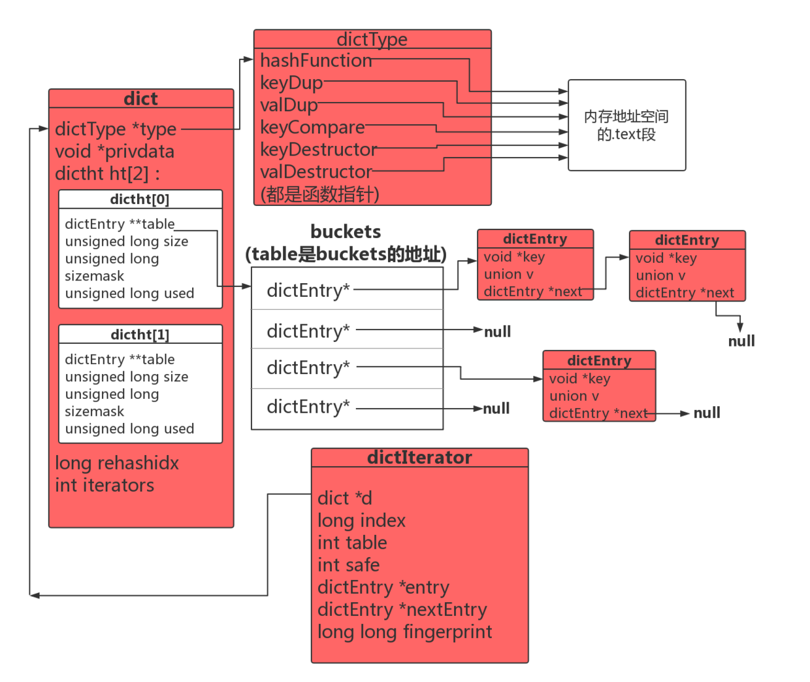
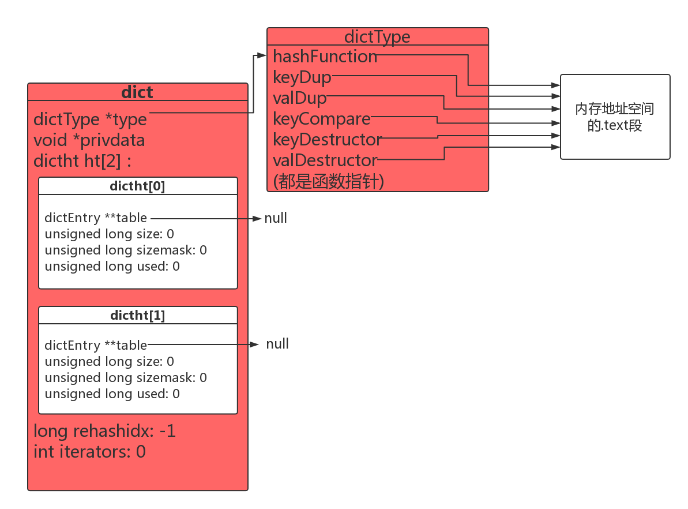
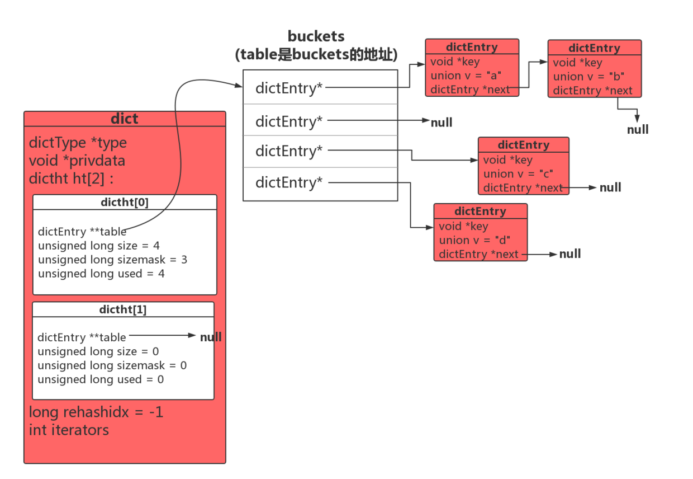
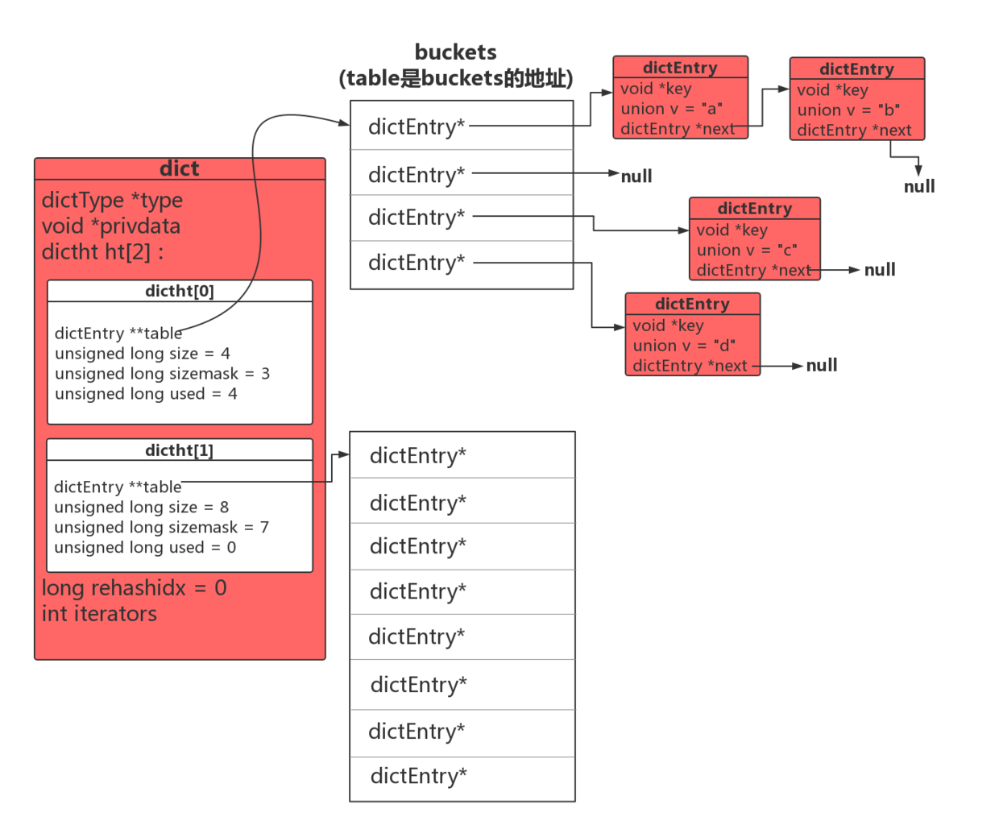

  # Redis 源码分析(三) ：Dict

- [一、什么是Dict](#%e4%b8%80%e4%bb%80%e4%b9%88%e6%98%afdict)
- [二、Redis Dict数据结构](#%e4%ba%8credis-dict%e6%95%b0%e6%8d%ae%e7%bb%93%e6%9e%84)
	- [hash算法](#hash%e7%ae%97%e6%b3%95)
- [三、Dict的基本操作](#%e4%b8%89dict%e7%9a%84%e5%9f%ba%e6%9c%ac%e6%93%8d%e4%bd%9c)
	- [创建Dict](#%e5%88%9b%e5%bb%badict)
	- [新增 - dictAdd](#%e6%96%b0%e5%a2%9e---dictadd)
	- [删除 - dictDelete](#%e5%88%a0%e9%99%a4---dictdelete)
	- [修改 - dictReplace](#%e4%bf%ae%e6%94%b9---dictreplace)
	- [查询 - dictFind](#%e6%9f%a5%e8%af%a2---dictfind)
	- [Rehash](#rehash)
		- [什么是Rehash](#%e4%bb%80%e4%b9%88%e6%98%afrehash)
		- [什么时候会触发Rehash](#%e4%bb%80%e4%b9%88%e6%97%b6%e5%80%99%e4%bc%9a%e8%a7%a6%e5%8f%91rehash)
		- [Rehash的过程](#rehash%e7%9a%84%e8%bf%87%e7%a8%8b)
		- [Rehash的方式](#rehash%e7%9a%84%e6%96%b9%e5%bc%8f)
		- [安全/非安全迭代器](#%e5%ae%89%e5%85%a8%e9%9d%9e%e5%ae%89%e5%85%a8%e8%bf%ad%e4%bb%a3%e5%99%a8)
		- [dictIterator定义](#dictiterator%e5%ae%9a%e4%b9%89)
		- [dictGetIterator:创建一个迭代器](#dictgetiterator%e5%88%9b%e5%bb%ba%e4%b8%80%e4%b8%aa%e8%bf%ad%e4%bb%a3%e5%99%a8)
		- [dictNext:迭代一个dictEntry节点](#dictnext%e8%bf%ad%e4%bb%a3%e4%b8%80%e4%b8%aadictentry%e8%8a%82%e7%82%b9)
- [参考资料](#%e5%8f%82%e8%80%83%e8%b5%84%e6%96%99)

# 一、什么是Dict

`dict` (dictionary 字典)，通常的存储结构是Key-Value形式的，通过Hash函数对`key`求Hash值来确定`Value`的位置，因此也叫Hash表，是一种用来解决算法中查找问题的数据结构，默认的算法复杂度接近O(1)，Redis本身也叫Remote Dictionary Server(远程字典服务器)，其实也就是一个大字典，它的`key`通常来说是String类型的，但是`Value`可以是 
`String`、`Set`、`ZSet`、`Hash`、`List`等不同的类型，下面我们看下dict的数据结构定义。

# 二、Redis Dict数据结构

从上图可以看出与`dict`相关的关键数据结构有三个，分别是：

* `dict`是Redis中的字典结构，包含两个dictht。
* `dictht`表示一个Hash表。
* `dictEntry` 是Redis中的字典结构，包含两个dictht。

`dictEntry`代码如下

	// redis 5.0.2
	typedef struct dictEntry {
	    void *key; //key void*表示任意类型指针
	    union {//联合体中对于数字类型提供了专门的类型优化
	        void *val;
	        uint64_t u64;
	        int64_t s64;
	        double d;
	    } v;
	    struct dictEntry *next; //next指针，用拉链法解决哈希冲突
	} dictEntry;

`dictht`代码如下

	// redis 5.0.2
	/* This is our hash table structure. Every dictionary has two of this as we
	 * implement incremental rehashing, for the old to the new table. */
	typedef struct dictht {
	    dictEntry **table; //数组指针，每个元素都是一个指向dictEntry的指针
	    unsigned long size; //表示这个dictht已经分配空间的大小，大小总是2^n
	    unsigned long sizemask;//sizemask = size - 1; 是用来求hash值的掩码，为2^n-1
	    unsigned long used; //目前已有的元素数量
	} dictht;

`dict`代码如下

	typedef struct dict {
	    dictType *type; //type中定义了对于Hash表的操作函数，比如Hash函数，key比较函数等
	    void *privdata; //privdata是可以传递给dict的私有数据     
	    dictht ht[2]; //每一个dict都包含两个dictht，一个用于rehash
	    long rehashidx; /* rehashing not in progress if rehashidx == -1 */
	    unsigned long iterators; /* number of iterators currently running */
	} dict;

	typedef struct dictType {
	    uint64_t (*hashFunction)(const void *key);// 计算hash值的函数
	    void *(*keyDup)(void *privdata, const void *key);// 键复制
	    void *(*valDup)(void *privdata, const void *obj);// 值复制
	    int (*keyCompare)(void *privdata, const void *key1, const void *key2);// 键比较
	    void (*keyDestructor)(void *privdata, void *key);// 键销毁
	    void (*valDestructor)(void *privdata, void *obj);// 值销毁
	} dictType;

其实通过上面的三个数据结构，已经可以大概看出`dict`的组成，数据（Key-Value）存储在每一个`dictEntry`节点；然后一条`Hash`表就是一个`dictht`结构，里面标明了Hash表的`size`,`used`等信息；最后每一个Redis的`dict`结构都会默认包含两个`dictht`，如果有一个Hash表满足特定条件需要扩容，则会申请另一个Hash表，然后把元素ReHash过来，ReHash的意思就是重新计算每个Key的Hash值，然后把它存放在第二个Hash表合适的位置，但是这个操作在Redis中并不是集中式一次完成的，而是在后续的增删改查过程中逐步完成的，这个叫渐进式ReHash，我们后文会专门讨论。

## hash算法
redis内置2种hash算法

* dictGenHashFunction，对字符串进行hash
* dictGenCaseHashFunction，对字符串进行hash，不区分大小写

		/* The default hashing function uses SipHash implementation
		 * in siphash.c. */
		
		uint64_t siphash(const uint8_t *in, const size_t inlen, const uint8_t *k);
		uint64_t siphash_nocase(const uint8_t *in, const size_t inlen, const uint8_t *k);
		
		uint64_t dictGenHashFunction(const void *key, int len) {
		    return siphash(key,len,dict_hash_function_seed);
		}
		
		uint64_t dictGenCaseHashFunction(const unsigned char *buf, int len) {
		    return siphash_nocase(buf,len,dict_hash_function_seed);
		}

# 三、Dict的基本操作

## 创建Dict

	/* Reset a hash table already initialized with ht_init().
	 * NOTE: This function should only be called by ht_destroy(). */
	static void _dictReset(dictht *ht)
	{
	    ht->table = NULL;
	    ht->size = 0;
	    ht->sizemask = 0;
	    ht->used = 0;
	}
	
	/* Create a new hash table */
	dict *dictCreate(dictType *type,
	        void *privDataPtr)
	{
	    dict *d = zmalloc(sizeof(*d));
	
	    _dictInit(d,type,privDataPtr);
	    return d;
	}
	
	/* Initialize the hash table */
	int _dictInit(dict *d, dictType *type,
	        void *privDataPtr)
	{
	    _dictReset(&d->ht[0]);
	    _dictReset(&d->ht[1]);
	    d->type = type;
	    d->privdata = privDataPtr;
	    d->rehashidx = -1;
	    d->iterators = 0;
	    return DICT_OK;
	}
需要注意的是创建初始化一个dict时并没有为buckets分配空间，table是赋值为null的。只有在往dict里添加dictEntry节点时才会为buckets分配空间，真正意义上创建一张hash表。

执行dictCreate后会得到如下布局：

## 新增 - dictAdd

	#define dictSetVal(d, entry, _val_) do { \
	    if ((d)->type->valDup) \
	        (entry)->v.val = (d)->type->valDup((d)->privdata, _val_); \
	    else \
	        (entry)->v.val = (_val_); \
	} while(0)
	
	/* Add an element to the target hash table */
	int dictAdd(dict *d, void *key, void *val)
	{
	    dictEntry *entry = dictAddRaw(d,key,NULL);//只在buckets的某个索引里新建一个dictEntry并调整链表的位置,只设置key，不设置不设置val
	
	    if (!entry) return DICT_ERR;
	    dictSetVal(d, entry, val);
	    return DICT_OK;
	}
	
	
	/* Low level add or find:
	 * This function adds the entry but instead of setting a value returns the
	 * dictEntry structure to the user, that will make sure to fill the value
	 * field as he wishes.
	 *
	 * This function is also directly exposed to the user API to be called
	 * mainly in order to store non-pointers inside the hash value, example:
	 *
	 * entry = dictAddRaw(dict,mykey,NULL);
	 * if (entry != NULL) dictSetSignedIntegerVal(entry,1000);
	 *
	 * Return values:
	 *
	 * If key already exists NULL is returned, and "*existing" is populated
	 * with the existing entry if existing is not NULL.
	 *
	 * If key was added, the hash entry is returned to be manipulated by the caller.
	 */
	dictEntry *dictAddRaw(dict *d, void *key, dictEntry **existing)
	{
	    long index;
	    dictEntry *entry;
	    dictht *ht;
	
	    if (dictIsRehashing(d)) _dictRehashStep(d);//判断是否是在rehash，如果是rehash会渐进式reash
	
	    /* Get the index of the new element, or -1 if
	     * the element already exists. */
	    if ((index = _dictKeyIndex(d, key, dictHashKey(d,key), existing)) == -1)
	        return NULL;
	
	    /* Allocate the memory and store the new entry.
	     * Insert the element in top, with the assumption that in a database
	     * system it is more likely that recently added entries are accessed
	     * more frequently. */
	    ht = dictIsRehashing(d) ? &d->ht[1] : &d->ht[0];//如果正在rehash的话存第二个hashtable里面
	    entry = zmalloc(sizeof(*entry));
	    entry->next = ht->table[index];
	    ht->table[index] = entry;
	    ht->used++;
	
	    /* Set the hash entry fields. */
	    dictSetKey(d, entry, key);
	    return entry;
	}
	
主要分为以下几个步骤:

1. 根据key的hash值找到应该存放的位置(buckets索引)。
2. 若dict是刚创建的还没有为bucekts分配内存，则会在找位置(_dictKeyIndex)时调用_dictExpandIfNeeded，为dictht[0]expand一个大小为4的buckets；若dict正好到了expand的时机，则会expand它的dictht[1]，并将rehashidx置为0打开rehash开关，_dictKeyIndex返回的会是dictht[1]的索引。
3. 申请一个dictEntry大小的内存插入到buckets对应索引下的链表头部，并给dictEntry设置next指针和key。
4. 为dictEntry设置value

## 删除 - dictDelete

	#define dictCompareKeys(d, key1, key2) \
    (((d)->type->keyCompare) ? \
        (d)->type->keyCompare((d)->privdata, key1, key2) : \
        (key1) == (key2))
        
	/* Remove an element, returning DICT_OK on success or DICT_ERR if the
	 * element was not found. */
	int dictDelete(dict *ht, const void *key) {
	    return dictGenericDelete(ht,key,0) ? DICT_OK : DICT_ERR;
	}
	
	/* Search and remove an element. This is an helper function for
	 * dictDelete() and dictUnlink(), please check the top comment
	 * of those functions. */
	static dictEntry *dictGenericDelete(dict *d, const void *key, int nofree) {
	    uint64_t h, idx;
	    dictEntry *he, *prevHe;
	    int table;
	
	    if (d->ht[0].used == 0 && d->ht[1].used == 0) return NULL;
	
	    if (dictIsRehashing(d)) _dictRehashStep(d);
	    h = dictHashKey(d, key);
	
	    for (table = 0; table <= 1; table++) {
	        idx = h & d->ht[table].sizemask;
	        he = d->ht[table].table[idx];//找到key对应的bucket索引
	        prevHe = NULL;
	        while(he) {
	            if (key==he->key || dictCompareKeys(d, key, he->key)) {
	                /* Unlink the element from the list */
	                if (prevHe)
	                    prevHe->next = he->next;
	                else
	                    d->ht[table].table[idx] = he->next;
	                if (!nofree) {
	                    dictFreeKey(d, he);
	                    dictFreeVal(d, he);
	                    zfree(he);
	                }
	                d->ht[table].used--;
	                return he;
	            }
	            prevHe = he;
	            he = he->next;
	        }
	        if (!dictIsRehashing(d)) break;
	    }
	    return NULL; /* not found */
	}
	
	/* Clear & Release the hash table */
	void dictRelease(dict *d)
	{
	    _dictClear(d,&d->ht[0],NULL);
	    _dictClear(d,&d->ht[1],NULL);
	    zfree(d);
	}

## 修改 - dictReplace

	/* Add or Overwrite:
	 * Add an element, discarding the old value if the key already exists.
	 * Return 1 if the key was added from scratch, 0 if there was already an
	 * element with such key and dictReplace() just performed a value update
	 * operation. */
	int dictReplace(dict *d, void *key, void *val)
	{
	    dictEntry *entry, *existing, auxentry;
	
	    /* Try to add the element. If the key
	     * does not exists dictAdd will succeed. */
	    entry = dictAddRaw(d,key,&existing);
	    if (entry) {
	        dictSetVal(d, entry, val);
	        return 1;
	    }
	
	    /* Set the new value and free the old one. Note that it is important
	     * to do that in this order, as the value may just be exactly the same
	     * as the previous one. In this context, think to reference counting,
	     * you want to increment (set), and then decrement (free), and not the
	     * reverse. */
	    auxentry = *existing;
	    dictSetVal(d, existing, val);
	    dictFreeVal(d, &auxentry);
	    return 0;
	}

## 查询 - dictFind

	dictEntry *dictFind(dict *d, const void *key)
	{
	    dictEntry *he;
	    uint64_t h, idx, table;
	
	    if (d->ht[0].used + d->ht[1].used == 0) return NULL; /* dict is empty */
	    if (dictIsRehashing(d)) _dictRehashStep(d);
	    h = dictHashKey(d, key);
	    for (table = 0; table <= 1; table++) {
	        idx = h & d->ht[table].sizemask;
	        he = d->ht[table].table[idx];
	        while(he) {
	            if (key==he->key || dictCompareKeys(d, key, he->key))
	                return he;
	            he = he->next;
	        }
	        if (!dictIsRehashing(d)) return NULL;
	    }
	    return NULL;
	}

## Rehash

### 什么是Rehash
随着操作的不断执行，hash表保存的键值对会逐渐的增多或者减少，这时就会暴露一些问题。如果hash表很大，但是键值对太少，也就是hash表的负载(dictht->used/dictht->size)太小，就会有大量的内存浪费；如果hash表的负载太大，就会影响字典的查找效率。这时候就需要进行rehash将hash表的负载控制在一个合理的范围。

### 什么时候会触发Rehash

当调用`dictAdd`为dict添加一个dictEntry节点时候，会`_dictKeyIndex`找到应该放置在buckets的哪个索引里，在这里会调用`_dictExpandIfNeeded`检查当前哈希表的空间是需要扩充（Rehash），若满足条件：dictht[0]的dictEntry节点数/buckets的索引数>=1则调用dictExpand，若dictEntry节点数/buckets的索引数>=dict_force_resize_ratio(默认是5)，则强制执行dictExpand扩充dictht[1]。

	/* Returns the index of a free slot that can be populated with
	 * a hash entry for the given 'key'.
	 * If the key already exists, -1 is returned
	 * and the optional output parameter may be filled.
	 *
	 * Note that if we are in the process of rehashing the hash table, the
	 * index is always returned in the context of the second (new) hash table. */
	static long _dictKeyIndex(dict *d, const void *key, uint64_t hash, dictEntry **existing)
	{
	    unsigned long idx, table;
	    dictEntry *he;
	    if (existing) *existing = NULL;
	
	    /* Expand the hash table if needed */
	    if (_dictExpandIfNeeded(d) == DICT_ERR)
	        return -1;
	    for (table = 0; table <= 1; table++) {
	        idx = hash & d->ht[table].sizemask;
	        /* Search if this slot does not already contain the given key */
	        he = d->ht[table].table[idx];
	        while(he) {
	            if (key==he->key || dictCompareKeys(d, key, he->key)) {
	                if (existing) *existing = he;
	                return -1;
	            }
	            he = he->next;
	        }
	        if (!dictIsRehashing(d)) break;
	    }
	    return idx;
	}
	
	/* Expand the hash table if needed */
	//判断dictht[1]是否需要扩充(并将dict调整为正在rehash状态)；若dict刚创建，则扩充dictht[0]  
	static int _dictExpandIfNeeded(dict *d)
	{
	    /* Incremental rehashing already in progress. Return. */
	    if (dictIsRehashing(d)) return DICT_OK; //如果正在ReHash，那直接返回OK，其实也表明申请了空间不久。
	
	    /* If the hash table is empty expand it to the initial size. */
	    if (d->ht[0].size == 0) return dictExpand(d, DICT_HT_INITIAL_SIZE);//如果 0 号哈希表的大小为0，表示还未创建，按照默认大小`DICT_HT_INITIAL_SIZE=4`去创建
	
	    /* If we reached the 1:1 ratio, and we are allowed to resize the hash
	     * table (global setting) or we should avoid it but the ratio between
	     * elements/buckets is over the "safe" threshold, we resize doubling
	     * the number of buckets. */
	     //如果满足 0 号哈希表used>size &&（dict_can_resize为1 或者 used/size > 5） 那就默认扩两倍大小
	    if (d->ht[0].used >= d->ht[0].size &&
	        (dict_can_resize ||
	         d->ht[0].used/d->ht[0].size > dict_force_resize_ratio))
	    {
	        return dictExpand(d, d->ht[0].used*2);
	    }
	    return DICT_OK;
	}
	
	
	/* Expand or create the hash table */
	//三个功能:
	//1.为刚初始化的dict的dictht[0]分配table(buckets)
	//2.为已经达到rehash要求的dict的dictht[1]分配一个更大(下一个2^n)的table(buckets),并将rehashidx置为0
	//3.为需要缩小bucket的dict分配一个更小的buckets，并将rehashidx置为0(打开rehash开关)
	int dictExpand(dict *d, unsigned long size)
	{
	    /* the size is invalid if it is smaller than the number of
	     * elements already inside the hash table */
	    if (dictIsRehashing(d) || d->ht[0].used > size)
	        return DICT_ERR;
	
	    dictht n; /* the new hash table */
	    unsigned long realsize = _dictNextPower(size);////从4开始找大于等于size的最小2^n作为新的slot数量
	
	    /* Rehashing to the same table size is not useful. */
	    if (realsize == d->ht[0].size) return DICT_ERR;
	
	    /* Allocate the new hash table and initialize all pointers to NULL */
	    n.size = realsize;
	    n.sizemask = realsize-1;
	    n.table = zcalloc(realsize*sizeof(dictEntry*));
	    n.used = 0;
	
	    /* Is this the first initialization? If so it's not really a rehashing
	     * we just set the first hash table so that it can accept keys. */
	    if (d->ht[0].table == NULL) {//刚创建的dict
	        d->ht[0] = n;//为d->ht[0]赋值
	        return DICT_OK;
	    }
	
	    /* Prepare a second hash table for incremental rehashing */
	    d->ht[1] = n;
	    d->rehashidx = 0;//设置为0表示开始从0号bucket Rehash
	    return DICT_OK;
	}
	
### Rehash的过程

假设一个dict已经有4个dictEntry节点(value分别为"a","b","c","d")，根据key的不同，存放在buckets的不同索引下。

现在如果我们想添加一个dictEntry，由于d->ht[0].used >= d->ht[0].size (4>=4)，满足了扩充dictht[1]的条件，会执行dictExpand。根据扩充规则，dictht[1]的buckets会扩充到8个槽位。

之后再将要添加的dictEntry加入到dictht[1]的buckets中的某个索引下，不过这个操作不属于dictExpand，不展开了。
扩充之后的dict的成员变量rehashidx被赋值为0，此后每次CRUD都会执行一次被动rehash把dictht[0]的buckets中的一个链表迁移到dictht[1]中，直到迁移完毕。

### Rehash的方式

1. 主动Rehash，一毫秒执行一次

		/* Rehash for an amount of time between ms milliseconds and ms+1 milliseconds */
		int dictRehashMilliseconds(dict *d, int ms) {
		    long long start = timeInMilliseconds();
		    int rehashes = 0;
		
		    while(dictRehash(d,100)) {//每次最多执行buckets的100个链表rehash
		        rehashes += 100;
		        if (timeInMilliseconds()-start > ms) break;
		    }
		    return rehashes;
		}

2. 被动Rehash，字典的增删改查(CRUD)调用dictAdd，dicFind，dictDelete，dictGetRandomKey等函数时，会调用_dictRehashStep，迁移buckets中的一个非空bucket
3. 
	    if (dictIsRehashing(d)) _dictRehashStep(d);

rehash函数

	/* Performs N steps of incremental rehashing. Returns 1 if there are still
	 * keys to move from the old to the new hash table, otherwise 0 is returned.
	 *
	 * Note that a rehashing step consists in moving a bucket (that may have more
	 * than one key as we use chaining) from the old to the new hash table, however
	 * since part of the hash table may be composed of empty spaces, it is not
	 * guaranteed that this function will rehash even a single bucket, since it
	 * will visit at max N*10 empty buckets in total, otherwise the amount of
	 * work it does would be unbound and the function may block for a long time. */
	int dictRehash(dict *d, int n) {
		//int empty_visits = n*10; empty_visits表示每次最多跳过10倍步长的空桶
		//（一个桶就是ht->table数组的一个位置），然后当我们找到一个非空的桶时，
		// 就将这个桶中所有的key全都ReHash到 1 号Hash表。最后每次都会判断是否将所有的key全部ReHash了，
		// 如果已经全部完成，就释放掉ht[0],然后将ht[1]变成ht[0]。
	    int empty_visits = n*10; /* Max number of empty buckets to visit. */
	    if (!dictIsRehashing(d)) return 0;
	
	    while(n-- && d->ht[0].used != 0) {//遍历n个bucket,ht[0]中还有dictEntry
	        dictEntry *de, *nextde;
	
	        /* Note that rehashidx can't overflow as we are sure there are more
	         * elements because ht[0].used != 0 */
	        assert(d->ht[0].size > (unsigned long)d->rehashidx);
	        while(d->ht[0].table[d->rehashidx] == NULL) {
	        	//当前bucket为空时跳到下一个bucket并且
	            d->rehashidx++;
	            if (--empty_visits == 0) return 1;
	        }
	        //直到当前bucket不为空bucket时
	        de = d->ht[0].table[d->rehashidx];
	        /* Move all the keys in this bucket from the old to the new hash HT */
	        while(de) {//把当前bucket的所有ditcEntry节点都移到ht[1]
	            uint64_t h;
	
	            nextde = de->next;
	            /* Get the index in the new hash table */
	            //hash函数算出的值& 新hashtable(buckets)的sizemask,保证h会小于新buckets的size
	            h = dictHashKey(d, de->key) & d->ht[1].sizemask;
	            de->next = d->ht[1].table[h];//插入到链表的最前面！省时间
	            d->ht[1].table[h] = de;
	            d->ht[0].used--;
	            d->ht[1].used++;
	            de = nextde;
	        }
	        d->ht[0].table[d->rehashidx] = NULL;//当前bucket已经完全移走
	        d->rehashidx++;
	    }
	
	    /* Check if we already rehashed the whole table... */
	    if (d->ht[0].used == 0) {
	        zfree(d->ht[0].table);//释放掉ht[0].table的内存(buckets)
	        d->ht[0] = d->ht[1];//浅复制，table只是一个地址，直接给ht[0]就好
	        _dictReset(&d->ht[1]);//ht[1]的table置空
	        d->rehashidx = -1;
	        return 0;
	    }
	
	    /* More to rehash... */
	    return 1;
	}

### 安全/非安全迭代器

safe迭代器：用户在迭代过程中可以对元素进行CRUD
undsafe迭代器：用户在迭代过程中禁止对元素进行CRUD

redis在`dict`结构里增加一个`iterator`成员，用来表示绑定在当前`dict`上的safe迭代器数量，dict每次CRUD执行`_dictRehashStep`时判断一下是否有绑定safe迭代器，如果有则不进行rehash以免扰乱迭代器的迭代，这样safe迭代时字典就可以正常进行CRUD操作了。

	static void _dictRehashStep(dict *d) {
	    if (d->iterators == 0) dictRehash(d,1);
	}

unsafe迭代器在执行迭代过程中不允许对dict进行其他操作，如何保证这一点呢？

redis在第一次执行迭代时会用`dictht[0]`、`dictht[1]`的`used`、`size`、`buckets`地址计算一个`fingerprint`(指纹)，在迭代结束后释放迭代器时再计算一遍`fingerprint`看看是否与第一次计算的一致，若不一致则用断言终止进程，生成指纹的函数如下:

	//unsafe迭代器在第一次dictNext时用dict的两个dictht的table、size、used进行hash算出一个结果
	//最后释放iterator时再调用这个函数生成指纹，看看结果是否一致，不一致就报错.
	//safe迭代器不会用到这个
	long long dictFingerprint(dict *d) {
	    long long integers[6], hash = 0;
	    int j;
	
	    integers[0] = (long) d->ht[0].table;//把指针类型转换成long
	    integers[1] = d->ht[0].size;
	    integers[2] = d->ht[0].used;
	    integers[3] = (long) d->ht[1].table;
	    integers[4] = d->ht[1].size;
	    integers[5] = d->ht[1].used;
	
	    /* We hash N integers by summing every successive integer with the integer
	     * hashing of the previous sum. Basically:
	     *
	     * Result = hash(hash(hash(int1)+int2)+int3) ...
	     *
	     * This way the same set of integers in a different order will (likely) hash
	     * to a different number. */
	    for (j = 0; j < 6; j++) {
	        hash += integers[j];
	        /* For the hashing step we use Tomas Wang's 64 bit integer hash. */
	        hash = (~hash) + (hash << 21); // hash = (hash << 21) - hash - 1;
	        hash = hash ^ (hash >> 24);
	        hash = (hash + (hash << 3)) + (hash << 8); // hash * 265
	        hash = hash ^ (hash >> 14);
	        hash = (hash + (hash << 2)) + (hash << 4); // hash * 21
	        hash = hash ^ (hash >> 28);
	        hash = hash + (hash << 31);
	    }
	    return hash;
	}

### dictIterator定义

	typedef struct dictIterator {
	    dict *d;
	    long index;//当前buckets索引，buckets索引类型是unsinged long，而这个初始化会是-1,所以long
	    int table, safe;//table是ht的索引只有0和1，safe是安全迭代器和不安全迭代器
	    //安全迭代器就等于加了一个锁在dict，使dict在CRUD时ditcEntry不能被动rehash
	    dictEntry *entry, *nextEntry;//当前hash节点以及下一个hash节点
	    /* unsafe iterator fingerprint for misuse detection. */
	    long long fingerprint;//dict.c里的dictFingerprint(),不安全迭代器相关
	} dictIterator;

### dictGetIterator:创建一个迭代器
	//默认是new一个unsafe迭代器
	dictIterator *dictGetIterator(dict *d)//获取一个iterator就是为这个dict new一个迭代器
	{
	    //不设置成员变量fingerprint，在dictNext的时候才设置。
	    dictIterator *iter = zmalloc(sizeof(*iter));
	
	    iter->d = d;
	    iter->table = 0;
	    iter->index = -1;
	    iter->safe = 0;
	    iter->entry = NULL;
	    iter->nextEntry = NULL;
	    return iter;
	}
	
	dictIterator *dictGetSafeIterator(dict *d) {
	    dictIterator *i = dictGetIterator(d);
	
	    i->safe = 1;
	    return i;
	}

### dictNext:迭代一个dictEntry节点
虽然safe迭代器会禁止rehash，但在迭代时有可能已经rehash了一部分，所以迭代器也会遍历在dictht[1]中的所有dictEntry。

# 参考资料

[Redis源码分析（dict）](https://blog.csdn.net/yangbodong22011/article/details/78467583)

[redis源码解读(三):基础数据结构之dict](http://czrzchao.com/redisSourceDict)

[Redis源码分析（dict）](https://blog.csdn.net/yangbodong22011/article/details/78467583)