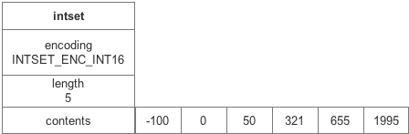
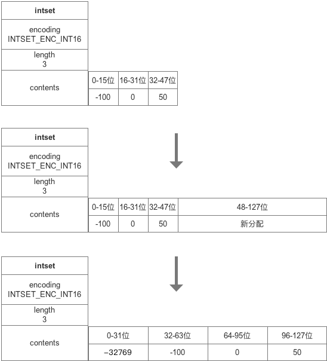

# Redis 源码分析(四) ：intset

- [Redis 源码分析(四) ：intset](#redis-%e6%ba%90%e7%a0%81%e5%88%86%e6%9e%90%e5%9b%9b-intset)
	- [一、什么是intset](#%e4%b8%80%e4%bb%80%e4%b9%88%e6%98%afintset)
	- [二、数据结构定义](#%e4%ba%8c%e6%95%b0%e6%8d%ae%e7%bb%93%e6%9e%84%e5%ae%9a%e4%b9%89)
	- [创建集合](#%e5%88%9b%e5%bb%ba%e9%9b%86%e5%90%88)
	- [新增元素](#%e6%96%b0%e5%a2%9e%e5%85%83%e7%b4%a0)
	- [查找元素](#%e6%9f%a5%e6%89%be%e5%85%83%e7%b4%a0)
	- [删除元素](#%e5%88%a0%e9%99%a4%e5%85%83%e7%b4%a0)
	- [升级](#%e5%8d%87%e7%ba%a7)
	- [总结](#%e6%80%bb%e7%bb%93)
	- [参考文章](#%e5%8f%82%e8%80%83%e6%96%87%e7%ab%a0)

## 一、什么是intset
`intset`是Redis内存数据结构之一，用来实现Redis的Set结构（**当集合元素不大于设定值并且元素都是整数时，就会用`intset`作为`set`的底层数据结构**），它的特点有：

* 元素类型只能为数字。
* 元素有三种类型：`int16_t`、`int32_t`、`int64_t`。
* 元素有序，不可重复。
* `intset`和`sds`一样，内存连续，就像数组一样。

## 二、数据结构定义
	
	typedef struct intset {
	    uint32_t encoding;  // 编码类型 int16_t、int32_t、int64_t
	    uint32_t length;    // 长度 最大长度:2^32
	    int8_t contents[];  // 柔性数组
	} intset;
	
	
* `encoding`为`inset`的编码方式，有3种编码方式，分别对应不同范围的整型：

		#define INTSET_ENC_INT16 (sizeof(int16_t))  // -32768~32767
		#define INTSET_ENC_INT32 (sizeof(int32_t))  // -2147483648~2147483647
		#define INTSET_ENC_INT64 (sizeof(int64_t))  // -2^63~2^63-1
* `intset`的编码是由最大的一个数决定的，如果有一个数是`int64`，那么整个`inset`的编码都是`int64`。
* `length`是`inset`的整数个数
* `contents`整数数组

`intset`的内存是连续的，所有的数据增删改查操作都是在内存地址偏移的基础上进行的，并且整数的保存也是有序的，一个保存了5个`int16`的`intset`的内存示意图如下：

由于`intset`是在内存上直接操作赋值，并且所存储的值都超过了一个字节，所以需要考虑大小端的问题：

* 大端模式，是指数据的高字节保存在内存的低地址中，而数据的低字节保存在内存的高地址中，这样的存储模式有点儿类似于把数据当作字符串顺序处理：地址由小向大增加，而数据从高位往低位放；这和我们的阅读习惯一致。
* 小端模式，是指数据的高字节保存在内存的高地址中，而数据的低字节保存在内存的低地址中，这种存储模式将地址的高低和数据位权有效地结合起来，高地址部分权值高，低地址部分权值低。

redis 的所有存储方式都是小端存储，在`endianconv.h`中有一段大小端的宏定义，如果当前cpu的字节序为大端就进行相应的转换：

	#if (BYTE_ORDER == LITTLE_ENDIAN)
		#define memrev16ifbe(p)
		#define memrev32ifbe(p)
		#define memrev64ifbe(p)
		#define intrev16ifbe(v) (v)
		#define intrev32ifbe(v) (v)
		#define intrev64ifbe(v) (v)
	#else
		#define memrev16ifbe(p) memrev16(p)
		#define memrev32ifbe(p) memrev32(p)
		#define memrev64ifbe(p) memrev64(p)
		#define intrev16ifbe(v) intrev16(v)
		#define intrev32ifbe(v) intrev32(v)
		#define intrev64ifbe(v) intrev64(v)
	#endif

## 创建集合

	/* Create an empty intset. */
	intset *intsetNew(void) {
	    intset *is = zmalloc(sizeof(intset));  // 分配空间
	    is->encoding = intrev32ifbe(INTSET_ENC_INT16);  // 初试创建默认元素大小为 2 字节
	    is->length = 0;
	    return is;
	}

## 新增元素

`intsetAdd `的过程涉及到了`intset`的升级、查找和插入。

	
	
	intset *intsetAdd(intset *is, int64_t value, uint8_t *success) {
	     /*为了节省空间, 判断添加的元素需要编码为何种数据类型, 比如int16, int32, int64*/
	    uint8_t valenc = _intsetValueEncoding(value);
	    uint32_t pos;
	    if (success) *success = 1;
	
	    /*如果intset编码位数无法容纳新元素，则需要重新更新整个intset编码*/
	    if (valenc > intrev32ifbe(is->encoding)) {
	        /* 更新编码并添加新元素 */
	        return intsetUpgradeAndAdd(is,value);
	    } else {
	        /*搜索新添加元素是否已经存在，存在则返回失败，此函数在查找一节会详细讲解*/
	        if (intsetSearch(is,value,&pos)) {
	            if (success) *success = 0;
	            return is;
	        }
	        
	        /*扩展内存空间*/
	        is = intsetResize(is,intrev32ifbe(is->length)+1);
	        
	        if (pos < intrev32ifbe(is->length)) 
	            /*如果添加元素位置不是一整块内存尾部，则需将其后面元素后移一个元素位置*/
	            intsetMoveTail(is,pos,pos+1);
	    }
	    
	    /*pos位置处赋值*/
	    _intsetSet(is,pos,value);
	    is->length = intrev32ifbe(intrev32ifbe(is->length)+1);
	    return is;
	}

	/*根据元素大小决定元素存储长度*/
	static uint8_t _intsetValueEncoding(int64_t v) {
	    if (v < INT32_MIN || v > INT32_MAX)
	        return INTSET_ENC_INT64;
	    else if (v < INT16_MIN || v > INT16_MAX)
	        return INTSET_ENC_INT32;
	    else
	        return INTSET_ENC_INT16;
	}
	
	/*重置intset空间大小，每次zrealloc扩展内存大小*/
	static intset *intsetResize(intset *is, uint32_t len) {
	    uint32_t size = len*intrev32ifbe(is->encoding);
	    is = zrealloc(is,sizeof(intset)+size);
	    return is;
	}
	
	/*向后移动元素*/
	static void intsetMoveTail(intset *is, uint32_t from, uint32_t to) {
	    void *src, *dst;
	    uint32_t bytes = intrev32ifbe(is->length)-from;
	    uint32_t encoding = intrev32ifbe(is->encoding);
	
	    if (encoding == INTSET_ENC_INT64) {
	        src = (int64_t*)is->contents+from;
	        dst = (int64_t*)is->contents+to;
	        bytes *= sizeof(int64_t);
	    } else if (encoding == INTSET_ENC_INT32) {
	        src = (int32_t*)is->contents+from;
	        dst = (int32_t*)is->contents+to;
	        bytes *= sizeof(int32_t);
	    } else {
	        src = (int16_t*)is->contents+from;
	        dst = (int16_t*)is->contents+to;
	        bytes *= sizeof(int16_t);
	    }
	    memmove(dst,src,bytes); // 由于移动前后地址会有重叠，因此要利用memmove进行内存拷贝 memcpy无法保障结果正确性
	}
	/* 更新集合编码并添加新元素 */
	static intset *intsetUpgradeAndAdd(intset *is, int64_t value) {
	    uint8_t curenc = intrev32ifbe(is->encoding);
	    uint8_t newenc = _intsetValueEncoding(value);
	    int length = intrev32ifbe(is->length);
	    int prepend = value < 0 ? 1 : 0;
	
	    /* 设置新编码，并扩展足够内存空间*/
	    is->encoding = intrev32ifbe(newenc);
	    is = intsetResize(is,intrev32ifbe(is->length)+1);
	
	    /* 取出原来空间中元素，从后开始往前依次放入新的位置 */
	    while(length--)
	        _intsetSet(is,length+prepend,_intsetGetEncoded(is,length,curenc));
	
	    /* 放置value值，要么在数组头，要么在数组尾部 */
	    if (prepend)
	        _intsetSet(is,0,value);
	    else
	        _intsetSet(is,intrev32ifbe(is->length),value);
	    is->length = intrev32ifbe(intrev32ifbe(is->length)+1);
	    return is;
	}

## 查找元素

为了确保`intset`元素的唯一性，再插入之前会进行一次查找，`intsetSearch`函数定义如下：

	uint8_t intsetFind(intset *is, int64_t value) {
	    /*判断待查元素编码是否符合条件，不符合直接返回false，否则进入intsetSearch进行实际查找*/
	    uint8_t valenc = _intsetValueEncoding(value);
	    return valenc <= intrev32ifbe(is->encoding) && intsetSearch(is,value,NULL);
	}
	
	static uint8_t intsetSearch(intset *is, int64_t value, uint32_t *pos) {
	    int min = 0, max = intrev32ifbe(is->length)-1, mid = -1;
	    int64_t cur = -1;
	
	    /* 集合为空，直接返回第一个位置 */
	    if (intrev32ifbe(is->length) == 0) {
	        if (pos) *pos = 0;
	        return 0;
	    } else {
	        /* _intsetGet函数仅仅获取set集合中pos位置的值， 如果待查元素大于集合尾部元素，则直接返回待查元素位置为集合长度*/
	        if (value > _intsetGet(is,intrev32ifbe(is->length)-1)) {
	            if (pos) *pos = intrev32ifbe(is->length);
	            return 0;
	        /*如果待查元素小于集合头部元素，则直接返回待查元素位置为0*/
	        } else if (value < _intsetGet(is,0)) {
	            if (pos) *pos = 0;
	            return 0;
	        }
	    }
	
	    /*二分查找*/
	    while(max >= min) {
	        mid = ((unsigned int)min + (unsigned int)max) >> 1;
	        cur = _intsetGet(is,mid);
	        if (value > cur) {
	            min = mid+1;
	        } else if (value < cur) {
	            max = mid-1;
	        } else {
	            break;
	        }
	    }
	    
	    /*找到元素返回1，否则返回0，pos为元素应该位置*/
	    if (value == cur) {
	        if (pos) *pos = mid;
	        return 1;
	    } else {
	        if (pos) *pos = min;
	        return 0;
	    }
	}
上述函数的作用就是利用`intset`有序的特性，通过二分法对目标`value`进行查找，如果找到返回1，反之返回0，`pos`作为引用传入函数中，会被赋值为`value`在`intset`中对应的位置。
`intsetSearch`中多次调用的`_intsetGet`是用来获取对应`pos`的`value`值的函数：

	static int64_t _intsetGet(intset *is, int pos) {    // 获取值
	    return _intsetGetEncoded(is,pos,intrev32ifbe(is->encoding));
	}
	
	static int64_t _intsetGetEncoded(intset *is, int pos, uint8_t enc) {    // 根据encode获取对应的值
	    int64_t v64;
	    int32_t v32;
	    int16_t v16;
	
	    if (enc == INTSET_ENC_INT64) {
	        memcpy(&v64,((int64_t*)is->contents)+pos,sizeof(v64));
	        memrev64ifbe(&v64); // 大小端转换
	        return v64;
	    } else if (enc == INTSET_ENC_INT32) {
	        memcpy(&v32,((int32_t*)is->contents)+pos,sizeof(v32));
	        memrev32ifbe(&v32);
	        return v32;
	    } else {
	        memcpy(&v16,((int16_t*)is->contents)+pos,sizeof(v16));
	        memrev16ifbe(&v16);
	        return v16;
	    }
	}

可以看到`intset`在获取值的时候都是通过地址偏移、内存拷贝，然后进行大小端转换处理完成的。

## 删除元素

	intset *intsetRemove(intset *is, int64_t value, int *success) {
	    uint8_t valenc = _intsetValueEncoding(value);
	    uint32_t pos;
	    if (success) *success = 0;
	    
	    /*查找元素是否存在*/
	    if (valenc <= intrev32ifbe(is->encoding) && intsetSearch(is,value,&pos)) {
	        uint32_t len = intrev32ifbe(is->length);
	
	        if (success) *success = 1;
	
	        /*删除元素，并移动其他元素覆盖原来位置，这里没有缓存空间，而是直接重置原来空间，可能是为了节省内存*/
	        if (pos < (len-1)) intsetMoveTail(is,pos+1,pos);
	        is = intsetResize(is,len-1);
	        is->length = intrev32ifbe(len-1);
	    }
	    return is;
	}

## 升级

当插入的`value`大于当前`intset`的`encode`时就需要对`intset`进行升级，以适应更大的值：

	static intset *intsetUpgradeAndAdd(intset *is, int64_t value) { // 升级并且添加新元素
	    uint8_t curenc = intrev32ifbe(is->encoding);
	    uint8_t newenc = _intsetValueEncoding(value);
	    int length = intrev32ifbe(is->length);
	    int prepend = value < 0 ? 1 : 0;
	
	    /* First set new encoding and resize */
	    is->encoding = intrev32ifbe(newenc);
	    is = intsetResize(is,intrev32ifbe(is->length)+1);
	
	    /* Upgrade back-to-front so we don't overwrite values.
	     * Note that the "prepend" variable is used to make sure we have an empty
	     * space at either the beginning or the end of the intset. */
	    while(length--) // 从尾部开始，将原有数据进行迁移
	        _intsetSet(is,length+prepend,_intsetGetEncoded(is,length,curenc));
	
	    /* Set the value at the beginning or the end. */
	    if (prepend)    // 小于0在集合头部
	        _intsetSet(is,0,value);
	    else    // 在集合尾部
	        _intsetSet(is,intrev32ifbe(is->length),value);
	    is->length = intrev32ifbe(intrev32ifbe(is->length)+1);
	    return is;
	}

首先当需要对原有`intset`进行升级时，插入的元素一定是大于当前`intset`的最大值或者小于当前`intset`的最小值的，因此带插入的`value`一定是在首尾，只需判断其正负即可。

升级的操作主要是将原本数据的内存地址大小进行一个统一的变更，从原`intset`的`length+prepend`开始，一个一个扩展迁移。

进行完扩展迁移之后把带插入的元素插入到头或尾即可。

一个`INTSET_ENC_INT16`->`INTSET_ENC_INT32`的升级示例如下图：

## 总结

* intset实质就是一个有序数组，内存连续，无重复
* 可以看到添加删除元素都比较耗时，查找元素是`O(logN)`时间复杂度，不适合大规模的数据
* 有三种编码方式，通过升级的方式进行编码切换
* 不支持降级
* 小端存储

## 参考文章

[Redis源码分析（intset）](https://blog.csdn.net/yangbodong22011/article/details/78671625)

[redis源码解读(四):基础数据结构之intset](http://czrzchao.com/redisSourceIntset#intset)

[Redis之intset数据结构):基础数据结构之intset](https://www.cnblogs.com/ourroad/p/4892945.html)

