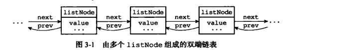
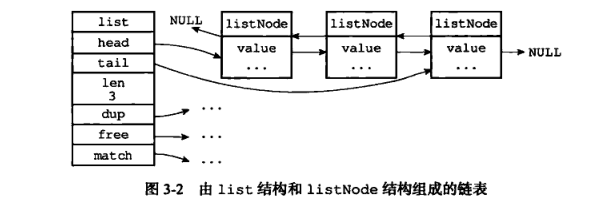

# Redis 数据结构 — 链表 linked-list

## 概述

* 链表提供了高效的节点重排能力，以及顺序性的节点访问方式，并且可以通过增删节点来灵活地调整链表的长度。
* 链表在Redis 中的应用非常广泛，比如列表键的底层实现之一就是链表。当一个列表键包含了数量较多的元素，又或者列表中包含的元素都是比较长的字符串时，Redis 就会使用链表作为列表键的底层实现。
* 链表结构是 Redis 中一个常用的结构，它可以存储多个字符串
* 它是有序的
* 能够存储2的32次方减一个节点（超过 40 亿个节点）
* Redis 链表是双向的，因此即可以从左到右，也可以从右到左遍历它存储的节点
* 链表结构查找性能不佳，但 插入和删除速度很快

由于是双向链表，所以只能够从左到右，或者从右到左地访问和操作链表里面的数据节点。 但是使用链表结构就意味着读性能的丧失，所以要在大量数据中找到一个节点的操作性能是不佳的，因为链表只能从一个方向中去遍历所要节点，比如从查找节点 10000 开始查询，它需要按照节点1 、节点 2、节点 3……直至节点 10000，这样的顺序查找，然后把一个个节点和你给出的值比对，才能确定节点所在。如果这个链表很大，如有上百万个节点，可能需要遍历几十万次才能找到所需要的节点，显然查找性能是不佳的。

链表结构的优势在于插入和删除的便利 ，因为链表的数据节点是分配在不同的内存区域的，并不连续，只是根据上一个节点保存下一个节点的顺序来索引而己，无需移动元素。

因为是双向链表结构，所以 Redis 链表命令分为左操作和右操作两种命令，左操作就意味着是从左到右，右操作就意味着是从右到左。

## 链表的数据结构

	typedef struct listNode{
	      struct listNode *prev;
	      struct listNode * next;
	      void * value;  
	}
	
	

	
	

	typedef struct list{
	    //表头节点
	    listNode  * head;
	    //表尾节点
	    listNode  * tail;
	    //链表长度
	    unsigned long len;
	    //节点值复制函数
	    void *(*dup) (void *ptr);
	    //节点值释放函数
	    void (*free) (void *ptr);
	    //节点值对比函数
	    int (*match)(void *ptr, void *key);
	}

	

## 链表的特性

* 双端：链表节点带有prev 和next 指针，获取某个节点的前置节点和后置节点的时间复杂度都是O（N）
* 无环：表头节点的 prev 指针和表尾节点的next 都指向NULL，对立案表的访问时以NULL为截止
* 表头和表尾：因为链表带有head指针和tail 指针，程序获取链表头结点和尾节点的时间复杂度为O(1)
* 长度计数器：链表中存有记录链表长度的属性 len
* 多态：链表节点使用 void* 指针来保存节点值，并且可以通过list 结构的dup 、 free、 match三个属性为节点值设置类型特定函数。

## 参考

[深入浅出Redis-redis底层数据结构（上）](https://www.cnblogs.com/jaycekon/p/6227442.html)
[Redis-05Redis数据结构--链表( linked-list)](https://blog.csdn.net/yangshangwei/article/details/82792672)

