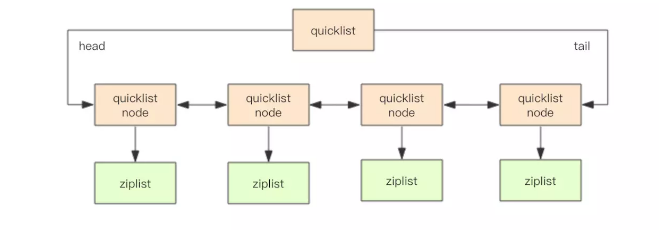

# Redis 源码分析(六) ：quciklist

- [Redis 源码分析(六) ：quciklist](#redis-%e6%ba%90%e7%a0%81%e5%88%86%e6%9e%90%e5%85%ad-quciklist)
	- [一、什么是 quicklist](#%e4%b8%80%e4%bb%80%e4%b9%88%e6%98%af-quicklist)
		- [redis list 数据结构特点](#redis-list-%e6%95%b0%e6%8d%ae%e7%bb%93%e6%9e%84%e7%89%b9%e7%82%b9)
	- [二、数据结构](#%e4%ba%8c%e6%95%b0%e6%8d%ae%e7%bb%93%e6%9e%84)
		- [list-max-ziplist-size](#list-max-ziplist-size)
		- [list-compress-depth](#list-compress-depth)
	- [三、quicklist 典型基本操作函数](#%e4%b8%89quicklist-%e5%85%b8%e5%9e%8b%e5%9f%ba%e6%9c%ac%e6%93%8d%e4%bd%9c%e5%87%bd%e6%95%b0)
		- [Create](#create)
		- [Push](#push)
		- [Pop](#pop)
		- [节点压缩](#%e8%8a%82%e7%82%b9%e5%8e%8b%e7%bc%a9)
		- [插入](#%e6%8f%92%e5%85%a5)
	- [总结](#%e6%80%bb%e7%bb%93)
	- [参考文章](#%e5%8f%82%e8%80%83%e6%96%87%e7%ab%a0)

## 一、什么是 quicklist

考虑到链表`adlist`的附加空间相对太高，`prev`和`next`指针就要占去 16 个字节 (64bit 系统的指针是 8 个字节)，另外每个节点的内存都是单独分配，会加剧内存的碎片化，影响内存管理效率。

`quicklist`是一个 3.2 版本之后新增的基础数据结构，是 redis 自定义的一种复杂数据结构，将`ziplist`和`adlist`结合到了一个数据结构中。主要是作为`list`的基础数据结构。
在 3.2 之前，`list`是根据元素数量的多少采用`ziplist`或者`adlist`作为基础数据结构，3.2 之后统一改用`quicklist`，从数据结构的角度来说`quicklist`结合了两种数据结构的优缺点，复杂但是实用：

- 链表在插入，删除节点的时间复杂度很低；但是内存利用率低，且由于内存不连续容易产生内存碎片
- 压缩表内存连续，存储效率高；但是插入和删除的成本太高，需要频繁的进行数据搬移、释放或申请内存

而`quicklist`通过将每个压缩表用双向链表的方式连接起来，来寻求一种收益最大化。

### redis list 数据结构特点

- 表`list`是一个能维持数据项先后顺序的双向链表

- 在表`list`的两端追加和删除数据极为方便，时间复杂度为 O(1)

- 表`list`也支持在任意中间位置的存取操作，时间复杂度为 O(N)

- 表`list`经常被用作队列使用

## 二、数据结构

    typedef struct quicklistNode {
        struct quicklistNode *prev; // 前一个节点
        struct quicklistNode *next; // 后一个节点
        unsigned char *zl;  // ziplist
        unsigned int sz;             // ziplist的内存大小
        unsigned int count : 16;     // zpilist中数据项的个数
        unsigned int encoding : 2;   // 1为ziplist 2是LZF压缩存储方式
        unsigned int container : 2;
        unsigned int recompress : 1;   // 压缩标志, 为1 是压缩
        unsigned int attempted_compress : 1; // 节点是否能够被压缩,只用在测试
        unsigned int extra : 10; /* more bits to steal for future usage */
    } quicklistNode;

`quicklistNode`实际上就是对`ziplist`的进一步封装，其中包括：

- 指向前后压缩表节点的两个指针
- `zl`：`ziplist`指针
- `sz`：`ziplist`的内存占用大小
- `count`：`ziplist`内部数据的个数
- `encoding`：`ziplist`编码方式，1 为默认方式，2 为 LZF 数据压缩方式
- `recompress`：是否压缩，1 表示压缩

这里从变量`count`开始，都采用了位域的方式进行数据的内存声明，使得 6 个`unsigned int`变量只用到了一个`unsigned int`的内存大小。

C 语言支持位域的方式对结构体中的数据进行声明，也就是可以指定一个类型占用几位：

1. 如果相邻位域字段的类型相同，且其位宽之和小于类型的`sizeof`大小，则后面的字段将紧邻前一个字段存储，直到不能容纳为止；
2. 如果相邻位域字段的类型相同，但其位宽之和大于类型的`sizeof`大小，则后面的字段将从新的存储单元开始，其偏移量为其类型大小的整数倍；
3. 如果相邻的位域字段的类型不同，则各编译器的具体实现有差异，VC6 采取不压缩方式，Dev-C++采取压缩方式；
4. 如果位域字段之间穿插着非位域字段，则不进行压缩；
5. 整个结构体的总大小为最宽基本类型成员大小的整数倍。

`sizeof(quicklistNode); // output:32`，通过位域的声明方式，`quicklistNode`可以节省 24 个字节。

通过`quicklist`将`quicklistNode`连接起来就是一个完整的数据结构了

    typedef struct quicklist {
        quicklistNode *head;    // 头结点
        quicklistNode *tail;    // 尾节点
        unsigned long count;    // 所有数据的数量
        unsigned int len;       // quicklist节点数量
        int fill : 16;          // 单个ziplist的大小限制，由list-max-ziplist-size给定
        unsigned int compress : 16;   // 压缩深度,由list-compress-depth给定
    } quicklist;

由于`quicklist`结构包含了压缩表和链表，那么每个`quicklistNode`的大小就是一个需要仔细考量的点。如果单个`quicklistNode`存储的数据太多，就会影响插入效率；但是如果单个`quicklistNode`太小，就会变得跟链表一样造成空间浪费。
`quicklist`通过`fill`对单个`quicklistNode`的大小进行限制：`fill`可以被赋值为正整数或负整数，full 的大小由`list-max-ziplist-size`给定。

### list-max-ziplist-size

1、`list-max-ziplist-size`取值，可以取正值，也可以取负值。

当取正值的时候，表示按照数据项个数来限定每个`quicklist`节点上的`ziplist`长度。比如，当这个参数配置成 5 的时候，表示每个`quicklist`节点的`ziplist`最多包含 5 个数据项，最大为 32768 个。

    #define FILL_MAX (1 << 15)  // 32768
    void quicklistSetFill(quicklist *quicklist, int fill) { // set ziplist的单个节点最大存储数据量
        if (fill > FILL_MAX) {  // 个数
            fill = FILL_MAX;
        } else if (fill < -5) { // 内存大小
            fill = -5;
        }
        quicklist->fill = fill;
    }

当取负值的时候，表示按照占用字节数来限定每个`quicklist`节点上的`ziplist`长度。这时，它只能取-1 到-5 这五个值，每个值含义如下：

- -5: 每个`quicklist`节点上的`ziplist`大小不能超过 64 Kb。（注：1kb => 1024 bytes）

- -4: 每个`quicklist`节点上的`ziplist`大小不能超过 32 Kb。

- -3: 每个`quicklist`节点上的`ziplist`大小不能超过 16 Kb。

-2: 每个`quicklist`节点上的`ziplist`大小不能超过 8 Kb。（**-2 是 Redis 给出的默认值**）

- -1: 每个`quicklist`节点上的`ziplist`大小不能超过 4 Kb。

2、`list-max-ziplist-size`配置产生的原因？

每个`quicklist`节点上的`ziplist`越短，则内存碎片越多。内存碎片多了，有可能在内存中产生很多无法被利用的小碎片，从而降低存储效率。这种情况的极端是每个`quicklist`节点上的`ziplist`只包含一个数据项，这就蜕化成一个普通的双向链表了。

每个`quicklist`节点上的`ziplist`越长，则为`ziplist`分配大块连续内存空间的难度就越大。有可能出现内存里有很多小块的空闲空间（它们加起来很多），但却找不到一块足够大的空闲空间分配给`ziplist`的情况。这同样会降低存储效率。这种情况的极端是整个`quicklist`只有一个节点，所有的数据项都分配在这仅有的一个节点的`ziplist`里面。这其实蜕化成一个`ziplist`了。

可见，一个`quicklist`节点上的`ziplist`要保持一个合理的长度。那到底多长合理呢？Redis 提供了一个配置参数`list-max-ziplist-size`，就是为了让使用者可以来根据实际应用场景进行调整优化。

### list-compress-depth

其表示一个`quicklist`两端不被压缩的节点个数。注：这里的节点个数是指`quicklist`双向链表的节点个数，而不是指`ziplist`里面的数据项个数。实际上，一个`quicklist`节点上的`ziplist`，如果被压缩，就是整体被压缩的。

1、`list-compress-depth`的取值：

- 0: 是个特殊值，表示都不压缩。这是 Redis 的默认值。

- 1: 表示`quicklist`两端各有 1 个节点不压缩，中间的节点压缩。

- 2: 表示`quicklist`两端各有 2 个节点不压缩，中间的节点压缩。

- 3: 表示`quicklist`两端各有 3 个节点不压缩，中间的节点压缩。

2、`list-compress-depth`配置产生原因？

当表`list`存储大量数据的时候，最容易被访问的很可能是两端的数据，中间的数据被访问的频率比较低（访问起来性能也很低）。如果应用场景符合这个特点，那么`list`还提供了一个选项，能够把中间的数据节点进行压缩，从而进一步节省内存空间。Redis 的配置参数`list-compress-depth`就是用来完成这个设置的。

## 三、quicklist 典型基本操作函数

当我们使用`lpush`或`rpush`等命令第一次向一个不存在的`list`里面插入数据的时候，Redis 会首先调用`quicklistCreate`接口创建一个空的`quicklist`。

### Create

    /* Create a new quicklist.
     * Free with quicklistRelease(). */
    quicklist *quicklistCreate(void) {
        struct quicklist *quicklist;

        quicklist = zmalloc(sizeof(*quicklist));
        quicklist->head = quicklist->tail = NULL;
        quicklist->len = 0;
        quicklist->count = 0;
        quicklist->compress = 0;
        quicklist->fill = -2;
        return quicklist;
    }

从上述代码中，我们看到`quicklist`是一个不包含空余头节点的双向链表（`head`和`tail`都初始化为`NULL`）。

### Push

`quicklist`只能在头尾插入节点，以在头部插入节点为例：

    int quicklistPushHead(quicklist *quicklist, void *value, size_t sz) {   // 在头部插入数据
        quicklistNode *orig_head = quicklist->head;

        if (likely(_quicklistNodeAllowInsert(quicklist->head, quicklist->fill, sz))) {  // 判断是否能够被插入到头节点中
            quicklist->head->zl = ziplistPush(quicklist->head->zl, value, sz, ZIPLIST_HEAD);  // 调用ziplist的api在头部插入数据
            quicklistNodeUpdateSz(quicklist->head); // 更新节点的sz
        } else {    // 需要新增节点
            quicklistNode *node = quicklistCreateNode();    // 新建节点
            node->zl = ziplistPush(ziplistNew(), value, sz, ZIPLIST_HEAD);  // 新建一个ziplist并插入一个节点

            quicklistNodeUpdateSz(node);    // 更新节点的sz
            _quicklistInsertNodeBefore(quicklist, quicklist->head, node);   // 将新节点插入到头节点之前
        }
        quicklist->count++; // count自增
        quicklist->head->count++;
        return (orig_head != quicklist->head);  // 返回0为用已有节点 返回1为新建节点
    }

`quicklist`的主要操作基本都是复用`ziplist`的`api`，其中`likely`是针对条件语句的优化，告知编译器这种情况很可能出现，让编译器针对这种条件进行优化；与之对应的还有`unlikely`。由于绝大部分时候都不需要新增节点，因此用`likely`做了优化
在`_quicklistNodeAllowInsert`函数中，针对单个节点的内存大小做了校验

    REDIS_STATIC int _quicklistNodeAllowInsert(const quicklistNode *node,
                                               const int fill, const size_t sz) {   // 判断当前node是否还能插入数据
        if (unlikely(!node))
            return 0;

        int ziplist_overhead;
        /* size of previous offset */
        if (sz < 254)   // 小于254时后一个节点的pre只有1字节,否则为5字节
            ziplist_overhead = 1;
        else
            ziplist_overhead = 5;

        /* size of forward offset */
        if (sz < 64)    // 小于64字节当前节点的encoding为1
            ziplist_overhead += 1;
        else if (likely(sz < 16384))    // 小于16384 encoding为2字节
            ziplist_overhead += 2;
        else    // encoding为5字节
            ziplist_overhead += 5;

        /* new_sz overestimates if 'sz' encodes to an integer type */
        unsigned int new_sz = node->sz + sz + ziplist_overhead; // 忽略了连锁更新的情况
        if (likely(_quicklistNodeSizeMeetsOptimizationRequirement(new_sz, fill)))   // // 校验fill为负数是否超过单存储限制
            return 1;
        else if (!sizeMeetsSafetyLimit(new_sz)) // 校验单个节点是否超过8kb，主要防止fill为正数时单个节点内存过大
            return 0;
        else if ((int)node->count < fill)   // fill为正数是否超过存储限制
            return 1;
        else
            return 0;
    }

同样，因为默认的`fill`为-2，所以针对为负数并且不会超过单个节点存储限制的条件做了`likely`优化；除此之外在计算的时候还忽略了`ziplist`可能发生的连锁更新；以及`fill`为正数时单个节点不能超过 8kb

### Pop

    /* Default pop function
     *
     * Returns malloc'd value from quicklist */
    int quicklistPop(quicklist *quicklist, int where, unsigned char **data,
                     unsigned int *sz, long long *slong) {
        unsigned char *vstr;
        unsigned int vlen;
        long long vlong;
        if (quicklist->count == 0)
            return 0;
        int ret = quicklistPopCustom(quicklist, where, &vstr, &vlen, &vlong,
                                     _quicklistSaver);
        if (data)
            *data = vstr;
        if (slong)
            *slong = vlong;
        if (sz)
            *sz = vlen;
        return ret;
    }

`quicklist`的`pop`操作是调用`quicklistPopCustom`来实现的。

`quicklistPopCustom`的实现过程基本上跟`quicklistPush`相反：

1. 从头部或尾部节点的`ziplist`中把对应的数据项删除；
2. 如果在删除后`ziplist`为空了，那么对应的头部或尾部节点也要删除；
3. 删除后还可能涉及到里面节点的解压缩问题。

### 节点压缩

由于`list`这个结构大部分时候只会用到头尾的数据，因此 redis 利用`lzf`算法对节点中间的元素进行压缩，以达到节省内存空间的效果。压缩节点的结构体和具体函数如下：

    typedef struct quicklistLZF {  // lzf结构体
        unsigned int sz; /* LZF size in bytes*/
        char compressed[];
    } quicklistLZF;

    REDIS_STATIC int __quicklistCompressNode(quicklistNode *node) { // 压缩节点
    #ifdef REDIS_TEST
        node->attempted_compress = 1;
    #endif

        /* Don't bother compressing small values */
        if (node->sz < MIN_COMPRESS_BYTES)  // 小于48字节不进行压缩
            return 0;

        quicklistLZF *lzf = zmalloc(sizeof(*lzf) + node->sz);

        /* Cancel if compression fails or doesn't compress small enough */
        if (((lzf->sz = lzf_compress(node->zl, node->sz, lzf->compressed,
                                     node->sz)) == 0) ||
            lzf->sz + MIN_COMPRESS_IMPROVE >= node->sz) {   // 如果压缩失败或压缩后节省的空间不到8字节放弃压缩
            /* lzf_compress aborts/rejects compression if value not compressable. */
            zfree(lzf);
            return 0;
        }
        lzf = zrealloc(lzf, sizeof(*lzf) + lzf->sz);    // 重新分配内存
        zfree(node->zl);    // 释放原有节点
        node->zl = (unsigned char *)lzf;    // 将压缩节点赋值给node
        node->encoding = QUICKLIST_NODE_ENCODING_LZF;   // 记录编码
        node->recompress = 0;
        return 1;
    }

### 插入

`quicklist`不仅实现了从头部或尾部插入，也实现了从任意指定的位置插入。`quicklistInsertAfter`和`quicklistInsertBefore`就是分别在指定位置后面和前面插入数据项。这种在任意指定位置插入数据的操作，情况比较复杂。

- 当插入位置所在的`ziplist`大小没有超过限制时，直接插入到`ziplist`中就好了

- 当插入位置所在的`ziplist`大小超过了限制，但插入的位置位于`ziplist`两端，并且相邻的`quicklist`链表节点的`ziplist`大小没有超过限制，那么就转而插入到相邻的那个`quicklist`链表节点的`ziplist`中

- 当插入位置所在的`ziplist`大小超过了限制，但插入的位置位于`ziplist`两端，并且相邻的`quicklist`链表节点的`ziplist`大小也超过限制，这时需要新创建一个`quicklist`链表节点插入

- 对于插入位置所在的`ziplist`大小超过了限制的其它情况（主要对应于在`ziplist`中间插入数据的情况），则需要把当前`ziplist`分裂为两个节点，然后再其中一个节点上插入数据

## 总结

`quicklist`除了常用的增删改查外还提供了`merge`、将`ziplist`转换为`quicklist`等`api`，这里就不详解了，可以具体查看`quicklist.h`和`quicklist.c`文件。

- `quicklist`是 redis 在`ziplist`和`adlist`两种数据结构的基础上融合而成的一个实用的复杂数据结构
- `quicklist`在 3.2 之后取代`adlist`和`ziplist`作为`list`的基础数据类型
- `quicklist`的大部分`api`都是直接复用`ziplist`
- `quicklist`的单个节点最大存储默认为 8kb
- `quicklist`提供了基于`lzf`算法的压缩`api`，通过将不常用的中间节点数据压缩达到节省内存的目的
- `quicklist`将双向链表和`ziplist`两者的优点结合起来，在时间和空间上做了一个均衡，能较大程度上提高 Redis 的效率。`push`和`pop`等操作操作的时间复杂度也都达到了最优。

## 参考文章

[Redis---quickList(快速列表)](https://www.cnblogs.com/virgosnail/p/9542470.html)

[redis 源码解读(六):基础数据结构之 quicklist](http://czrzchao.com/redisSourceQuicklist#quicklist)

[Redis 数据结构之 quicklist](https://www.cnblogs.com/exceptioneye/p/7044341.html)
