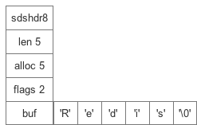
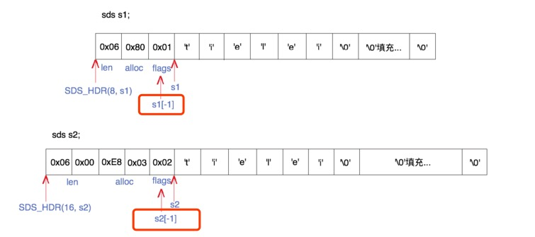
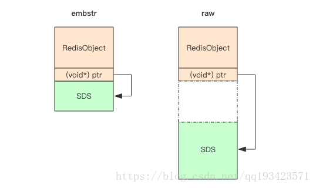
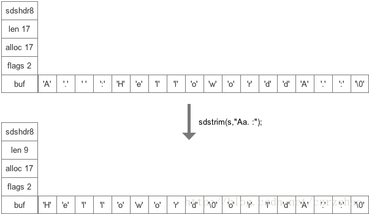

# Redis 基础数据类型 — 简单动态字符串（simple dynamic string）SDS

## 什么是SDS
字符串是Redis中最为常见的数据存储类型，其底层实现是简单动态字符串sds(simple dynamic string)，是可以修改的字符串。

它类似于Java中的ArrayList，它采用预分配冗余空间的方式来减少内存的频繁分配。

## 数据结构

	// 3.0及以前
	struct sdshdr {
	    // 记录buf数组中已使用字节数量
	    unsigned int len;
	    // 记录buf数组中未使用的字节数量
	    unsigned int free;
	    // 字节数组，存储字符串
	    char buf[];
	};
	
	// >=3.2
	struct __attribute__ ((__packed__)) sdshdr5 {
	    unsigned char flags; /* 3 lsb of type, and 5 msb of string length */
	    char buf[];
	};
	struct __attribute__ ((__packed__)) sdshdr8 {
	    uint8_t len; /* used */
	    uint8_t alloc; /* excluding the header and null terminator */
	    unsigned char flags; /* 3 lsb of type, 5 unused bits */
	    char buf[];
	};
	struct __attribute__ ((__packed__)) sdshdr16 {
	    uint16_t len; /* used */
	    uint16_t alloc; /* excluding the header and null terminator */
	    unsigned char flags; /* 3 lsb of type, 5 unused bits */
	    char buf[];
	};
	struct __attribute__ ((__packed__)) sdshdr32 {
	    uint32_t len; /* used */
	    uint32_t alloc; /* excluding the header and null terminator */
	    unsigned char flags; /* 3 lsb of type, 5 unused bits */
	    char buf[];
	};
	struct __attribute__ ((__packed__)) sdshdr64 {
	    uint64_t len; /* used */
	    uint64_t alloc; /* excluding the header and null terminator */
	    unsigned char flags; /* 3 lsb of type, 5 unused bits */
	    char buf[];
	};
	

	//在3.2以后的版本，redis 的SDS分为了5种数据结构，分别应对不同长度的字符串需求，具体的类型选择如下。
	static inline char sdsReqType(size_t string_size) { // 获取类型
	    if (string_size < 1<<5)     // 32
	        return SDS_TYPE_5;
	    if (string_size < 1<<8)     // 256
	        return SDS_TYPE_8;
	    if (string_size < 1<<16)    // 65536 64k
	        return SDS_TYPE_16;
	    if (string_size < 1ll<<32)  // 4294967296 4GB
	        return SDS_TYPE_32;
	    return SDS_TYPE_64;
	}
	

`__attribute__ ((__packed__))`这个声明就是用来告诉编译器取消内存对齐优化，按照实际的占用字节数进行对齐
	
	printf("%ld\n", sizeof(struct sdshdr8));  // 3
	printf("%ld\n", sizeof(struct sdshdr16)); // 5
	printf("%ld\n", sizeof(struct sdshdr32)); // 9
	printf("%ld\n", sizeof(struct sdshdr64)); // 17
	

通过加上`__attribute__ ((__packed__))`声明，sdshdr16节省了1个字节，sdshdr32节省了3个字节，sdshdr64节省了7个字节。 

**但是内存不对齐怎么办呢，不能为了一点内存大大拖慢cpu的寻址效率啊？redis 通过自己在malloc等c语言内存分配函数上封装了一层zmalloc，将内存分配收敛，并解决了内存对齐的问题**。在内存分配前有这么一段代码：

	if (_n&(sizeof(long)-1)) _n += sizeof(long)-(_n&(sizeof(long)-1)); \    // 确保内存对齐！

这段代码写的比较抽象，简而言之就是先判断当前要分配的_n个内存是否是long类型的整数倍，如果不是就在_n的基础上加上内存大小差值，从而达到了内存对齐的保证。

* len记录当前字节数组的长度（不包括\0），使得获取字符串长度的时间复杂度由O(N)变为了O(1)
* alloc记录了当前字节数组总共分配的内存大小（不包括\0）
* flags记录了当前字节数组的属性、用来标识到底是sdshdr8还是sdshdr16等
* buf保存了字符串真正的值以及末尾的一个\0

整个SDS的内存是连续的，统一开辟的。为何要统一开辟呢？因为在大多数操作中，buf内的字符串实体才是操作对象。如果统一开辟内存就能通过buf头指针进行寻址，拿到整个struct的指针，**而且通过buf的头指针减一直接就能获取flags的值，骚操作代码如下**！
	
	// flags值的定义
	#define SDS_TYPE_5  0
	#define SDS_TYPE_8  1
	#define SDS_TYPE_16 2
	#define SDS_TYPE_32 3
	#define SDS_TYPE_64 4
	
	// 通过buf获取头指针
	#define SDS_HDR_VAR(T,s) struct sdshdr##T *sh = (void*)((s)-(sizeof(struct sdshdr##T)));
	#define SDS_HDR(T,s) ((struct sdshdr##T *)((s)-(sizeof(struct sdshdr##T))))

	// 通过buf的-1下标拿到flags值
	unsigned char flags = s[-1];

## SDS的两种存储形式

	> set codehole abcdefghijklmnopqrstuvwxyz012345678912345678
	OK
	> debug object codehole
	Value at:0x7fec2de00370 refcount:1 encoding:embstr serializedlength:45 lru:5958906 lru_seconds_idle:1
	> set codehole abcdefghijklmnopqrstuvwxyz0123456789123456789
	OK
	> debug object codehole
	Value at:0x7fec2dd0b750 refcount:1 encoding:raw serializedlength:46 lru:5958911 lru_seconds_idle:1...
	
	
	
	
一个字符的差别，存储形式 encoding 就发生了变化。一个是 embstr，一个是 row。

在了解存储格式的区别之前，首先了解下**RedisObject**结构体。

所有的 Redis 对象都有一个 Redis 对象头结构体

	struct RedisObject { // 一共占用16字节
	    int4 type; // 4bits  类型
	    int4 encoding; // 4bits 存储格式
	    int24 lru; // 24bits 记录LRU信息
	    int32 refcount; // 4bytes 
	    void *ptr; // 8bytes，64-bit system 
	} robj;

* 不同的对象具有不同的类型 type(4bit)，同一个类型的 type 会有不同的存储形式 encoding(4bit)。

* 为了记录对象的 LRU 信息，使用了 24 个 bit 的 lru 来记录 LRU 信息。

* 每个对象都有个引用计数 refcount，当引用计数为零时，对象就会被销毁，内存被回收。ptr 指针将指向对象内容 (body) 的具体存储位置。
*  一个 RedisObject 对象头共需要占据 16 字节的存储空间。

embstr 存储形式是这样一种存储形式，它将 RedisObject 对象头和 SDS 对象连续存在一起，使用 malloc 方法一次分配。而 raw 存储形式不一样，它需要两次 malloc，两个对象头在内存地址上一般是不连续的。

在字符串比较小时，SDS 对象头的大小是capacity+3——SDS结构体的内存大小至少是 3。意味着分配一个字符串的最小空间占用为 19 字节 (16+3)。

如果总体超出了 64 字节，Redis 认为它是一个大字符串，不再使用 emdstr 形式存储，而该用 raw 形式。而64-19-结尾的\0，所以empstr只能容纳44字节。

再看一下RedisObject的10种存储格式——encoding

	//这两个宏定义申明是在server.h文件中
	#define OBJ_ENCODING_RAW 0     /* Raw representation */
	#define OBJ_ENCODING_INT 1     /* Encoded as integer */
	#define OBJ_ENCODING_HT 2      /* Encoded as hash table */
	#define OBJ_ENCODING_ZIPMAP 3  /* Encoded as zipmap */
	#define OBJ_ENCODING_LINKEDLIST 4 /* No longer used: old list encoding. */
	#define OBJ_ENCODING_ZIPLIST 5 /* Encoded as ziplist */
	#define OBJ_ENCODING_INTSET 6  /* Encoded as intset */
	#define OBJ_ENCODING_SKIPLIST 7  /* Encoded as skiplist */
	#define OBJ_ENCODING_EMBSTR 8  /* Embedded sds string encoding */
	#define OBJ_ENCODING_QUICKLIST 9 /* Encoded as linked list of ziplists */

## 创建SDS

由于sdshdr5的只用来存储长度为32字节以下的字符数组，因此flags的5个bit就能满足长度记录，加上type所需的3bit，刚好为8bit一个字节，因此sdshdr5不需要单独的len记录长度，并且只有32个字节的存储空间，动态的变更内存余地较小，所以 redis 直接不存储alloc，当sdshdr5需要扩展时会直接变更成更大的SDS数据结构。 
除此之外，SDS都会多分配1个字节用来保存'\0'。

	sds sdsnewlen(const void *init, size_t initlen) {   // 创建sds
	    void *sh;
	    sds s;  // 指向字符串头指针
	    char type = sdsReqType(initlen);
	    if (type == SDS_TYPE_5 && initlen == 0) type = SDS_TYPE_8;  // 如果是空字符串直接使用SDS_TYPE_8，方便后续拼接
	    int hdrlen = sdsHdrSize(type);
	    unsigned char *fp; /* flags pointer. */
	
	    sh = s_malloc(hdrlen+initlen+1);    // 分配空间大小为 sdshdr大小+字符串长度+1
	    if (!init)
	        memset(sh, 0, hdrlen+initlen+1);    // 初始化内存空间
	    if (sh == NULL) return NULL;
	    s = (char*)sh+hdrlen;
	    fp = ((unsigned char*)s)-1; // 获取flags指针
	    switch(type) {
	        case SDS_TYPE_5: {
	            *fp = type | (initlen << SDS_TYPE_BITS);    // sdshdr5的前5位保存长度，后3位保存type
	            break;
	        }
	        case SDS_TYPE_8: {
	            SDS_HDR_VAR(8,s);       // 获取sdshdr指针
	            sh->len = initlen;      // 设置len
	            sh->alloc = initlen;    // 设置alloc
	            *fp = type; // 设置type
	            break;
	        }
	        case SDS_TYPE_16: {
	            SDS_HDR_VAR(16,s);
	            sh->len = initlen;
	            sh->alloc = initlen;
	            *fp = type;
	            break;
	        }
	        case SDS_TYPE_32: {
	            SDS_HDR_VAR(32,s);
	            sh->len = initlen;
	            sh->alloc = initlen;
	            *fp = type;
	            break;
	        }
	        case SDS_TYPE_64: {
	            SDS_HDR_VAR(64,s);
	            sh->len = initlen;
	            sh->alloc = initlen;
	            *fp = type;
	            break;
	        }
	    }
	    if (initlen && init)
	        memcpy(s, init, initlen);   // 内存拷贝字字符数组赋值
	    s[initlen] = '\0';  // 字符数组最后一位设为\0
	    return s;
	}

## SDS拼接

	static inline size_t sdslen(const sds s) {
	    unsigned char flags = s[-1];
	    switch(flags&SDS_TYPE_MASK) {
	        case SDS_TYPE_5:
	            return SDS_TYPE_5_LEN(flags);
	        case SDS_TYPE_8:
	            return SDS_HDR(8,s)->len;
	        case SDS_TYPE_16:
	            return SDS_HDR(16,s)->len;
	        case SDS_TYPE_32:
	            return SDS_HDR(32,s)->len;
	        case SDS_TYPE_64:
	            return SDS_HDR(64,s)->len;
	    }
	    return 0;
	}
	

	sds sdscatlen(sds s, const void *t, size_t len) {
	    size_t curlen = sdslen(s);  // 获取当前字符串长度
	
	    s = sdsMakeRoomFor(s,len);  // 重点!
	    if (s == NULL) return NULL;
	    memcpy(s+curlen, t, len);   // 内存拷贝
	    sdssetlen(s, curlen+len);   // 设置sds->len
	    s[curlen+len] = '\0';       // 在buf的末尾追加一个\0
	    return s;
	}
	
	sds sdsMakeRoomFor(sds s, size_t addlen) {  // 确保sds字符串在拼接时有足够的空间
	    void *sh, *newsh;
	    size_t avail = sdsavail(s); // 获取可用长度
	    size_t len, newlen;
	    char type, oldtype = s[-1] & SDS_TYPE_MASK;
	    int hdrlen;
	
	    /* Return ASAP if there is enough space left. */
	    if (avail >= addlen) return s;
	
	    len = sdslen(s);    // 获取字符串长度 O(1)
	    // 用sds（指向结构体尾部，字符串首部）减去结构体长度得到结构体首部指针
    	 // 结构体类型是不确定的，所以是void *sh
	    sh = (char*)s-sdsHdrSize(oldtype);  // 获取当前sds指针
	    newlen = (len+addlen);  // 分配策略 SDS_MAX_PREALLOC=1024*1024=1M
	    if (newlen < SDS_MAX_PREALLOC)
	        newlen *= 2;    // 如果拼接后的字符串小于1M，就分配两倍的内存
	    else
	        newlen += SDS_MAX_PREALLOC; // 如果拼接后的字符串大于1M，就分配多分配1M的内存
	
	    type = sdsReqType(newlen);  // 获取新字符串的sds类型
	
	    // 由于SDS_TYPE_5没有记录剩余空间（用多少分配多少），所以是不合适用来进行追加的
    	// 为了防止下次追加出现这种情况，所以直接分配SDS_TYPE_8类型
	    if (type == SDS_TYPE_5) type = SDS_TYPE_8;  // 如果type为SDS_TYPE_5直接优化成SDS_TYPE_8
	
	    hdrlen = sdsHdrSize(type);
	    if (oldtype==type) {
	        newsh = s_realloc(sh, hdrlen+newlen+1); // 类型没变在原有基础上realloc
	        if (newsh == NULL) return NULL;
	        s = (char*)newsh+hdrlen;
	    } else {
	        /* Since the header size changes, need to move the string forward,
	         * and can't use realloc */
	        newsh = s_malloc(hdrlen+newlen+1);  // 类型发生变化需要重新malloc
	        if (newsh == NULL) return NULL;
	        memcpy((char*)newsh+hdrlen, s, len+1);  // 将老字符串拷贝到新的内存快中
	        s_free(sh); // 释放老的sds内存
	        s = (char*)newsh+hdrlen;
	        s[-1] = type;   // 设置sds->flags
	        sdssetlen(s, len);  // 设置sds->len
	    }
	    sdssetalloc(s, newlen); // 设置sds->alloc
	    return s;
	}

SDS字符串分配策略：

1. 拼接后的字符串长度不超过1M，分配两倍的内存
2. 拼接够的字符串长度超过1M，多分配1M的内存 (字符串最大长度为 512M)

通过这两种策略，在字符串拼接时会预分配一部分内存，下次拼接的时候就可能不再需要进行内存分配了，将原本N次字符串拼接需要N次内存重新分配的次数优化到最多需要N次，是典型的空间换时间的做法。 
当然，如果新的字符串长度超过了原有字符串类型的限定那么还会涉及到一个重新生成sdshdr的过程。

还有一个细节需要注意，由于sdshrd5并不存储alloc值，因此无法获取sdshrd5的可用大小，如果继续采用sdshrd5进行存储，在之后的拼接过程中每次都还是要进行内存重分配。因此在发生拼接行为时，sdshrd5会被直接优化成sdshrd8。

## 惰性空间释放策略

	void sdsclear(sds s) {  //重置sds的buf空间，懒惰释放
	    struct sdshdr *sh = (void*) (s-(sizeof(struct sdshdr)));
	    sh->free += sh->len;    //表头free成员+已使用空间的长度len = 新的free
	    sh->len = 0;            //已使用空间变为0
	    sh->buf[0] = '\0';         //字符串置空
	}

	sds sdstrim(sds s, const char *cset) {  // sds trim操作
	    char *start, *end, *sp, *ep;
	    size_t len;
	
	    sp = start = s;
	    ep = end = s+sdslen(s)-1;
	    while(sp <= end && strchr(cset, *sp)) sp++; // 从头遍历
	    while(ep > sp && strchr(cset, *ep)) ep--;   // 从尾部遍历
	    len = (sp > ep) ? 0 : ((ep-sp)+1);
	    if (s != sp) memmove(s, sp, len);   // 内存拷贝
	    s[len] = '\0';
	    sdssetlen(s,len);   // 重新设置sds->len
	    return s;
	}

将A. :`HelloWroldA.:`进行`sdstrim(s,"Aa. :");`后，如下图所示： 

可以看到内存空间并没有被释放，甚至空闲的空间都没有被置空。由于SDS是通过len值标识字符串长度，因此SDS完全不需要受限于c语言字符串的那一套\0结尾的字符串形式。在后续需要拼接扩展时，这部分空间也能够再次被利用起来，降低了内存重新分配的概率。

当然，SDS也提供了真正的释放空间的方法，以供真正需要释放空闲内存时使用。

## 总结

1. redis 3.2之后，针对不同长度的字符串引入了不同的SDS数据结构，并且强制内存对齐1，将内存对齐交给统一的内存分配函数，从而达到节省内存的目的
2. SDS的字符串长度通过sds->len来控制，不受限于C语言字符串\0，可以存储二进制数据，并且将获取字符串长度的时间复杂度降到了O(1)
3. SDS的头和buf字节数组的内存是连续的，可以通过寻址方式获取SDS的指针以及flags值
4. SDS的拼接扩展有一个内存预分配策略，用空间减少每次拼接的内存重分配可能性
5. SDS的缩短并不会真正释放掉对应空闲空间
6. SDS分配内存都会多分配1个字节用来在buf的末尾追加一个\0，在部分场景下可以和C语言字符串保证同样的行为甚至复用部分string.h的函数

C 字符串|	SDS
------------- | -------------
获取字符串长度的复杂度为O（N)|	获取字符串长度的复杂度为O(1)
API 是不安全的，可能会造成缓冲区溢出	|API 是安全的，不会造成缓冲区溢出
修改字符串长度N次必然需要执行N次内存重分配	|修改字符串长度N次最多执行N次内存重分配
只能保存文本数据	|可以保存二进制数据和文本文数据
可以使用所有<String.h>库中的函数	|可以使用一部分<string.h>库中的函数

## 参考

[redis源码解读(一):基础数据结构之SDS](https://blog.csdn.net/czrzchao/article/details/78990345)

[Redis深入浅出——字符串和SDS](https://blog.csdn.net/qq193423571/article/details/81637075)
