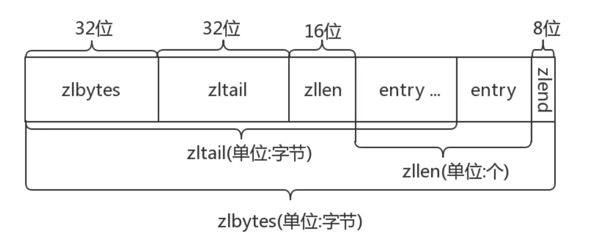
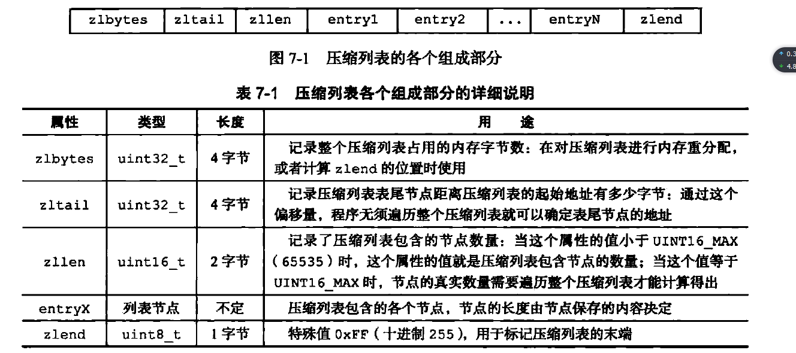
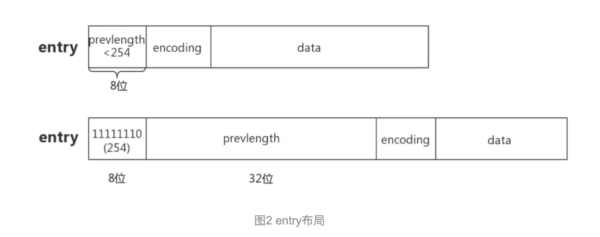
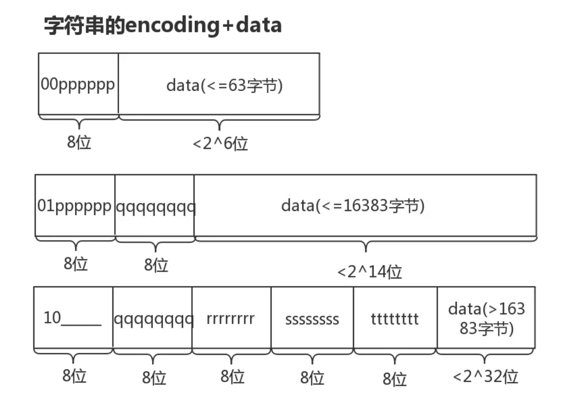
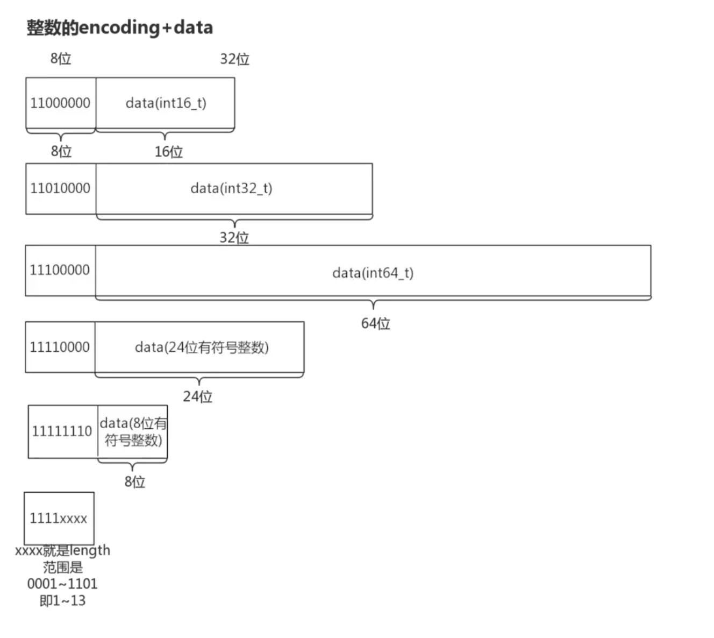
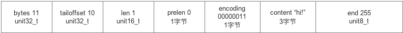

# Redis 源码分析(五) ：ziplist

## 一、前言
`ziplist`是redis节省内存的典型例子之一，这个数据结构通过特殊的编码方式将数据存储在连续的内存中。在3.2之前是list的基础数据结构之一，在3.2之后被`quicklist`替代。但是仍然是`zset`底层实现之一。

## 二、存储结构

**压缩表没有数据结构代码定义**，完全是通过内存的特殊编码方式实现的一种紧凑存储数据结构。我们可以通过`ziplist`的初始化函数和操作`api`来倒推其内存分布。
	
	#define ZIP_END 255
	
	#define ZIPLIST_BYTES(zl)       (*((uint32_t*)(zl)))    // 获取ziplist的bytes指针
	#define ZIPLIST_TAIL_OFFSET(zl) (*((uint32_t*)((zl)+sizeof(uint32_t)))) // 获取ziplist的tail指针
	#define ZIPLIST_LENGTH(zl)      (*((uint16_t*)((zl)+sizeof(uint32_t)*2)))   // 获取ziplist的len指针
	#define ZIPLIST_HEADER_SIZE     (sizeof(uint32_t)*2+sizeof(uint16_t))   // ziplist头大小
	#define ZIPLIST_END_SIZE        (sizeof(uint8_t))   // ziplist结束标志位大小
	#define ZIPLIST_ENTRY_HEAD(zl)  ((zl)+ZIPLIST_HEADER_SIZE)  // 获取第一个元素的指针
	#define ZIPLIST_ENTRY_TAIL(zl)  ((zl)+intrev32ifbe(ZIPLIST_TAIL_OFFSET(zl)))    // 获取最后一个元素的指针
	#define ZIPLIST_ENTRY_END(zl)   ((zl)+intrev32ifbe(ZIPLIST_BYTES(zl))-1)    // 获取结束标志位指针
	
	unsigned char *ziplistNew(void) {   // 创建一个压缩表
	    unsigned int bytes = ZIPLIST_HEADER_SIZE+1; // zip头加结束标识位数
	    unsigned char *zl = zmalloc(bytes);
	    ZIPLIST_BYTES(zl) = intrev32ifbe(bytes);    // 大小端转换
	    ZIPLIST_TAIL_OFFSET(zl) = intrev32ifbe(ZIPLIST_HEADER_SIZE);
	    ZIPLIST_LENGTH(zl) = 0; // len赋值为0
	    zl[bytes-1] = ZIP_END;  // 结束标志位赋值
	    return zl;
	}

通过上面的源码，我们不难看出`ziplist`的头是由两个`unint32_t`和一个`unint16_t`组成。这3个数字分别保存是`ziplist`的内存占用、元素数量和最后一个元素的偏移量。除此之外，`ziplist`还包含一个结束标识，用常量255表示。整个`ziplist`描述内容占用了11个字节。初始化后的内存图如下：

### zlentry的内存布局

`zlentry`每个节点由三部分组成：`prevlength`、`encoding`、`data`

* `prevlengh`: 记录上一个节点的长度，为了方便反向遍历ziplist
* `encoding`: 当前节点的编码规则.
* `data`: 当前节点的值，可以是数字或字符串

* `entry`的前8位小于254，则这8位就表示上一个节点的长度
* `entry`的前8位等于254，则意味着上一个节点的长度无法用8位表示，后面32位才是真实的prevlength。用254 不用255(11111111)作为分界是因为255是zlend的值，它用于判断ziplist是否到达尾部。

### zlentry数据结构

	typedef struct zlentry {    // 压缩列表节点
	    unsigned int prevrawlensize, prevrawlen;    // prevrawlen是前一个节点的长度，prevrawlensize是指prevrawlen的大小，有1字节和5字节两种
	    unsigned int lensize, len;  // len为当前节点长度 lensize为编码len所需的字节大小
	    unsigned int headersize;    // 当前节点的header大小
	    unsigned char encoding; // 节点的编码方式
	    unsigned char *p;   // 指向节点的指针
	} zlentry;
	
	void zipEntry(unsigned char *p, zlentry *e) {   // 根据节点指针返回一个enrty
	    ZIP_DECODE_PREVLEN(p, e->prevrawlensize, e->prevrawlen);    // 获取prevlen的值和长度
	    ZIP_DECODE_LENGTH(p + e->prevrawlensize, e->encoding, e->lensize, e->len);  // 获取当前节点的编码方式、长度等
	    e->headersize = e->prevrawlensize + e->lensize; // 头大小
	    e->p = p;
	}

## 三、编码方式

每个`entry`可以存储一个整数或一个字节数组。为了节省内存，redis 对不同类型，不同大小的数据采用了不同的编码方式，下面是不同数据类型的编码方式：

### zlentry之prevrawlen编码

`zlentry`中`prevrawlen`进行了压缩编码, 如果字段小于254, 则直接用一个字节保存, 如果大于254字节, 则使用5个字节进行保存, 第一个字节固定值254, 后四个字节保存实际字段值. `zipPrevEncodeLength`函数是对改字段编码的函数, 我们可以通过此函数看下编码格式.
	
	
	/*prevrawlen字段进行编码函数*/
	static unsigned int zipPrevEncodeLength(unsigned char *p, unsigned int len) {
	     /*
	     *ZIP_BIGLEN值为254, 返回值表示len所占用的空间大小, 要么1要么5
	     */
	    if (p == NULL) {
	        return (len < ZIP_BIGLEN) ? 1 : sizeof(len)+1;
	    } else {
	          /*len小于254直接用一个字节保存*/
	        if (len < ZIP_BIGLEN) {
	            p[0] = len;
	            return 1;
	        } else {
	               /*大于254,第一个字节赋值为254, 后四个字节保存值*/
	            p[0] = ZIP_BIGLEN;
	            memcpy(p+1,&len,sizeof(len));
	            memrev32ifbe(p+1);
	            return 1+sizeof(len);
	        }
	    }
	}
	

### 字符串编码

`zlentry`中`len`字段配合`encoding`字段进行了编码, 尽量压缩字段长度, 减少内存使用. 如果实体内容被编码成整数, 则长度默认为1, 如果实体内容被编码为字符串, 则会根据不同长度进行不同编码.编码原则是第一个字节前两个bit位标识占用空间长度, 分别有以下几种, 后面紧跟着存储实际值.
	
	/*字符串编码标识使用了最高2bit位 */
	#define ZIP_STR_06B (0 << 6)  //6bit
	#define ZIP_STR_14B (1 << 6)  //14bit
	#define ZIP_STR_32B (2 << 6)  //32bit
	
	/*zlentry中len字段进行编码过程*/
	static unsigned int zipEncodeLength(unsigned char *p, unsigned char encoding, unsigned int rawlen) {
	    unsigned char len = 1, buf[5];
	
	    if (ZIP_IS_STR(encoding)) {
	        /*
	          *6bit可以存储, 占用空间为1个字节, 值存储在字节后6bit中.
	          */
	        if (rawlen <= 0x3f) {
	            if (!p) return len;
	            buf[0] = ZIP_STR_06B | rawlen;
	        } else if (rawlen <= 0x3fff) {
	            len += 1;
	            if (!p) return len;
	               /*14bit可以存储, 置前两个bit位为ZIP_STR_14B标志 */
	            buf[0] = ZIP_STR_14B | ((rawlen >> 8) & 0x3f);
	            buf[1] = rawlen & 0xff;
	        } else {
	            len += 4;
	            if (!p) return len;
	            buf[0] = ZIP_STR_32B;
	            buf[1] = (rawlen >> 24) & 0xff;
	            buf[2] = (rawlen >> 16) & 0xff;
	            buf[3] = (rawlen >> 8) & 0xff;
	            buf[4] = rawlen & 0xff;
	        }
	    } else {
	        /* 内容编码为整型, 长度默认为1*/
	        if (!p) return len;
	        buf[0] = encoding;
	    }
	
	    /* Store this length at p */
	    memcpy(p,buf,len);
	    return len;
	}
由上面代码可以看字符串节点分为3类：

* 当`data`小于63字节时(2^6)，节点存为上图的第一种类型，高2位为00，低6位表示data的长度。
* 当`data`小于16383字节时(2^14)，节点存为上图的第二种类型，高2位为01，后续14位表示data的长度。
* 当`data`小于4294967296字节时(2^32)，节点存为上图的第二种类型，高2位为10，下一字节起连续32位表示data的长度。

### 整数编码
	
	`zlentry`中`encoding`和`p`表示元素编码和内容, 下面分析下具体编码规则, 可以看到这里对内存节省真是到了魔性的地步. `encoding`是保存在`len`字段第一个字节中, 第一个字节最高2bit标识字符串编码, 5和6bit位标识是整数编码, 解码时直接从第一个字节中获取编码信息.
	
	/* 整数编码标识使用了5和6bit位 */
	#define ZIP_INT_16B (0xc0 | 0<<4)  //16bit整数
	#define ZIP_INT_32B (0xc0 | 1<<4)  //32bit整数
	#define ZIP_INT_64B (0xc0 | 2<<4)  //64bit整数
	#define ZIP_INT_24B (0xc0 | 3<<4)  //24bit整数
	#define ZIP_INT_8B 0xfe            //8bit整数
	
	#define ZIP_INT_IMM_MASK 0x0f
	#define ZIP_INT_IMM_MIN 0xf1    /* 11110001 */
	#define ZIP_INT_IMM_MAX 0xfd    /* 11111101 */
	
	static int zipTryEncoding(unsigned char *entry, unsigned int entrylen, long long *v, unsigned char *encoding) {
	    long long value;
	    if (entrylen >= 32 || entrylen == 0) return 0;
	   
	    if (string2ll((char*)entry,entrylen,&value)) {
	        /* 0-12之间的值, 直接在保存在了encoding字段中, 其他根据值大小, 直接设置为相应的编码*/
	        if (value >= 0 && value <= 12) {
	            *encoding = ZIP_INT_IMM_MIN+value;
	        } else if (value >= INT8_MIN && value <= INT8_MAX) {
	            *encoding = ZIP_INT_8B;
	        } else if (value >= INT16_MIN && value <= INT16_MAX) {
	            *encoding = ZIP_INT_16B;
	        } else if (value >= INT24_MIN && value <= INT24_MAX) {
	            *encoding = ZIP_INT_24B;
	        } else if (value >= INT32_MIN && value <= INT32_MAX) {
	            *encoding = ZIP_INT_32B;
	        } else {
	            *encoding = ZIP_INT_64B;
	        }
	        *v = value;
	        return 1;
	    }
	    return 0;
	}

由上面代码可以看出整数节点分为6类：
	

整数节点的`encoding`的长度为8位，其中高2位用来区分整数节点和字符串节点（**高2位为11时是整数节点**），低6位用来区分整数节点的类型。

值得注意的是 最后一种encoding是存储整数0~12的节点的encoding，它没有额外的data部分，encoding的高4位表示这个类型，低4位就是它的data。这种类型的节点的encoding大小介于ZIP_INT_24B与ZIP_INT_8B之间（1~13），但是为了表示整数0，取出低四位xxxx之后会将其-1作为实际的data值（0~12）。

	
### 编码总结

不同于整数节点encoding永远是8位，字符串节点的encoding可以有8位、16位、40位三种长度

相同encoding类型的整数节点 data长度是固定的，但是相同encoding类型的字符串节点，data长度取决于encoding后半部分的值。

## 四、添加元素

有了一个初始化后的ziplist，就可以往里添加数据了，以push函数为例对ziplist的插入过程做一个解析，顺便把ziplist的完整数据结构做一个整理：

	unsigned char *ziplistPush(unsigned char *zl, unsigned char *s, unsigned int slen, int where) { // push
	    unsigned char *p;
	    p = (where == ZIPLIST_HEAD) ? ZIPLIST_ENTRY_HEAD(zl) : ZIPLIST_ENTRY_END(zl);
	    return __ziplistInsert(zl,p,s,slen);
	}

push的方式分为头尾两种，主体还是要看__ziplistInsert函数：
	
	unsigned char *__ziplistInsert(unsigned char *zl, unsigned char *p, unsigned char *s, unsigned int slen) {  // 插入
	    size_t curlen = intrev32ifbe(ZIPLIST_BYTES(zl)), reqlen;
	    unsigned int prevlensize, prevlen = 0;
	    size_t offset;
	    int nextdiff = 0;
	    unsigned char encoding = 0;
	    long long value = 123456789; /* initialized to avoid warning. Using a value
	                                    that is easy to see if for some reason
	                                    we use it uninitialized. */
	    zlentry tail;
	
	    /* Find out prevlen for the entry that is inserted. */
	    if (p[0] != ZIP_END) {  // 如果不是在尾部插入
	        ZIP_DECODE_PREVLEN(p, prevlensize, prevlen);    // 获取prevlen
	    } else {    // 在尾部插入
	        unsigned char *ptail = ZIPLIST_ENTRY_TAIL(zl);  // 获取最后一个entry
	        if (ptail[0] != ZIP_END) {  // 如果ziplist不为空
	            prevlen = zipRawEntryLength(ptail); // prevlen就是最后一个enrty的长度
	        }
	    }
	
	    /* See if the entry can be encoded */
	    if (zipTryEncoding(s,slen,&value,&encoding)) {  // 尝试对value进行整数编码
	        /* 'encoding' is set to the appropriate integer encoding */
	        reqlen = zipIntSize(encoding);  // 数据长度
	    } else {
	        /* 'encoding' is untouched, however zipEncodeLength will use the
	         * string length to figure out how to encode it. */
	        reqlen = slen;  // 字符数组长度
	    }
	    /* We need space for both the length of the previous entry and
	     * the length of the payload. */
	    reqlen += zipPrevEncodeLength(NULL,prevlen);    // 获取pre编码长度
	    reqlen += zipEncodeLength(NULL,encoding,slen);  // 获取编码长度
	
	    /* When the insert position is not equal to the tail, we need to
	     * make sure that the next entry can hold this entry's length in
	     * its prevlen field. */
	    int forcelarge = 0;
	    nextdiff = (p[0] != ZIP_END) ? zipPrevLenByteDiff(p,reqlen) : 0;    // 如果不在尾部插入，需要判断当前prelen大小是否够用
	    if (nextdiff == -4 && reqlen < 4) { // 如果当前节点prelen为5个字节或1个字节已经够用
	        nextdiff = 0;
	        forcelarge = 1;
	    }
	
	    /* Store offset because a realloc may change the address of zl. */
	    offset = p-zl;  // 记录偏移量，因为realloc可能会改变ziplist的地址
	    zl = ziplistResize(zl,curlen+reqlen+nextdiff);  //  重新申请内存
	    p = zl+offset;  // 拿到p指针
	
	    /* Apply memory move when necessary and update tail offset. */
	    if (p[0] != ZIP_END) {  // 不是在尾部插入
	        /* Subtract one because of the ZIP_END bytes */
	        memmove(p+reqlen,p-nextdiff,curlen-offset-1+nextdiff);  // 通过内存拷贝将原有数据后移，因为移动前后内存地址有重叠需要用memmove
	
	        /* Encode this entry's raw length in the next entry. */
	        if (forcelarge)
	            zipPrevEncodeLengthForceLarge(p+reqlen,reqlen); // 当下一个节点的prelen空间已经够用时，不需要压缩，防止连锁更新
	        else
	            zipPrevEncodeLength(p+reqlen,reqlen);   // 将reqlen保存到后一个节点中
	
	        /* Update offset for tail */
	        ZIPLIST_TAIL_OFFSET(zl) =
	            intrev32ifbe(intrev32ifbe(ZIPLIST_TAIL_OFFSET(zl))+reqlen); // 更新tail值
	
	        zipEntry(p+reqlen, &tail);
	        if (p[reqlen+tail.headersize+tail.len] != ZIP_END) {    // 如果下一个节点的prelen扩展了需要加上nextdiff
	            ZIPLIST_TAIL_OFFSET(zl) =
	                intrev32ifbe(intrev32ifbe(ZIPLIST_TAIL_OFFSET(zl))+nextdiff);
	        }
	    } else {    // 如果是在尾部插入直接更新tail_offset
	        /* This element will be the new tail. */
	        ZIPLIST_TAIL_OFFSET(zl) = intrev32ifbe(p-zl);
	    }
	
	    if (nextdiff != 0) {    // 连锁更新
	        offset = p-zl;  // 记录offset预防地址变更
	        zl = __ziplistCascadeUpdate(zl,p+reqlen);
	        p = zl+offset;
	    }
	
	    /* Write the entry */
	    p += zipPrevEncodeLength(p,prevlen);    // 记录prelen
	    p += zipEncodeLength(p,encoding,slen);  // 记录encoding和len
	    if (ZIP_IS_STR(encoding)) { // 保存字符串
	        memcpy(p,s,slen);
	    } else {    // 保存数字
	        zipSaveInteger(p,value,encoding);
	    }
	    ZIPLIST_INCR_LENGTH(zl,1);  // ziplist的len加1
	    return zl;
	}

一个完整的插入流程大致是这样的：

1. 获取p指针的`prelen`
2. 根据`prelen`值计算当前带插入节点的`reqlen`
3. 校验p指针对应的节点的`prelen`是否够`reqlen`使用，不够需要扩展，够不进行压缩
4. 重新申请内存，如果不是在尾部插入需要将对应数据后移
5. 更新`ziplist`的`tailoffset`值
6. 尝试进行连锁更新
7. 保存当前节点，分表保存`prevlen`、`encoding`、对应内容
8. `ziplist`的`len`加1

通过对push的梳理，ziplist的内存分布就很清晰了：

通过连续的内存和上述编码方式，ziplist可以很方便的拿到头尾节点；由于每个节点都保存了前一个节点的长度，因此可以通过尾节点很方便的利用内存偏移进行遍历；相比链表或hash表大大压缩了内存；最主要这个数据结构的大部分场景都是pop或push，因此在查找和中间插入场景下的时间复杂度提升也是可以接受的。

## 五、已知节点的位置，求data的值

根据`entry`布局 可以看出，若要算出`data`的偏移量，得先计算出`prevlength`所占内存大小（1字节和5字节）：

	//根据ptr指向的entry，返回这个entry的prevlensize
	#define ZIP_DECODE_PREVLENSIZE(ptr, prevlensize) do {                          \
	if ((ptr)[0] < ZIP_BIGLEN) {                                               \
	    (prevlensize) = 1;                                                     \
	} else {                                                                   \
	    (prevlensize) = 5;                                                     \
	}                                                                          \
	} while(0);

接着再用`ZIP_DECODE_LENGTH(ptr + prevlensize, encoding, lensize, len)`算出`encoding`所占的字节，返回给`lensize`；`data`所占的字节返回给`len`
	
	//根据ptr指向的entry求出该entry的len（encoding里存的 data所占字节）和lensize（encoding所占的字节）
	#define ZIP_DECODE_LENGTH(ptr, encoding, lensize, len) do {                    \
	    ZIP_ENTRY_ENCODING((ptr), (encoding));                                     \
	    if ((encoding) < ZIP_STR_MASK) {                                           \
	        if ((encoding) == ZIP_STR_06B) {                                       \
	            (lensize) = 1;                                                     \
	            (len) = (ptr)[0] & 0x3f;                                           \
	        } else if ((encoding) == ZIP_STR_14B) {                                \
	            (lensize) = 2;                                                     \
	            (len) = (((ptr)[0] & 0x3f) << 8) | (ptr)[1];                       \
	        } else if (encoding == ZIP_STR_32B) {                                  \
	            (lensize) = 5;                                                     \
	            (len) = ((ptr)[1] << 24) |                                         \
	                    ((ptr)[2] << 16) |                                         \
	                    ((ptr)[3] <<  8) |                                         \
	                    ((ptr)[4]);                                                \
	        } else {                                                               \
	            assert(NULL);                                                      \
	        }                                                                      \
	    } else {                                                                   \
	        (lensize) = 1;                                                         \
	        (len) = zipIntSize(encoding);                                          \
	    }                                                                          \
	} while(0);
	
	//将ptr的encoding解析成1个字节：00000000、01000000、10000000(字符串类型)和11??????(整数类型)
	//如果是整数类型，encoding直接照抄ptr的;如果是字符串类型，encoding被截断成一个字节并清零后6位
	#define ZIP_ENTRY_ENCODING(ptr, encoding) do {  \
	    (encoding) = (ptr[0]); \
	    if ((encoding) < ZIP_STR_MASK) (encoding) &= ZIP_STR_MASK; \
	} while(0)
	
	//根据encoding返回数据(整数)所占字节数
	unsigned int zipIntSize(unsigned char encoding) {
	    switch(encoding) {
	    case ZIP_INT_8B:  return 1;
	    case ZIP_INT_16B: return 2;
	    case ZIP_INT_24B: return 3;
	    case ZIP_INT_32B: return 4;
	    case ZIP_INT_64B: return 8;
	    default: return 0; /* 4 bit immediate */
	    }
	    assert(NULL);
	    return 0;
	}

## 六、查找元素
查找元素直接从指定位置开始,一个一个查找, 直到找到或者到达尾部.
	
	/* 从位置p开始查找元素, skip表示每查找一次跳过的元素个数*/
	unsigned char *ziplistFind(unsigned char *p, unsigned char *vstr, unsigned int vlen, unsigned int skip) {
	    int skipcnt = 0;
	    unsigned char vencoding = 0;
	    long long vll = 0;
	
	    while (p[0] != ZIP_END) {
	        unsigned int prevlensize, encoding, lensize, len;
	        unsigned char *q;
	        
	          /*取出元素中元素内容放入q中*/
	        ZIP_DECODE_PREVLENSIZE(p, prevlensize);
	        ZIP_DECODE_LENGTH(p + prevlensize, encoding, lensize, len);
	        q = p + prevlensize + lensize;
	
	        if (skipcnt == 0) {
	            /* 如果元素是字符串编码, */
	            if (ZIP_IS_STR(encoding)) {
	                if (len == vlen && memcmp(q, vstr, vlen) == 0) {
	                    return p;
	                }
	            } else {
	                /*元素是整数编码, 按照整型进行比较*/
	                if (vencoding == 0) {
	                    if (!zipTryEncoding(vstr, vlen, &vll, &vencoding)) {
	                        /* 如果无法进行整数编码, 则直接赋值为UCHAR_MAX以后不会在进行整数类型比较*/
	                        vencoding = UCHAR_MAX;
	                    }
	                    assert(vencoding);
	                }
	
	                /*如果待查元素是整型编码, 直接进行比较*/
	                if (vencoding != UCHAR_MAX) {
	                    long long ll = zipLoadInteger(q, encoding);
	                    if (ll == vll) {
	                        return p;
	                    }
	                }
	            }
	
	            /* 重置跳过元素值 */
	            skipcnt = skip;
	        } else {
	            /* Skip entry */
	            skipcnt--;
	        }
	
	        /* 移动到下个元素位置 */
	        p = q + len;
	    }
	
	    return NULL;
	}

## 七、删除元素
删除元素主要通过ziplistDelete和ziplistDeleteRange来进行

	
	/* 删除一个元素*/
	unsigned char *ziplistDelete(unsigned char *zl, unsigned char **p) {
	    size_t offset = *p-zl;
	    zl = __ziplistDelete(zl,*p,1);
	    *p = zl+offset;
	    return zl;
	}
	
	/* 删除一段数据 */
	unsigned char *ziplistDeleteRange(unsigned char *zl, unsigned int index, unsigned int num) {
	     /*根据索引查找出元素位置，下面介绍该函数*/
	    unsigned char *p = ziplistIndex(zl,index);
	    return (p == NULL) ? zl : __ziplistDelete(zl,p,num);
	}
	
	unsigned char *ziplistIndex(unsigned char *zl, int index) {
	    unsigned char *p;
	    unsigned int prevlensize, prevlen = 0;
	     /*传入索引与零比较，比零大则从头部开始查找，比零小则从尾部开始查找*/
	    if (index < 0) {
	        index = (-index)-1;
	        p = ZIPLIST_ENTRY_TAIL(zl);
	        if (p[0] != ZIP_END) {
	               /*不断取出prevlen值，从后向前开始查找*/
	            ZIP_DECODE_PREVLEN(p, prevlensize, prevlen);
	            while (prevlen > 0 && index--) {
	                p -= prevlen;
	                ZIP_DECODE_PREVLEN(p, prevlensize, prevlen);
	            }
	        }
	    } else {
	        p = ZIPLIST_ENTRY_HEAD(zl);
	        while (p[0] != ZIP_END && index--) {
	            p += zipRawEntryLength(p);
	        }
	    }
	    return (p[0] == ZIP_END || index > 0) ? NULL : p;
	}
	
	/* 真正执行删除操作函数*/
	static unsigned char *__ziplistDelete(unsigned char *zl, unsigned char *p, unsigned int num) {
	    unsigned int i, totlen, deleted = 0;
	    size_t offset;
	    int nextdiff = 0;
	    zlentry first, tail;
	
	    first = zipEntry(p);
	    for (i = 0; p[0] != ZIP_END && i < num; i++) {
	        p += zipRawEntryLength(p);
	        deleted++;
	    }
	
	    totlen = p-first.p;
	    if (totlen > 0) {
	        if (p[0] != ZIP_END) {
	            /* 如果删除元素没有到尾部，则需要重新计算删除元素后面元素中prevlen字段占用空间，类似插入时进行的操作 */
	            nextdiff = zipPrevLenByteDiff(p,first.prevrawlen);
	            p -= nextdiff;
	            zipPrevEncodeLength(p,first.prevrawlen);
	
	            /* 重置尾部偏移量 */
	            ZIPLIST_TAIL_OFFSET(zl) =
	                intrev32ifbe(intrev32ifbe(ZIPLIST_TAIL_OFFSET(zl))-totlen);
	
	            /* 如果删除元素没有到尾部，尾部偏移量需要加上nextdiff偏移量 */
	            tail = zipEntry(p);
	            if (p[tail.headersize+tail.len] != ZIP_END) {
	                ZIPLIST_TAIL_OFFSET(zl) =
	                   intrev32ifbe(intrev32ifbe(ZIPLIST_TAIL_OFFSET(zl))+nextdiff);
	            }
	
	            /* 移动元素至删除元素位置*/
	            memmove(first.p,p,
	                intrev32ifbe(ZIPLIST_BYTES(zl))-(p-zl)-1);
	        } else {
	            /* 如果删除的元素到达尾部，则不需要移动*/
	            ZIPLIST_TAIL_OFFSET(zl) =
	                intrev32ifbe((first.p-zl)-first.prevrawlen);
	        }
	
	        /* 重置ziplist空间 */
	        offset = first.p-zl;
	        zl = ziplistResize(zl, intrev32ifbe(ZIPLIST_BYTES(zl))-totlen+nextdiff);
	        ZIPLIST_INCR_LENGTH(zl,-deleted);
	        p = zl+offset;
	
	        /* 同样和插入时一样，需要遍历检测删除元素后面的元素prevlen空间是否足够，不足时进行扩展*/
	        if (nextdiff != 0)
	            zl = __ziplistCascadeUpdate(zl,p);
	    }
	    return zl;
	}

## 八、连锁更新

由于每个节点都保存着前一个节点的长度，并且redis出于节省内存的考量，针对254这个分界点上下将`prelen`的长度分别设为1和5字节。因此当我们插入一个节点时，后一个节点的`prelen`可能就需要进行扩展；那么如果后一个节点原本的长度为253呢？由于`prelen`的扩展，导致再后一个节点也需要进行扩展。在最极端情况下会将整个`ziplist`都进行更新。

在push的代码中可以看到如果当前节点的prelen字段进行了扩展，会调用__ziplistCascadeUpdate进行连锁更新：
	
	unsigned char *__ziplistCascadeUpdate(unsigned char *zl, unsigned char *p) {    // 连锁更新
	    size_t curlen = intrev32ifbe(ZIPLIST_BYTES(zl)), rawlen, rawlensize;
	    size_t offset, noffset, extra;
	    unsigned char *np;
	    zlentry cur, next;
	
	    while (p[0] != ZIP_END) {   // 遍历所有节点
	        zipEntry(p, &cur);  // 获取当前节点
	        rawlen = cur.headersize + cur.len;  // 当前节点长度
	        rawlensize = zipPrevEncodeLength(NULL,rawlen);  // 当前节点所需要的prelen大小
	
	        /* Abort if there is no next entry. */
	        if (p[rawlen] == ZIP_END) break;    // 没有下一个节点
	        zipEntry(p+rawlen, &next);  // 获取上一个节点
	
	        /* Abort when "prevlen" has not changed. */
	        if (next.prevrawlen == rawlen) break;   // prelen没变直接break
	
	        if (next.prevrawlensize < rawlensize) { // 只有当需要扩展的时候才会触发连锁更新
	            /* The "prevlen" field of "next" needs more bytes to hold
	             * the raw length of "cur". */
	            offset = p-zl;  // 记录偏移量，预防内存地址变更
	            extra = rawlensize-next.prevrawlensize;
	            zl = ziplistResize(zl,curlen+extra);    // 重新申请内存
	            p = zl+offset;
	
	            /* Current pointer and offset for next element. */
	            np = p+rawlen;
	            noffset = np-zl;
	
	            /* Update tail offset when next element is not the tail element. */
	            if ((zl+intrev32ifbe(ZIPLIST_TAIL_OFFSET(zl))) != np) { // 更新tailoffset
	                ZIPLIST_TAIL_OFFSET(zl) =
	                    intrev32ifbe(intrev32ifbe(ZIPLIST_TAIL_OFFSET(zl))+extra);
	            }
	
	            /* Move the tail to the back. */
	            memmove(np+rawlensize,
	                np+next.prevrawlensize,
	                curlen-noffset-next.prevrawlensize-1);  // 内存拷贝
	            zipPrevEncodeLength(np,rawlen); // 记录新的prelen
	
	            /* Advance the cursor */
	            p += rawlen;    // 检查下一个节点
	            curlen += extra;    // 更新curlen
	        } else {    // 小于之前的size或者相等都并不会引起连锁更新
	            if (next.prevrawlensize > rawlensize) {
	                zipPrevEncodeLengthForceLarge(p+rawlen,rawlen); // 当原有的prelensize大于当前所需时，不进行收缩直接赋值减少后续连锁更新的可能性
	            } else {
	                zipPrevEncodeLength(p+rawlen,rawlen);
	            }
	
	            /* Stop here, as the raw length of "next" has not changed. */
	            break;  // 直接结束连锁更新
	        }
	    }
	    return zl;
	}

可以看到ziplist的连锁更新是一个一个节点进行校验，直到遍历完整个ziplist或遇到不需要更新的节点为止。

尽管连锁更新的复杂度较高，但它真正造成性能问题的几率是很低的。 

1. 首先，压缩列表里要恰好有多个连续的、长度介于250 字节至253 宇节之间的节点，连锁更新才有可能被引发，在实际中，这种情况并不多见。
2. 其次，即使出现连锁更新，但只要被更新的节点数量不多，就不会对性能造成任何影响：比如说，对三五个节点进行连锁更新是绝对不会影响性能的。

因为以上原因，`ziplistPush`等命令的平均复杂度仅为0（在实际中，我们可以放心地使用这些函数，而不必担心连锁更新会影响压缩列表的性能。

## 九、总结

1. `ziplist`是 redis 为了节省内存，提升存储效率自定义的一种紧凑的数据结构
2. `ziplist`保存着尾节点的偏移量，可以方便的拿到头尾节点
3. 每一个`entry`都保存着前一个`entry`的长度，可以很方便的从尾遍历
4. 每个`entry`中都可以保存一个字节数组或整数，不同类型和大小的数据有不同的编码方式
5. 添加和删除节点可能会引发连锁更新，极端情况下会更新整个`ziplist`，但是概率很小

## 参考文章

[Redis源码分析-压缩列表ziplist](https://www.jianshu.com/p/afaf78aaf615)

[redis源码解读(五):基础数据结构之ziplist](http://czrzchao.com/redisSourceZiplist)

[Redis之ziplist数据结构](https://www.cnblogs.com/ourroad/p/4896387.html)

[Redis之ziplist数据结构](https://blog.csdn.net/qiangzhenyi1207/article/details/80353104)