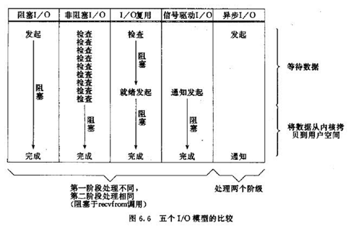

# 同步IO和异步IO

## 什么是IO？

> IO (Input/Output，输入/输出)即数据的读取（接收）或写入（发送）操作，通常用户进程中的一个完整IO分为两阶段：用户进程空间<-->内核空间、内核空间<-->设备空间（磁盘、网络等）。IO有内存IO、网络IO和磁盘IO三种，通常我们说的IO指的是后两者。

## 同步IO和异步IO区别

> 同步IO：导致请求进程阻塞，直到I/O操作完成。
> 
> 异步IO：不导致请求进程阻塞。
> 
>  同步IO：用户进程发出IO调用，去获取IO设备数据，双方的数据要经过内核缓冲区同步，完全准备好后，再复制返回到用户进程。而复制返回到用户进程会导致请求进程阻塞，直到I/O操作完成。
> 
> 异步IO：用户进程发出IO调用，去获取IO设备数据，并不需要同步，内核直接复制到进程，整个过程不导致请求进程阻塞。

## IO的5种模型

**5种模型可以分为同步IO和异步IO两大类，1~4为同步IO模型，5位异步IO模型
**

1. 阻塞IO模型 , 进程发起IO系统调用后，进程被阻塞，转到内核空间处理，整个IO处理完毕后返回进程。操作成功则进程获取到数据。资源不可用时，IO请求一直阻塞，直到反馈结果（有数据或超时）。
> 典型应用：阻塞socket、Java BIO；
> 
> 特点：
> 
> 1. 进程阻塞挂起不消耗CPU资源，及时响应每个操作；
> 
> 2. 实现难度低、开发应用较容易；
> 
> 3. 适用并发量小的网络应用开发；
> 
> 4. 不适用并发量大的应用：因为一个请求IO会阻塞进程所有操作。

2. 非阻塞IO模型，进程发起IO系统调用后，如果内核缓冲区没有数据，需要到IO设备中读取，进程返回一个错误而不会被阻塞；进程发起IO系统调用后，如果内核缓冲区有数据，内核就会把数据返回进程。
>  对于上面的阻塞IO模型来说，内核数据没准备好需要进程阻塞的时候，就返回一个错误，以使得进程不被阻塞。
> 
> 典型应用：socket是非阻塞的方式（设置为NONBLOCK）
> 
> 特点：
> 
> 1. 进程轮询（重复）调用，消耗CPU的资源；
> 
> 2. 实现难度低、开发应用相对阻塞IO模式较难；
> 
> 3. 适用并发量较小、且不需要及时响应的网络应用开发；

3. IO复用模型，多个的进程的IO可以注册到一个复用器（select）上，然后用一个进程调用该select， select会监听所有注册进来的IO；如果select没有监听的IO在内核缓冲区都没有可读数据，select调用进程会被阻塞；而当任一IO在内核缓冲区中有可数据时，select调用就会返回；而后select调用进程可以自己或通知另外的进程（注册进程）来再次发起读取IO，读取内核中准备好的数据。
> 典型应用：select、poll、epoll三种方案，nginx都可以选择使用这三个方案
> 特点：
> 
> 1. 专一进程解决多个进程IO的阻塞问题，性能好；Reactor模式;
> 
> 2. 实现、开发应用难度较大；
> 
> 3. 适用高并发服务应用开发：一个进程（线程）响应多个请求；
> 
> Linux中IO复用的实现方式主要有select、poll和epoll：
> 
> Select：注册IO、阻塞扫描，监听的IO最大连接数不能多于FD_SIZE；
> 
> Poll：原理和Select相似，没有数量限制，但IO数量大扫描线性性能下降；
> 
> Epoll ：事件驱动不阻塞，mmap实现内核与用户空间的消息传递，数量很大，Linux2.6后内核支持；（Windows有IOCP、FreeBSD下有Kqueue）
> 

4. 信号驱动的IO模型，当进程发起一个IO操作，会向内核注册一个信号处理函数，然后进程返回不阻塞；当内核数据就绪时会发送一个信号给进程，进程便在信号处理函数中调用IO读取数据。
> 特点：回调机制，实现、开发应用难度大；

5. 异步IO模型，当进程发起一个IO操作，进程返回（不阻塞），但也不能返回果结；内核把整个IO处理完后，会通知进程结果。如果IO操作成功则进程直接获取到数据。
> 典型应用：JAVA7 AIO、高性能服务器应用
> 
> 不阻塞，数据一步到位；Proactor模式；
> 
> 需要操作系统的底层支持，LINUX 2.5 版本内核首现，2.6 版本产品的内核标准特性；
> 
> 实现、开发应用难度大；
> 
> 非常适合高性能高并发应用；

## IO比较

## 参考资料

[5种IO模型、阻塞IO和非阻塞IO、同步IO和异步IO
](https://blog.csdn.net/tjiyu/article/details/52959418)

