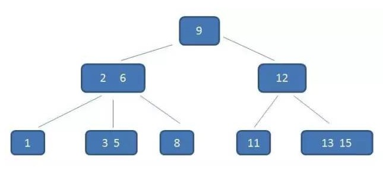
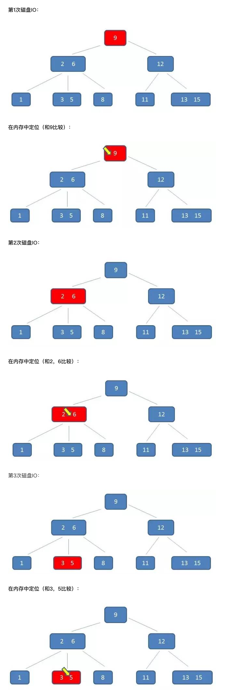
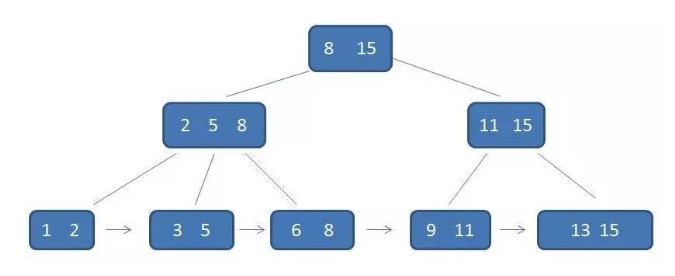
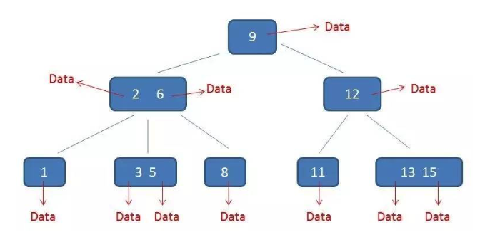
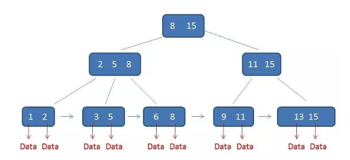

# B-Tree、B+Tree、B*Tree

## 一、B-Tree

### 1.1 什么是B-Tree

 1970年，R.Bayer和E.mccreight提出了一种适用于外查找的树，它是一种平衡的多叉树，称为B树，其定义如下

* 根结点至少有两个子女。

* 每个中间节点都包含k-1个元素和k个孩子，其中 m/2 <= k <= m

* 每一个叶子节点都包含k-1个元素，其中 m/2 <= k <= m

* 所有的叶子结点都位于同一层。

* 每个节点中的元素从小到大排列，节点当中k-1个元素正好是k个孩子包含的元素的值域分划。

**M = 3**

### 1.2 B-Tree 查找

假设我们要查找的数据是 5

## 二、B+Tree

### 2.1 什么是B+Tree

B+ 树是一种树数据结构，是一个n叉树，每个节点通常有多个孩子，一棵B+树包含根节点、内部节点和叶子节点。根节点可能是一个叶子节点，也可能是一个包含两个或两个以上孩子节点的节点。

一个m阶的B+树具有如下几个特征：

* 有k个子树的中间节点包含有k个元素（B树中是k-1个元素），每个元素不保存数据，只用来索引，所有数据都保存在叶子节点。

* 所有的叶子结点中包含了全部元素的信息，及指向含这些元素记录的指针，且叶子结点本身依关键字的大小自小而大顺序链接。

* 所有的中间节点元素都同时存在于子节点，在子节点元素中是最大（或最小）元素。

### 2.2 B+Tree特点

B+的特性：

* 所有关键字都出现在叶子结点的链表中（稠密索引），且链表中的关键字是有序的；

* 不可能在非叶子结点命中；

* **非叶子结点相当于是叶子结点的索引（稀疏索引），叶子结点相当于是存储（关键字）数据的数据层**；

* 更适合文件索引系统；

B-树中的卫星数据（Satellite Information）：

B+树中的卫星数据（Satellite Information）：

数据量相同的情况下，B+树的结构比B-树更加“矮胖”，因此查询时候IO次数也更少。

### 2.3 B+Tree的优势

* 单一节点存储更多的元素，使得查询的IO次数更少，由于B+树在内部节点上不包含数据信息，因此在内存页中能够存放更多的key。 数据存放的更加紧密，具有更好的空间局部性。因此访问叶子节点上关联的数据也具有更好的缓存命中率。

* 所有查询都要查找到叶子节点，查询性能稳定。

* 所有叶子节点形成有序链表，便于范围查询。B+树的叶子结点都是相链的，因此对整棵树的便利只需要一次线性遍历叶子结点即可。而且由于数据顺序排列并且相连，所以便于区间查找和搜索。而B树则需要进行每一层的递归遍历。相邻的元素可能在内存中不相邻，所以缓存命中性没有B+树好。

## 三、B*Tree

### 3.1 什么是B*Tree

B*Tree是B+Tree的变体，在B+Tree的非根和非叶子结点再增加指向兄弟的指针；

B*Tree定义了非叶子结点关键字个数至少为`(2/3) * M`，即块的最低使用率为2/3

### 3.2 B+Tree和B*Tree区别

* B+树的分裂：当一个结点满时，分配一个新的结点，并将原结点中1/2的数据复制到新结点，最后在父结点中增加新结点的指针；B+树的分裂只影响原结点和父结点，而不会影响兄弟结点，所以它不需要指向兄弟的指针；
* B*树的分裂：当一个结点满时，如果它的下一个兄弟结点未满，那么将一部分数据移到兄弟结点中，再在原结点插入关键字，最后修改父结点中兄弟结点的关键字（因为兄弟结点的关键字范围改变了）；如果兄弟也满了，则在原结点与兄弟结点之间增加新结点，并各复制1/3的数据到新结点，最后在父结点增加新结点的指针；

所以，B*树分配新结点的概率比B+树要低，空间使用率更高；

## 四、小结

   * B-树：多路搜索树，每个结点存储M/2到M个关键字，非叶子结点存储指向关键字范围的子结点，所有关键字在整颗树中出现，且只出现一次，非叶子结点可以命中；
   * B+树：在B-树基础上，为叶子结点增加链表指针，所有关键字都在叶子结点中出现，非叶子结点作为叶子结点的索引；B+树总是到叶子结点才命中；
   * B*树：在B+树基础上，为非叶子结点也增加链表指针，将结点的最低利用率从1/2提高到2/3；

## 参考资料

https://www.sohu.com/a/156886901_479559

https://www.cnblogs.com/vincently/p/4526560.html

https://blog.csdn.net/andyzhaojianhui/article/details/76988560