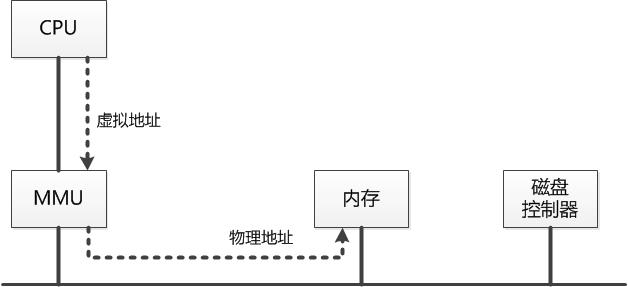
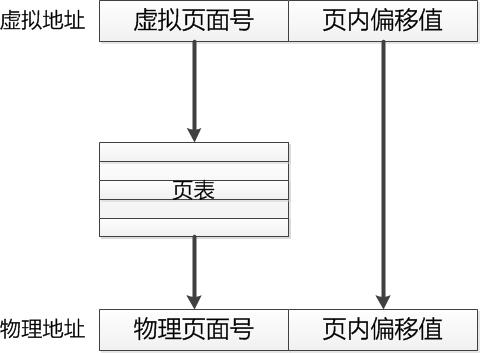
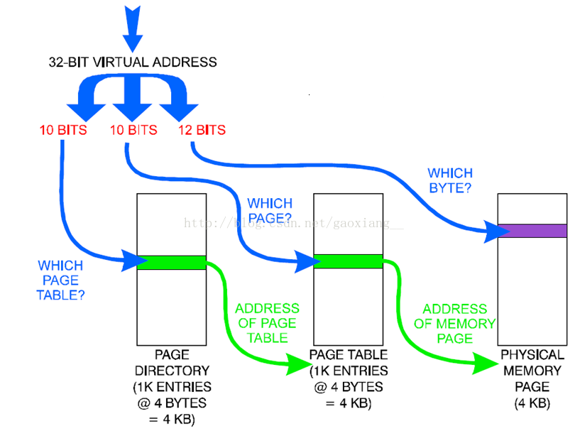
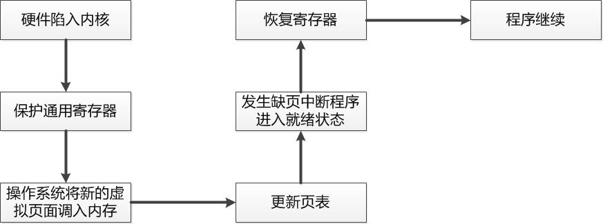
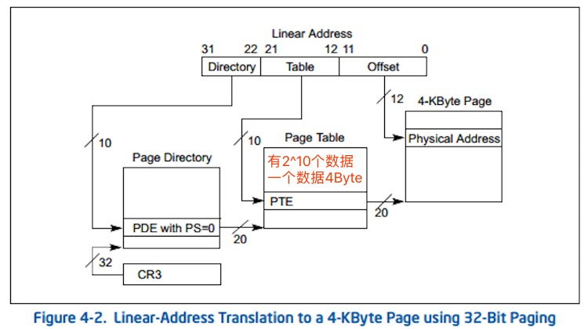
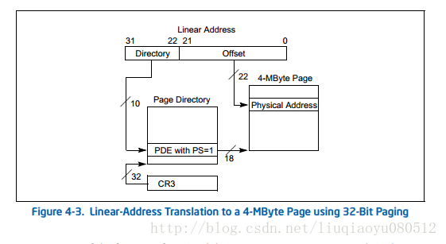
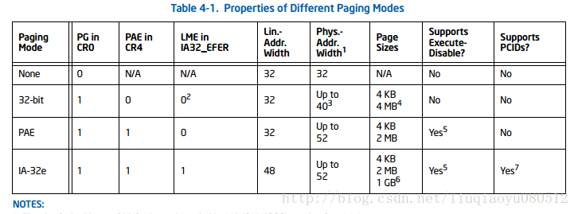
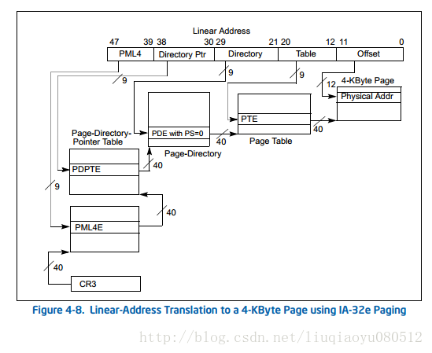

# 内存管理、寻址方式那些事

## 一、内存

### 1.1 什么是内存
　　简单地说，内存就是一个数据货架。内存有一个最小的存储单位，大多数都是一个字节。内存用内存地址（memory address）来为每个字节的数据顺序编号。因此，内存地址说明了数据在内存中的位置。内存地址从0开始，每次增加1。这种线性增加的存储器地址称为线性地址（linear address）。

　　内存地址的编号有上限。地址空间的范围和地址总线（address bus）的位数直接相关。CPU通过地址总线来向内存说明想要存取数据的地址。以英特尔32位的80386型CPU为例，这款CPU有32个针脚可以传输地址信息。每个针脚对应了一位。如果针脚上是高电压，那么这一位是1。如果是低电压，那么这一位是0。32位的电压高低信息通过地址总线传到内存的32个针脚，内存就能把电压高低信息转换成32位的二进制数，从而知道CPU想要的是哪个位置的数据。用十六进制表示，32位地址空间就是从0x00000000 到0xFFFFFFFF，**所以32位操作系统单个进程最大的内存使用空间一般不大于4G**。

### 1.2 什么虚拟内存地址

　　内存的一项主要任务，就是存储进程的相关数据。我们之前已经看到过进程空间的程序段、全局数据、栈和堆，以及这些这些存储结构在进程运行中所起到的关键作用。有趣的是，尽管进程和内存的关系如此紧密，但进程并不能直接访问内存。在Linux下，进程不能直接读写内存中地址为0x1位置的数据。进程中能访问的地址，只能是**虚拟内存地址（virtual memory address）**。操作系统会把虚拟内存地址翻译成真实的内存地址。这种内存管理方式，称为虚拟内存（virtual memory）。

## 二、内存分页

### 2.1 为什么要使用内存分页

> 既然386的CPU的地址总线是32位的，就可以寻址2^32一共4G的内存了，内存分页也只能寻址4G的空间，不能多于4G，为什么还要使用这个机制？

> 假设内存是连续分配的（也就是程序在物理内存上是连续的）

> 1. 进程A进来，向os申请了200的内存空间，于是os把`0~199`分配给A
> 2. 进程B进来，向os申请了5的内存空间，os把`200~204`分配给它
> 3. 进程C进来，向os申请了100的内存空间，os把`205~304`分配给它
> 4. 这个时候进程B运行完了，把`200~204`还给os
> 
> 但是很长时间以后，只要系统中的出现的进程的大小>5的话，`200~204`这段空间都不会被分配出去（只要A和C不退出）。过了一段更长的时间，内存中就会出现许许多多`200~204`这样不能被利用的碎片
> 
> 而分页机制让程序可以在逻辑上连续、物理上离散。也就是说在一段连续的物理内存上，可能`0~4`（这个值取决于页面的大小）属于A，而`5~9`属于B，`10~14`属于C，从而保证任何一个“内存片段”都可以被分配出去。

　　为了解决交换系统存在的缺陷，分页系统横空出世。分页系统的核心在于：将虚拟内存空间和物理内存空间皆划分为大小相同的页面，如4KB、8KB或16KB等，并以页面作为内存空间的最小分配单位，一个程序的一个页面可以存放在任意一个物理页面里。

　　（1）解决空间浪费碎片化问题

　　由于将虚拟内存空间和物理内存空间按照某种规定的大小进行分配，这里我们称之为页（Page），然后按照页进行内存分配，也就克服了外部碎片的问题。

　　（2）解决程序大小受限问题

　　程序增长有限是因为一个程序需要全部加载到内存才能运行，因此解决的办法就是使得一个程序无须全部加载就可以运行。使用分页也可以解决这个问题，只需将当前需要的页面放在内存里，其他暂时不用的页面放在磁盘上，这样一个程序同时占用内存和磁盘，其增长空间就大大增加了。而且，分页之后，如果一个程序需要更多的空间，给其分配一个新页即可（而无需将程序倒出倒进从而提高空间增长效率）。

### 2.2 CPU 读取内存数据的过程

　　这个过程由内存管理单元（MMU）完成，MMU接收CPU发出的虚拟地址，将其翻译为物理地址后发送给内存。内存管理单元按照该物理地址进行相应访问后读出或写入相关数据，如下图所示：

### 2.3 MMU如何把虚拟地址翻译成物理地址的

　　答案是查页表，对于每个程序，内存管理单元MMU都为其保存一个页表，该页表中存放的是虚拟页面到物理页面的映射。每当为一个虚拟页面寻找到一个物理页面之后，就在页表里增加一条记录来保留该映射关系。当然，随着虚拟页面进出物理内存，页表的内容也会不断更新变化。

　　页表的根本功能是提供从虚拟页面到物理页面的映射。因此，页表的记录条数与虚拟页面数相同。此外，内存管理单元依赖于页表来进行一切与页面有关的管理活动，这些活动包括判断某一页面号是否在内存里，页面是否受到保护，页面是否非法空间等等。

### 2.4 为什么要多级页表

　　在32的系统中，系统分配给每个进程的虚拟地址为4G，对于每个虚拟地址页建立一个记录，这样也需要4G/4k个，假设每条记录大小为4B，这样对于每个进程需要4M的页表，对于一个helloworld程序而言，不足4K的程序需要4M的页表，未免有些浪费。

　　这种单一的连续分页表，需要给每一个虚拟页预留一条记录的位置。但对于任何一个应用进程，其进程空间真正用到的地址都相当有限。我们还记得，进程空间会有栈和堆。进程空间为栈和堆的增长预留了地址，但栈和堆很少会占满进程空间。这意味着，如果使用连续分页表，很多条目都没有真正用到。因此，Linux中的分页表，采用了多层的数据结构。多层的分页表能够减少所需的空间。

　　多层分页表还有另一个优势。单层分页表必须存在于连续的内存空间。而多层分页表的二级表，可以散步于内存的不同位置。这样的话，操作系统就可以利用零碎空间来存储分页表。还需要注意的是，这里简化了多层分页表的很多细节。最新Linux系统中的分页表多达3层，管理的内存地址也比本章介绍的长很多。不过，多层分页表的基本原理都是相同。

　　使用多级页表机制，对于第一级的页表如图所示只需4K的空间，用于索引二级页表的地址。还是以helloworld代码为例，可能只需要一个物理页，因此只需要一条记录，故对于第二级的页表也只需要一个页表，对于一级页表中的其他记录可以对应为空。这样只需要8k的空间就可以完成页面的映射。大大节省了页表所占的空间。

### 2.5 分页系统的优缺点
　　优点：

　　（1）分页系统不会产生外部碎片，一个进程占用的内存空间可以不是连续的，并且一个进程的虚拟页面在不需要的时候可以放在磁盘中。

　　（2）分页系统可以共享小的地址，即页面共享。只需要在对应给定页面的页表项里做一个相关的记录即可。

　　缺点：页表很大，占用了大量的内存空间。

### 2.6 缺页中断处理

　　在分页系统中，一个虚拟页面既有可能在物理内存，也有可能保存在磁盘上。如果CPU发出的虚拟地址对应的页面不在物理内存，就将产生一个缺页中断，而缺页中断服务程序负责将需要的虚拟页面找到并加载到内存。缺页中断的处理步骤如下，省略了中间很多的步骤，只保留最核心的几个步骤：

### 2.7 页面置换算法

　　常用的算法有：页面置换的目标、随机更换算法、先进先出算法、第二次机会算法、时钟算法、最优更换算法、NRU（最近未被使用）算法、 LRU（最近最少使用）算法、工作集算法、工作集时钟算法

## 三、内存分页寻址模式
 
### 3.1 四种寻址方式
 
1. 不分页模式(没有魔法，只支持4GB)

2. 32位分页模式(有魔法，能超过4GB)

3. PAE分页模式(32位地址+64位的页表项，这个应该属于过渡阶段)

4. IA-32e分页模式(也就是目前的”64位模式”)

后三种模式都必须启动分页管理，关闭分页就会回到第一种模式。

### 3.2 开启分页管理的好处

1. 交换内存(虚拟内存)，x86 默认是 4KB 分页，操作系统可以将一些长久没有使用的内存页交换到外存上(一页只有4KB，写盘是非常快的)，然后这些页就可以分配到别的地方使用，这样可以使得”内存容量”大增，而调度得好的话在性能上影响不大。
2. 延迟装载，现在一个游戏安装程序动辄上G，如果一次性装载完再执行，那等个几分钟才出安装界面也是正常的，实际上各种操作系统都用CPU的分页机制实现了延迟装载：装载程序时会在进程中建立内存页到可执行文件的映射，并将相应的页表项初始化为不可用状态，等执行到这个页的指令或访问这个页的数据时CPU就会触发缺页异常，操作系统到这个时候才根据映射把相应的指令或数据读到某页内存中并修改原来不可用的页表项指向它，然后重新执行导致异常的那条指令。所以即使是上G的程序也是瞬间装载的。
3. 共享内存，我们可以复制页表来实现进程间内存的共享。比如fork子进程就很快，因为只是复制了页表，所以子进程一开始是直接使用父进程内存的。再比如动态链接库，它们的指令所占内存页是在各个进程中共享的，所以公共动态链接库的繁荣可以减少内存占用。
4. copy on write，除了上面提到的缺页异常可实现延迟装载，还有个页保护异常可实现 copy on write，每个页表项有记录该页是否可写的标志位，当某进程fork一个子进程的时候会将所有可写的内存页设置为不可写，当子进程修改数据时会触发页保护异常，操作系统会将该页复制一份让子进程修改，父进程的数据完全不受影响。

### 3.3  32位分页模式

32位分页模式相较于不分页的情况，多了个线性地址->物理地址的转换，一般情况下这个转换分两级：

1. CR3 寄存器高20位(31:12 bit)存着第一级页目录表(4KB大小)的物理地址的高20位(低12位全部为0，这样的物理地址是4KB对齐的)，**页目录表可看成是个长度为1024的数组，每个元素的大小是4字节**，它的低12位(11:0 bit)是一些标志位，比如第0位标志着这个页目录项是否可用，如果可用则高20位记录着下一级页表的物理地址，如果不可用那么线性地址如果走这个页目录项转换就会发生缺页异常。 
第一级转换取线性地址的高10位(31:22 bit)作为数组下标定位页目录表中的项。
2. 第二级页表也是4KB大小，也分为1024项，第0位也是可用与否的标志位，如果可用则高20位记录着一个内存页的物理地址，这里用线性地址的21:12 bit 来定位页表项，经过这两级映射最终得出了一个4KB内存页的起始地址，再加上线性地址的低12位页内偏移就得出了最终的物理地址。

****

如果完全按上面这种方式映射的话，那么转换后还是32位的地址，那么最多也只能用4GB内存了。但是第一级页目录项还可以直接映射一个4MB的内存页——当页目录项中第7位为1的时候(为0就还有一级页表要转换，也就是上面的情况)。

### 3.4  32为操作系统如何突破4G内存限制

这时页目录项的高10位(31:22 bit)作为物理地址的31:22 bit，低22位取线性地址的低22位作为页内偏移，然后相比于上面的映射，21:12 bit这里还有10个位空出来了，然后CPU就发扬了不用白不用的抠门精神，在其中8位(20:13 bit)多存储了物理地址的高8位(39:32 bit，实际上不同型号的CPU支持的位数可能不一样)，这样利用映射4MB页的机制我们能使用最大达到40bit的物理地址，也就是高达1TB的内存。下图演示了这种映射：

但是这种映射存在一些缺点：

1. 线性地址还是32位的，也就是一个进程最多使用4GB内存(32位系统一般设计为一个进程一个页目录表，进程切换时自动修改CR3寄存器)
2. 只有4MB的内存页能使用超过4GB的内存，而4MB对于磁盘交换来说未免太大了点，所以一般只能把那种不需要做磁盘交换的内存做4MB映射，比如操作系统内核；当然也可以把这样的内存页分配给需要大块内存的程序。
而PAE分页模式解决了第2个缺点(因为页表项变成了8字节，最后一级页表项也能表示一个宽地址，最高可达52位，跟IA-32e一样)，但线性地址还是32位的，也就是单个进程还是最多使用4GB内存，但所有进程加起来理论上可以使用4PB内存(不过要1M个进程，太不现实)。

由此可见32位系统用超过4GB内存也是完全可能的，ReadyFor4GB有可能是通过4MB内存页映射实现的(如果系统原来是32位分页模式的话)，也可能是原来就是PAE分页模式只是系统限制了只使用4GB以下内存，也可能是从32位分页模式大改造成PAE分页模式(但这个的难度要高很多，4字节页表项改成8字节页表项，能兼容原来的内核代码？)。

### 3.5  IA-32e（64位模式）

32位线性地址限制了进程的地址空间，即使有超过4GB的内存，在一个进程中也用不了。那么就扩大地址宽度吧，之前我们从16位扩到20位(8088到8086)，然后从20位扩到32位(80386)，那就扩到48位吧(想想当年把1MB内存当成宝贝，现在一个内碎片都可能超过1MB了)。现在可以放这张全家福了：

IA-32e模式中线性地址是48位(256TB)，物理地址是52位(4PB，最高值，各CPU实际支持的最大宽度普遍低于这个值，后面部分有检测方法)。

48位是6字节，但实际上64位程序中的地址(指针)的大小是8字节，文档(v1:3.3.7.1 Canonical Addressing)规定64位线性地址必须遵循一个规则：如果第47位是0，那么63:48bit全部是0；否则全部是1。其实就是扩展了符号位的意思，如果分页转换前的线性地址不符合这个规则就会触发CPU异常，这个应该是督促系统程序员兼容以后的真64位CPU。于是只有以下地址才是合法的地址：

	0x00000000 00000000 ～ 0x00007FFF FFFFFFFF
	0xFFFF8000 00000000 ～ 0xFFFFFFFF FFFFFFFF

而CPU做线性地址到物理地址转换的时候只取其低48位。这个地址转换有4级，每级还是一个4KB的页表，其中每项8字节，那么就只有512个项，每级用线性地址中的9位做下标索引，4*9=36，刚好剩下12位填充4KB内存页的页内偏移：

让我们来算算各级页表项管理的地址空间的大小：

PTE 4KB

PDE 4KB * 512 = 2MB

PDPTE 2MB * 512 = 1GB

PML4E 1GB * 512 = 512GB

所以我们看出来了，不直接上64位貌似还挺有道理的，48位就已经很浪费了！第一级页表中一项竟然就映射了512GB的地址空间，我看了下Alienware Area-51才32GB的内存，所以以目前的内存大小来看，砍掉一级变成3级映射也是完全够用的。

在 IA-32e 模式中为了提高地址转换速度，同时为了减少页表数量(确实很有必要，内存越大，页表越多)，我们可以在 PDE 中直接映射2MB的内存页(普遍支持)，甚至可以在 PDPTE 中直接映射 1GB 的内存页(部分CPU支持)。

## 参考资料

[https://www.douban.com/note/658219783/](https://www.douban.com/note/658219783/)

[https://www.cnblogs.com/edisonchou/p/5094066.html](https://www.cnblogs.com/edisonchou/p/5094066.html)

[https://blog.csdn.net/gaoxiang/article/details/41578339](https://blog.csdn.net/gaoxiang__/article/details/41578339)

[https://www.cnblogs.com/vamei/p/9329278.html](https://www.cnblogs.com/vamei/p/9329278.html)