# 二叉树、2-3 树、红黑树

- [二叉树、2-3 树、红黑树](#二叉树2-3-树红黑树)
	- [一、满二叉树](#一满二叉树)
	- [二、完全二叉树](#二完全二叉树)
	- [三、二叉查找树](#三二叉查找树)
	- [四、平衡二叉树](#四平衡二叉树)
		- [4.1 插入原理](#41-插入原理)
		- [4.2 旋转问题](#42-旋转问题)
		- [4.3 旋转操作](#43-旋转操作)
			- [4.3.1 单旋转](#431-单旋转)
			- [4.3.2 双旋转](#432-双旋转)
	- [五、平衡查找树之 2-3 查找树(2-3 Search Tree)](#五平衡查找树之-2-3-查找树2-3-search-tree)
		- [5.1 将数据项放入 2-3 树节点中的规则是：](#51-将数据项放入-2-3-树节点中的规则是)
		- [5.2 构造 2-3 树](#52-构造-2-3-树)
			- [5.2.1 优点](#521-优点)
			- [5.2.2 缺点](#522-缺点)
	- [六、红黑树](#六红黑树)
		- [6.1 什么是红黑树](#61-什么是红黑树)
		- [6.2 红黑树的本质：](#62-红黑树的本质)
		- [6.3 红黑树链接类型](#63-红黑树链接类型)
		- [6.4 红黑树颜色表示](#64-红黑树颜色表示)
		- [6.5 红黑树旋转](#65-红黑树旋转)
		- [6.7 红黑树插入](#67-红黑树插入)
		- [6.7 一颗红黑树的构造全过程](#67-一颗红黑树的构造全过程)
		- [参考文章](#参考文章)

> 有序数组的优势在于二分查找，链表的优势在于数据项的插入和数据项的删除。但是在有序数组中插入数据就会很慢，同样在链表中查找数据项效率就很低。综合以上情况，二叉树可以利用链表和有序数组的优势，同时可以合并有序数组和链表的优势，二叉树也是一种常用的数据结构。

## 一、满二叉树

一个二叉树，如果每一个层的结点数都达到最大值，则这个二叉树就是满二叉树。也就是说，如果一个二叉树的层数为 K，且结点总数是(2^k) -1 ，则它就是满二叉树。

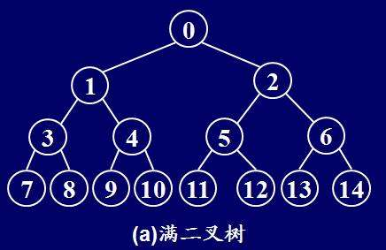

## 二、完全二叉树

若设二叉树的深度为 h，除第 h 层外，其它各层 (1 ～ h-1) 的结点数都达到最大个数，第 h 层所有的结点都连续集中在最左边，这就是完全二叉树。

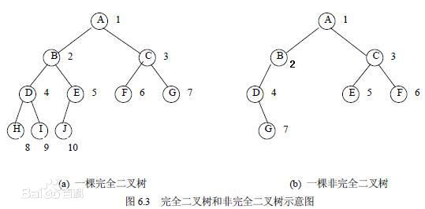

## 三、二叉查找树

二叉查找树（Binary Search Tree），（又：二叉搜索树，二叉排序树）它或者是一棵空树，或者是具有下列性质的二叉树： 若它的左子树不空，则左子树上所有节点的值均小于它的根节点的值； 若它的右子树不空，则右子树上所有节点的值均大于它的根节点的值； 它的左、右子树也分别为二叉排序树。“中序遍历”可以让节点有序。

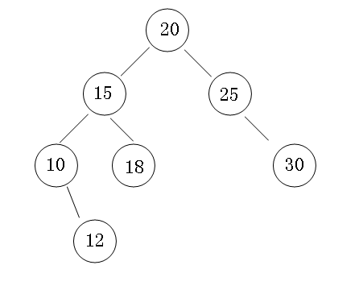

## 四、平衡二叉树

平衡二叉树（Balanced Binary Tree）是二叉查找树的一个进化体，也是第一个引入平衡概念的二叉树。1962 年，G.M. Adelson-Velsky 和 E.M. Landis 发明了这棵树，所以它又叫 AVL 树。平衡二叉树要求对于每一个节点来说，它的左右子树的高度之差不能超过 1，如果插入或者删除一个节点使得高度之差大于 1，就要进行节点之间的旋转，将二叉树重新维持在一个平衡状态。这个方案很好的解决了二叉查找树退化成链表的问题，把插入，查找，删除的时间复杂度最好情况和最坏情况都维持在 O(logN)。但是频繁旋转会使插入和删除牺牲掉 O(logN)左右的时间，不过相对二叉查找树来说，时间上稳定了很多。

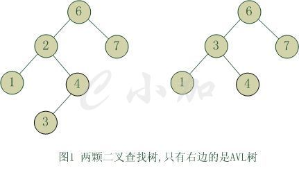

### 4.1 插入原理

根据二叉平衡树的定义，一定保持左右子树深度绝对值小于 1.在平衡二叉树插入工作一定考虑深度差，在 AVL 树进行插入工作时候，困难在于可能破坏 AVL 树的平衡属性。需要根据树的实际结构进行几种简单的旋转（rotation）操作就可以让树恢复 AVL 树的平衡性质

### 4.2 旋转问题

对于一个平衡的节点，由于任意节点最多有两个儿子，因此高度不平衡时，此节点的两颗子树的高度差 2.容易看出，这种不平衡出现在下面四种情况：

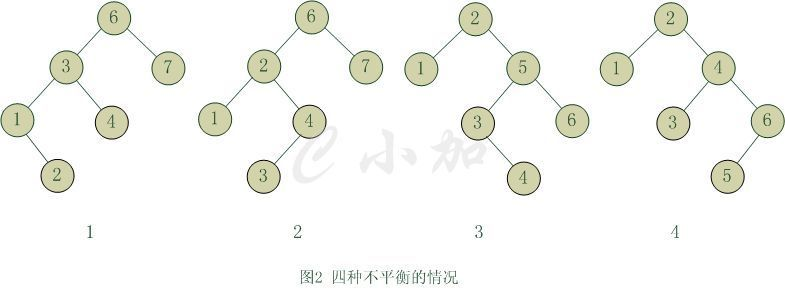

1. 6 节点的左子树 3 节点高度比右子树 7 节点大 2，左子树 3 节点的左子树 1 节点高度大于右子树 4 节点，这种情况成为左左。

2. 6 节点的左子树 2 节点高度比右子树 7 节点大 2，左子树 2 节点的左子树 1 节点高度小于右子树 4 节点，这种情况成为左右。

3. 2 节点的左子树 1 节点高度比右子树 5 节点小 2，右子树 5 节点的左子树 3 节点高度大于右子树 6 节点，这种情况成为右左。

4. 2 节点的左子树 1 节点高度比右子树 4 节点小 2，右子树 4 节点的左子树 3 节点高度小于右子树 6 节点，这种情况成为右右。

从图 2 中可以可以看出，1 和 4 两种情况是对称的，这两种情况的旋转算法是一致的，只需要经过一次旋转就可以达到目标，我们称之为单旋转。2 和 3 两种情况也是对称的，这两种情况的旋转算法也是一致的，需要进行两次旋转，我们称之为双旋转。

### 4.3 旋转操作

#### 4.3.1 单旋转

**单旋转是针对于左左和右右这两种情况的解决方案**，这两种情况是对称的，只要解决了左左这种情况，右右就很好办了。图 3 是左左情况的解决方案，节点 k2 不满足平衡特性，因为它的左子树 k1 比右子树 Z 深 2 层，而且 k1 子树中，更深的一层的是 k1 的左子树 X 子树，所以属于左左情况。

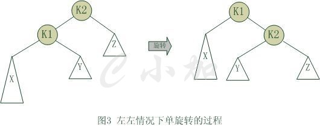

#### 4.3.2 双旋转

**对于左右和右左这两种情况，单旋转不能使它达到一个平衡状态，要经过两次旋转。双旋转是针对于这两种情况的解决方案**，同样的，这样两种情况也是对称的，只要解决了左右这种情况，右左就很好办了。图 4 是左右情况的解决方案，节点 k3 不满足平衡特性，因为它的左子树 k1 比右子树 Z 深 2 层，而且 k1 子树中，更深的一层的是 k1 的右子树 k2 子树，所以属于左右情况。

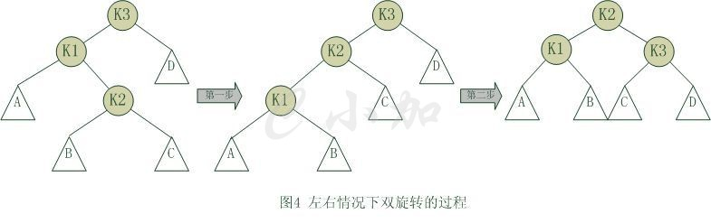

## 五、平衡查找树之 2-3 查找树(2-3 Search Tree)

2-3 树是最简单的 B-树（或-树）结构，**其每个非叶节点都有两个或三个子女，而且所有叶都在统一层上。2-3 树不是二叉树**，其节点可拥有 3 个孩子。不过，2-3 树与满二叉树相似。若某棵 2-3 树不包含 3-节点，则看上去像满二叉树，其所有内部节点都可有两个孩子，所有的叶子都在同一级别。另一方面，2-3 树的一个内部节点确实有 3 个孩子，故比相同高度的满二叉树的节点更多。高为 h 的 2-3 树包含的节点数大于等于高度为 h 的满二叉树的节点数，即至少有 2^h-1 个节点。换一个角度分析，包含 n 的节点的 2-3 树的高度不大于 log2(n+1) (即包含 n 个节点的二叉树的最小高度)。

为了保证查找树的平衡性，我们需要一些灵活性，因此在这里我们允许树中的一个结点保存多个键。

2- 结点，含有一个键（及其对应的值）和两条链接，左链接指向的 2-3 树中的键都小于该结点，右链接指向的 2-3 树中的键都大于该结点，右链接指向的 203 树中的键都大于该结点

3-结点：含有两个键(及值)和三条链接，左链接指向的 2-3 树中的键都小于该结点，中链接指向的 2-3 树中的键都位于该结点的两个键之间，右链接指向的 2-3 树中的键都大于该结点。

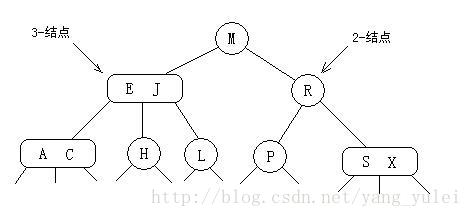

### 5.1 将数据项放入 2-3 树节点中的规则是：

先找插入结点，若结点有空(即 2-结点)，则直接插入。如结点没空(即 3-结点)，则插入使其临时容纳这个元素，然后分裂此结点，把中间元素移到其父结点中。对父结点亦如此处理。（中键一直往上移，直到找到空位，在此过程中没有空位就先搞个临时的，再分裂。）

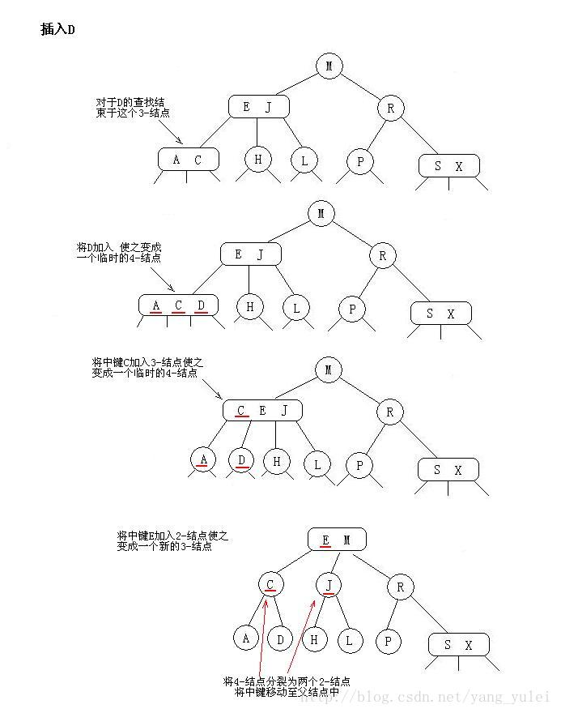

### 5.2 构造 2-3 树

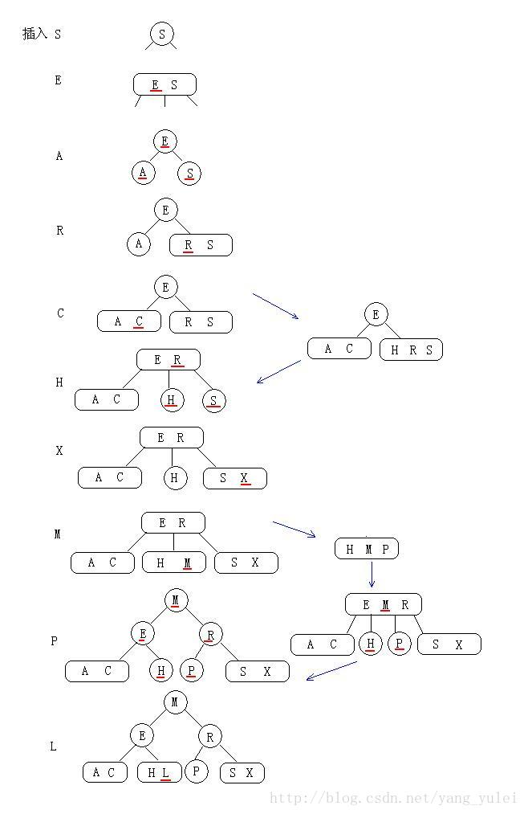

#### 5.2.1 优点

2-3 树在最坏情况下仍有较好的性能。每个操作中处理每个结点的时间都不会超过一个很小的常数，且这两个操作都只会访问一条路径上的结点，所以任何查找或者插入的成本都肯定不会超过对数级别。

完美平衡的 2-3 树要平展的多。例如，含有 10 亿个结点的一颗 2-3 树的高度仅在 19 到 30 之间。我们最多只需要访问 30 个结点就能在 10 亿个键中进行任意查找和插入操作。

#### 5.2.2 缺点

我们需要维护两种不同类型的结点，查找和插入操作的实现需要大量的代码，而且它们所产生的额外开销可能会使算法比标准的二叉查找树更慢。

平衡一棵树的初衷是为了消除最坏情况，但我们希望这种保障所需的代码能够越少越好。

## 六、红黑树

### 6.1 什么是红黑树

1.节点是红色或黑色。

2.根节点是黑色。

3.每个叶子节点都是黑色的空节点（NIL节点）。

4 每个红色节点的两个子节点都是黑色。(从每个叶子到根的所有路径上不能有两个连续的红色节点)

5.从任一节点到其每个叶子的所有路径都包含相同数目的黑色节点。

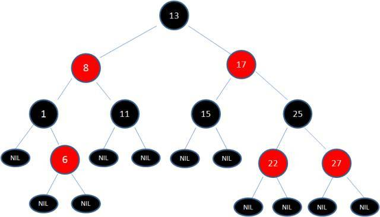

理解红黑树一句话就够了：**红黑树就是用红链接表示 3-结点的 2-3 树**。那么红黑树的插入、构造就可转化为 2-3 树的问题，即：在脑中用 2-3 树来操作，得到结果，再把结果中的 3-结点转化为红链接即可。而 2-3 树的插入，前面已有详细图文，实际也很简单：有空则插，没空硬插，再分裂。 这样，我们就不用记那么复杂且让人头疼的红黑树插入旋转的各种情况了。只要清楚 2-3 树的插入方式即可。

红黑树的另一种定义是满足下列条件的二叉查找树：

1. 红链接均为左链接。
2. 没有任何一个结点同时和两条红链接相连。
3. 该树是完美黑色平衡的，即任意空链接到根结点的路径上的黑链接数量相同。

如果我们将**一颗红黑树中的红链接画平**，那么所有的空链接到根结点的距离都将是相同的。**如果我们将由红链接相连的结点合并，得到的就是一颗 2-3 树**。

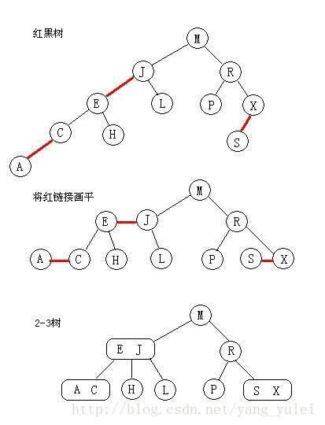

### 6.2 红黑树的本质：

★ 红黑树是对 2-3 查找树的改进，它能用一种统一的方式完成所有变换。

★ 红黑树背后的思想是用标准的二叉查找树（完全由 2-结点构成）和一些额外的信息（替换 3-结点）来表示 2-3 树。

### 6.3 红黑树链接类型

我们将树中的链接分为两种类型：红链接将两个 2-结点连接起来构成一个 3-结点，黑链接则是 2-3 树中的普通链接。确切地说，我们将 3-结点表示为由一条左斜的红色链接相连的两个 2-结点。

这种表示法的一个优点是，我们无需修改就可以直接使用标准二叉查找树的 get()方法。对于任意的 2-3 树，只要对结点进行转换，我们都可以立即派生出一颗对应的二叉查找树。我们将用这种方式表示 2-3 树的二叉查找树称为红黑树。

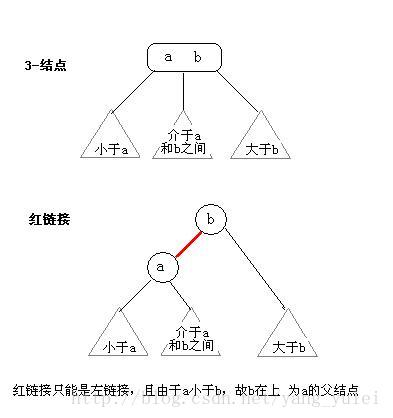

### 6.4 红黑树颜色表示

因为每个结点都只会有一条指向自己的链接（从它的父结点指向它），我们将链接的颜色保存在表示结点的 Node 数据类型的布尔变量 color 中（若指向它的链接是红色的，那么该变量为 true，黑色则为 false）。

当我们提到一个结点颜色时，我们指的是指向该结点的链接的颜色。

### 6.5 红黑树旋转

在我们实现的某些操作中可能会出现红色右链接或者两条连续的红链接，但在操作完成前这些情况都会被小心地旋转并修复。

### 6.7 红黑树插入

在插入时我们可以使用旋转操作帮助我们保证 2-3 树和红黑树之间的一一对应关系，因为旋转操作可以保持红黑树的两个重要性质：**有序性和完美平衡性**。

1.  向一个只含有一个 2-结点的 2-3 树中插入新键后，2-结点变为 3-结点。我们再把这个 3-结点转化为红结点即可）

    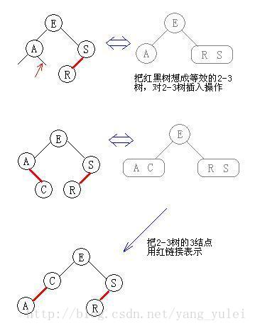

2.  向一颗双键树（即一个 3-结点）中插入新键
    （向红黑树中插入操作时，想想 2-3 树的插入操作。你把红黑树当做 2-3 树来处理插入，一切都变得简单了）
    （向 2-3 树中的一个 3-结点插入新键，这个 3 结点临时成为 4-结点，然后分裂成 3 个 2 结点）

   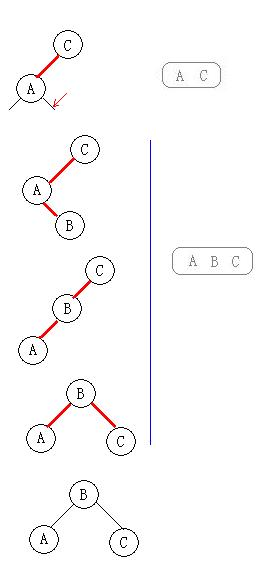

### 6.7 一颗红黑树的构造全过程

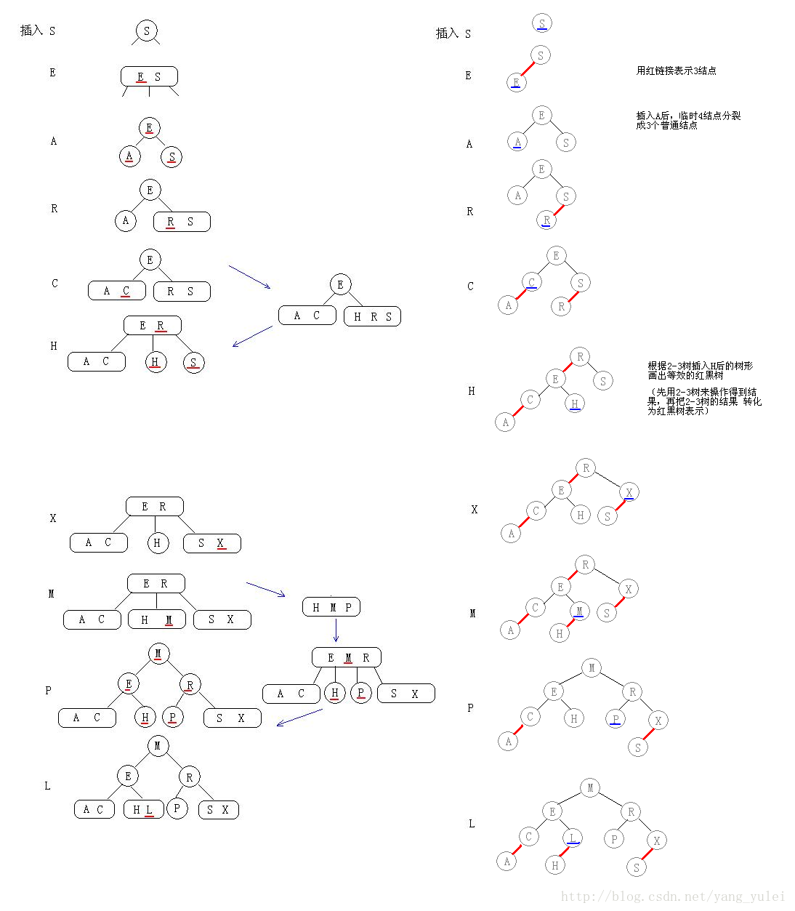

### 参考文章

[浅谈数据结构-平衡二叉树](http://www.cnblogs.com/polly333/p/4798944.html)

[查找（一）史上最简单清晰的红黑树讲解](https://blog.csdn.net/yang_yulei/article/details/26066409)

[浅谈算法和数据结构: 八 平衡查找树之 2-3 树
](http://www.cnblogs.com/yangecnu/p/Introduce-2-3-Search-Tree.html)
