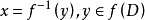
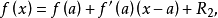
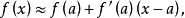
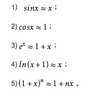
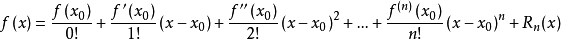

# 微积分基础

## 导数(Derivatives)

> 导数是函数的局部性质。一个函数在某一点的导数描述了这个函数在这一点附近的变化率。如果函数的自变量和取值都是实数的话，函数在某一点的导数就是该函数所代表的曲线在这一点上的切线斜率。导数的本质是通过极限的概念对函数进行局部的线性逼近。例如在运动学中，物体的位移对于时间的导数就是物体的瞬时速度。

一阶导数为 0 的时候，对应的值不是最大值（局部）就是最小值（局部）。

## 求导规则

加（减）法则：`（f+g)'=f'+g'`

乘法法则：`（f*g)'=f'*g+g'*f`

除法法则：`（f/g)'=(f'*g-g'*f)/g^2`

`y = x^n => dy/dx = nx^n-1`

`y = sin(x) => dy/dx = cos(x)`

`y = e^x => dy/dx = e^x`

`y = lnx => dy/dx = 1/x`

	(lnx)'=lim[h→0] [ln(x+h)-lnx]/h
	=lim[h→0] ln[(x+h)/x]/h
	=lim[h→0] ln(1+h/x)/h
	ln(1+h/x)与h/x等价,用等价无穷小代换
	=lim[h→0] (h/x) / h
	=1/x
	
1. `C'=0(C为常数)；`
2. `(Xn)'=nX(n-1) (n∈R)；`
3. `(sinX)'=cosX；`
4. `(cosX)'=-sinX；`
5. `(aX)'=aXIna （ln为自然对数)；`
6. `(logaX)'=（1/X)logae=1/(Xlna) (a>0，且a≠1)；`
7. `(tanX)'=1/(cosX)2=(secX)2`
8. `(cotX)'=-1/(sinX)2=-(cscX)2`
9. `(secX)'=tanX secX；`
10. `(cscX)'=-cotX cscX； [1] `

## 二阶导数 （Second Derivative）

> 二阶导数，是原函数导数的导数，将原函数进行二次求导。一般的，函数y=f（x）的导数y‘=f’（x）仍然是x的函数，则y’=f‘（x）的导数叫做函数y=f（x）的二阶导数。在图形上，它主要表现函数的凹凸性。 [1] 

dy/dx = cos(x) => -sin(x)

f'' > 0 定义为凸(convex)对应最小值(局部最小)，f''< 0 的时候定义为凹(concave)对应最大值（局部最大）

### 二阶导数几何意义
（1）切线斜率变化的速度，表示的是一阶导数的变化率。

（2）函数的凹凸性（例如加速度的方向总是指向轨迹曲线凹的一侧）。 

	这里以物理学中的瞬时加速度为例:
	  根据定义有
	可如果加速度并不是恒定的，某点的加速度表达式就为：
	a=limΔt→0 Δv/Δt=dv/dt(即速度对时间的一阶导数)
	又因为v=dx/dt 所以就有：
	a=dv/dt=d²x/dt² 即元位移对时间的二阶导数
	将这种思想应用到函数中 即是数学所谓的二阶导数
	f'(x)=dy/dx (f(x)的一阶导数）
	f''(x)=d²y/dx²=d(dy/dx)/dx (f(x)的二阶导数)

## 拐点 （Inflection Point）

> 拐点，又称反曲点，在数学上指改变曲线向上或向下方向的点，直观地说拐点是使切线穿越曲线的点（即曲线的凹凸分界点）。若该曲线图形的函数在拐点有二阶导数，则二阶导数在拐点处异号（由正变负或由负变正）或不存在。

拐点就是二阶导数为 0 的点

比较所有驻点（f'=0）处及边界点函数值，得到的最大或者最小值，即函数最值

## epsilon-delta

> 就是数学分析（历史上称为“无穷小分析”）中用来严格定义极限概念的数学语言，它避免了早期微积分使用直观无穷小概念时在逻辑上产生的混乱，从而为微积分理论建立了坚实的逻辑基础。
ε-δ（epsilon-delta）语言的例子：
一元实函数在 x0 点“连续”概念的定义：
设 f(x)是实数集 R 上的函数，若对任意给定的数 ε > 0，总存在数 δ > 0，当
|x - x0| <δ 时，有|f(x) - f(x0)| <ε，则称函数 f(x)在 x0 点连续。 [1]
这种定义方法使得微积分的基本概念（如极限、连续、导数等）不再依赖于“无穷小”这个含混不清的说法，而是用不等式的语言确切地描述出来（并且是可验证的）。因而使微积分理论严密起来。
与 ε - δ 语言类似的是 N - δ 语言。它是用来定义数列极限的严密化语言，思想是完全相同的。

> 用“窄带”(narrow band)的说法通俗地讲解了极限和连续的概念。所谓极限存在，就是不管取多窄的窄带，数列足够靠后的数字，都会落在窄带(A+ε,A-ε)之内。所谓函数连续，就是只要x足够接近a，就能保证f(x)足够接近f(a)。

## 逆函数（反函数）
> 设函数y=f(x)的定义域是D，值域是f(D)。如果对于值域f(D)中的每一个y，在D中有且只有一个x使得f(x)=y，则按此对应法则得到了一个定义在f(D)上的函数，并把该函数称为函数y=f(x)的反函数，记为

## 线性近似和牛顿法
所谓线性近似，也叫线性逼近，主要作用是把一个复杂的非线性函数用一个简单的线性函数来表示。

假设一般函数上存在点(a, f(a))，当x接近a时，可以使用函数在a点的切线作为函数的近似线。函数L(x)≈f(a)+f'(a)(x-a)即称为函数f在a点的线性近似或切线近似

例如，有一个实数变量的可导函数f，根据n=1的泰勒公式，

其中  是余数。舍去余数就是线性近似：

当x无限接近于a的时候这个等式成立。
 
### 常用线性近似公式

## 泰勒公式
> 泰勒公式是将一个在x=x0处具有n阶导数的函数f(x)利用关于(x-x0)的n次多项式来逼近函数的方法。
> 若函数f(x)在包含x0的某个闭区间[a,b]上具有n阶导数，且在开区间(a,b)上具有(n+1)阶导数，则对闭区间[a,b]上任意一点x，成立下式：
> 

## 二阶常系数线性微分方程
二阶常系数线性微分方程是形如y''+py'+qy=f(x)的微分方程，其中p，q是实常数。自由项f(x)为定义在区间I上的连续函数，即y''+py'+qy=0时，称为二阶常系数齐次线性微分方程。若函数y1和y2之比为常数，称y1和y2是线性相关的；若函数y1和y2之比不为常数，称y1和y2是线性无关的。特征方程为：λ^2+pλ+q=0，然后根据特征方程根的情况对方程求解。

