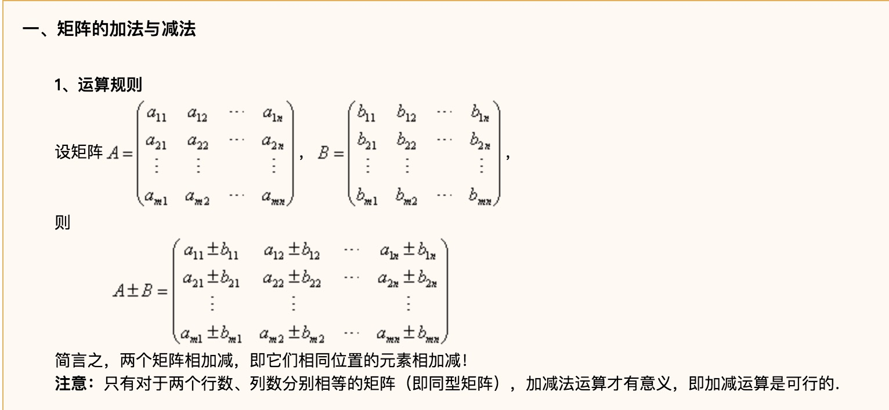

# 线性代数基础

## 矩阵乘法

[矩阵A(m*n)] * [矩阵B(n*p)] = [矩阵C(m*p)]

## 矩阵消元

https://www.cnblogs.com/Dumblidor/p/5751579.html

## 逆矩阵

设A是数域上的一个n阶方阵，若在相同数域上存在另一个n阶矩阵B，使得： AB=BA=E。 则我们称B是A的逆矩阵，而A则被称为可逆矩阵。

https://baike.baidu.com/item/%E9%80%86%E7%9F%A9%E9%98%B5/10481136?fr=aladdin

## A的LU分解

我们将 A 通过消元后得到的上三角矩阵(upper triangular) 记为 U，即

https://blog.csdn.net/xhf0374/article/details/63680667

我们将这个矩阵即为 E21，因为它把 A 的 (2,1) 位置的元素消成了 0. 这个矩阵称为初等矩阵或消元矩阵(elementary matrix or elimination matrix).

E32 * E21 * A=U

因此，我们只需记录消元所用的乘数，就能快速地确定矩阵 L（注意我们这里所讨论的是没有行交换的情形），不需要进行任何计算，这就是我们使用形式 A=LU 的好处。

I = 对角线为1，其他为 0 的矩阵

## 矩阵置换、转置

置换矩阵(permutation matrix)

置换矩阵的每一行和每一列都恰好有一个 1，其余的元素都是 0.

置换矩阵可由单位矩阵经过行或列交换得到。

一个矩阵乘以置换矩阵，相当于对矩阵的行或列进行交换。

置换矩阵的性质：P−1=PT ， 即置换矩阵都是正交矩阵。

由于置换矩阵的每一行都可以看作取自单位矩阵的某一行， 因此 n×n 维置换矩阵共有 n! 个（第一行有 n 种取法，第二行 n−1 种，⋯，第 n 行 1 种）。

https://blog.csdn.net/sda42342342423/article/details/78673073

## 矩阵列空间

## 向量空间ℝ^n

所有 n 维列向量构成的向量空间即为 ℝ^n.

ℝ^2 的所有子空间：

ℝ^2

零向量 (0,0)^T
所有通过零向量 (0,0)^T 的直线
ℝ^3 的所有子空间：

ℝ^3

零向量 (0,0,0)^T
所有通过零向量 (0,0,0)^T 的直线
所有通过零向量 (0,0,0)^T 的平面

矩阵的列空间 

矩阵 A 的列的所有线性组合构成一个线性空间，称为 A 的列空间。

## 子空间(Subspace)

https://blog.csdn.net/xhf0374/article/details/64494236

## 列空间(Column space)

## 零空间(Nullspace)

## 简化行阶梯形式 R

零空间矩阵就是将所有特解作为列的矩阵

## 线性无关
如果存在不全为零的常数 c1,c2,⋯,cn 使得 c1x1+c2x2+⋯+cnxn=0，那么称向量 x1,x2,⋯,xn 线性相关，否则称为线性无关。

如果将 x1,x2,⋯,xn 看作矩阵 A 的 n 个列向量，那么 x1,x2,⋯,xn 线性无关当且仅当 A 的零空间中只有零向量，也即是当且仅当 rankA=n；x1,x2,⋯,xn 线性相关当且仅当 A 的零空间中有非零向量，也即是当且仅当 rankA<n.

## 向量生成的空间

如果一个空间由向量 v1,v2,⋯,vn 的所有线性组合构成，那么称这个空间为 v1,v2,⋯,vn 生成的空间，可记为 span{v1,v2,⋯,vn}.

显然 span{v1,v2,⋯,vn} 是包含 v1,v2,⋯,vn 的最小的线性空间，因为如果一个线性空间包含 v1,v2,⋯,vn，则必包含它们的线性组合。

## 基

如果线性空间 V 中的向量 v1,v2,⋯,vd 满足一下两个条件：

v1,v2,⋯,vd 线性无关
v1,v2,⋯,vd 生成 V
那么称 v1,v2,⋯,vd 是 V 的一组基。

线性空间 V 的任何一组基中所含向量的个数都相同。
n+1 个 n 维向量必定线性相关。因为考虑以这 n+1 个 n 维向量为列向量的 n×(n+1) 维矩阵 A，则 Ax=0 一定有非零解（未知数个数多余方程个数，必有自由变量）。

## 维数

线性空间的基中所含向量的个数称为这个线性空间的维数
rankA= 主列（主元所在的列）的个数 = 列空间的维数
零空间的维数 = 自由变量的个数

## 如何判断矩阵可逆

#### 一个矩阵如果 行、列都是线性无关的，则这个矩阵可逆，如果一个矩阵不可能逆，那这行或者列，一定线性相关

## 四个基本子空间

零空间N(A)
n维向量，是Ax=0的解，所以N(A)在Rn里。

列空间C(A)
列向量是m维的，所以C(A)在Rm里。

行空间C(AT)
A的行的所有线性组合，即A转置的列的线性组合（因为我们不习惯处理行向量），C(AT)在Rn里。

A转置的零空间N(AT)—A的左零空间
N(AT)在Rm里。

## 矩阵空间

所有 n×n 维矩阵构成的线性空间称为矩阵空间，记为 ℝn×n.
若记 M 为所有 3×3 矩阵构成的矩阵空间，则所有的 3×3 对称矩阵构成的矩阵空间 S 和 3×3 上三角矩阵构成的矩阵空间 U 都是 M 的子空间，显然他们的交也是 M 的子空间，事实上，S 与 U 的交即为所有 3×3 对角矩阵构成的矩阵空间。但 S∪U 不是线性空间，因为对加法不封闭。 
定义 S+U={α+β|α∈S,β∈U}，显然 S+U 是 M 的子空间，且 S+U=M.
dimM=9,dimS=6,dim(S+U)=9,dim(S∩U)=3, 故 
dimS+dimU=dim(S+U)+dim(S∩U).

## 秩1矩阵

任何一个秩矩阵都能写成 A=uvT 的形式，其中 rankA=1,u,v 均为列向量。
秩 1 矩阵的集合不是线性空间，因为对加法不封闭（两个秩 1 矩阵的和的秩可能为 2）。
任何一个秩为 r 的矩阵都能写成 r 个秩 1 矩阵的和。

## 图和网络

## 关联矩阵

假设一个电路图，4个结点，n=4，5条边，m=5，用矩阵来表示这些信息，这个矩阵叫做关联矩阵(Incidence Matrix)

## 基尔霍夫电流定律

## 欧拉公式

相互无关(两回路之间无关)的回路数量#loops=边的数量#edges-列空间的秩#rank（等于n-1，结点的数量-1，1为A零空间的维）

		#loops = #edges - (#nodes - 1)
		#nodes - #edges + #loops = 1
