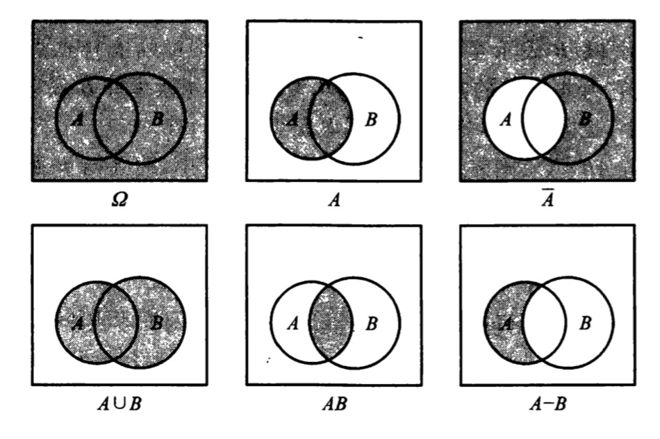
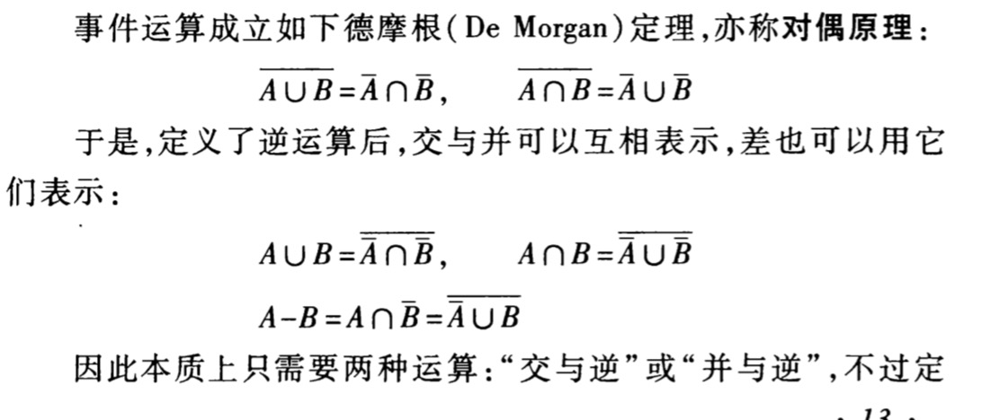
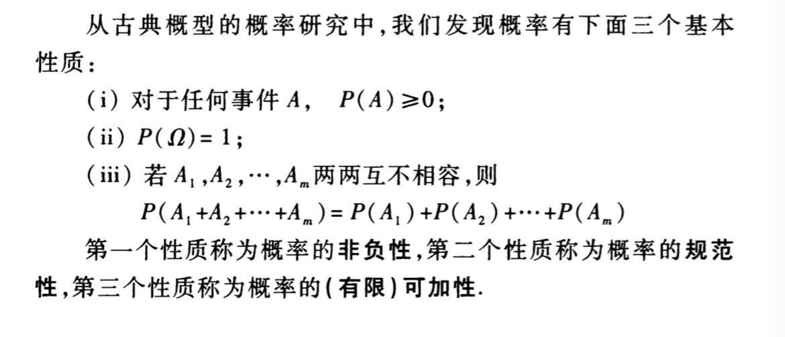
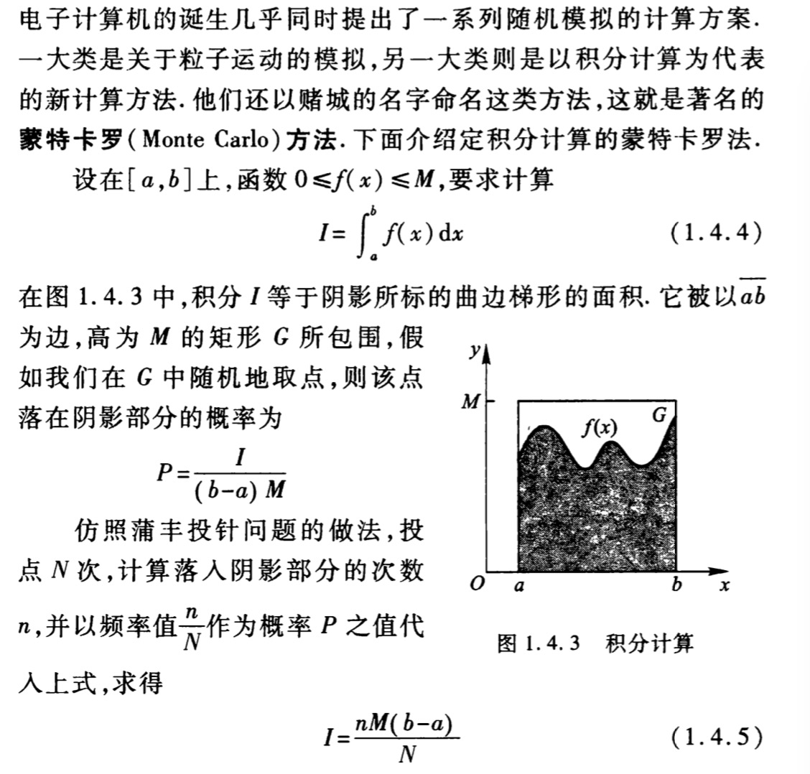
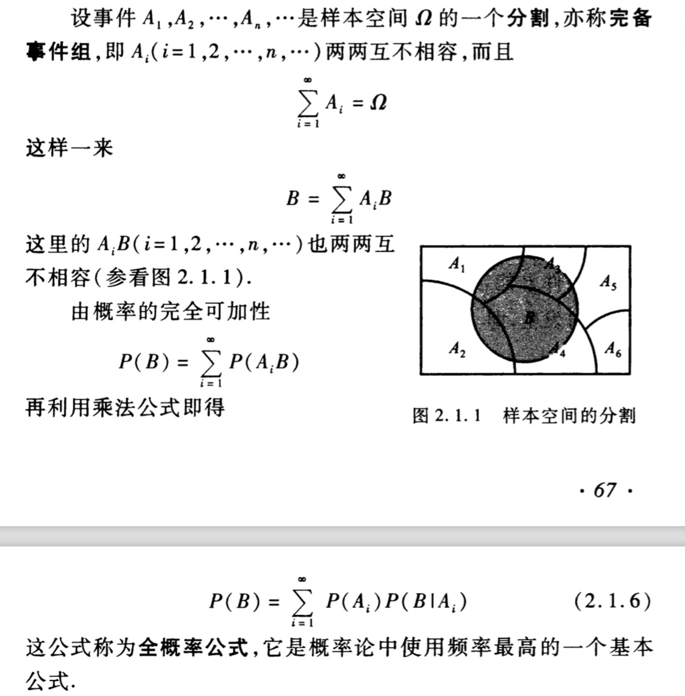
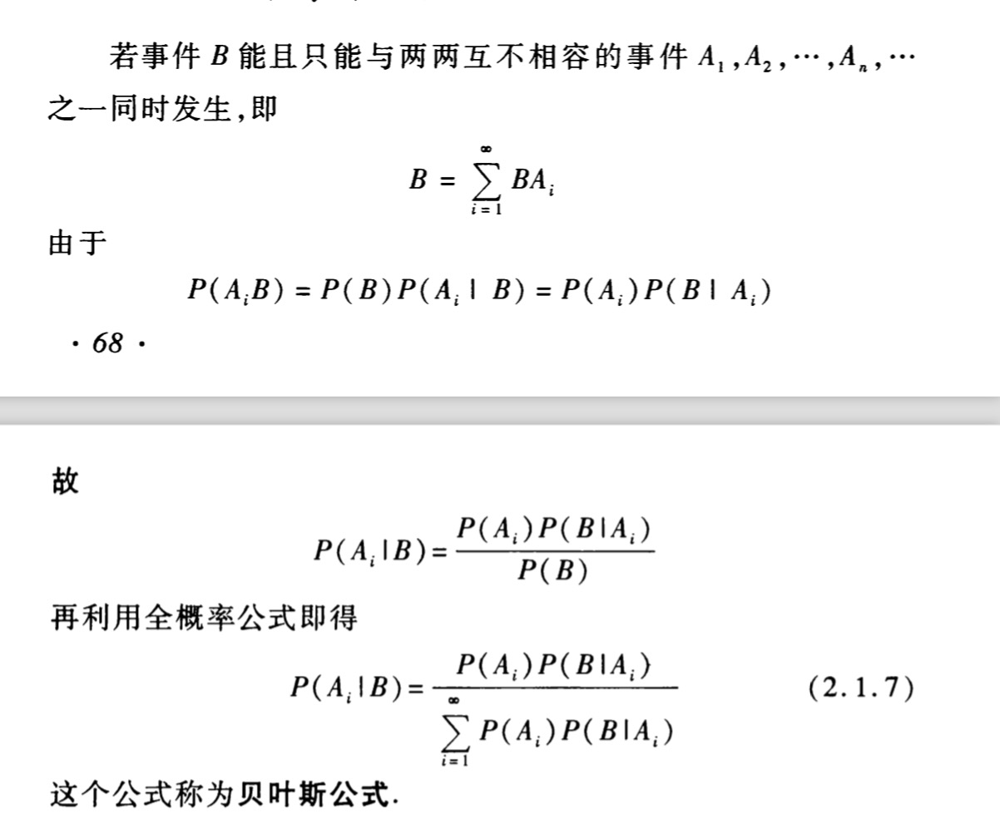

# 概率论基础

    ⊃⊆⊇∩∪∞ℇ∋∊∌∍⊉⊈⊅

- [概率论基础](#概率论基础)
    - [样本空间与事件](#样本空间与事件)
    - [对偶公式](#对偶公式)
    - [随机事件运算](#随机事件运算)
    - [概率的三个基本性质](#概率的三个基本性质)
    - [二项系数](#二项系数)
    - [蒙特卡罗（Monte Carlo）](#蒙特卡罗monte-carlo)
    - [乘法公式](#乘法公式)
    - [全概率公式](#全概率公式)
    - [贝叶斯公式（Bayes）](#贝叶斯公式bayes)

## 样本空间与事件

A⊂B 事件 B 包含了事件 A，A 被包含于 B

A∩B A 与 B 的交集，表示事件 A 和事件 B 同时发生

A∪B A 与 B 的并集，表示事件 A 或事件 B 或他们二者同事发生

P(A|B) 在事件 B 发生下，事件 A 发生的概率

## 对偶公式

## 随机事件运算

（1）交换律：A∪B=B∪A、AB=BA

（2）结合律：( A∪B )∪C=A∪( B∪C )

（3）分配律：A∪( BC )=( A∪B )( A∪C )A( B∪C )=( AB )∪( AC )

（4）摩根律：A B=A∪B、A ∪ B=A B

## 概率的三个基本性质

## 二项系数

## 蒙特卡罗（Monte Carlo）

## 乘法公式

P(AB)=P(B)P(A|B) = P(A)P(B|A)

## 全概率公式

## 贝叶斯公式（Bayes）

