# 统计学基础

最近休息在家无聊，整理下之前看的统计学的一些基础知识，方便以后查阅吧。

- [统计学基础](#统计学基础)
  - [基础名词](#基础名词)
  - [基础概念和公式](#基础概念和公式)
    - [基础概念对应的数学符号：](#基础概念对应的数学符号)
    - [总体均值（Population Mean）和样本均值（Sample Mean）公式：](#总体均值population-mean和样本均值sample-mean公式)
    - [总体方差（variance of a population）公式：](#总体方差variance-of-a-population公式)
    - [样本方差（Sample variance）](#样本方差sample-variance)
    - [无偏样本方差 （unbiased sameple variance）](#无偏样本方差-unbiased-sameple-variance)
    - [总体标准差 （Population Standard Deviation）](#总体标准差-population-standard-deviation)
    - [样本标准差 （Sample Standard Deviation）](#样本标准差-sample-standard-deviation)
    - [样本均值的抽样分布](#样本均值的抽样分布)
    - [随机变量 （Random Variable）](#随机变量-random-variable)
    - [概率密度函数 （probability density function）](#概率密度函数-probability-density-function)
    - [二项式定理 (Binomial theorem)](#二项式定理-binomial-theorem)
    - [二项式分布 （Binomial coefficients）](#二项式分布-binomial-coefficients)
    - [期望 （Expected value）](#期望-expected-value)
    - [泊松分布 (poisson distribution)](#泊松分布-poisson-distribution)
    - [泊松过程 （Poisson process）](#泊松过程-poisson-process)
    - [大数定律(law of large numbers)](#大数定律law-of-large-numbers)
    - [正态分布（Normal distribution)又名高斯分布（Gaussian distribution)](#正态分布normal-distribution又名高斯分布gaussian-distribution)
    - [中心极限定理 （central limit theorem）](#中心极限定理-central-limit-theorem)
    - [伯努利分布](#伯努利分布)
    - [Z 统计量 （Z-statistic）和 T 统计量(T-statistic)](#z-统计量-z-statistic和-t-统计量t-statistic)
    - [第一类型错误（Type 1 Error）](#第一类型错误type-1-error)
    - [**线性回归**](#线性回归)
    - [R2 参数](#r2-参数)
    - [协方差和回归线](#协方差和回归线)
    - [卡方检验 x^2 (chi square)分布](#卡方检验-x2-chi-square分布)
    - [F 统计量 （F-statistic）](#f-统计量-f-statistic)

## 基础名词

- 均值 （Mean），所有数相加出去数量。
- 中位数 （Median）， 中间一个数，或者是中间的两个数相加除以 2
- 众数 （Mode），出现次数最多的数。
- 极差 （Range），最大值减去最小值（Max-Min）
- 中程数（Mid-Range） （Max+Min）/ 2
- 样本 （sameple）
- 总体 （population）
- 总体的均值 （mean of a population） 𝝻
- 样本的均值 (mean of a sameple)
- 总体方差 （variance of a population）
- 样本方差（Sample variance）

## 基础概念和公式

### 基础概念对应的数学符号：

### 总体均值（Population Mean）和样本均值（Sample Mean）公式：

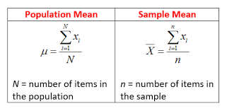

### 总体方差（variance of a population）公式：

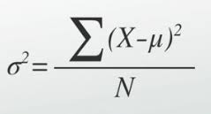

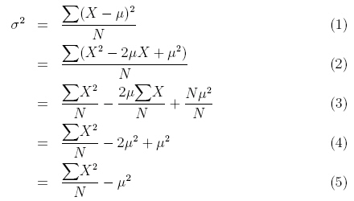

### 样本方差（Sample variance）

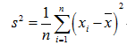

### 无偏样本方差 （unbiased sameple variance）

刚开始接触这个公式的话可能会有一个疑问就是：为什么样本方差要除以（n-1）而不是除以 n？为了解决这个疑惑，我们需要具备一点统计学的知识基础，关于总体、样本、期望（均值）、方差的定义以及统计估计量的评选标准。有了这些知识基础之后，我们会知道样本方差之所以要除以（n-1）是因为这样的方差估计量才是关于总体方差的无偏估计量。这个公式是通过修正下面的方差计算公式而来的：

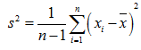

[彻底理解样本方差为何除以 n-1](https://blog.csdn.net/Hearthougan/article/details/77859173)

### 总体标准差 （Population Standard Deviation）

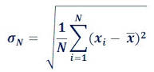

### 样本标准差 （Sample Standard Deviation）

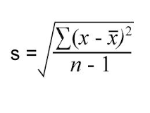

### 样本均值的抽样分布

无限总体，样本均值的方差为总体方差的 1/n，即 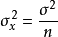

有限总体，样本均值的方差为 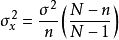 (x 为平均数)

[样本均值的抽样分布](https://wapbaike.baidu.com/item/%E6%A0%B7%E6%9C%AC%E5%9D%87%E5%80%BC%E7%9A%84%E6%8A%BD%E6%A0%B7%E5%88%86%E5%B8%83)

ps：这里的样本均值，是指抽离多个样本的均值，不是单个样本的均值 ！！！

### 随机变量 （Random Variable）

随机变量（random variable）表示随机试验各种结果的实值单值函数。随机事件不论与数量是否直接有关，都可以数量化，即都能用数量化的方式表达

### 概率密度函数 （probability density function）

在数学中，连续型随机变量的概率密度函数（在不至于混淆时可以简称为密度函数）是一个描述这个随机变量的输出值，在某个确定的取值点附近的可能性的函数。而随机变量的取值落在某个区域之内的概率则为概率密度函数在这个区域上的积分。当概率密度函数存在的时候，累积分布函数是概率密度函数的积分。概率密度函数一般以小写标记。

### 二项式定理 (Binomial theorem)

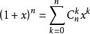

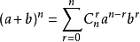

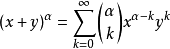

组合

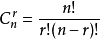

排列

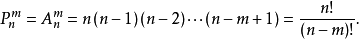

### 二项式分布 （Binomial coefficients）

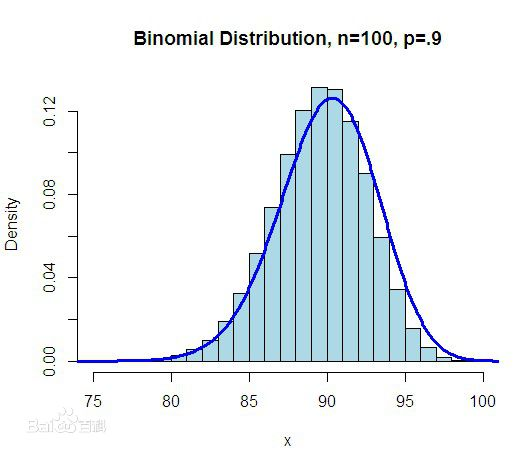

### 期望 （Expected value）

**期望公式：**

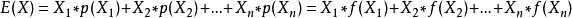

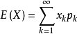

E(X) = np (若 X 服从二项分布 B(n,p))

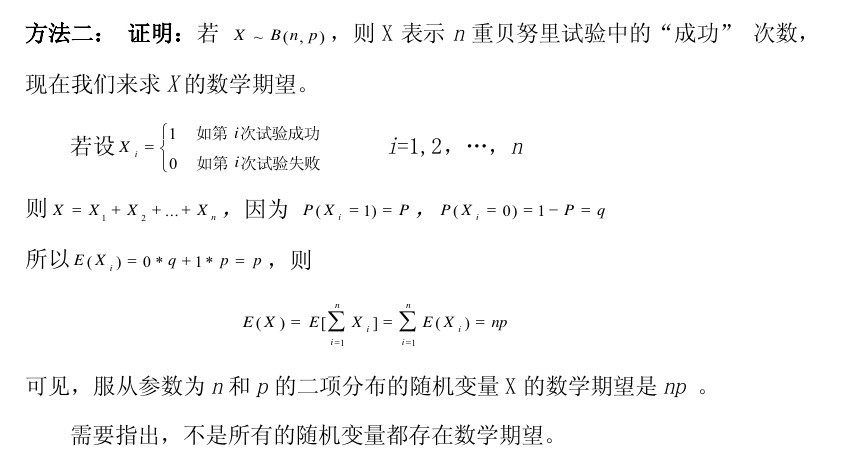

[频率和概率以及均值和期望的联系区别](https://blog.csdn.net/Michael_liuyu09/article/details/77943898)

### 泊松分布 (poisson distribution)

泊松分布适合于描述单位时间内随机事件发生的次数的概率分布。如某一服务设施在一定时间内受到的服务请求的次数，电话交换机接到呼叫的次数、汽车站台的候客人数、机器出现的故障数、自然灾害发生的次数、DNA 序列的变异数、放射性原子核的衰变数等等。

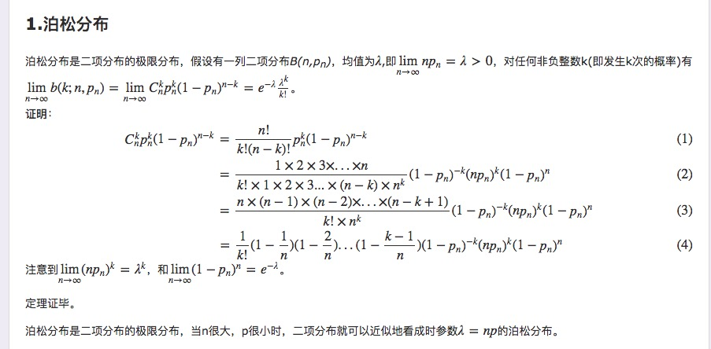

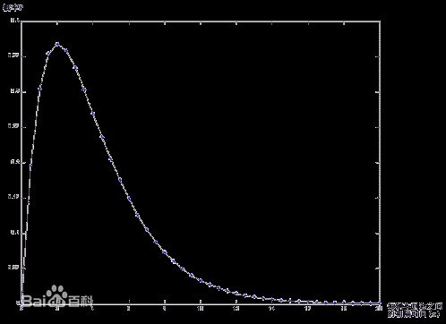

泊松分布的参数 λ 是单位时间(或单位面积)内随机事件的平均发生率。 泊松分布适合于描述单位时间内随机事件发生的次数。

### 泊松过程 （Poisson process）

实验结果满足泊松分布的实验即为泊松过程。

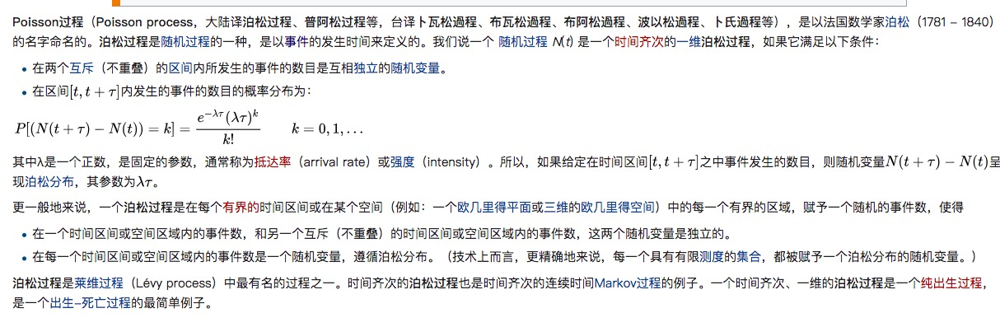

[泊松过程](https://zh.wikipedia.org/wiki/%E6%B3%8A%E6%9D%BE%E8%BF%87%E7%A8%8B)

[泊松分布、泊松过程、泊松点过程](https://www.cnblogs.com/jwmeng/p/7698651.html)

### 大数定律(law of large numbers)

是一种描述当试验次数很大时所呈现的概率性质的定律。但是注意到，大数定律并不是经验规律，而是在一些附加条件上经严格证明了的定理，它是一种自然规律因而通常不叫定理而是大数“定律”。而我们说的大数定理通常是经数学家证明并以数学家名字命名的大数定理，如伯努利大数定理 [2] 。
（抛硬币概率在测试次数很多的时候正反的概率应该都趋势与.5）

### 正态分布（Normal distribution)又名高斯分布（Gaussian distribution)

**样本值落在两个标准差范围内的概率是 95.4%**

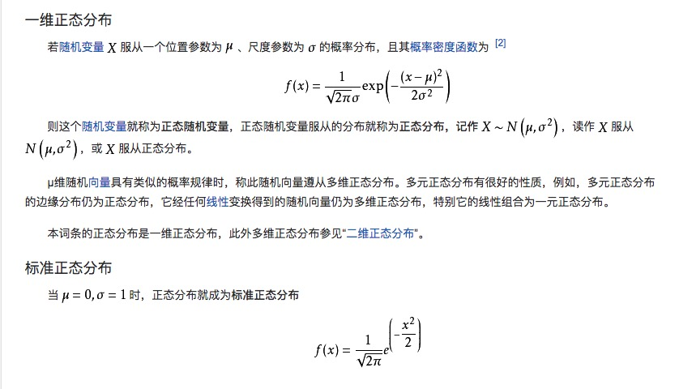

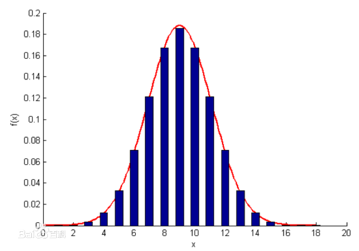

### 中心极限定理 （central limit theorem）

中心极限定理，是指概率论中讨论随机变量序列部分和分布渐近于正态分布的一类定理。这组定理是数理统计学和误差分析的理论基础，指出了大量随机变量近似服从正态分布的条件。它是概率论中最重要的一类定理，有广泛的实际应用背景。在自然界与生产中，一些现象受到许多相互独立的随机因素的影响，如果每个因素所产生的影响都很微小时，总的影响可以看作是服从正态分布的。中心极限定理就是从数学上证明了这一现象。最早的中心极限定理是讨论重点，伯努利试验中，事件 A 出现的次数渐近于正态分布的问题。

### 伯努利分布

伯努利分布亦称“零一分布”、“两点分布”。称随机变量 X 有伯努利分布, 参数为 p(0<p<1),如果它分别以概率 p 和 1-p 取 1 和 0 为值。EX= p,DX=p(1-p)。伯努利试验成功的次数服从伯努利分布,参数 p 是试验成功的概率。伯努利分布是一个离散型机率分布，是 N=1 时二项分布的特殊情况，为纪念瑞士科学家詹姆斯·伯努利(Jacob Bernoulli 或 James Bernoulli)而命名。

- 其概率质量函数为：

        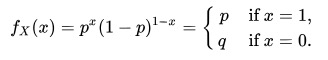

* 期望： E[x] = p
  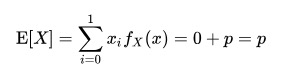

- 方差 ： var[X]=p(1-p)

  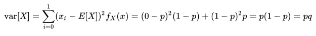

### Z 统计量 （Z-statistic）和 T 统计量(T-statistic)

公式: 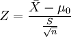

样本数量大于 n > 30 用 Z-table，反之用 T-Table

### 第一类型错误（Type 1 Error）

在进行假设检验时，由于检验统计量是随机变量，有一定的波动性，即使原假设 H0 为真，在正常的情况下，计算的统计量仍有一定的概率 α(α 称为显著性水平)落入拒绝域内，因此也有可能会错误地拒绝原假设 H0，这种当原假设 H0 为真而拒绝原假设的错误，称为假设检验的第一类错误，又称为拒真错误。

### **线性回归**

线性回归方程是利用数理统计中的回归分析，来确定两种或两种以上变数间相互依赖的定量关系的一种统计分析方法之一。线性回归也是回归分析中第一种经过严格研究并在实际应用中广泛使用的类型。按自变量个数可分为一元线性回归分析方程和多元线性回归分析方程。

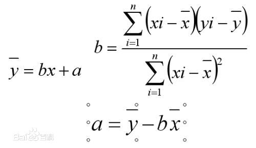

### R2 参数

### 协方差和回归线

在概率论和统计学中，协方差用于衡量两个变量的总体误差。而方差是协方差的一种特殊情况，即当两个变量是相同的情况。 [1]

期望值分别为 E[X]与 E[Y]的两个实随机变量 X 与 Y 之间的协方差 Cov(X,Y)定义为：

Cov(x,y) = E[(x - E[x])(y - E(y))]
= E[xy] - 2E[y]E[x] + E[x]E[y]
= E[xy] - E[y]E[x]
从直观上来看，协方差表示的是两个变量总体误差的期望。

如果两个变量的变化趋势一致，也就是说如果其中一个大于自身的期望值时另外一个也大于自身的期望值，那么两个变量之间的协方差就是正值；如果两个变量的变化趋势相反，即其中一个变量大于自身的期望值时另外一个却小于自身的期望值，那么两个变量之间的协方差就是负值。

如果 X 与 Y 是统计独立的，那么二者之间的协方差就是 0，因为两个独立的随机变量满足 E[XY]=E[X]E[Y]。

但是，反过来并不成立。即如果 X 与 Y 的协方差为 0，二者并不一定是统计独立的。

协方差 Cov(X,Y)的度量单位是 X 的协方差乘以 Y 的协方差。而取决于协方差的相关性，是一个衡量线性独立的无量纲的数。

协方差为 0 的两个随机变量称为是不相关的。

回归线斜率 ： m = Cov(X,Y)/Var(X)

### 卡方检验 x^2 (chi square)分布

卡方检验就是统计样本的实际观测值与理论推断值之间的偏离程度，实际观测值与理论推断值之间的偏离程度就决定卡方值的大小，卡方值越大，越不符合；卡方值越小，偏差越小，越趋于符合，若两个值完全相等时，卡方值就为 0，表明理论值完全符合。

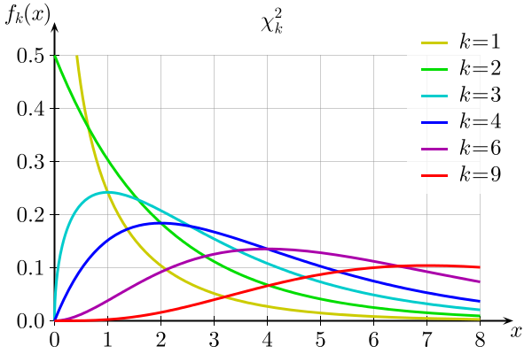

### F 统计量 （F-statistic）

F 检验（F-test），最常用的别名叫做联合假设检验（英语：joint hypotheses test），此外也称方差比率检验、方差齐性检验。它是一种在零假设（null hypothesis, H0）之下，统计值服从 F-分布的检验。其通常是用来分析用了超过一个参数的统计模型，以判断该模型中的全部或一部分参数是否适合用来估计母体。
