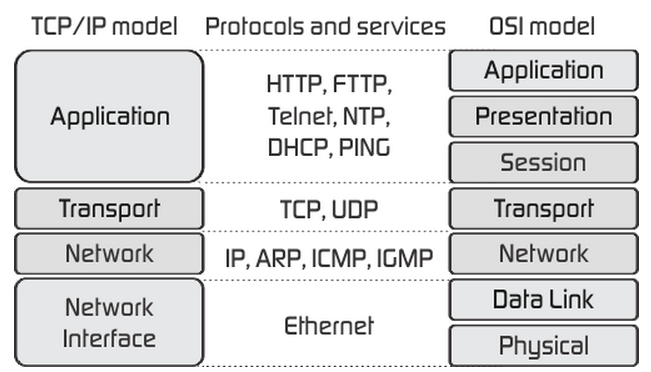
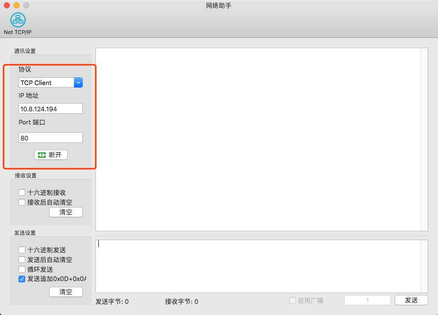
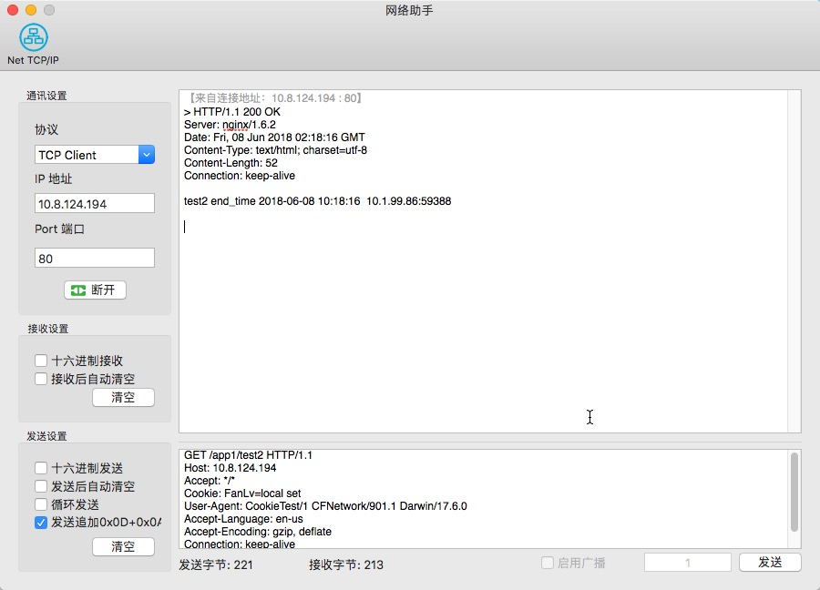
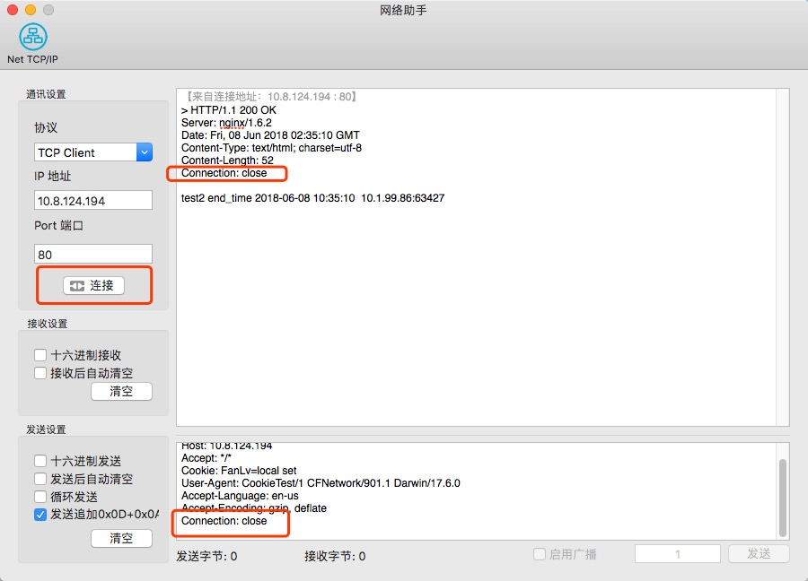
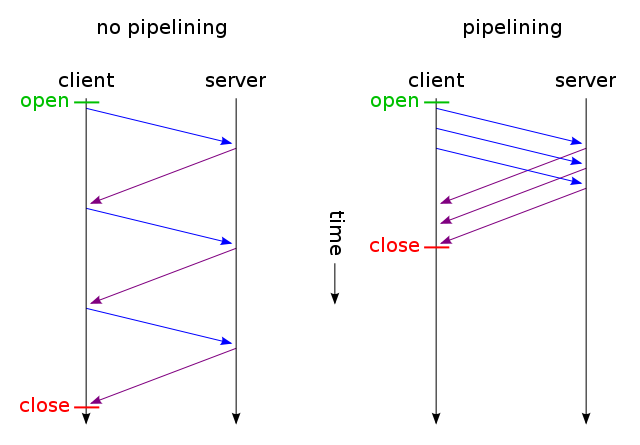
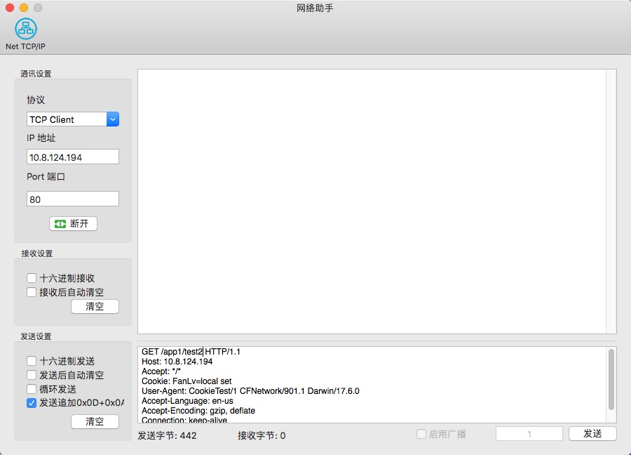
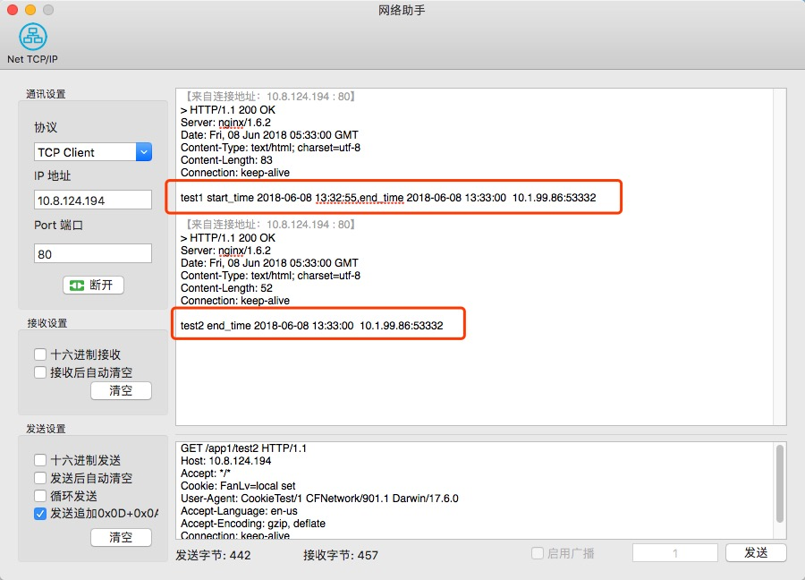

# 深入浅出HTTP

## 一、什么是Http和TCP

> HTTP（HyperText Transfer Protocol)超文本传输协议，是互联网上应用最为广泛的一种网络协议。所有的WWW文件都必须遵守这个标准。设计HTTP最初的目的是为了提供一种发布和接收HTML页面的方法。1960年美国人Ted Nelson构思了一种通过计算机处理文本信息的方法，并称之为超文本（hypertext）,这成为了HTTP超文本传输协议标准架构的发展根基。Ted Nelson组织协调万维网协会（World Wide Web Consortium）和互联网工程工作小组（Internet Engineering Task Force ）共同合作研究，最终发布了一系列的RFC，其中著名的RFC 2616定义了HTTP 1.1。

> TCP（Transmission Control Protocol 传输控制协议）是一种面向连接的、可靠的、基于字节流的传输层通信协议，由IETF的RFC 793定义。在简化的计算机网络OSI模型中，它完成第四层传输层所指定的功能，用户数据报协议（UDP）是同一层内 [1]  另一个重要的传输协议。在因特网协议族（Internet protocol suite）中，TCP层是位于IP层之上，应用层之下的中间层。不同主机的应用层之间经常需要可靠的、像管道一样的连接，但是IP层不提供这样的流机制，而是提供不可靠的包交换。 [1] 

## 二、Http和Tcp关系

由上面的图，我们看到TCP运行在TCP/IP模型的传输层（Transport），HTTP运行在应用层（Application）。简单来说就是HTTP是基于TCP的封装，HTTP运行在TCP之上。

当客户端发起一个HTTP请求服务器的时候，HTTP会通过TCP建立起一个到服务器的Socket链接，然后发送相关请求数据，服务器收到请求数据以后，会处理相关逻辑然后把数据回复给客户端，这就完成了一次HTTP请求的收发。

## 三、Keep-Alive

在Http1.0的时候Http每次请求需要的数据完毕后，会立即将TCP连接断开，这个过程是很短的。所以Http连接是一种短连接，是一种无状态的连接。所谓的无状态，是指浏览器每次向服务器发起请求的时候，不是通过一个连接，而是每次都建立一个新的连接。如果是一个连接的话，服务器进程中就能保持住这个连接并且在内存中记住一些信息状态。而每次请求结束后，连接就关闭，相关的内容就释放了，所以记不住任何状态，成为无状态连接。

随着时间的推移，html页面变得复杂了，里面可能嵌入了很多图片，这时候每次访问图片都需要建立一次tcp连接就显得低效了。因此Keep-Alive被提出用来解决效率低的问题。从HTTP/1.1起，默认都开启了Keep-Alive，保持连接特性，简单地说，当一个网页打开完成后，客户端和服务器之间用于传输HTTP数据的TCP连接不会关闭，如果客户端再次访问这个服务器上的网页，会继续使用这一条已经建立的连接Keep-Alive不会永久保持连接，它有一个保持时间，可以在不同的服务器软件（如Apache）中设定这个时间。虽然这里使用TCP连接保持了一段时间，但是这个时间是有限范围的，到了时间点依然是会关闭的，所以我们还把其看做是每次连接完成后就会关闭。后来，通过Session, Cookie等相关技术，也能保持一些用户的状态。但是还是每次都使用一个连接，依然是无状态连接。

### Tcp工具验证Keep-Alive功能
上面说了Http就是基于Tcp的封装，我们完全可以找个Tcp客户端来验证上面概率的正确与否。

1. 首先我们开个Tcp工具，我这里用的是AppStore里面一个“网络助手”的工具先连上一个我一个现有Http服务器
	

2. 我们自己构造HTTP请求，用TCP方式手动发给送服务器，内如如下

		GET /app1/test2 HTTP/1.1
		Host: 10.8.124.194
		Accept: */*
		Cookie: Name=Alex
		User-Agent: CookieTest/1 CFNetwork/901.1 Darwin/17.6.0
		Accept-Language: en-us
		Accept-Encoding: gzip, deflate
		Connection: keep-alive

	在HTTP头中我们指定了`GET /app1/test2 HTTP/1.1`表示用GET方式访问 服务器 `/app1/test2` ，并指定连接方式  `Connection: keep-alive`，表示不断开连接。

	

	这里我们看到服务器给我们返回数据以后Socket连接并没有立即断开。

3. 我们在来设置下`Connection: close`发送给服务器测试下，结果如下：
   
   此时我们可以看到，服务器回复给客户端数据以后，立马就断 开了连接，服务器在回复的HTTP头中也指明了`Connection: close`。

## 四、HTTP管道传输机制（pipelining）
> HTTP pipelining is a technique in which multiple HTTP requests are sent on a single TCP connection without waiting for the corresponding responses.[1]

HTTP1.1 版引入了管道机制（pipelining），即在同一个TCP连接里面，发送一个请求后，不需要等待服务器返回就可以继续发送HTTP请求。这样就进一步改进了HTTP协议的效率。举例来说，客户端需要请求两个资源。以前的做法是，在同一个TCP连接里面，先发送A请求，然后等待服务器做出回应，收到后再发出B请求。管道机制则是允许浏览器同时发出A请求和B请求，但是服务器还是按照顺序，先回应A请求，完成后再回应B请求。

如下图所示：

***PS：这里需要说明的是虽然客户端可以连续发送几个请求，但是服务器的数据返回必须是按客户端的请求顺序返回，假设客户端先后快速请求了API1和API2，假设API1响应需要10s，API2响应需要1s，服务器一定是先返回API1的数据，再返回API2的数据***

### TCP工具验证pipelining

1. 首先服务器段，我定义好了`/app1/test1`和`/app1/test2`两个接口，`/app1/test1`里面接收到客户端请求以后，sleep 5秒以后才返回，`/app1/test2` 则不sleep直接返回。
 
		@app.route('/app1/test1')
		def test1():
		    start_time = datetime.datetime.now().strftime('%Y-%m-%d %H:%M:%S')
		    time.sleep(5)
		    end_time = datetime.datetime.now().strftime('%Y-%m-%d %H:%M:%S')
		    res = 'test1 start_time %s,end_time %s  %s:%s' % (start_time, end_time, request.remote_addr,
		                                                      request.environ.get('REMOTE_PORT'))
		    return res
		
		
		@app.route('/app1/test2')
		def test2():
		    end_time = datetime.datetime.now().strftime('%Y-%m-%d %H:%M:%S')
		    res = 'test2 end_time %s  %s:%s' % (end_time, request.remote_addr, request.environ.get('REMOTE_PORT'))
		    return res

2. 我们先用Tcp向服务器依次发送`/app1/test1`和`/app1/test2`两个请求

		GET /app1/test1 HTTP/1.1
		Host: 10.8.124.194
		Accept: */*
		Cookie: FanLv=local set
		User-Agent: CookieTest/1 CFNetwork/901.1 Darwin/17.6.0
		Accept-Language: en-us
		Accept-Encoding: gzip, deflate
		Connection: keep-alive
		
		GET /app1/test2 HTTP/1.1
		Host: 10.8.124.194
		Accept: */*
		Cookie: FanLv=local set
		User-Agent: CookieTest/1 CFNetwork/901.1 Darwin/17.6.0
		Accept-Language: en-us
		Accept-Encoding: gzip, deflate
		Connection: keep-alive

如图，客户端请求了`/app1/test1`和`/app1/test2`两个请求以后，服务器端阻塞在`/app1/test1`请求中，过了5秒钟以后，服务器先返回`test1`的数据，然后再返回了`test2`的数据。

数据返回结果如图二所示:

### 思维发散：客户端一个请求阻塞，会阻塞其他所有请求吗？

上面的测试可以知道在Http1.1的时候所有接口所有请求都是按顺序返回的，当有一个请求被阻塞，后面的那后面的请求也会被阻塞。那平时我们用的客户端App也会这样吗？平时我们App启动的时候可能瞬间请求10几个接口，如果中间一个接口被阻塞了，App是否会也会阻塞？

#### iOS上测试
我这里用for循环去执行10个异步的get请求代码如下

   	   NSLog(@"开始请求接口");
	   for (int i = 0; i<10; i++) {
	        [self getUrl:@"http://10.8.124.194/app1/test2" dataBody:nil Completetion:^(id result, NSError *error) {
	            NSLog(@"test1 : %@",result);
	        }];
	    }

在iOS11.4下输入日志如下，接口里返回了客户端请求的IP地址和端口，从端口可以看出来，客户端最多只开了四个连接（52997，52998，52999，53000），前面四个接口都可以正常返回，后面所有的请求都超时了，当然我们可以把超时时间设置长一些，所有接口都能正常返回。**通过这个结论我们可以知道：如果所有通道被阻塞了，后面所有的接口都会被阻塞**

	2018-06-08 14:31:16.649633+0800 CookieTest[77315:18959238] 开始请求接口
	2018-06-08 14:31:21.852816+0800 CookieTest[77315:18959238] test1 : test1 start_time 2018-06-08 14:31:16,end_time 2018-06-08 14:31:21  10.1.99.68:52998
	2018-06-08 14:31:21.854052+0800 CookieTest[77315:18959238] test1 : test1 start_time 2018-06-08 14:31:16,end_time 2018-06-08 14:31:21  10.1.99.68:53000
	2018-06-08 14:31:21.854627+0800 CookieTest[77315:18959238] test1 : test1 start_time 2018-06-08 14:31:16,end_time 2018-06-08 14:31:21  10.1.99.68:52999
	2018-06-08 14:31:21.855119+0800 CookieTest[77315:18959238] test1 : test1 start_time 2018-06-08 14:31:16,end_time 2018-06-08 14:31:21  10.1.99.68:52997
	2018-06-08 14:31:26.662885+0800 CookieTest[77315:18959320] Task <60D5735A-2FA9-4471-83AC-8CA45331DA5C>.<5> finished with error - code: -1001
	2018-06-08 14:31:26.671603+0800 CookieTest[77315:18959320] Task <19F56B62-AC38-4CAD-9DEE-41BDAF56F142>.<6> finished with error - code: -1001
	2018-06-08 14:31:28.920738+0800 CookieTest[77315:18959238] test1 : error
	2018-06-08 14:31:28.921320+0800 CookieTest[77315:18959238] test1 : error
	2018-06-08 14:31:28.921494+0800 CookieTest[77315:18959320] Task <B05712A7-FCA1-49BE-9FE3-2B0CB268B9BC>.<7> finished with error - code: -1001
	2018-06-08 14:31:28.922015+0800 CookieTest[77315:18959320] Task <1EA49B3B-7191-4CDA-9F9B-310E861BA478>.<8> finished with error - code: -1001
	2018-06-08 14:31:28.922101+0800 CookieTest[77315:18959238] test1 : error
	2018-06-08 14:31:28.922272+0800 CookieTest[77315:18959320] Task <B4DD6C71-06FF-41BF-87AF-C474505DBA43>.<9> finished with error - code: -1001
	2018-06-08 14:31:28.922529+0800 CookieTest[77315:18959238] test1 : error
	2018-06-08 14:31:28.922857+0800 CookieTest[77315:18959238] test1 : error
	2018-06-08 14:31:28.922786+0800 CookieTest[77315:18959320] Task <AAFDA4A5-C9EA-4CDE-921C-CB83D3BEB449>.<10> finished with error - code: -1001
	2018-06-08 14:31:28.923383+0800 CookieTest[77315:18959238] test1 : error
	
上面的结果，只告诉我们接口阻塞超时了，但是没有体现出来端口复用。下面我用一个服务器不会阻塞的接口来测试，结果如下

	2018-06-08 15:10:23.713832+0800 CookieTest[77361:18975432] 开始请求接口
	2018-06-08 15:10:23.826531+0800 CookieTest[77361:18975432] test1 : test2 end_time 2018-06-08 15:10:23  10.1.99.68:53069
	2018-06-08 15:10:23.827515+0800 CookieTest[77361:18975432] test1 : test2 end_time 2018-06-08 15:10:23  10.1.99.68:53067
	2018-06-08 15:10:23.827683+0800 CookieTest[77361:18975432] test1 : test2 end_time 2018-06-08 15:10:23  10.1.99.68:53068
	2018-06-08 15:10:23.827820+0800 CookieTest[77361:18975432] test1 : test2 end_time 2018-06-08 15:10:23  10.1.99.68:53066
	2018-06-08 15:10:23.857233+0800 CookieTest[77361:18975432] test1 : test2 end_time 2018-06-08 15:10:23  10.1.99.68:53069
	2018-06-08 15:10:23.861634+0800 CookieTest[77361:18975432] test1 : test2 end_time 2018-06-08 15:10:23  10.1.99.68:53068
	2018-06-08 15:10:23.862247+0800 CookieTest[77361:18975432] test1 : test2 end_time 2018-06-08 15:10:23  10.1.99.68:53067
	2018-06-08 15:10:23.862464+0800 CookieTest[77361:18975432] test1 : test2 end_time 2018-06-08 15:10:23  10.1.99.68:53066
	2018-06-08 15:10:23.889165+0800 CookieTest[77361:18975432] test1 : test2 end_time 2018-06-08 15:10:23  10.1.99.68:53069
	2018-06-08 15:10:23.892295+0800 CookieTest[77361:18975432] test1 : test2 end_time 2018-06-08 15:10:23  10.1.99.68:53068
	
可以看的很清楚，这里在**iOS系统里面复用的Socket连接是四个**，客户端端口分别是`53066`、`53067`、`53068`、`53069`
	
#### Mac上测试

在MAC 控制台程序下输出的日志如下 ，**可以看出MAC有6个连接是复用的**，端口分别是`58392`，`58393`，`58394`，`58395`，`58396`，`58397`

	2018-06-08 15:08:56.900511+0800 HttpTestOnMac[71167:2100741] 开始请求接口
	2018-06-08 15:08:57.064507+0800 HttpTestOnMac[71167:2100741] test1 : test2 end_time 2018-06-08 15:08:57  10.1.99.86:58392
	2018-06-08 15:08:57.064794+0800 HttpTestOnMac[71167:2100741] test1 : test2 end_time 2018-06-08 15:08:57  10.1.99.86:58393
	2018-06-08 15:08:57.064858+0800 HttpTestOnMac[71167:2100741] test1 : test2 end_time 2018-06-08 15:08:57  10.1.99.86:58395
	2018-06-08 15:08:57.064875+0800 HttpTestOnMac[71167:2100741] test1 : test2 end_time 2018-06-08 15:08:57  10.1.99.86:58394
	2018-06-08 15:08:57.065229+0800 HttpTestOnMac[71167:2100741] test1 : test2 end_time 2018-06-08 15:08:57  10.1.99.86:58396
	2018-06-08 15:08:57.065277+0800 HttpTestOnMac[71167:2100741] test1 : test2 end_time 2018-06-08 15:08:57  10.1.99.86:58397
	2018-06-08 15:08:57.093141+0800 HttpTestOnMac[71167:2100741] test1 : test2 end_time 2018-06-08 15:08:57  10.1.99.86:58392
	2018-06-08 15:08:57.093583+0800 HttpTestOnMac[71167:2100741] test1 : test2 end_time 2018-06-08 15:08:57  10.1.99.86:58393
	2018-06-08 15:08:57.093646+0800 HttpTestOnMac[71167:2100741] test1 : test2 end_time 2018-06-08 15:08:57  10.1.99.86:58395
	2018-06-08 15:08:57.095336+0800 HttpTestOnMac[71167:2100741] test1 : test2 end_time 2018-06-08 15:08:57  10.1.99.86:58394

#### Android上测试
测试代码如下

	private void test() {
	        OkHttpClient httpClient = new OkHttpClient();
	        for (int i = 0; i < 100; i++) {
	            Request request = new Request.Builder().url("http://10.8.124.194/app1/test1").build();
	            httpClient.newCall(request).enqueue(new Callback() {
	                @Override
	                public void onFailure(Call call, IOException e) {
	
	                }
	
	                @Override
	                public void onResponse(Call call, Response response) throws IOException {
	                    Ln.e("----res==" + response.body().string());
	                }
	            });
	        }
	    }
	   
返回结果如下：

	MainActivity.java:76): ----res==test1 start_time 2018-06-08 14:52:55,end_time 2018-06-08 14:53:00  10.1.99.17:37596
	06-08 14:53:01.281 24199-24278/demo.testbrand E/demo.testbrand.MainActivity$3.onResponse(MainActivity.java:76): ----res==test1 start_time 2018-06-08 14:52:55,end_time 2018-06-08 14:53:00  10.1.99.17:37594
	06-08 14:53:01.281 24199-24277/demo.testbrand E/demo.testbrand.MainActivity$3.onResponse(MainActivity.java:76): ----res==test1 start_time 2018-06-08 14:52:55,end_time 2018-06-08 14:53:00  10.1.99.17:37597
	06-08 14:53:01.283 24199-24276/demo.testbrand E/demo.testbrand.MainActivity$3.onResponse(MainActivity.java:76): ----res==test1 start_time 2018-06-08 14:52:55,end_time 2018-06-08 14:53:00  10.1.99.17:37593
	06-08 14:53:01.285 24199-24279/demo.testbrand E/demo.testbrand.MainActivity$3.onResponse(MainActivity.java:76): ----res==test1 start_time 2018-06-08 14:52:55,end_time 2018-06-08 14:53:00  10.1.99.17:37595
	06-08 14:53:06.395 24199-24276/demo.testbrand E/demo.testbrand.MainActivity$3.onResponse(MainActivity.java:76): ----res==test1 start_time 2018-06-08 14:53:01,end_time 2018-06-08 14:53:06  10.1.99.17:37596
	06-08 14:53:06.396 24199-24278/demo.testbrand E/demo.testbrand.MainActivity$3.onResponse(MainActivity.java:76): ----res==test1 start_time 2018-06-08 14:53:01,end_time 2018-06-08 14:53:06  10.1.99.17:37593
	06-08 14:53:06.396 24199-24309/demo.testbrand E/demo.testbrand.MainActivity$3.onResponse(MainActivity.java:76): ----res==test1 start_time 2018-06-08 14:53:01,end_time 2018-06-08 14:53:06  10.1.99.17:37597
	06-08 14:53:06.397 24199-24280/demo.testbrand E/demo.testbrand.MainActivity$3.onResponse(MainActivity.java:76): ----res==test1 start_time 2018-06-08 14:53:01,end_time 2018-06-08 14:53:06  10.1.99.17:37594
	06-08 14:53:06.397 24199-24310/demo.testbrand E/demo.testbrand.MainActivity$3.onResponse(MainActivity.java:76): ----res==test1 start_time 2018-06-08 14:53:01,end_time 2018-06-08 14:53:06  10.1.99.17:37595
	
**可以看出Android的复用连接是5个**

## 五、HTTP-MAX-Coonection

### 浏览器的Http连接数限制
查阅资料，我们可以指定各个浏览器Socket的并发数为下面这些数据，具体可以参考[Max parallel http connections in a browser?
](https://stackoverflow.com/questions/985431/max-parallel-http-connections-in-a-browser)

	Firefox 2:  2
	Firefox 3+: 6
	Opera 9.26: 4
	Opera 12:   6
	Safari 3:   4
	Safari 5:   6
	IE 7:       2
	IE 8:       6
	IE 10:      8
	Chrome:     6

### iOS和Mac的连接数限制

Google查了下相关iOS连接数限制，iOS有个[HTTPMaximumConnectionsPerHost](https://developer.apple.com/documentation/foundation/nsurlsessionconfiguration/1407597-httpmaximumconnectionsperhost?language=objc)
这个属性。它的描述如下

> Discussion
This property determines the maximum number of simultaneous connections made to each host by tasks within sessions based on this configuration.

> This limit is per session, so if you use multiple sessions, your app as a whole may exceed this limit. Additionally, depending on your connection to the Internet, a session may use a lower limit than the one you specify.

> The default value is 6 in macOS, or 4 in iOS.

从官方文档的描述来看，在macOS上最大的连接数是6，在iOS上最大的并发数是4，这也符合我们之前的测试结果。

#### iOS和Mac的连接数设置的问题
然后我尝试对这个属性进行设置

    [NSURLSession sharedSession].configuration.HTTPMaximumConnectionsPerHost = 2;
发现并没有生效。

最后Google搜了下，有朋友说这个属性已经失效

[HTTPMaximumConnectionsPerHost parameter for NSURLSessionConfiguration](https://github.com/aws/aws-sdk-ios/issues/606)

> Hi, currently there is no way to set it to a higher number. I will take this as a feature request to the team.

## 六、数据传输在HTTP2中的优化

*  单一连接：刚才也说到 1.1 在请求多的时候，会开启6-8个连接，而 HTTP2 只会开启一个连接，这样就减少握手带来的延迟。
*  多路复用：也就是连接共享，刚才说到 HTTP1.1的 head of line blocking，那么在多路复用的情况下，blocking 已经不存在了。每个连接中 可以包含多个流，而每个流中交错包含着来自两端的帧。也就是说同一个连接中是来自不同流的数据包混合在一起，如下图所示，每一块代表帧，而相同颜色块来自同一个流，每个流都有自己的 ID，在接收端会根据 ID 进行重装组合，就是通过这样一种方式来实现多路复用。
* HTTP 2.0 使用新的二进制格式：基本的协议单位是帧，每个帧都有不同的类型和用途，规范中定义了10种不同的帧。例如，报头(HEADERS)和数据(DATA)帧组成了基本的HTTP 请求和响应；其他帧例如 设置(SETTINGS),窗口更新(WINDOW_UPDATE), 和推送承诺(PUSH_PROMISE)是用来实现HTTP/2的其他功能。那些请求和响应的帧数据通过流来进行数据交换。新的二进制格式是流量控制、优先级、server push等功能的基础
*  头部压缩：HTTP2.0 通过 HPACK 格式来压缩头部，使用了哈夫曼编码压缩、索引表来对头部大小做优化。索引表是把字符串和数字之间做一个匹配，比如method: GET对应索引表中的2，那么如果之前发送过这个值是，就会缓存起来，之后使用时发现之前发送过该Header字段，并且值相同，就会沿用之前的索引来指代那个Header值。具体实验数据可以参考这里：HTTP/2 头部压缩技术介绍
* Server Push：就是服务端可以主动推送一些东西给客户端，也被称为缓存推送。推送的资源可以备客户端日后之需，需要的时候直接拿出来用，提升了速率。具体的实验可以参考这里：iOS HTTP/2 Server Push 探索


## 参考文章

http://www.cocoachina.com/ios/20170425/19118.html

https://stackoverflow.com/questions/15089331/maximize-the-number-of-simultaneous-http-downloads

https://blog.csdn.net/qq_28885149/article/details/52922107

https://www.cnblogs.com/master-song/p/8820244.html

https://www.jianshu.com/p/5c21f75d2120