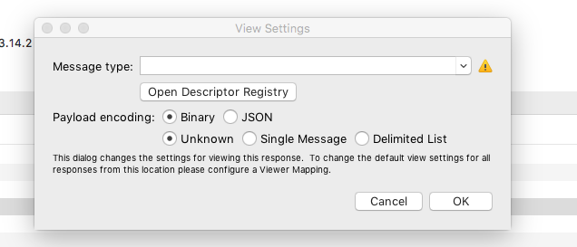
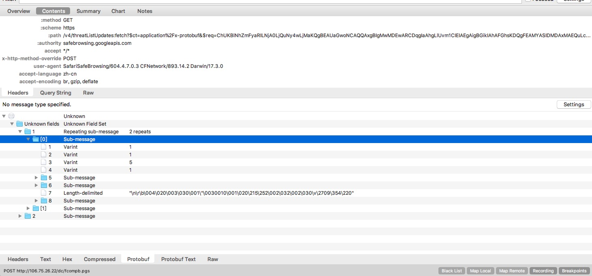
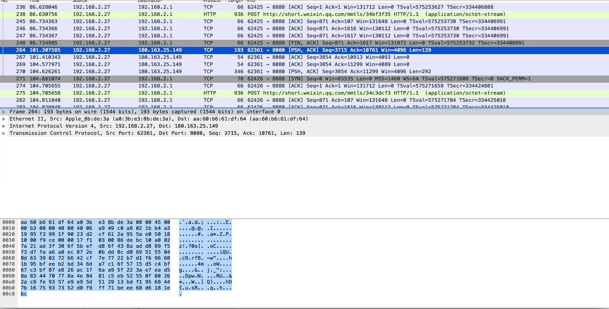
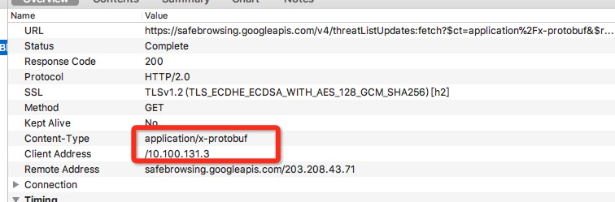
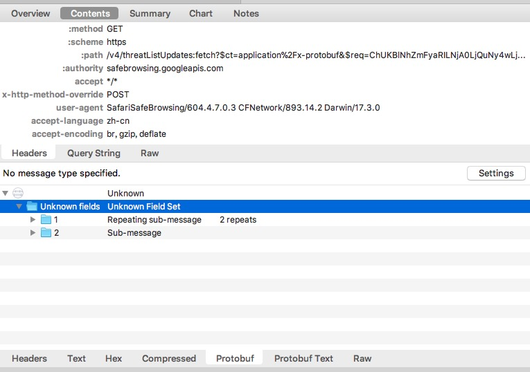
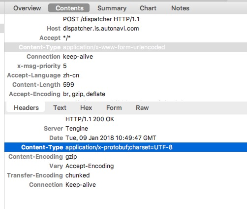
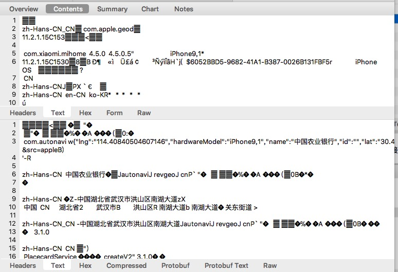
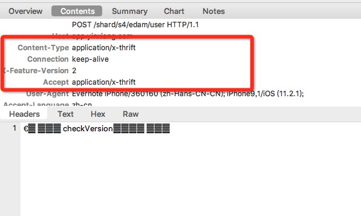
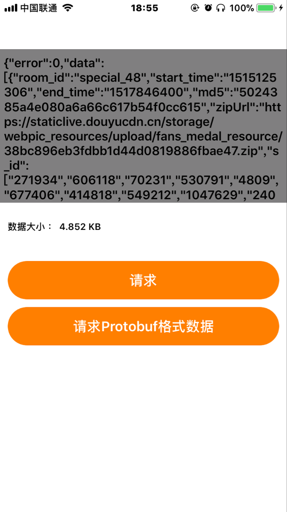
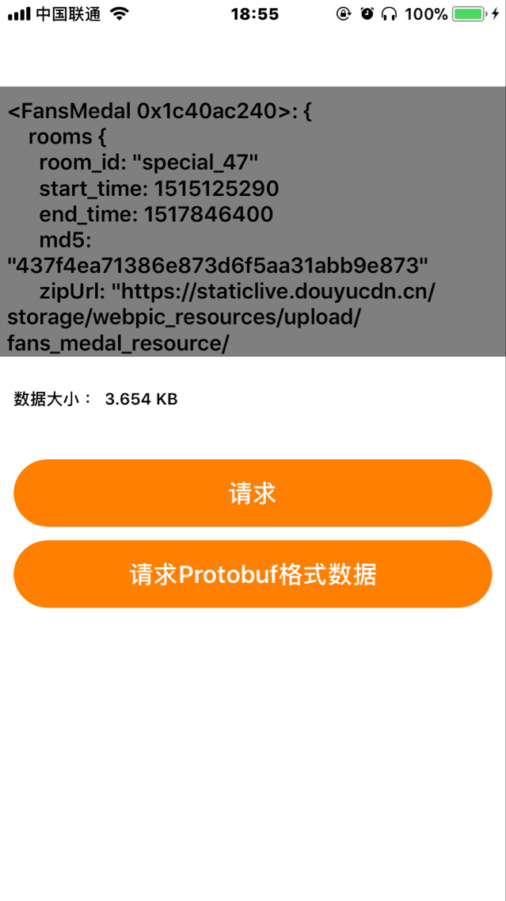

# Protobuf 技术预研

- [Protobuf 技术预研](#protobuf-技术预研)
	- [一、背景](#一背景)
	- [二、Protobuf说明](#二protobuf说明)
		- [2.1 什么是Protobuf](#21-什么是protobuf)
		- [2.2 Protobuf优点](#22-protobuf优点)
		- [2.3 Protobuf缺点](#23-protobuf缺点)
	- [三、Protobuf 相关框架](#三protobuf-相关框架)
		- [3.1 gRPC框架](#31-grpc框架)
		- [3.2 Thrift框架](#32-thrift框架)
	- [四、Protobuf-HTTP抓包方案](#四protobuf-http抓包方案)
	- [五、业界方案调研](#五业界方案调研)
		- [5.1 Protobuf在Http中的使用(抓包分析)](#51-protobuf在http中的使用抓包分析)
		- [5.2 gRPC 框架](#52-grpc-框架)
		- [5.3 Thrift 框架](#53-thrift-框架)
	- [六、测试Protobuf在Http中传输Demo](#六测试protobuf在http中传输demo)
		- [6.1 proto文件编写](#61-proto文件编写)
		- [6.2 proto文件转Objective-C Model](#62-proto文件转objective-c-model)
		- [6.3 服务器项目配置和实现](#63-服务器项目配置和实现)
		- [6.4 客户端项目配置和实现](#64-客户端项目配置和实现)
		- [6.5 测试结果](#65-测试结果)
	- [七、思考和讨论](#七思考和讨论)
	- [参考文章](#参考文章)

## 一、背景
现在客户端与服务器通讯主要通过Json来做数据交互，本次调研主要比较Protobuf项目中使用的优缺点，和可行性。

## 二、Protobuf说明

### 2.1 什么是Protobuf
ProtocolBuffer(以下简称PB)是google 的一种数据交换的格式，它独立于语言，独立于平台。
大部分IM通讯协议都是使用PB来传输。具体代表性的有支付宝、微信等App。

***说白了，PB就是一种序列化协议，我们开发中想在什么场景中使用Protobuf做为数据交换的序列化协议，取决于自己的业务。***

### 2.2 Protobuf优点

1. 性能好/效率高
时间开销： XML格式化（序列化）的开销还好；但是XML解析（反序列化）的开销就不敢恭维了。 但是protobuf在这个方面就进行了优化。可以使序列化和反序列化的时间开销都减短。比较Json的解析速度也快很多。
空间开销：protobuf也减少了很多。

2. 消息格式所有端共用一个通用的Proto文件描述。

3. 支持向后兼容和向前兼容，
当客户端和服务器同时使用一块协议的时候， 当客户端在协议中增加一个字节，并不会影响客户端的使用

4. 支持多种编程语言 :
Java、PHP、C++、[Objective-c](https://github.com/google/protobuf/tree/master/objectivec "Title") 等等

### 2.3 Protobuf缺点

1. 二进制格式导致可读性差，为了提高性能，protobuf采用了二进制格式进行编码。这直接导致了可读性差。

2. 缺乏自描述， 一般来说，XML是自描述的，而protobuf格式则不是。 给你一段二进制格式的协议内容，不配合你写的.proto文件是看不出来是什么作用的。

3. 没有通用的解析方法，必须一个proto文件对应一个Model

## 三、Protobuf 相关框架

### 3.1 gRPC框架
gRPC  是一个高性能、开源和通用的 RPC 框架，面向移动和 HTTP/2 设计。目前提供 C、Java 和 Go 语言版本，分别是：grpc, grpc-java, grpc-go. 其中 C 版本支持 C, C++, Node.js, Python, Ruby, Objective-C, PHP 和 C# 支持.

优点 ：gRPC 基于 HTTP/2 标准设计，带来诸如双向流、流控、头部压缩、单TCP连接上的多复用请求等特。这些特性使得其在移动设备上表现更好，更省电和节省空间占用。

缺点 ： 暂时没有在网上找到有使用这个框架的APP。这个框架的稳定性、对系统的要求，需要进一步调研

PS：百度2017年9月开源了一个bRPC框架，据说效率比gRPC还要高，但是网上资料很少，稳定性也不确定，能否支持移动端开发也没找到对应的资料。

### 3.2 Thrift框架
Thrift是一款由Fackbook开发的可伸缩、跨语言的服务开发框架，该框架已经开源并且加入的Apache项目。Thrift主要功能是：通过自定义的Interface Definition Language(IDL)，可以创建基于RPC的客户端和服务端的服务代码。数据和服务代码的生成是通过Thrift内置的代码生成器来实现的。Thrift 的跨语言性体现在，它可以生成C++, Java, Python, PHP, Ruby, Erlang, Perl, Haskell, C#, Cocoa, JavaScript, Node.js, Smalltalk, OCaml , Delphi等语言的代码，且它们之间可以进行透明的通信。

优点：

1. One-stop shop，相对于protobuf，序列化和RPC支持一站式解决，如果是pb的话，还需要考虑选择RPC框架，现在Google是开源了gRpc，但是几年以前是没有第一方的标准解决方案的
2. 特性丰富，idl层面支持map，protobuf应该是最近才支持的，map的key支持任意类型，avro只支持string，序列化支持自定义protocol, rpc支持thread pool, hsha, no blocking 多种形式，必有一款适合你，对于多语言的支持也非常丰富
3. RPC和序列化性能都不错，这个到处都有benchmark，并不是性能最好的，但是基本上不会成为瓶颈或者短板

缺点：

1. 移动客户端开发相关的资料很少。
2. 主要是服务端在使用，移动端使用Thrift的目前只找到有友盟SDK和印象笔记App。

## 四、Protobuf-HTTP抓包方案

Charles支持Protobuf数据的解析工作，只需要指定对应的proto文件就可以。

相关链接  [Protocol Buffers &bull; Charles Web Debugging Proxy](https://www.charlesproxy.com/documentation/using-charles/protocol-buffers/)

点击查看大图

## 五、业界方案调研

### 5.1 Protobuf在Http中的使用(抓包分析)

通过抓包分析了支付宝、淘宝、QQ、微信（包括企业微信）、米家、哔哩哔哩等APP数据包。

1.支付宝公开申明使用了Protobuf，通过抓包发现，支付宝HTTP接口调用很少，大部分都是走的TCP。应该是TCP传输数据使用的是Protobuf。

2.微信和QQ，Http上没有看到使用Protobuf的接口。TCP抓包里面的数据(具体见下图)都是加密过的数据，具体内部他们是使用什么数据传输，我们这边不得而知。

3.在手机上抓到Google统计的两个接口使用Protobuf，具体是哪个App里调用的没查出来（调用时机不确定）。

返回内容如下：

4.使用米家的App时候发现里面调用高德接口获取地理位置信息的接口是使用Protobuf传输的。

***PS：综上所述，可以看出两点，一、Protobuf在HTTP中传输方案上是可行的，也有公司（Google、高德）在这样使用，但是使用场景单一。二、在Http中使用纯的Protobuf协议做数据序列化的方案的公司不多（可能Json传输简单直接，能满足99%公司的需求）。***

### 5.2 gRPC 框架

***暂时没找搜到有使用该方案的App***

### 5.3 Thrift 框架

Thrift也是一种RPC调用框架，Thrift也有自己定义的Interface Definition Language(IDL)（类似Protobuf的proto描述文件），根据定义好的中间文件可以转换为各种语言对应的Model。可以快速的把Model转二进制数据，发送给远端，远端拿到二进制数据可以快速反序列化成Model。传输协议TCP、HTTP都有。
		
目前调研到移动端有在使用的Thrift的有： ***友盟SDK、印象笔记***

友盟SDK日志上报的协议使用的是Thrift

[友盟统计新版SDK使用Thrift库的说明](http://bbs.umeng.com/thread-6705-1-1.html)

印象笔记移动App中所有的接口都是使用Thrift调用

## 六、测试Protobuf在Http中传输Demo

### 6.1 proto文件编写

这里找了一个线上的配置文件地址作为测试数据,下载这个Json格式数据，修改里面数据内容，把Array里面数据全部改成第一条数据，方便Protobuf模拟数据，修改后的json文件数据为：[测试数据.Json](./images/fans_medal.json)

按照这个数据格式开始编写Proto文件内容如下：

		syntax = "proto3";
		
		message RoomInfo {  
		 string room_id = 1;
		 uint64 start_time = 2;
		 uint64 end_time = 3;
		 string md5 = 4;
		 string zipUrl = 5;
		 repeated string s_id = 6;
		
		} 
		
		message FansMedal {
		 repeated RoomInfo rooms = 1;
	}
保存到fansMedal.proto文件

### 6.2 proto文件转Objective-C Model
工具：使用Google 提供的https://github.com/google/protobuf/releases Mac版protoc工具

这里因为我服务器和客户端都是Objective-C写的，服务器是Mac控制台程序，手机是iOS客户端端。所以只用把proto文件转成OC的model，服务器和客户端都用这个model就可以了。

把fansMedal.proto 复制到跟protoc 一个目录下（也可以不在一个目录protoc指向对应地址就行），执行命令：

	./protoc fansMedal.proto --objc_out=./

然后会在当前目录下生成 `FansMedal.pbobjc.h` `FansMedal.pbobjc.m`两个model文件。copy到服务器和客户端两个项目中。

### 6.3 服务器项目配置和实现

服务器这边需要pod引入Protobuf框架

	pod 'Protobuf', '~> 3.5.0'

返回Protobuf结构的data数据代码如下：

	 FansMedal *fansMedal = [[FansMedal alloc] init];
	 fansMedal.roomsArray = [[NSMutableArray alloc] init];
	 for (int i = 0; i<=13 ; i++) {
	     RoomInfo *roomInfo = [[RoomInfo alloc] init];
	     roomInfo.md5 = @"437f4ea71386e873d6f5aa31abb9e873";
	     roomInfo.zipURL = @"https://staticlive.douyucdn.cn/storage/webpic_resources/upload/fans_medal_resource/17cd936c18ca95bf3acfd7068bec9818.zip";
	     roomInfo.startTime = 1515125290;
	     roomInfo.endTime = 1517846400;
	     roomInfo.roomId = @"special_47";
	     roomInfo.sIdArray = [[NSMutableArray alloc] init];
	     [roomInfo.sIdArray addObject:@"271934"];
	     [roomInfo.sIdArray addObject:@"606118"];
	     [roomInfo.sIdArray addObject:@"70231"];
	     [roomInfo.sIdArray addObject:@"530791"];
	     [roomInfo.sIdArray addObject:@"4809"];
	     [roomInfo.sIdArray addObject:@"677406"];
	     [roomInfo.sIdArray addObject:@"414818"];
	     [roomInfo.sIdArray addObject:@"549212"];
	     [roomInfo.sIdArray addObject:@"1047629"];
	     [roomInfo.sIdArray addObject:@"2400799"];
	     [fansMedal.roomsArray addObject:roomInfo];
	 }
	 NSData *data = [fansMedal data];
	 return [GCDWebServerDataResponse responseWithData:data contentType:@"application/octet-stream"];

返回Json格式的接口数据代码如下：

	NSString *path = [[NSBundle mainBundle] pathForResource:@"fans_medal" ofType:@"json"];
	NSString *content = [[NSString alloc] initWithContentsOfFile:path encoding:NSUTF8StringEncoding error:nil];
	return [GCDWebServerDataResponse responseWithHTML:content];
	
	
### 6.4 客户端项目配置和实现

客户端也需要pod引入Protobuf框架

	pod 'Protobuf', '~> 3.5.0'

客户端请求Json数据代码如下：

    NSDate *startDate = [NSDate date];
    [self getUrl:@"http://192.168.2.1:8080/" dataBody:nil Completetion:^(id result, NSError *error) {
        if (!error && [result isKindOfClass:[NSData class]]) {
            NSData *data = (NSData *)result;
            NSError *pError;
            id obj = [NSJSONSerialization JSONObjectWithData:data options:NSJSONReadingAllowFragments error:&pError];
            if (!pError) {
                NSDate *endDate1 = [NSDate date];
                _infolabel.text = [NSString stringWithFormat:@"数据大小 ： %.3f KB, 请求耗时：%f",[data length]/1000.0,[endDate1 timeIntervalSinceDate:startDate]];
                _textView.text = [obj description];
            }
        }
    }];
    
客户端请求Protobuf数据代码如下：

    NSDate *startDate = [NSDate date];
    [self getUrl:@"http://192.168.2.1:8080/Protobuf" dataBody:nil Completetion:^(id result, NSError *error) {
        if (!error && [result isKindOfClass:[NSData class]]) {
            NSData *data = (NSData *)result;
            NSError *pError;
            FansMedal *fansMedal = [[FansMedal alloc] initWithData:data error:&pError];
            if (!pError) {
                NSDate *endDate1 = [NSDate date];
                _infolabel.text = [NSString stringWithFormat:@"数据大小 ： %.3f KB, 请求耗时：%f",[data length]/1000.0,[endDate1 timeIntervalSinceDate:startDate]];
                _textView.text = fansMedal.description;
            }
        }
    }];
    
   
   
### 6.5 测试结果

***同一段数据内容 Json格式的数据大小是4.852KB,Protobuf格式的数据大小是3.654KB***

***请求耗时，测试了调用100次耗时在2~6秒左右，每次都不等。有时候Protobuf快，有时候纯Json请求快，不太有参考意义，这里就不贴出相应的耗时数据***

## 七、思考和讨论

1. 因为TCP所有数据都是二进制数据流传输，需要自己去把二进制数据流转成自己需要的数据协议，Protobuf可以很好的支持这一点，所以Protobuf在TCP传输使用的场景比较多。

2. 反观HTTP，HTTP是属于应用层的协议，底层传输使用的也是TCP。HTTP已经做了数据解封装操作，我们在使用get和post的时候，我们在开发中可以快速拿到客户端和服务器的传输的数据（一般使用Json），Json可读性好，也能在各个端也能快速的转成Model，所以基本已经满足了大部分公司99%的需求。使用Protobuf在HTTP传输好处是Protobuf解析快（这个应该对一般App来说没有这种性能瓶颈，所以一般都不在乎这种优势），数据压缩空间比Json大（没有Json那种多余的“{} 、：”字符等等）。大部分公司都是为了简单直接所以选择Json，Protobuf能节省多少流量也需要具体统计以后才知道。

3. gRPC和Thrift都是RPC框架，客户端做简单的数据拉取工作，个人感觉没必要使用RPC框架，一个是框架的稳定性不确定，二是对现有的项目结构是否也有影响。而且RPC框架一般是用户服务器端内网之间互相调用，很少有客户端远程RPC调用服务器接口。

如果只是对数据解析和节省带宽有要求可以单纯使用Protobuf协议来序列化传输的数据即可。

## 参考文章

[Protobuf优缺点](https://www.jianshu.com/p/a969036c711a)

[Json VS Protobuf](https://www.v2ex.com/t/186561)

[gRPC 官方文档中文版 V1.0](http://doc.oschina.net/grpc?t=56831)

[用 thrift 或 gRPC 之类的框架做 app 和服务器的通信合适吗？](https://www.zhihu.com/question/30657506)

[比较跨语言通讯框架：thrift和Protobuf](http://chengxu.org/p/440.html)

[RPC 框架对移动客户端的开发有什么意义?](https://neue.v2ex.com/t/276757)

[哪个互联网公司使用 facebook thrift 做底层架构，实现高性能、可扩展的web应用？引入thrift之后的优缺点是什么？](https://www.zhihu.com/question/20189791)

[gRPC初体验](https://www.jianshu.com/p/774b38306c30)

[Thrift优缺点讨论](http://blog.csdn.net/jiyiqinlovexx/article/details/50478712)

