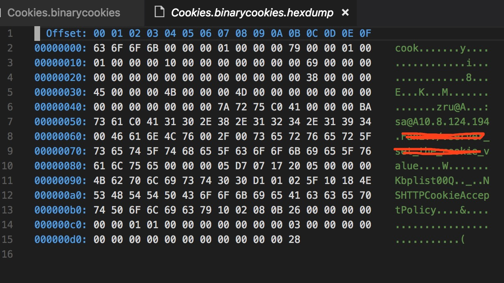

# iOS Cookie 存储相关技术

## 一、什么是Cookie
>  Cookie，有时也用其复数形式 Cookies，指某些网站为了辨别用户身份、进行 session 跟踪而储存在用户本地终端上的数据（通常经过加密）。定义于 RFC2109 和 2965 中的都已废弃，最新取代的规范是 RFC6265 [1]  。（可以叫做浏览器缓存）[来自百度百科](https://baike.baidu.com/item/cookie/1119?fr=aladdin)
 
说白了Cookie就是提供服务器存储相关数据到客户端的一种解决方案，服务器通过返回的Http头中告知客户端，我设置了Cookie，客户端收到请求以后，会读出Http响应的Header里面把对应的Cookie的key、value值持久化存到本地的Cookie文件，下次再请求服务器相关域名的接口中，会自动带上Cookie相关数据。当然客户端也可以主动设置、读取、删除这些Cookie。

Cookie一般用来存放用户相关的信息，这样用户每次访问同一个网站的时候就不用重复登录（这个只是Cookie的使用场景之一），由于它是序列化以后存在本地磁盘上的（iOS是存在沙箱文件夹下后面会说），所以Cookie有被伪造的风险，一般存储敏感信息在Cookie上的时候，服务器都会对相关数据进行加密

## 二、Cookie在Http中的传输方式
客户端请求一个服务器接口，如果本地没有任何该域名相关的Cookie，客户端发起的网络请求头是中是不会带Cookie的，Http请求头如下

	GET /app1/set HTTP/1.1
	Host: 10.8.124.194
	Accept: */*
	User-Agent: CookieTest/1 CFNetwork/901.1 Darwin/17.6.0
	Accept-Language: en-us
	Accept-Encoding: gzip, deflate
	Connection: keep-alive
这个里调用服务器的`/app1/set`接口，请求的Http头中没有任何Cookie相关的数据。这里面每个字段表示什么意思感兴趣的朋友可以自己去查询相关接口。

调用Set的接口，服务器接口服务器返回以下数据

	HTTP/1.1 200 OK
	Server: nginx/1.6.2
	Date: Sat, 02 Jun 2018 14:23:40 GMT
	Content-Type: text/html; charset=utf-8
	Content-Length: 98
	Set-Cookie: Name=Alex; Expires=Mon, 02-Jul-2018 22:23:40 GMT; Path=/
	Proxy-Connection: Keep-alive
	
	set Cookie ok

我们看到服务器返回的响应头里面多了一个`Set-Cookie`字段，里面有Name=Alex和Expires=超时。

我们再次调用接口调用该域名下的一个`/app1/get`接口，此时我们客户端发起的请求头如下

	GET /app1/get HTTP/1.1
	Host: 10.8.124.194
	Accept: */*
	Cookie: Name=Alex
	User-Agent: CookieTest/1 CFNetwork/901.1 Darwin/17.6.0
	Accept-Language: en-us
	Accept-Encoding: gzip, deflate
	Connection: keep-alive

这时的Http请求头里面已经自动带上了Cookie字段，并且自动的填上了`Name=Alex`,服务器那边可以直接读取请求头中Cookie的的内容。

当客户端或者服务器为对应域名设置了Cookie以后，该域名下所有的网络请求都会带上Cookie。即使请求该域名下的静态资源，或者通过src属性去请求静态资源，都是会自动带上Cookie的。

	//请求方式一
    [self.webview loadRequest:[NSURLRequest requestWithURL:[NSURL URLWithString:@"http://10.8.124.194/static/log.jpg"]]];
	//请求方式二
    [self.webview loadHTMLString:@"<html><body></body></html>" baseURL:nil];

## 三、Cookie的存放位置
很多朋友有个误区，任务Cookie是与浏览器强相关的，我们平时用网络请求是不能携带Cookie的，这个是错误的，Cookie其实就是存在Http请求头中的一段数据，只要客户端发的是网络请求就可以设置和保存Cookie，当然客户端和浏览器也可以设置禁止服务器写入Cookie。

iOS 的Cookie文件是存在`沙箱文件夹/Library/Cookies/`下，所以APP与APP之前是不能共享Cookie数据的。其实这样也好理解，就像电脑上的浏览器一样，你在Chrome里面打开百度登录了你的账号，这个登录状态只能在Chrome里面保持，你用Safari打开百度还是未登录状态，就是因为每个浏览器Cookie的保存位置都不一样。

***这里需要单独拿出来说的是APP里面使用的WKWebView的所有Cookie都是单独存在一个文件中的，与本地调用NSURLSession存储的Cookie是区分开的（WebCore），WKWebView存储的Cookie文件名字是`Cookies.binarycookies`，NSURLSession和UIWebView 是共用一套Cookeie存储的名字一般是 `app的bundleid.binarycooimages`***

随便说下`NSHTTPCookieStorage`只能操作NSURLSession相关的Cookie，要操作WKWebView的Cookie需要用JS方式来写入。具体可以参考下面的文章。

[iOS之WKWebView 的Cookie读取与注入 同步登陆番外篇](https://www.jianshu.com/p/fd47847c53f9)

可以用二进制编辑器查看Cookie文件存储内容如下

可以看到，Cookie中存储了 域名、key/value值，Cookie的接受策略等等。

PS：客户端或者服务器写Cookie的时候，不会立马在磁盘上生成Cookie文件，一般会过1~5秒以后才会生成。如果没有生成Cookie文件，在App退到后台的时候回立马生成Cookie文件。

## 四、如何操作Cookie

### 4.1 iOS客户端设置Cookie

* 设置Cookie实现如下

		NSMutableDictionary *properties = [NSMutableDictionary dictionary];
	    [properties setObject:key forKey:NSHTTPCookieName];
	    [properties setObject:newValue forKey:NSHTTPCookieValue];
	    [properties setObject:domian forKey:NSHTTPCookieDomain];
	    [properties setObject:path forKey:NSHTTPCookiePath];
	    // 将可变字典转化为cookie
	    NSHTTPCookie *cookie = [NSHTTPCookie cookieWithProperties: properties];
	    // 获取cookieStorage
	    NSHTTPCookieStorage *cookieStorage = [NSHTTPCookieStorage sharedHTTPCookieStorage];    
	    // 存储cookie
	    [cookieStorage setCookie:cookie];
  	这个里面`NSHTTPCookieName`、`NSHTTPCookieValue`两个必须要设置这个表示Key=Value，服务端读取的时候会根据Key（`NSHTTPCookieName`）的值去读取Value（`NSHTTPCookieValue`）中的数据。`NSHTTPCookieDomain`表示请求的URL的域名，设置以后，客户端请求相关的域名的时候，Http请求Header中会自动带上Cookie中存的这些数据。
* 读取Cookie数据

		//获取所有cookies
		NSHTTPCookieStorage *cookieStorage = [NSHTTPCookieStorage sharedHTTPCookieStorage];
		for (NSHTTPCookie *cookie in [cookieStorage cookies]) {
		   NSLog(@"%@", cookie);
		}
* 删除Cookie
 
		 //删除cookies
		 NSHTTPCookieStorage *cookieStorage = [NSHTTPCookieStorage sharedHTTPCookieStorage];
		  NSArray *tempArray = [NSArray arrayWithArray:[cookieStorage cookies]];
		  for (NSHTTPCookie *cookiej in tempArray) {
		    [cookieStorage deleteCookie:cookie];
		  }
		

### 4.2 服务器设置Cookie（Python-Flask）
* 读取Cookie

		@app.route('/app1/get')
		def get_cookie():
		    name = request.cookies.get('Name')
		    if name is None:
		        name = ""
		    return "name : %s " % (name)

* 设置Cookie

		@app.route('/app1/set')
		def set_cookie():
		    outdate = datetime.datetime.today() + datetime.timedelta(days=30)//设置30天以后超时
		    response = make_response('set Cookie')
		    response.set_cookie('Name', 'Alex', expires=outdate)
		    return response

* 删除Cookie

		@app.route('/app1/del')
		def del_cookie():
		    response = make_response('delete cookie')
		    response.set_cookie('Name', '', expires=0)
		    return response
		   
	删除Cookie其实就是设置Cookie立即超时，客户端判断超时以后会主动删除本地的Cookie文件
	

## 存在的不足

1. 没有在多个系统版本上验证这个事。
2. 系统自动设置Cookie到HttpHeader头里面，这部分逻辑在哪里实现的。
3. Cookie的策略。

